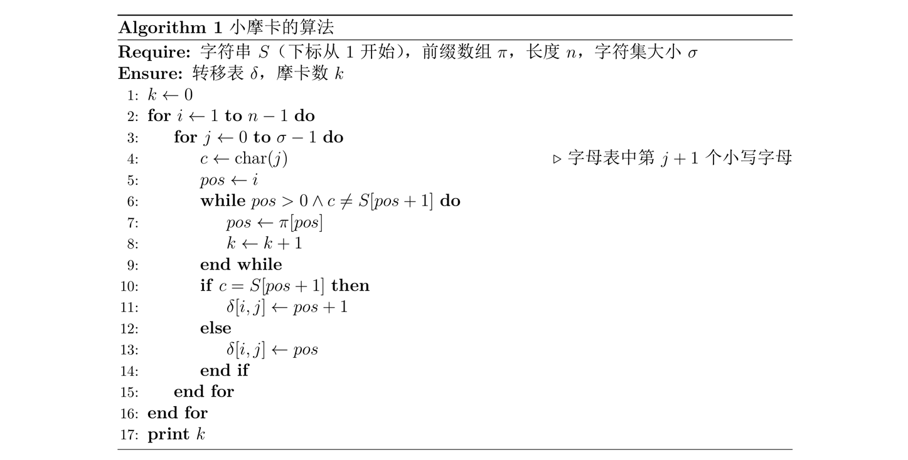
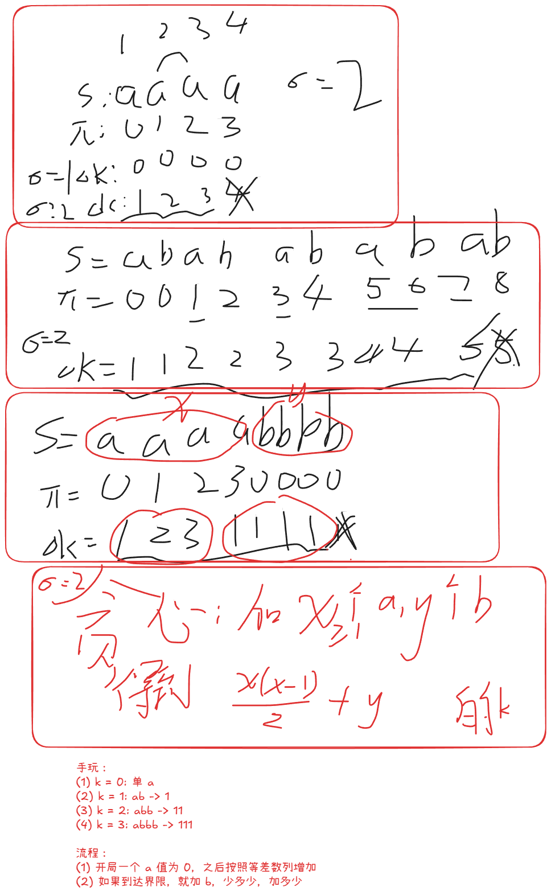

## 1001 小丑牌

签到题， $x$ 集合和 $y$ 集合选两个数字，乘积尽可能大

## 1004 搭积木

### Problem Description

小 W 正在用积木搭建一个巨大的结构。

有 $n$ 块积木，编号为 $1$ 到 $n$。第 $i$ 块积木有两个整数属性 $a_i$ 和 $b_i$。

一开始，小 W 打算一块一块地搭建。对每块积木 $i$，给定一个积木 $f_i$，表示积木 $i$ 必须直接放在积木 $f_i$ 的上方。如果 $f_i=0$，则积木 $i$ 位于整个结构的最底部。题目保证这些要求是自洽的，并且最终会形成一个包含所有积木的完整结构。

后来，小 W 觉得逐块搭建太无聊了。他想到一种新方法：可以先把若干块积木组装成一个结构，再一次性把整个已组装结构放到另一个结构上。具体地，对于两个不交的连通集合 $A$ 和 $B$，若 $A$ 中存在唯一的点 $x$ 使得 $f_x \in B$，那么 $A$ 就可以被放在 $B$ 的上面。

也就是说，在满足所有原始直接上下关系的前提下，小 W 可以自由选择执行放置操作的顺序，也可以提前组装某些局部结构。

一次放置操作中，假设一个已经组装好的结构被放到另一个结构的上方。令：

$A$ 为上方结构内所有积木的 $a_i$ 之和；

$B$ 为下方承托结构内所有积木的 $b_i$ 之和。

这次放置操作的代价定义为 $A \times B$。

操作完成后，两个结构会合并为一个更大的结构。

注意，下方承托结构指的是当前已经组装在一起的整个结构，而不只是单块积木或它的祖先。

小 W 想知道，在所有合法的搭建顺序中，最小总代价是多少。

### Input

本题单个测试点内有多组测试数据。

第一行输入一个正整数 $T$ $(1 \le T \le 20)$，表示测试数据组数。

接下来按如下格式输入 $T$ 组数据：

第一行输入一个整数 $n$ $(1 \le n \le 2 \times 10^5)$，表示积木数量。保证单个测试点内所有测试数据的 $n$ 之和不超过 $10^6$。

第二行输入 $n$ 个整数 $a_1, a_2, \dots, a_n$ $(1 \le a_i \le 10^3)$。

第三行输入 $n$ 个整数 $b_1, b_2, \dots, b_n$ $(1 \le b_i \le 10^3)$。

第四行输入 $n$ 个整数 $f_1, f_2, \dots, f_n$。其中 $f_1=0$，对于所有 $i>1$，保证 $1 \le f_i < i$。

### Output

对于每组数据，输出一行一个整数，表示搭建完整结构所需的最小总代价。

### Sample Input

```txt
1
3
3 10 1
5 1 10
0 1 1
```

### Sample Output

```txt
56
```

### Hint

样例中，积木 $2$ 和 $3$ 都必须直接放在积木 $1$ 上方。

如果先把积木 $2$ 放到积木 $1$ 上，代价为 $10 \times 5 = 50$。

此时下方结构包含积木 $\{1, 2\}$，其 $b$ 之和为 $5 + 1 = 6$。再放置积木 $3$，代价为 $1 \times 6 = 6$。

总代价为 $50 + 6 = 56$，可以证明这是最优的。

### Solution

**类树上 Smith rule 合并贪心**

先合并谁的问题，当一个父节点 $P(a, b)$ 和子节点 $X(a_1, b_1)$ 与 $Y(a_2, b_2)$ 合并时，可以先合并 $X$ 当且仅当
 
$$
a_1b + a_2(b+b_1) < a_2b + a_1(b+b_2) 
\newline
\Rightarrow 
\newline
a_2b_1 < a_1b_2 
$$

**不开 long long 见什么**

不仅 ans 要开 `__int128`，而且 比较器 的 乘法要开 `long long`

### code

```cpp
#include<bits/stdc++.h>
using namespace std;
using LL = long long;

const int N = 2e5 + 5;

void write(__int128 x) {
    if (x < 0) x = -x, putchar('-');
    if (x == 0) putchar('0');
    stack<char> S;
    while(x) S.push('0' + x % 10), x /= 10;
    while(S.size()) putchar(S.top()), S.pop();
    putchar('\n');
}

struct DSU {
    vector<int> f;
    void init(int n) {
        f = vector<int>(n);
        iota(f.begin(), f.end(), 0);
    }
    int find(int x) {
        return f[x] == x ? x : f[x] = find(f[x]);
    }
    bool merge(int x,int y) {
        x = find(x), y = find(y);
        assert(x != y);
        if (x == y) return false;
        f[y] = x;
        return true;
    }
}D;

int T;
int t[N];

struct Node{
    LL a, b, u, t;
    bool operator<(const Node& o) const {
        return b*o.a != a*o.b ? b*o.a > a*o.b : t > o.t;
    }
};

int n;
int a[N], b[N], f[N];
priority_queue<Node> Q;

void solve() {
    cin >> n;
    for (int i = 1; i <= n; i++) cin >> a[i];
    for (int i = 1; i <= n; i++) cin >> b[i];
    for (int i = 1; i <= n; i++) cin >> f[i];

    D.init(n + 1);
    for (int i = 1; i <= n; i++) Q.emplace(a[i], b[i], i, t[i] = ++T);
    
    __int128 ans = 0;
    while(Q.size()) {
        auto [_a, _b, u, _t] = Q.top(); Q.pop();
        if (t[u] != _t) continue;
        if (f[u] == 0) continue;
        int ff = D.find(f[u]);
        if(D.merge(ff, u)) {
            ans += _a * b[ff];
            a[ff] += _a;
            b[ff] += _b;
            Q.emplace(a[ff], b[ff], ff, t[ff] = ++T);
        }
    }
    write(ans);
}

int main() {
    ios::sync_with_stdio(0); cin.tie(0); cout.tie(0);
    int T = 1;
    cin >> T;
    while (T--) solve();
}
```

## 1005 摩卡数

### Problem Description

小摩卡是个天才，尤其在字符串理论方面有着异于常人的天赋。为了赞颂她的才华，人们常常将那些满足特定优美性质的字符串命名为“摩卡串”。

小摩卡上本科时，在数据结构与算法分析课程中学到了 KMP 自动机，并想出了如下构建一个字符串 $S$ 的 KMP 自动机的算法。

在算法中：
- $S$ 是长度为 $n$ 的输入字符串，仅包含前 $\sigma$ 个小写字母。
- $\pi$ 是 $S$ 的前缀函数。
- $\pi[i]$ 的值是满足 $k < i$ 且 $S[1,k] = S[i-k+1,i]$ 的最大 $k$。若不存在这样的正整数 $k$，则 $\pi[i] = 0$。
- $S[l,r]$ 表示仅保留 $S$ 中第 $l$ 个到第 $r$ 个位置的字符所构成的子串。
- $\delta$ 是 KMP 自动机的转移表。
- $\delta[i,j]$ 表示如果当前状态为 $i$ 且输入字符为 $j$，则新状态变为 $\delta[i,j]$。
- $k$ 是一个计数器。



小摩卡定义，算法结束后 $k$ 的值即为字符串 $S$ 的摩卡数。请你构造一个字符串 $S$ 并指定 $S$ 的字符集大小 $\sigma$，使得对字符串 $S$ 运行该算法，所得到的摩卡数恰好为 $k$。

你需要保证构造的字符串的长度不超过 $10^5$。

### Input

第一行输入一个正整数 $T$ ($1 \le T \le 50$)，表示数据组数。接下来按如下格式输入 $T$ 组数据：

输入一行一个正整数 $k$ ($1 \le k \le 10^9$)，表示摩卡数的值。

### Output

对于每组数据，输出两行：

第一行输出两个用空格分隔的正整数 $n, \sigma$，表示字符串的长度和字符集的大小。
第二行输出一行一个字符串 $S$。
你需要保证 $1 \le n \le 10^5, 1 \le \sigma \le 26$，$S$ 的长度为 $n$，且 $S$ 仅包含前 $\sigma$ 个小写英文字母。

本题使用 Special Judge 测试，如有多个满足条件的答案，你可以输出任意一种。你不需要最小化字符串 $S$ 的长度或字典序。

可以证明在题目限制内，一定存在至少一组满足条件的解。

### Sample Input

```txt
2
14
697
```

### Sample Output

```txt
6 3
abcabc
21 26
cbababcbbabcbbabcbabc
```

### Solution

**简单的构造题，多手玩一下就知道怎么构造了**



### Code

```cpp
#include<bits/stdc++.h>
using namespace std;

const int N = 1e5 + 5;

vector<int> getNe(string s) {
    int n = s.size();
    vector<int> ne(n);
    for (int i = 1,j=0;i<n;) {
        while(s[i]!=s[j] && j) j = ne[j-1];
        if(s[i]==s[j]) i++,j++;
        else i++;
        ne[i-1]=j;
    }
    return ne;
}

int algo(string s, int sigma) {
    int n = s.size();
    vector<int> pi = getNe(s);
    cout << "pi:";
    for (auto v:pi) cout << v << " ";
    cout << "\n";
    int k = 0;
    for (int i = 1; i <= n-1; i++) {
        for(int j = 0; j < sigma; j++) {
            char c = 'a' + j;
            int pos = i;
            while(pos > 0 && c != s[pos]) {
                pos = pi[pos-1];
                k++;
            }
        }
        cout << k << "!\n";
    }
    return k;
}

void solve() {
    int k;
    cin >> k;
    int x = 1, y = 0, cur = 0;
    while(cur < k) {
        if (cur + x <= k) cur += x++;
        else {
            y += k - cur;
            break;
        }
    }
    cout << x + y << " 2\n";
    while(x--) cout << "a";
    while(y--) cout << "b";
    cout << "\n";
}
int main() {
    ios::sync_with_stdio(0); cin.tie(0); cout.tie(0);
    int T = 1;
    cin >> T;
    while (T--) solve();
}
```
## 1006 开关灯

### Problem Description

小 D 很喜欢随机性。

他面前有一排 $n$ 盏灯，从左到右编号为 $1,2,\dots,n$，第 $i$ 盏灯的权值为 $a_i$。一开始，所有灯都是关闭的。

小 D 随机选择一个 $1 \sim n$ 的排列，并按照这个排列依次打开所有灯。

每打开一盏灯后，所有亮着的灯会形成若干个极大连续段。若当前共有 $c$ 个连续段，并且这次打开的是第 $i$ 盏灯，那么小 D 会获得 $a_i \cdot c$ 分。

小 D 想知道，最终总得分的期望是多少？答案对 $998244353$ 取模。

### Input

本题有多组测试数据。第一行输入一个正整数 $T$ ($1 \le T \le 2 \times 10^5$)，表示测试数据组数。

接下来输入 $T$ 组测试数据。每组测试数据包含两行：

第一行一个整数 $n$ ($1 \le n \le 2 \times 10^5$)。

第二行 $n$ 个整数 $a_1,a_2,\dots,a_n$ ($0 \le a_i < 998244353$)。

保证单个测试点内所有测试数据的 $n$ 之和不超过 $2 \times 10^6$。

### Output

输出一个整数，表示小 D 最终总得分的期望值对 $998244353$ 取模后的结果。

可以证明答案是一个分母不被 $998244353$ 整除的有理数。若答案最简表示为 $\frac{x}{y}$，你需要输出 $x \times y^{-1} \bmod 998244353$，其中 $y^{-1}$ 表示 $y$ 在模 $998244353$ 意义下的乘法逆元。

### Sample Input

```txt
2
1
10
3
1 2 3
```

### Sample Output

```txt
10
665496242
```

### Solution

**暴力打表，对于模数概率题，可以溯源找分子规律**

由于最终结果仅与灯被选中的次数有关，所以打表一次全排列对应的操作，各个位置被选中的次数：

```txt
test:1
1
test:2
2 2
test:3
7 6 7
test:4
32 28 28 32
test:5
180 160 160 160 180
test:6
1200 1080 1080 1080 1080 1200
test:7
9240 8400 8400 8400 8400 8400 9240
```

注意到：

分为边缘 + 中间，设为 $a_i, b_i$ 

则 $a_1 = b_1 = 1$ 

$a_i / b_i = (i+4)/(i+3)$ 

且 $b_i = a_{i-1} \times i$ 

所以 $a_i = a_{i-1} \times i(i+4)/(i+3)$

其中 $i \ge 2, a_1 = 1, a_2 = 2$ 

### Code

```cpp
#include<bits/stdc++.h>
using namespace std;

const int N = 2e5 + 5;
const int mod = 998244353;

int ksm(int a, int b=mod-2) {
    int res = 1;
    for(;b;b>>=1,a=1LL*a*a%mod) if(b&1) res = 1LL * res * a % mod;
    return res;
}

int A[N];
int a[N], b[N];
int n;
int fac[N], invfac[N], inv[N];

void init() {
    fac[0] = 1;
    for (int i = 1; i < N; i++) fac[i] = 1LL * fac[i-1] * i % mod;
    invfac[N-1] = ksm(fac[N-1]);
    for (int i = N-1; i >= 1; i--) invfac[i-1] = 1LL * invfac[i] * i % mod;
    for (int i = 1; i <N;i++) inv[i] = 1LL * invfac[i] * fac[i-1] % mod;
    a[1] = 1;
    a[2] = 2;
    for (int i = 3; i < N; i++) {
        a[i] = 1LL * a[i-1] * i % mod * (i+4) % mod * inv[i+3] % mod;
        b[i] = 1LL * a[i-1] * i % mod;
    }
}

void test(int n) {
    cout << "test:" << n << "\n";
    // 模拟 n 的所有排列 他们代表的权重 
    vector<int> a(n), c(n);
    iota(a.begin(), a.end(), 0);
    do { // order: a
        int b = 0;
        for (int i = 0; i < n; i++) {
            b |= 1 << a[i];
            int len = 0, tot = 0;
            for (int j = 0; j < n; j++) {
                if(b >> j & 1) len++;
                else tot += (len > 0), len = 0;
            }
            tot += (len > 0);
            c[a[i]] += tot;
        }
    } while(next_permutation(a.begin(), a.end()));
    for (int i = 0; i < n; i++) 
        cout << c[i] << " \n"[i==n-1];
}

void solve() {
    cin >> n;
    for (int i = 1; i <= n; i++) cin >> A[i];
    int ans = 0;
    if (n == 1) {
        ans = 1LL * a[1] * A[1] % mod;
    } else {
        ans = 1LL * a[n] * (A[1] + A[n]) % mod;
        for (int i = 2; i < n; i++)
            ans = (ans + 1LL * b[n] * A[i] % mod) % mod;
    }
    ans = 1LL * ans * invfac[n] % mod;
    cout << ans << "\n";
}

int main() {
    init();
    // for (int i = 1; i <= 10;i++) test(i);
    ios::sync_with_stdio(0); cin.tie(0); cout.tie(0);
    int T = 1;
    cin >> T;
    while (T--) solve();
}
```

## 1008 数字子序列

### Problem Description

给定一个长度为 $n$ 的数字串 $D$，其中每一位都是 $0 \sim 9$ 的数字。一个数字子序列是若干个互不相交且从左到右排列的非空连续子串 

$$ 
D[l_1..r_1], D[l_2..r_2], \dots, D[l_k..r_k], 1 \le l_1 \le r_1 < l_2 \le r_2 < \dots < l_k \le r_k \le n 
$$

每个被选择的子串按照通常的十进制表示解释为一个整数，数字子序列的长度定义为它包含的整数个数，即上式中的 $k$。

如果一个数字子序列对应的整数序列 $x_1, x_2, \dots, x_k$ 满足 $x_1 < x_2 < \dots < x_k$ 则称它是上升的。请你求出给定数字串 $D$ 的最长上升数字子序列的长度。

### Input

第一行输入一个正整数 $T$ ($1 \le T \le 500$)，表示数据组数。接下来按如下格式输入 $T$ 组数据：

第一行输入一个数字串 $D$，设 $D$ 的长度为 $n$，保证 $1 \le n \le 10^5$。

保证所有数据中 $n$ 的总和不超过 $5 \times 10^5$。

### Output

对于每组数据，输出一行一个整数，表示最长上升数字子序列的长度。

### Sample Input

```txt
1
271828182845904523536028747135266249775724709369995
```

### Sample Output

```txt
17
```

### Hint

对于样例，一种最优方案是选择
$$ 2, 7, 8, 18, 28, 45, 52, 53, 60, 287, 471, 526, 624, 977, 5724, 7093, 69995 $$
因此答案为 $17$。

### Solution


### Code

```cpp

```

## 1010 游戏

### Problem Description

Alice 和 Bob 在玩取石子游戏，有 $n$ 堆石子从左到右排成一排，初始时从左到右第$i$ 堆有 $x_i$ 颗石子。

Alice 和 Bob 轮流操作：

- 轮到 Alice 操作时，Alice 从最左边的堆选至少一个石子，把选中的石子移到第二左的堆。
- 轮到 Bob 操作时，Bob 从最右边的堆选至少一个石子，把选中的石子移到第二右的堆。

若轮到某人无法操作时，当前操作的人输掉游戏。

若 Alice 和 Bob 都使用最优策略，你需要判断 Alice 是否有先手必胜策略。

### Input

第一行输入一个正整数 $T(1 \le T \le 10^5)$，表示数据组数。接下来按如下格式输入 $T$ 组数据：

每组第一行输入一个整数 $n(1 \le n \le 10^6)$。

第二行输入 $n$ 个正整数表示每堆石子数 $x_1,x_2,\dots,x_n(1 \le x_i \le 10^9)$。

保证输入数据中 $\sum n \le 3 \times 10^6$。

### Output

共输出 $T$ 行。

如果 Alice 有先手必胜策略，输出 `YES`，否则输出 `NO`。

### Sample Input

```txt
5
5 
4 5 4 5 9 
3 
4 4 1 
2 
10 9 
5 
1 2 1 1 2 
5 
2 1 1 2 1
```

### Sample Output

```txt
NO 
YES 
YES 
NO 
YES
```

### Solution

**从 基础情况 建立 必胜/必败 判断体系，找规律**

- $n = 1$ 时，必败
- $n = 2$ 时，必胜
- $n=3$ 时，设为 $a,b,c$ 
	- Alice 不可能全挪，否则必败
	- Bob 同样不可能全挪
	- $只能看谁先挪空 \Rightarrow a > c 时必胜，否则必败$ 
	- 即轮到 Alice 并且只剩下 $3$ 堆的话，充要条件是 $a > c$
- $n=4$ 时，设为 $a,b,c,d$
	- 若 $a+b \ge d$ ，Alice 可以全挪，到达 $n=3$ 必胜
	- 若 $a+b \lt d$ ，Alice 全挪必败，部分挪则 Bob 可以全挪之后 $n=3$ ，因为必定 $a-x<c+d$ 所以必败
	- 充要条件是 $a+b \ge d$
- $n=5$ 时，设为 $a,b,c,d,e$
	- 若 $a+b > d+e$ ，Alice 全挪，到达 $n=4$ 必胜
	- 若 $a+b<d+e$ ，Alice 全挪必败，故部分挪，此时 Bob 全挪，到达 $n=4$ ，因为 $a+b<(d+e)$ 所以必败
	- 若 $a+b=d+e$ ，Alice 全挪必败，故部分挪，同样，Bob 全挪必败，故也部分挪，直到某一个人挪动导致 $n=4$ 那么另一方就来到 $n=4$ 的情况直接胜，故充要条件是 $a>e$
- $n>5$ 时，似乎可以总结出来规律
	- 若 $pre_i > suf_j$ 必胜
	- 若 $pre_i < suf_j$ 必败
	- 若 $pre_i = suf_j$ 未决定，需要比较 $pre_{i-1}$ 和 $suf_{j+1}$ 
	- 为什么？
		- 归纳假设，挖掉中间的一个，左右两边分别是 $pre$ 和 $suf$ 
		- $n+1$ 的比较，必然可以基于 $n$ 的比较，不受先手后手的影响
		- 针对于相等情况，这与先后手有关，先手必败，故需要尽量切换先后手顺序
			- 注意：切换先手后手顺序，其实是比较最外层 **已经累计得到** 的数量（$pre_{i-1} > suf_{j+1}$）

### Code

```cpp
#include<bits/stdc++.h>
using namespace std;
using LL = long long;

const int N = 1e6 + 5;

LL n, a[N], pre[N], suf[N];

void solve() {
	cin >> n;
	suf[n + 1] = 0;
	for (int i = 1; i <= n; i++) cin >> a[i], pre[i] = pre[i - 1] + a[i];
	for (int i = n; i >= 1; i--) suf[i] = suf[i + 1] + a[i];
	if (n == 1) return void(cout << "NO\n");
	if (n == 2) return void(cout << "YES\n");
	for (int m = n / 2 + 1, i = m - 1, j = m + 1; j <= n; i--, j++) {
		if (pre[i] > suf[j]) return void(cout << "YES\n");
		else if (pre[i] < suf[j]) return void(cout << "NO\n");
	}
	if (n & 1) cout << "NO\n";
	else cout << "YES\n";
}
int main() {
	ios::sync_with_stdio(0); 
	cin.tie(0); cout.tie(0);
	int T = 1;
	cin >> T;
	while (T--) solve();
}
```


## 1012 向量

### Problem Description

已知 $A$ 是一个 $n$ 行 $n$ 列的 01 矩阵，且矩阵中值为 $1$ 的位置的个数恰好为 $m$。

$v$ 是一个 $n$ 维列向量，且 $v$ 的每个分量均为 $[-10^9, 10^9]$ 内的整数。

设向量 $u = (I + kA)v$，其中 $I$ 为 $n$ 阶单位矩阵，$k$ 是一个给定的常数。

请你根据给定的 $n, k, m, A, u$，求出列向量 $v$。

若存在多个满足条件的 $v$，请输出其中字典序最小的答案；若不存在满足条件的 $v$，则输出 No Solution。

对于两个 $n$ 维向量 $v_1, v_2$，称 $v_1$ 的字典序小于 $v_2$ 的字典序，当且仅当存在 $1 \le i \le n$，使得对于所有 $1 \le j < i$，都有 $v_{1,j} = v_{2,j}$，且 $v_{1,i} < v_{2,i}$。

### Input

第一行输入一个正整数 $T$ ($1 \le T \le 10^5$)，表示数据组数。

接下来按如下格式输入 $T$ 组数据：

第一行输入三个整数 $n, k, m$ ($1 \le n, m \le 10^6, 2 \le k \le 10^6, \sum n, \sum m \le 2 \times 10^6$)。

第二行输入 $n$ 个整数表示 $u^T = (u_1, u_2, \dots, u_n)$ ($|u_i| \le 10^{18}$)。

第三行输入 $m$ 个整数 $x_1, x_2, \dots, x_m$ ($1 \le x_i \le n$)。

第四行输入 $m$ 个整数 $y_1, y_2, \dots, y_m$ ($1 \le y_i \le n$)。

第三行和第四行表示矩阵 $A$ 中值为 $1$ 的位置，即 $a_{x_i, y_i} = 1$。

保证每组数据内不存在重复的 $(x_i, y_i)$ 对。

### Output

共输出 $T$ 行。

对于每组数据，输出 $n$ 个整数，表示 $v^T = (v_1, v_2, \dots, v_n)$。

若无解或答案不合法，输出一行字符串 No Solution。

### Sample Input

```txt
2
2 2 1
3 1
1
2
2 2 2
1 0
1 2
2 1
```

### Sample Output

```txt
1 1
No Solution
```

### Solution


### Code

```cpp

```