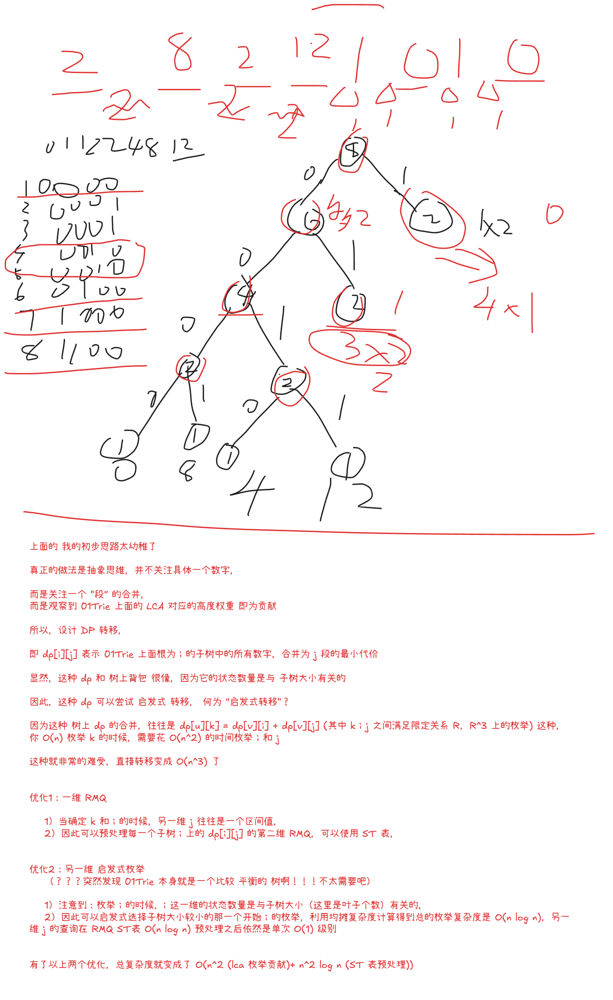

> 一场竟然两道 NTT

## 1001 xyz 问题【2-SAT / 优化建图】

### Problem Description

河灵和胖胖龙正在玩一款逻辑推理类游戏。

游戏桌上摆放着 $n$ 张数字牌 $x_1, x_2, \dots, x_n$，其中 $x_i$ 表示第 $i$ 张数字牌上的数字，每张数字牌上只能填写数字 $0$ 或 $1$。

桌上还摆放着 $m$ 张运算牌 $op_1, op_2, \dots, op_m$，其中 $op_j$ 表示第 $j$ 张运算牌上的运算符，每张运算牌上只能填写以下三种运算符之一：
- `&`：按位与。
- `|`：按位或。
- `^`：按位异或。

现在，胖胖龙向河灵发起了挑战。

他给出了 $k$ 个条件，其中每个条件都包含四个整数 $i, j, y, z$ ($1 \le i \le n$, $1 \le j \le m$, $0 \le y, z \le 1$)，表示河灵的填写结果需要满足等式 $x_i \text{ op}_j \ y = z$。

请你帮帮河灵，为每张数字牌填写 $0$ 或 $1$，并为每张运算牌填写 `&`, `|`, `^` 的其中一种，使得填写方案满足胖胖龙给出的所有条件。或判断不存在满足条件的填写方案。

### Input

每个测试点中包含多组测试数据。输入的第一行包含一个正整数 $T$ ($1 \le T \le 5 \times 10^4$)，表示数据组数。对于每组测试数据：

第一行三个正整数 $n, m, k$ ($1 \le n, m, k \le 3 \times 10^5$)，分别表示数字牌个数、运算牌个数以及条件个数。

接下来 $k$ 行，每行四个整数 $i, j, y, z$ ($1 \le i \le n$, $1 \le j \le m$, $0 \le y, z \le 1$)，表示河灵的填写结果需要满足等式 $x_i \text{ op}_j \ y = z$。

一张数字牌或运算牌可以不出现在任何条件中；同一张数字牌或运算牌可能同时出现在多个条件中。

保证所有测试数据中 $\sum n$、$\sum m$ 与 $\sum k$ 均不超过 $2 \times 10^6$。

### Output

对于每组测试数据：若存在满足条件的填写方案，输出的第一行包含一个字符串 `YES`。

第二行输出一个长度为 $n$ 的 01 串，其中第 $i$ 个字符表示第 $i$ 张数字牌上的数字 $x_i$。

第三行输出一个长度为 $m$ 的字符串，其中第 $j$ 个字符表示第 $j$ 张运算牌上的运算符 $op_j$，字符只能是 `&`, `|`, `^` 的其中一种。

若存在多种满足条件的填写方案，输出任意一种即可。

若不存在满足条件的填写方案，输出一行一个字符串 `NO`。

### Sample Input

```txt
2
3 2 4
1 1 0 0
2 1 1 1
2 2 0 1
3 2 1 0
1 1 2
1 1 0 0
1 1 0 1
```

### Sample Output

```txt
YES
011
&^
NO
```

### Solution

2-SAT 神秘编码题目，甚至这个 2-SAT 编码比 adhoc 还 adhoc。

题目看起来是一个很标准的逻辑限制：

$$ 
x_i\ op_j\ y = z 
$$

其中 $x_i$ 是 $0/1$，这部分天然是布尔变量。真正恶心的是 $op_j$，因为它有三种取值：`&|^`

如果朴素地开三个变量：

```txt
a: op 是 &
b: op 是 |
c: op 是 ^
```

那我们很容易写出“最多选一个”：

```txt
a -> !b, a -> !c
b -> !a, b -> !c
c -> !a, c -> !b
```

但是“三个里面至少选一个”是：

$$
a \lor b \lor c
$$

这是三元子句，不是 2-SAT。

所以这个方向看起来很自然，但是最后会卡在一个非常别扭的地方：  
**你排除了所有不合法的，却没有保证它一定选了一个合法的。**

关键就在于重新编码运算符。

我们用两个布尔变量 $P,Q$ 表示一个运算符：

```txt
P Q   op
0 0   &
0 1   |
1 1   ^
1 0   禁用
```

这个编码很神秘，但妙就妙在：三个合法状态不是随便摆的。

它有两个非常好用的性质：

```txt
Q = 0 时，只可能是 &
Q = 1 时，可能是 | 或 ^
P = 1 且 Q = 1 时，是 ^
P = 0 且 Q = 0 时，是 &
```

唯一非法状态是：

```txt
P=1,Q=0
```

所以全局加：

$$ 
\neg P \lor Q 
$$

建边：

```cpp
add(p[j], q[j]);
add(nq[j], np[j]);
```

这一步相当于把“三选一”硬塞进了两个变量里。

接下来对每个限制分类讨论。

设：

```txt
X = x_i
P = p_j
Q = q_j
```

#### 1. y=0,z=0

也就是：

$$
X\ op\ 0 = 0
$$

真值表：

```txt
X=0: 0&0=0, 0|0=0, 0^0=0   全部可以
X=1: 1&0=0, 1|0=1, 1^0=1   只能 &
```

所以唯一不合法的情况是：

```txt
X=1 且 op 不是 &
```

在这个神秘编码里，`op 不是 &` 等价于：

```txt
Q=1
```

因为 `&` 是 `00`，另外两个合法运算符都是 `Q=1`。

所以禁止：

$$ 
X \land Q
$$

转成：

$$
\neg X \lor \neg Q
$$

建边：

```cpp
add(x[u], nq[v]);
add(q[v], nx[u]);
```

#### 2. y=0,z=1

也就是：

$$ 
X\ op\ 0 = 1
$$

真值表：

```txt
X=0: 0&0=0, 0|0=0, 0^0=0   全部不行
X=1: 1&0=0, 1|0=1, 1^0=1   只能 | 或 ^
```

所以只有一种合法情况：

```txt
X=1 且 op 不是 &
```

而 `op 不是 &` 仍然等价于：

```txt
Q=1
```

所以直接强制：

$$ 
X,\quad Q
$$

建边：

```cpp
add(nx[u], x[u]);
add(nq[v], q[v]);
```

#### 3. y=1,z=0

也就是：

$$ 
X\ op\ 1 = 0
$$

真值表：

```txt
X=0: 0&1=0, 0|1=1, 0^1=1   只能 &
X=1: 1&1=1, 1|1=1, 1^1=0   只能 ^
```

所以：

```txt
X=0 时，op 必须是 &
X=1 时，op 必须是 ^
```

根据编码：

```txt
& = 00
^ = 11
```

所以这一下变成了非常舒服的：

$$ 
P=X,\quad Q=X
$$

这里就是这个编码最 adhoc 的地方。  
如果 `&` 和 `^` 没有放在 `00` 和 `11`，这一类条件就会变得非常难看。

建边就是两个等价关系：

```cpp
// P == X
add(x[u], p[v]);
add(p[v], x[u]);
add(nx[u], np[v]);
add(np[v], nx[u]);

// Q == X
add(x[u], q[v]);
add(q[v], x[u]);
add(nx[u], nq[v]);
add(nq[v], nx[u]);
```

#### 4. y=1,z=1

也就是：

$$ 
X\ op\ 1 = 1
$$

真值表：

```txt
X=0: 0&1=0, 0|1=1, 0^1=1   不能 &
X=1: 1&1=1, 1|1=1, 1^1=0   不能 ^
```

非法情况是：

```txt
X=0 且 op=&
X=1 且 op=^
```

编码后：

```txt
op=&  是 P=0,Q=0
op=^  是 P=1,Q=1
```

看起来会出现三元限制：

```txt
X=0 且 P=0 且 Q=0
X=1 且 P=1 且 Q=1
```

但是因为我们已经有全局合法编码，所以可以压成二元子句：

- 禁止 `X=0 且 op=&`

由于合法状态里，`Q=0` 只可能是 `&`，所以禁止：

```txt
X=0 且 Q=0
```

也就是：

$$ 
X \lor Q
$$

- 禁止 `X=1 且 op=^`

由于 `^` 是 `P=1,Q=1`，并且非法状态 `10` 已经被禁掉，所以 `P=1` 时合法状态只能是 `^`，所以禁止：

```txt
X=1 且 P=1
```

也就是：

$$ 
\neg X \lor \neg P
$$

建边：

```cpp
add(nx[u], q[v]);
add(nq[v], x[u]);

add(x[u], np[v]);
add(p[v], nx[u]);
```

于是完整编码表就是：

```txt
P Q   op
0 0   &
0 1   |
1 1   ^
1 0   禁用
```

完整条件表：

| y   | z   | 限制                   |
| --- | --- | -------------------- |
| 0   | 0   | `!X \| !Q`           |
| 0   | 1   | `X && Q`             |
| 1   | 0   | `P == X \|\| Q == X` |
| 1   | 1   | `X \| Q && !X \| !P` |

这题的重点不在 Tarjan，而在这个编码。  

Tarjan 只是收尾，编码才是真正的构造。

最后跑 SCC。

如果变量和它的反变量在同一个 SCC 中，无解：

```cpp
scc[x[i]] == scc[nx[i]]
scc[p[j]] == scc[np[j]]
scc[q[j]] == scc[nq[j]]
```

否则有解。

取值时注意 SCC 编号方向。对于当前这种 Tarjan 写法，应该用：

```cpp
value = scc[var] < scc[not_var]
```

`P=1,Q=0` 已经被全局限制禁掉，所以不会出现。

复杂度：$O(n+m+k)$

### Solution(STD)

**我愿称之为 2-SAT 分类降维**

竟然可以根据是否出现过 $(y, z) = (1, 0)$ 分别分为两类然后

- 出现过：排除 `|` 操作
- 未出现：用 `|` 代替 `^`

至此，2-SAT 每一个候选集合都 $\le 2$ 了，可以直接建图。

### Code

```cpp
#include<bits/stdc++.h>
using namespace std;

const int N = 3e5 + 5;

int n, m, k;

// p q
// 0 0 and
// 0 1 or
// 1 1 xor
// 1 0 禁用  即 !p | q : p->q and !q->!p
int x[N], nx[N], p[N], q[N], np[N], nq[N];
int tot;
vector<int> e[N*6];
int dfn[N*6], scc[N*6], sc, stk[N*6], tp, low[N*6];
int dfncnt, ins[N*6];

void tarjan(int u) {
    dfn[u] = low[u] = ++dfncnt;
    stk[++tp] = u; ins[u] = 1;
    for(auto v:e[u]) {
        if(!dfn[v]) {
            tarjan(v);
            low[u] = min(low[u], low[v]);
        } else if(ins[v]) {
            low[u] = min(low[u], dfn[v]);
        }
    }
    if (low[u] == dfn[u]) {
        ++sc;
        do {
            int u = stk[tp];
            scc[u] = sc;
            ins[u] = 0; 
        }while(stk[tp--]!=u);
    }
}

void add(int u,int v) {
    e[u].push_back(v);
}

void solve() {
    cin >> n >> m >> k;
    sc = dfncnt = tp = tot = 0;
    for (int i = 1; i <= n; i++) {
        x[i] = ++tot;
        nx[i] = ++tot;
    }
    for (int i = 1; i <= m; i++) {
        add(p[i]=++tot, q[i]=++tot);
        add(nq[i]=++tot, np[i]=++tot);
    }
    for (int i = 1; i <= k; i++) {
        int u, v, y, z;
        cin >> u >> v >> y >> z;
        // x[u] op[v] y = z
        if (y==0&&z==0) {
            // 如果是 0 都可以
            // 如果是 1 一定是 and(0, 0) 根据 表格，合法的状态中，可以用 q=0 直接代表
            // 综上，只有一种非法情况，就是 x == 1 && q == 1 其取反是我们需要的，即
            // !x | !q : x->!q and q->!x
            add(x[u], nq[v]);
            add(q[v], nx[u]);
        } else if(y==0&&z==1) {
            // 如果是 0 不可能
            // 如果是 1 一定不是 and 不是 q=0 而是 or 或者 xor q=1
            // 综上，只有一种合法情况 x == 1 && q == 1 加两条语句
            add(nx[u], x[u]);
            add(nq[v], q[v]);
        } else if(y==1&&z==0) {
            // 这里编码太 tm 妙了
            // 如果是 0 一定是 and(0, 0)
            // 如果是 1 一定是 xor(1, 1)
            // 综上，只有一种合法情况 x == p && x == q
            // 注意这里 其实是枚举各种 x -> p and !x -> !p and p -> x and !p -> !x
            add(x[u], p[v]);
            add(nx[u], np[v]);
            add(p[v], x[u]);
            add(np[v], nx[u]);
            add(x[u], q[v]);
            add(nx[u], nq[v]);
            add(q[v], x[u]);
            add(nq[v], nx[u]);
        } else if(y==1&&z==1){
            // 如果是 0 不可能 and(0, 0)
            // 如果是 1 不可能 xor(1, 1)
            // 综上，唯一的非法情况 (x == 0 && p == 0 && q == 0) or (x == 1 && p == 1 && q == 1)
            // 需要的是： (x == 1 || p == 1 || q == 1) && (x == 0 || p == 0 || q == 0)
            // (x == 1 | q == 1) and (x == 0 | p == 0)
            add(nx[u], q[v]);
            add(nq[v], x[u]);
            add(x[u], np[v]);
            add(p[v], nx[u]);
        }
    }
    fill(dfn,dfn+1+tot,0);
    for (int i = 1; i <= tot; i++) {
        if(!dfn[i]) {
            tarjan(i);
        }
    }
    bool ok = true;
    for (int i = 1; i<=n;i++) {
        ok &= scc[x[i]] != scc[nx[i]];
    }
    for (int i = 1; i <=m;i++) {
        ok &= scc[p[i]] != scc[np[i]];
        ok &= scc[q[i]] != scc[nq[i]];
    }
    if(!ok) {
        cout << "NO\n";
    }  else {
        cout << "YES\n";
        for(int i = 1;i<=n;i++) {
            // 快速理解为什么是 < 号：
            // 永真式 A | A: !A -> A
            // 对应的 scc 序，显然 A 的 scc 编号较小，小了，就真了
            cout << (scc[x[i]] < scc[nx[i]]);
        }cout << "\n";
        for (int i = 1;i <=m;i++) {
            int pp = scc[p[i]] < scc[np[i]];
            int qq = scc[q[i]] < scc[nq[i]];
            if (!pp&&!qq) {
                cout << "&";
            } else if(!pp&&qq) {
                cout << "|";
            } else if(pp&&qq) {
                cout << "^";
            }
        }
        cout << "\n";   
    }
    for (int i = 1; i<= tot;i++) e[i].clear();
}

int main() {
    ios::sync_with_stdio(0); cin.tie(0); cout.tie(0);
    int T = 1;
    cin >> T;
    while (T--) solve();
}
```

## 1002 表达式2

### Problem Description

河灵上小学二年级了。最近，河灵在学校里学到了最新最酷的乘法运算。

这一天，老师给河灵一个由 $n$ 个非零数字构成的数字串 $S$。河灵可以在数字串的任意两个相邻数字之间的空隙中插入乘号，使其变成一个数字表达式。

例如数字串 $1234$，河灵可以在第一个空隙和第三个空隙中插入乘号，就可以得到表达式 $1 \times 23 \times 4$。

简单的表达式求值已经难不倒河灵了，该去研究更有意思的数学问题了！于是河灵交给了你这个问题。

对于每一个整数 $k$（$0 \le k < n$），你需要求出：在数字串 $S$ 的 $n-1$ 个空隙中插入恰好 $k$ 个乘号，使其变成一个数学表达式，计算所有不同插入方案所得表达式的结果之和。

答案对 $998244353$ 取模。

### Input

每个测试点中包含多组测试数据。输入的第一行包含一个正整数 $T$（$1 \le T \le 2 \times 10^5$），表示数据组数。对于每组测试数据：

第一行一个正整数 $n$（$1 \le n \le 10^5$），表示数字串长度。

第二行一个长度为 $n$ 的数字串 $S$，保证 $S$ 的每一位数字均为 $1 \sim 9$ 中的某一个。

保证所有测试数据中 $n$ 之和不超过 $2 \times 10^5$。

### Output

对于每组测试数据：输出一行 $n$ 个整数 $ans_0, ans_1, \ldots, ans_{n-1}$，其中 $ans_i$ 表示当 $k=i$ 时问题的答案对 $998244353$ 取模后的值。

### Sample Input

```txt
2
3
777
5
32768
```

### Sample Output

```txt
777 1078 343
32768 81324 67124 21144 2016
```

### Solution

**DP 分析 -> 二维状态+双函数 DP -> 生成函数表示 DP -> NTT 加速递推**

- 事后诸葛亮：看到打印 $k = 0 \dots n-1$ 的答案的时候，就往 **FFT** 加速 **二维生成函数** 递推方向想 

- **DP分析**
	- 朴素地定义二维状态 DP
		- $f_{i,j}$ 表示前 $i$ 个字符，插入 $j$ 个乘号的结果之和
	- 依然是增量法 DP 转移
		- 显然考虑的是：
		- 当枚举到第 $i$ 个字符的时候，$f_{i,j}$ 考虑要不要在前面新插入一个 乘号
			1. 不插入：相当于前面的结果都乘以 10 在加上这一位的影响（上一个乘号之前的结果之和是什么？）
				- 因此引入新的辅助函数 $g_{i,j}$ 表示这个结果之和
				- 既然需要用到 $g_{i,j}$ 自然也要维护它的转移
				- 即：不变 $g_{i-1,j}$
			2. 插入：相当于这一位的数字乘以之前 $f_{i-1,j-1}$  的结果
				- 同样要维护 $g_{i,j}$ 
				- 显然是：$f_{i-1,j-1}$

综上，转移为

$$
\begin{cases}
\begin{aligned}

f_{i,j} &= 10 \cdot f_{i-1,j} + S[i] \cdot g_{i-1,j} + S[i] \cdot f_{i-1,j-1} \\
g_{i,j} &= g_{i-1,j} + f_{i-1,j-1}

\end{aligned}
\end{cases}
$$

建立生成函数（二维！）

$$
\begin{cases}
\begin{aligned}

F_i(x) &= \sum_{j=0}^{i-1} f_{i,j} x^j \\
G_i(x) &= \sum_{j=0}^{i-1} g_{i,j} x^j 

\end{aligned}
\end{cases}
$$

初步改写：

$$
\begin{cases}
\begin{aligned}

F_i &=  (10 + S[i]  \cdot x) \cdot F_{i-1} + S[i] \cdot G_{i-1} \\
G_i &= x \cdot F_{i-1} + G_{i-1}

\end{aligned}
\end{cases}
$$

写成矩阵形式，就是：

$$

\left[
\begin{array}{cc}

F_i & G_i 

\end{array}
\right]

=

\left[
\begin{array}{cc}

F_{i-1} & G_{i-1} 

\end{array}
\right]

\times

\left[
\begin{array}{cc}

10 + S[i] \cdot x & x \\
S[i] & 1

\end{array}
\right]


$$

记

$$

M_i 

= 

\left[
\begin{array}{cc}

10 + S[i] \cdot x & x \\
S[i] & 1

\end{array}
\right]

$$

则

$$

\left[
\begin{array}{cc}

F_n & G_n 

\end{array}
\right]

=

\left[
\begin{array}{cc}

F_{1} & G_{1} 

\end{array}
\right]

\times

\prod_{i=2}^{n} M_i

$$

显然，这是我第一次遇到矩阵套多项式（原来套的是二维生成函数）的

- **如何优化多项式连乘的复杂度？**
	- 使用类似线段树的方法
	- 其实是分治乘法
	- 这样可以最大化利用 FFT 这类算法的乘法优势
	- 复杂度 $O(n \log^2{n})$

### Code

> 几个坑点，见代码

```cpp
#include<bits/stdc++.h>
using namespace std;
using LL = long long;
using Poly = vector<LL>;

const int N = 1e5 + 5;

const LL mod = 998244353;
const int g = 3;

inline void inc(LL& a, LL x) {a+=x;if(a>=mod)a-=mod;}
inline void dec(LL& a, LL x) {a-=x;if(a<0)a+=mod;}
inline void tim(LL& a, LL x) {(a*=x)%=mod;}
inline LL add(LL a, LL b){a+=b;if(a>=mod)a-=mod;return a;}
inline LL sub(LL a, LL b){a-=b;if(a<0)a+=mod;return a;}

LL ksm(LL a, LL b = mod - 2) {
    LL res = 1;
    for (;b;b>>=1,tim(a,a)) if(b&1) tim(res, a);
    return res;
}

namespace NTT{
    const int N = 1 << 21;
    LL w[N], iw[N];
    
    void init() {
        for (int i = 1;i < N; i<<=1) {
            LL wn = ksm(g, (mod-1)/(i<<1));
            LL iwn = ksm(wn);
            // 【宇宙超级无敌大坑点：没初始化 w[i] = iw[i] = 0】
            w[i] = iw[i] = 1;
            for (int j = 1; j < i;j++) {
                w[i|j] = w[i|(j-1)] * wn % mod;
                iw[i|j] = iw[i|(j-1)] * iwn % mod;
            }
        }
    }
    
    void DIF(Poly& A, int n) {
        for (int l = n >> 1;l;l>>=1) {
            for (int i = 0; i < n; i += l<<1) {
                for (int j = 0;j<l;j++) {
                    LL x = A[i|j], y = A[i|l|j];
                    A[i|j] = add(x,y);
                    A[i|l|j] = sub(x,y) * w[l|j] % mod;
                }
            }
        }
    }

    void DIT(Poly& A, int n) {
        for (int l = 1; l < n;l <<= 1) {
            for (int i = 0; i < n; i += l<<1) {
                for (int j = 0;j<l;j++) {
                    LL x = A[i|j], y = A[i|l|j] * iw[l|j] % mod;
                    A[i|j] = add(x,y);
                    A[i|l|j] = sub(x,y);
                }
            }
        }
        LL invn = ksm(n);
        for (int i = 0; i < n; i++) tim(A[i], invn);
    }

    void mul_to(Poly& A, Poly& B, int lim) {
        int n = A.size(), m = B.size(), L = 1;
        while(L<n+m-1) L <<= 1;
        A.resize(L), B.resize(L);
        DIF(A,L),DIF(B,L);
        for (int i =0 ; i<L;i++) tim(A[i], B[i]);
        DIT(A,L);
        A.resize(lim);
    }

    Poly mul(Poly A, Poly B, int lim=-1) {
        if(lim==-1)lim = A.size() + B.size() - 1;
        mul_to(A, B, lim);
        return A;
    }

    void add_to(Poly& A,const Poly& B) {
        A.resize(max(A.size(), B.size()));
        for(int i = 0;i<B.size();i++) inc(A[i], B[i]);
    }

    Poly addP(Poly A, Poly B) {
        add_to(A, B);
        return A;
    }
}
using NTT::mul;
using NTT::addP;

struct Mat{
    Poly a00,a01,a10,a11;
    Mat(){}
    Mat(Poly&& a00, Poly&& a01, Poly&& a10, Poly&& a11) 
    :a00(move(a00)),
    a01(move(a01)),
    a10(move(a10)),
    a11(move(a11))
    {}
};

int n;
string s;

Mat merge(const Mat& a, const Mat& b) {
    return Mat(
        addP(mul(a.a00,b.a00),mul(a.a01,b.a10)), addP(mul(a.a00,b.a01), mul(a.a01,b.a11)),
        addP(mul(a.a10,b.a00),mul(a.a11,b.a10)), addP(mul(a.a10,b.a01), mul(a.a11,b.a11))
    );
}

Mat dc(int l,int r) {
    if(l==r) {
        return Mat(
            {10,s[l]}, {0,1},
            {s[l]}, {1}
        );
    } else {
        int mid = (l + r) / 2;
        Mat L = dc(l,mid);
        Mat R = dc(mid+1,r);
        return merge(L, R);
    }
}

void solve() {
    cin >> n >> s;
    s = " " + s;
    // 【双重的坑】
    // 【坑点1：特判 n = 1，要不然无限递归】
    if(n == 1) {
        // 【坑点2：不要 s[i] -= '0' 之后作为答案输出，否则输出 滚木 字符】
        cout << s[1] << "\n";
    } else {
        for (int i = 1; i <= n;i++) s[i] -= '0';
        Poly F1 = {s[1]}, G1 = {1};
        Mat M = dc(2, n);
        Poly Fn = addP(mul(M.a00,F1), mul(M.a10,G1));
        // Poly Gn = addP(mul(M.a01,F1), mul(M.a11,G1));
        for(int i = 0; i < n;i ++) {
            // assert(Fn[i] >= 0 && Fn[i] < mod);
            cout << Fn[i] << " ";
        }cout << "\n";
    }
}

int main() {
    // auto st = clock();
    NTT::init();
    ios::sync_with_stdio(0); cin.tie(0); cout.tie(0);
    int T = 1;
    cin >> T;
    while (T--) solve();
    // auto ed = clock();
    // cout << (ed - st) << "ms\n";
}
```

## 1003 张力【01Trie / LCA / 启发式 DP】

### Problem Description

胖胖龙正在研究一种数字排列艺术。

他认为，对于任意两个非负整数 $x,y$，将它们相邻放置时会产生大小为 $\operatorname{lowbit}(x \oplus y)$ 的“张力”。

现在，胖胖龙有一个长度为 $n$ 的非负整数序列 $a_1,a_2,\dots,a_n$。他希望将这些数重新排列成 $b_1,b_2,\dots,b_n$，使得相邻数字之间的总张力最小，即最小化：

$$
\sum_{i=1}^{n-1} \operatorname{lowbit}(b_i \oplus b_{i+1})
$$

其中 $\oplus$ 表示按位异或。

对于正整数 $x$，$\operatorname{lowbit}(x)$ 表示 $x$ 二进制表示下最低位的 $1$ 对应的数值，例如 $\operatorname{lowbit}(12)=4$。特别地，我们定义 $\operatorname{lowbit}(0)=0$。

请你帮帮胖胖龙，求出最小可能的总张力。

### Input

每个测试点中包含多组测试数据。输入的第一行包含一个正整数 $T$ $(1 \le T \le 100)$，表示数据组数。对于每组测试数据：

第一行一个正整数 $n$ $(1 \le n \le 5 \times 10^3)$，表示序列的长度。

第二行 $n$ 个整数 $a_1,a_2,\dots,a_n$ $(0 \le a_i < 2^{50})$，表示序列 $a$。

保证所有测试数据中 $n$ 之和不超过 $2 \times 10^4$。

### Output

对于每组测试数据：输出一行一个整数，表示最小可能的总张力。

### Sample Input

```txt
3
3
0 1 2
5
3 4 5 6 7
8
1 8 2 0 12 1 4 2
```

### Sample Output

```txt
2
4
8
```

### Solution

- **01Trie 上 LCA = lowbit** 
- **二叉树上启发式 DP 合并**
- **启发式 + ST 表 RMQ -> 优化 树上合并 DP** 



### Code

```cpp
#include<bits/stdc++.h>
using namespace std;
using LL = long long;

const int N = 5e3 + 5;
const int B = 50;
const LL INF = 0x3f3f3f3f3f3f3f3f;

int n;
LL a[N];

namespace Trie{
    // 【坑点1：Trie 的数组不要开小了！】
    int ch[N*50][2], tot;
    int pass[N*50], dep[N*50];

    void clear() {
        memset(ch,0,sizeof(ch[0]) * (tot + 2));
        memset(pass,0,sizeof(pass[0]) * (tot + 2));
        memset(dep,0,sizeof(dep[0]) * (tot + 2));
        tot = 1;
    }

    void insert(LL x) {
        int cur = 1;
        pass[cur]++;
        for(int i = 0;i<B;i++) {
            int to = x >>i & 1;
            if (!ch[cur][to]) ch[cur][to] = ++tot, dep[tot] = dep[cur]+1;
            cur = ch[cur][to];
            pass[cur]++;
        }
    }
    vector<LL> dfs(int u) {
        int l = ch[u][0], r = ch[u][1];
        int c = pass[u];
        vector<LL> res;
        if (!l && !r) {
            res.assign(c+1, 0);
            res[0] = INF;
            return res;
        }
        if (!l) return dfs(r);
        if (!r) return dfs(l);

        LL w = 1LL << dep[u];
        auto L = dfs(l);
        auto R = dfs(r);
        if(L.size() > R.size()) swap(L, R);
        int szR = R.size();
        int lg = __lg(szR);
        vector<vector<LL>> rmq(szR,vector<LL>(lg+1));
        for (int i = 0; i < szR;i++) rmq[i][0] = R[i] + w * i;
        for (int p = 1; p <= lg;p++) {
            for (int i = 0;i < szR;i++) {
                int j = min(szR-1, i + (1 << (p-1)));
                rmq[i][p] = min(rmq[i][p-1], rmq[j][p-1]);
            }
        }
        // dp_u[k] = max dp_a[i] + dp_b[j] + w * (i + j - k)
        // 其中 max(abs(i-j), 1) <= k <= i + j
        // 先枚举 k >= 1, i >= 1 然后
        // j >= k - i,  i - k <= j <= i + k
        // 即 abs(i - k) <= j <= i + k
        res.assign(c+1, INF);
        int szL = L.size();
        for (int k = 1; k <= c; k++) {
            for (int i = 1; i < szL; i++) {
                int jl = abs(i - k), jr = min(i+k, szR - 1);
                if (jl > jr) continue;
                int lgl = __lg(jr - jl + 1);
                LL tmp = min(rmq[jl][lgl], rmq[jr-(1<<lgl)+1][lgl]);
                // 【坑点2：别爆 long long 了】
                __int128 x = (__int128) w * (i - k) + tmp + L[i];
                if(x < res[k]) res[k] = x;
            }
        }
        return res;
    }

    LL cal() {
        return dfs(1)[1];
    }
}

void solve() {
    cin >> n;
    Trie::clear();
    for (int i = 1; i <= n; i++) {
        cin >> a[i];
        Trie::insert(a[i]);
    }
    cout << Trie::cal() << "\n";
}

int main() {
    ios::sync_with_stdio(0); cin.tie(0); cout.tie(0);
    int T = 1;
    cin >> T;
    while (T--) solve();
}
```

## 1005 减数游戏 2【博弈 / 容斥原理 / NTT】

### Problem Description

河灵和胖胖龙正在玩「减数游戏」。

游戏在一个长度为 $n$ 的正整数序列 $a_1, \dots, a_n$（$1 \le a_i \le n$）上进行，这些数构成了一个可重集合 $S$。

游戏开始时，河灵和胖胖龙的分数均为 $0$。河灵和胖胖龙轮流操作，河灵先手。

每次操作需要在 $1 \sim \min\{S\}$ 范围内选择一个正整数 $x$，然后将当前集合 $S$ 中的所有数都减去 $x$，如果某些数在当前操作后变成了 $0$，那么这些数将会被立即移出集合 $S$。若本次操作中至少有一个数被移出集合 $S$，则对方玩家得一分。

当集合 $S$ 为空时，游戏结束。记最终河灵与胖胖龙的分数分别为 $A, B$。若 $A \ge B$，则河灵获胜；否则胖胖龙获胜。

现在，河灵获得了一个残缺的序列 $a_1, \dots, a_n$（$0 \le a_i \le n$），其中某些位置的值已知，满足 $1 \le a_i \le n$；其余位置的值未知，用 $a_i = 0$ 表示。

对于每个满足 $a_i = 0$ 的未知位置，河灵都可以将 $a_i$ 替换成 $1 \sim n$ 中的任意一个正整数。不同未知位置的替换相互独立。

请你帮帮河灵，求出有多少种不同的替换方案，使得在河灵和胖胖龙都采取最优策略的前提下，最终河灵获胜。两种替换方案不同，当且仅当存在某个未知位置，在两种方案中的替换数值不同。答案对 $998244353$ 取模。

### Input

每个测试点中包含多组测试数据。输入的第一行包含一个正整数 $T$（$1 \le T \le 5 \times 10^5$），表示数据组数。对于每组测试数据：

第一行一个正整数 $n$（$1 \le n \le 10^5$），表示序列 $a$ 长度。

第二行 $n$ 个整数 $a_1, \dots, a_n$（$0 \le a_i \le n$），表示残缺的序列 $a$。其中某些位置的值已知，保证满足 $1 \le a_i \le n$；其余位置的值未知，用 $a_i = 0$ 表示。

保证所有测试数据中 $n$ 之和不超过 $5 \times 10^5$。

### Output

对于每组测试数据：输出一行一个整数，表示答案对 $998244353$ 取模后的值。

### Sample Input

```txt
5
7
7 4 1 3 5 4 1
11
8 9 3 1 11 1 6 6 4 2 7
6
0 1 4 5 0 0
6
0 0 0 0 0 0
15
0 4 0 13 0 0 6 0 13 0 0 2 8 3 0
```

### Sample Output

```txt
0
1
67
27867
528208295
```

### Solution

- **容斥原理**
	- 回顾一下
	- yesAND_i / noAND_i 表示的是：**钦定** **至少** i 个一定/一定不 
	- 第一种：yesOR = sum of +-yesAND_i 
	- 第二种：yesAND = U - noOR = U - (sum of +-noAND_i)
		- 后来我发现我好傻逼， $U$ 其实就是 noAND_0 
		- 所以 yesAND = sum of +- noAND_i
- **这个题，它的外部是一层博弈问题**
	- 通过分析它的先手优势与操作控制
	- 奇偶性
	- 等
	- 得到：填数后的数字集合 $S$ 合法当且仅当
	- $\text{mex}^+ (S)$ 即最小的没有出现过的正整数，是奇数
	- 问题就是求这个填法的方案数
- **开始容斥**
	- 假设有 $k$ 个填数字的位置
	- 一开始，已经有了一些数字占位，所以枚举 $\text{mex}^+$ 答案为 $x$ 
	- 因此，前面的没选过的数字必须被选中（假设有 $i$ 个空缺），$x$ 一定不选
	- 合法的方案描述为：
		- $k$ 个完全不同的小球，放到 $n-1$ 个不同的箱子中，其中所有的 $i$ 个盒子，都必须有小球放，求合法的方案数
	- 分析：
		- 这是一个 **异球**，**异盒**，**特定盒子特定数量** 的小球盒子问题
		- 如果是 **同球** 的话，隔板法就可以解决了
		- 难就难在 是 **异球** 所以不得不使用容斥
	- 如何容斥？
		- 最终我们需要的是，所有的 $i$ 个空都要有球，是 AND ，
			- 相比：钦定若干位置先放 1 个（这是一个死路）
		- 所以，使用 **容斥原理2** 
		- 所以，我们需要快速求出：至少有 $j$ 个位置不放球的方案数，显然这个好枚举了
			- 钦定若干位置不放的话，以后也不再放了
			- 即 $\binom{i}{j} (n-1-j)^k$
		- 然后就是简单的全集 $U$ 
			- 显然是随便放
			- 即 $(n-1)^k$ 
		- 因此
		- $\text{ans}_i = (n-1)^k - \sum_{j=1}^{i} (-1)^{j+1} \binom{i}{j} (n-1-j)^k = n^k - f_i$ 
			- 后来才发现
			- $ans_i = \sum_{j=0}{i} (-1)^j \binom{i}{j}(n-1-j)^k = f_i'$  

考虑这个求解这个：

$$

\begin{equation}
\begin{aligned}

f_i &= \sum_{j=1}^{i} (-1)^{j+1} \binom{i}{j} (n-1-j)^k \\
&= \sum_{j=1}^{i} (-1)^{j+1} \frac{i!}{j!(i-j)!} (n-1-j)^k \\
&= i! \sum_{j=1}^{i} (-1)^{j+1} \frac{(n-1-j)^k}{j!} \cdot \frac{1}{(i-j)!}  \\

或者: \\
f_i' &= i!\sum_{j=0}^{i}(-1)^j \frac{(n-1-j)^k}{j!} \cdot \frac{1}{(i-j)!} 

\end{aligned}
\end{equation}


$$

分离出 $j$ 与 $i-j$ 可观察到：

设

$$
\begin{cases}
\begin{aligned}

A_j &= (-1)^{j+1} \frac{(n-1-j)^k}{j!} \\
B_j &= \frac{1}{j!} \\

或者: \\

A_j' &= (-1)^j \frac{(n-1-j)^k}{j!} \\
B_j' &= \frac{1}{j!}

\end{aligned}
\end{cases}
$$

则 

$$
\begin{equation}
\begin{aligned}

f_i &= i! \sum_{a+b=i \wedge a \ne 0} A_a \cdot B_b \\
&= i! \sum_{a+b=i} A_a \cdot B_b -  i! A_0 B_i \\

或者: \\

f_i' &= i! \sum_{a+b=i} A_a \cdot B_i

\end{aligned}
\end{equation}
$$
整合式子

$$
\begin{equation}
\begin{aligned}

\text{ans}_i &= n^k + i! A_0 B_i - i! (A \times B)_i \\
&= i! (A' \times B')_i

\end{aligned}
\end{equation}
$$

因此针对不同的 $i$ 我们可以计算其卷积，使用 **NTT** 计算（因为 998244353 友好）

- 忘了说了， $i=n+1$ 的时候， $n \leftarrow n + 1$ 注意特判

### Code

```cpp
#include<bits/stdc++.h>
using namespace std;
using LL = long long;
using Poly = vector<LL>;

const int N = 1e5 + 5;

const LL mod = 998244353;
const int g = 3;

// +-*
inline LL add(LL a, LL b) {a += b;if(a>=mod)a-=mod;return a;}
inline LL sub(LL a, LL b) {a -= b;if(a<0)a+=mod;return a;}
inline void inc(LL& a, LL x) {a += x;if(a>=mod)a-=mod;}
inline void dec(LL& a, LL x) {a -= x;if(a<0)a+=mod;}
inline void tim(LL& a, LL x) {(a*=x)%=mod;}

// 求逆
LL ksm(LL a, LL b = mod - 2) {
    LL res = 1;
    for(;b;b>>=1,tim(a,a))if(b&1)tim(res,a);
    return res;
}

namespace NTT{
    const int N = 1 << 21;
    // w_{N}^{i} / w_{N}^{-i}
    LL w[N], iw[N];

    void init() {
        for (int i = 1; i < N; i <<= 1) {
            LL wn = ksm(g, (mod-1)/(i<<1));
            LL iwn = ksm(wn);
            w[i] = iw[i] = 1;
            for (int j = 1;j<i;j++) {
                w[i|j] = w[i|(j-1)] * wn % mod;
                iw[i|j] = iw[i|(j-1)] * iwn % mod;
            }
        }
    }

    void DIF(Poly& A, int n) {
        for (int l = n >> 1; l; l>>=1) {
            for (int i = 0; i < n; i += l << 1) {
                for (int j = 0; j < l; j++) {
                    LL x = A[i | j], y = A[i | l | j];
                    A[i | j] = add(x, y);
                    A[i | l | j] = sub(x, y) * w[l | j] % mod;
                }
            }
        }
    }

    void DIT(Poly& A, int n) {
        for (int l = 1; l < n; l<<=1) {
            for (int i = 0; i < n; i += l << 1) {
                for (int j = 0; j < l; j++) {
                    LL x = A[i | j], y = A[i | l | j] * iw[l | j] % mod;
                    A[i | j] = add(x, y);
                    A[i | l | j] = sub(x, y);
                }
            }
        }
        LL invn = ksm(n);
        for (int i = 0; i < n; i++) tim(A[i], invn);
    }

    void mul_to(Poly& A, Poly& B, int lim) {
        int n = A.size(), m = B.size(), L = 1;
        while(L < n + m - 1) L <<= 1;
        A.resize(L); B.resize(L);
        DIF(A, L); DIF(B, L);
        for (int i = 0; i < L; i++) tim(A[i], B[i]);
        DIT(A, L);
        A.resize(lim);
    }
}

LL fac[N], invfac[N];

void init() {
    fac[0] = 1;
    for (int i = 1; i < N; i++) fac[i] = fac[i-1] * i % mod;
    invfac[N-1] = ksm(fac[N-1]);
    for (int i = N-1; i >= 1; i--) invfac[i-1] = invfac[i] * i % mod;
}

LL binom(int a, int b) {
    if (a < b) return 0;
    return fac[a] * invfac[b] % mod * invfac[a-b] % mod;
}

int n;
bool vis[N];
Poly A, B; // B 其实就是 invfac

void solve() {
    
    int k = 0;
    cin >> n;

    fill(vis,vis+1+n+1,false);
    
    for (int i = 1; i <= n; i++) {
        int a;
        cin >> a;
        if (a == 0) {
            k++;
        } else {
            vis[a] = true;
        }
    }

    A.resize(n);
    B.resize(n);
    
    for (int j = 0; j < n; j++) {
        A[j] = ksm(n - 1 - j, k) * invfac[j] % mod;
        if (j & 1) A[j] = (-A[j] + mod) % mod;
    }
    for (int j = 0;j < n; j++) B[j] = invfac[j];
    
    NTT::mul_to(A, B, n);
    
    LL ans = 0;
    int i = 0;
    for (int _ = 1; _ <= n+1; _++) {
        // 【坑点1：跳过不可能的奇数】
        if(_&1 && !vis[_]) {
            if(_ == n+1) {
                // noOR 并集求的是 \sum_{j=0}^{i} (-1)^j \binom{i}{j} (n-j)^k 
                // 也就是说 n = n + 1
                // 不用 NTT 直接暴力求和
                LL res = 0;
                for (int j = 0; j <= i; j++) {
                    LL tmp = binom(i, j) * ksm(n-j, k) % mod;
                    if (j & 1) dec(res, tmp);
                    else inc(res, tmp);
                }
                inc(ans, res);
            } else {
                inc(ans, fac[i] * A[i] % mod);
            }
        }
        if(!vis[_]) i++;
    }
    cout << ans << "\n";
}

int main() {
    init();
    NTT::init();
    ios::sync_with_stdio(0); cin.tie(0); cout.tie(0);
    int T = 1;
    cin >> T;
    while (T--) solve();
}
```

## 1006 合成大hdu【构造】

### Problem Description

河灵是 hdu 的狂热粉丝。在他眼中，一切的一切都是 hdu 的模样。

有一天晚上，河灵在草稿纸上涂鸦时发现，他居然可以在一个字符串中窥见 hdu 的影子！对于一个字符串 $S$，河灵可以一下子就数出字符串 $S$ 的不同子序列 `hdu` 的个数。

简单的数数已经不能满足河灵了。河灵有一个正整数 $n$ ($1 \le n \le 10^9$)，河灵很想知道拥有不同子序列 `hdu` 个数恰好为 $n$ 的字符串 $S$ 是什么样的。

请你帮帮河灵，你需要构造一个仅包含 `h`, `d`, `u` 三种字符的字符串 $S$，使得字符串 $S$ 的不同子序列 `hdu` 的个数恰好等于 $n$。但是河灵的草稿纸大小有限，所以你构造的字符串长度不能超过 $3001$。

可以证明，对于所有满足 $1 \le n \le 10^9$ 的正整数 $n$，至少存在一种满足要求的构造方案。

*注：*
- **子序列**：如果 $S'$ 可以通过 $S$ 删除若干个（可能是零个或全部）元素，且不改变剩余元素的相对顺序得到，则称 $S'$ 是 $S$ 的子序列。
- **不同的子序列**：两个子序列 $S_1, S_2$ 不同，当且仅当原序列中至少存在一个位置在一个子序列中出现，在另一个子序列中被删除。

### Input

每个测试点中包含多组测试数据。输入的第一行包含一个正整数 $T$ ($1 \le T \le 10^3$)，表示数据组数。对于每组测试数据：

一行一个正整数 $n$ ($1 \le n \le 10^9$)，表示构造的字符串 $S$ 需要包含的不同子序列 `hdu` 的个数。

### Output

对于每组测试数据：输出一行一个字符串 $S$ ($1 \le |S| \le 3001$)，表示你构造的字符串。你需要保证字符串 $S$ 仅包含 `h`, `d`, `u` 三种字符。

若存在多种满足条件的字符串 $S$，输出任意一种即可。

### Sample Input

```txt
3
1
3
27
```

### Sample Output

```txt
hdu
hdhdu
hhhddduuu
```

### Solution

adhoc 神秘构造题目，基于 **基数表示法 + 数轴关系分配的充分利用**

如果数值范围很小，我们考虑的是，把它表示为 $n = B \times q + r$ 的形式

$$
h^r d h^{B-r} d^q u
$$

- 理解方式：从 $d$ 向两边扩展 $h, u$ ，发现，他们的和即为 $r + (r + B-r) \times q$  
- 关键在于： $1$ 权值的卡墙
- 约束条件：所有的字母数量 $B+q+2 \le 3001$ 即需要限制：
	- $B =1500 , 0 \le q \le 1499 , 0 \le r \le 1500(可以取等)$  
	- 最大表示的数字大约为： $1500 \times 1499 + 1499 = 1500^2 > 10^6$ 

如果过大，这种构造最多只能构造出来 平方级别的数字，对于立方级别，显然需要尽量均分，大约 $1000$ ，于是有：

$$
h^r d h^{B-r} d^q u^{C-s} d u^s
$$

- 公式：$B \times (C q + s) + C \times r$ 
- 理解方式：以 $3$ 个 d 为中心，分别向两侧对称式的扩展
- 关在在于：$3$ 平均变量
- 约束条件：$B+C+q+2 \le 3001$ 
	- 隐约构造丢番图方程：$Bx + Cy = n$ 
	- 所以：$B = 1000, C = 999, 0 \le q \le 1000, 1(不是0) \le r \le 1000, 0 \le s \le 999(必须取等)$ 
	- 最大表示的数字约为：$1000 \times (999 \times 1000 + 999) + 999 \times 1000 = 10^9 - 10^3 + 10^6 - 10^3 = 10^9 + 10^6 - 2 \times 10^3 > 10^9$
	- 因此足够了，但是需要注意这里的精度是否每一个都被考虑到，并且预测它的下限
	- 如果 $n = 1000 \times (999 \times q + s) + 999 \times r$ 那么
		- $n - 999 \times r \equiv 0 \pmod{1000}$
		- $n + r\equiv 0 \pmod{1000}$
		- 所以可行的解只有： $r = 1000 - (n \mod{1000})$
		- 则 $999 \times q + s = \frac{n - 999 \times r}{1000} = m$
		- 需要求解这个方程，其中约束条件是 $0 \le q \le 1000, 0 \le s \le 999$，且 $999 \times q + s \le 10^6 - 1$，而必然有 $\frac{n - 999 \times r}{1000} \lt 10^6$
		- 故该方程有解：$\begin{cases}q = \lfloor \frac{m}{999} \rfloor \\ s = m \bmod 999\end{cases}$
- 下限估计？：
	- 隐含的条件是：$\begin{cases}n - 999 \times r \equiv 0 \pmod{1000} \\n - 999 \times r \ge 0\end{cases}$
	- 根据丢番图方程：$999 r + 1000 k = n, (0 \le r \le 1000, k \in \mathbb{Z})$ 这个方程的解， $r$ 的周期为 $1000$
	- 所以，只要 $n \ge 10^6 \ge 999 \times 1000$ ， $r$ 的解就一定合法
	- 所以该方法对于 $n \ge 10^6$ 成立

### Code

```cpp
#include<bits/stdc++.h>
using namespace std;

bool check(string s, int ans) {
    int a = 0, b = 0, c = 0;
    for(auto _: s) {
        if (_ == 'h') a++;
        else if (_ == 'd') b += a;
        else c += b;
    }
    // cout << a << " " << b << " " << c << "\n";
    return c == ans && s.size() <= 3001;
}

string cal1(int n) {
	// n <= 1e6
	int B = 1500;
	int q = n / B, r = n % B;
	return string(r, 'h') + "d" + string(B - r, 'h') + string(q, 'd') + "u";
}

string cal2(int n) {
	// n > 1e6
	int B = 1000, C = 999;
	int r = B - n % B, m = (n - C * r) / B, q = m / C, s = m % C;
    // ??? 神秘特判，要不然 999999999 的时候 q = 1001, s = 0
    if (!s && q) q--, s+=C; 
	return string(r, 'h') + "d" + string(B - r, 'h') + string(q, 'd') + string(C - s, 'u') + "d" + string(s, 'u');
}

void solve() {
	int n;
	cin >> n;
    string res = (n <= 1e6 + 5? cal1(n) : cal2(n));
    // if (!check(res, n)) {
        // cout << n << ":";
        // cout << res.size() << "\n";
    // }
    cout << res << "\n";
}
int main() {
	ios::sync_with_stdio(0); cin.tie(0); cout.tie(0);
	int T = 1;
	cin >> T;
	while (T--) solve();
}
```

## 1007 另一个 shu 论问题【莫比乌斯反演 / 启发式合并】

### Problem Description

随着对算法竞赛研究的不断深入，河灵逐渐对“数论”与“树论”产生了浓厚的兴趣。

现在，河灵有一棵包含 $n$ 个节点的树，节点编号为 $1 \sim n$，根节点为 $1$。

我们记 $\gcd(x,y)$ 表示整数 $x,y$ 的最大公约数，记 $\operatorname{lca}(x,y)$ 表示节点 $x,y$ 在这棵树中的最近公共祖先的编号。河灵想知道，“数论”和“树论”碰撞在一起，会产生什么样的火花？

所以河灵想请你求出，有多少对 $x,y$ ($1 \le x < y \le n$) 满足 $\gcd(x,y) = \operatorname{lca}(x,y)$。

### Input

每个测试点中包含多组测试数据。输入的第一行包含一个正整数 $T$ ($1 \le T \le 8 \times 10^5$)，表示数据组数。对于每组测试数据：

第一行一个正整数 $n$ ($1 \le n \le 2 \times 10^5$)，表示树的大小。

接下来 $n-1$ 行，每行两个正整数 $x,y$ ($1 \le x,y \le n$)，表示树中存在无向边 $(x,y)$。

保证所有测试数据中 $n$ 之和不超过 $8 \times 10^5$。

### Output

对于每组测试数据：输出一行一个整数，表示答案。

### Sample Input

```txt
2
5
1 2
2 3
1 4
4 5
10
3 9
4 7
6 9
8 5
5 2
9 1
1 2
2 7
7 10
```

### Sample Output

```txt
7
27
```

### Solution

**群友的题解是什么垃圾？莫反你先别急着用除法换元** 

**DSU on Tree 本质上就是 继承为主，从而少读，少写**

考虑子树信息合并，lca 节点 $u$ 新来了一个子树上面的 $x$ 时，需要匹配已有子树中的 $y$ 组成 lca 关系

$$
\begin{align}

\sum_{y \in {T}_{pre}, x \in {T}_{cur}} [ \gcd(x, y) = u ] 

&\xlongequal{将 [\cdot] 提升为约束条件并化简} \sum_{u\mid x,y} \sum_{u \mid x,y} [\gcd(\frac{x}{u}, \frac{y}{u}) = 1] \\

&\xlongequal{对单位函数 \epsilon 反演(莫反)} \sum_{u\mid x,y} \sum_{d\mid \frac{x}{u}, \frac{y}{u}} \mu(d) \\

&\xlongequal{将 \sum 条件提出来，变成 [\cdot]}  [u\mid x] \sum_{d\mid \frac{x}{u}} [u \mid y] \cdot [du \mid y] \cdot \mu(d) \\

&\xlongequal{消去无用的  [u \mid y] } [u\mid x] \sum_{d\mid \frac{x}{u}} [du \mid y] \cdot \mu(d) \\

&\xlongequal{将 [x \mid y] 关系转化为倍数统计} [u \mid x] \sum_{d \mid \frac{x}{u}} \mu(d) \cdot \text{cnt}(du) \\

\end{align} 
$$

- 其中 $\text{cnt}(d) = \sum_{y \in T_{pre}} [d \mid y]$ 
- 即集合 $T_{pre}$ 中 $i$ 的倍数个数
- 通过平均 $O(\ln{n})$ 时间进行维护，具体原因见后文。

**特别注意**

- $\sum_{i=1}^{n} \tau(i) = O(n \ln{n})$ 即 $[1,n]$ 的因子个数的和，是 $O(n\log{n})$ 级别的，而非 $O(n\sqrt{n})$ ！
	- 因此我们可以暴力枚举 $1e6$ 范围内的所有数字的质因子
	- 既然如此，这就需要 $O(n\ln{n})$ 调和级数时间内在 `init` 内预处理所有数字的引子集合
- 计算的时候，每一个 lca 节点，一定要最后插入（贡献为子树中其倍数的个数），否则会被重复计数

### Code

```cpp
#include<bits/stdc++.h>
using namespace std;
using LL = long long;

const int N = 2e5 + 5;

vector<int> F[N];// 因子集合
int primes[N], cntP, mu[N], factor[N];

int n;
vector<int> e[N];// 树
int son[N], sz[N];
int dfncnt, rnk[N];
map<int,int> cnt[N];

LL ans;

void init() {
    mu[1] = 1;
    for (int i = 2; i < N; i++) {
        if (!factor[i]) {
            factor[i] = primes[++cntP] = i;
            mu[i] = -1;
        }
        for (int j = 1; j<=cntP;j++) {
            int p = primes[j];
            int pi = p * i;
            if (pi >= N) break;
            factor[pi] = p;
            if(i%p) {
                mu[pi] = -mu[i];
            } else {
                mu[pi] = 0;
                break;
            }
        }
    }
    for(int i = 1; i <N; i++) {
        for(int j = i;j<N;j+=i) {
            F[j].push_back(i);
        }
    }
}

void dfs0(int u,int f) {
    son[u] = 0;
    sz[u] = 1;
    for(auto v:e[u]) if (v!=f) {
        dfs0(v, u);
        sz[u] += sz[v];
        if (sz[son[u]] < sz[v]) {
            son[u] = v;
        }
    }
}

void dfs(int u,int f) {
    rnk[++dfncnt] = u;
    if (son[u]) {
        dfs(son[u], u);
        // 继承重儿子子树
        cnt[u].swap(cnt[son[u]]);
    } else {
        cnt[u].clear();
    }
    auto& C = cnt[u];
    // 合并
    for(auto v:e[u]) if(v!=f && v!=son[u]){
        // 递归计算
        int st = dfncnt + 1;
        dfs(v, u);
        int ed = dfncnt;
        // 如果遍历到 x 那么就计算
        // x 是 u 的倍数的时候， d 是 x/u 的因子的 mu[d] * C[u * d]
        for (int i = st; i <= ed; i++) {
            int x = rnk[i];
            if (x % u == 0) {
                for (auto d: F[x/u]) {
                    if (C.count(u * d)) ans += mu[d] * C[u * d];
                    // cout << u * d << "\n";
                    // cout << u << "+=" << mu[d] * C[u * d] << "\n";
                }
            }
        }
        // 合并完，加入 u 信息
        for(auto [val, c]: cnt[v]) C[val] += c;
        cnt[v].clear();
    }
    // 一定要最后！ 加入 u 信息
    // cout << "fin: " << u << "+=" << C[u] << "\n";
    if (C.count(u)) ans += C[u];
    for(auto val:F[u]) C[val]++;
}

void solve() {
    dfncnt = ans = 0;
    cin >> n;
    for (int i = 1; i < n ;i++)  {
        int u , v;
        cin >> u >> v;
        e[u].push_back(v);
        e[v].push_back(u);
    }
    dfs0(1, 0);
    dfs(1, 0);
    cout << ans << "\n";
    for (int i = 1; i <= n; i++) e[i].clear();
}

int main() {
    init();
    ios::sync_with_stdio(0); cin.tie(0); cout.tie(0);
    int T = 1;
    cin >> T;
    while (T--) solve();
}
```