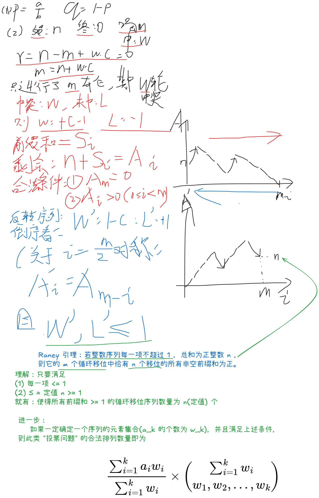
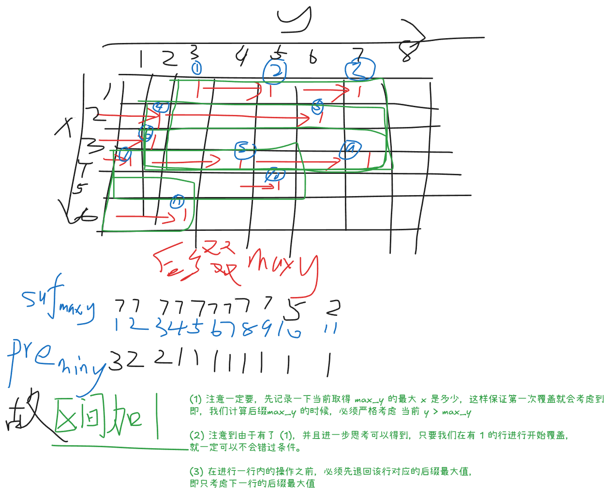

## A 比特掩码
### Problem Description

对于非负整数 $x$，定义 $f(x)$ 为 $x$ 的二进制表示（不含前导零）中极长连续全 $1$ 段的个数。例如，$f(23)=2$，因为 $23=(10111)_2$，其二进制表示包含 $2$ 个极长连续全 $1$ 段。

给定 $n$ 个整数 $a_1,a_2,\dots,a_n$。你需要处理 $m$ 个操作。每个操作由两个整数 $\textit{type}$ 和 $x$ 描述。

- 若 $\textit{type}=1$，将每个 $a_i$ 替换为 $a_i \mathbin{\&} x$。
- 若 $\textit{type}=2$，将每个 $a_i$ 替换为 $a_i \mathbin{|} x$。
- 若 $\textit{type}=3$，将每个 $a_i$ 替换为 $a_i \oplus x$。

其中 $\mathbin{\&}$ 表示按位与运算，$\mathbin{|}$ 表示按位或运算，$\oplus$ 表示按位异或运算。

每个操作之后，输出

$$
\sum_{i=1}^{n} f(a_i)
$$

### Input

每个测试文件仅包含一组测试数据。

第一行包含一个整数 $n$ $(1 \le n \le 3 \cdot 10^5)$。

第二行包含 $n$ 个整数 $a_1,a_2,\dots,a_n$ $(0 \le a_i < 2^{30})$。

第三行包含一个整数 $m$ $(1 \le m \le 3 \cdot 10^5)$。

接下来 $m$ 行，每行包含两个整数 $\textit{type}$ 和 $x$ $(1 \le \textit{type} \le 3,\ 0 \le x < 2^{30})$，描述一个操作。

### Output

输出 $m$ 行。第 $j$ 行必须包含第 $j$ 个操作之后

$$
\sum_{i=1}^{n} f(a_i)
$$

的值。

### Sample Input

```txt
4
3 5 6 10
4
1 7
2 8
3 15
2 3
```

### Sample Output

```txt
5
7
5
4
```

### Solution

> 这不就是利用的 2026“钉耙编程”中国大学生算法设计暑期联赛（1） 1006 开关灯的结论吗

**计算 01 串连续的 1 段数量的公式**

$$
段数 = \text{cnt}_{1} - \text{cnt}_{11}
$$

在本题中， $n$ 不可能一个个去枚举，必然需要使用到按位更新，因此维护的是：

- 第 $i$ 位置上面 $1$ 的数量
- 第 $i, i+1$ 位置同时为 $1$ 的数量

针对不同操作维护这个信息（从高位向低位遍历更新）

- 对于 `&`
	- 只看 $0$：清空 $i$ 位置的 $1$， $i, i - 1$ 位置的 $11$
- 对于 `|`
	- 只看 1：$i$ 位置的 $1$ 填满， $i$ 位置的 $11$ 等于 $i+1$ 位置的 $1$，$i-1$ 位置的 $11$ 等于 $i-1$ 位置的 $1$
- 对于 `^`
	- $i$ 位置的 $1$ 相对于 $n$ 取反
	- $i$ 位置的 $11$ 相对于 $i + 1$ 位置的 $1$ 取反
	- $i-1$ 位置的 $11$ 相对于 $i-1$ 位置的 $1$ 取反

### Code

```cpp
#include<bits/stdc++.h>
using namespace std;

const int N = 3e5 + 5, B = 30;

int n, a[N], m;
int cnt[B+1][3];

void solve() {
	cin >> n;
	memset(cnt,0,sizeof cnt);
	for (int i = 1; i <= n;i ++) {
		cin >> a[i];
		for (int j = 0;j<B;j++) {
			cnt[j][1]+=((a[i]>>j&1) == 1);
			cnt[j][2]+=((a[i]>>j&3) == 3);
		}
	}
	cin >> m;
	for (int i = 1; i <= m;i ++) {
		int type, x;
		cin >> type >> x;
		if (type == 1) {
			for(int i = B-1; i >= 0;i--) {
				if ((x >> i & 1) == 0) {
					if (i > 0) cnt[i-1][2] = 0;
					cnt[i][1] = 0;
					cnt[i][2] = 0;
				}
			}
		} else if (type == 2) {
			for (int i = B-1; i >= 0; i--) {
				if ((x >> i & 1) == 1) {
					if (i > 0) cnt[i-1][2] = cnt[i-1][1];
					cnt[i][1] = n;
					cnt[i][2] = cnt[i+1][1];
				}
			}
		} else {
			for (int i = B-1; i >= 0;i--) {
				if ((x >> i & 1) == 1) {
					if (i > 0) cnt[i-1][2] = cnt[i-1][1] - cnt[i-1][2];
					cnt[i][1] = n - cnt[i][1];
					cnt[i][2] = cnt[i+1][1] - cnt[i][2];
				}
			}
		}
		int ans = 0;
		for (int i = 0; i < B;i++) ans += cnt[i][1] - cnt[i][2];
		cout << ans << "\n"; 
	}
}
int main() {
	ios::sync_with_stdio(0); cin.tie(0); cout.tie(0);
	int T = 1;
	// cin >> T;
	while (T--) solve();
}
```

## B 再买一瓶

### Problem Description

一瓶饮料售价 $1$ 元。

每次小明喝完一瓶饮料，他会以 $\dfrac{a}{b}$ 的概率获奖。如果获奖，他将得到 $c$ 元；否则，他什么也得不到。

他得到的钱可以用来购买更多饮料。每瓶饮料的获奖事件相互独立。

小明一开始有 $n$ 元。求他恰好喝完 $m$ 瓶饮料后花光所有钱的概率。

### Input

每个测试文件包含多组测试数据。第一行包含测试数据的组数 $T$ ($1 \le T \le 200\,000$)。

接下来 $T$ 行，每行包含五个整数 $n, m, c, a, b$ ($1 \le n, m, c \le 2\,000\,000$，$0 \le a < b < 998\,244\,353$)，表示小明一开始有 $n$ 元，每次获奖得到 $c$ 元，获奖概率为 $\dfrac{a}{b}$；你需要求出他恰好喝完 $m$ 瓶饮料的概率。

### Output

输出 $T$ 行，每行包含一个整数：对应测试数据的答案对 $998\,244\,353$ 取模的结果。

形式化地，设 $M = 998\,244\,353$。可以证明，答案可以表示为最简分数 $\dfrac{p}{q}$，其中 $p$ 和 $q$ 为整数且 $q \not\equiv 0 \pmod{M}$。输出等于 $p \cdot q^{-1} \bmod M$ 的整数。

### Sample Input

```txt
4
1 1 2 1 2
1 3 2 1 2
2 2 3 1 3
1 2 2 1 2
```

### Sample Output

```txt
499122177
873463809
776412275
0
```

### Hint

在第一组测试数据中，恰好喝完 $1$ 瓶的唯一方式是第一瓶没有获奖，其概率为 $\dfrac{1}{2}$。

在第二组测试数据中，恰好喝完 $3$ 瓶的唯一方式是第一瓶获奖且接下来两瓶都没有获奖，其概率为 $\dfrac{1}{8}$。

在第四组测试数据中，小明一开始有 $1$ 元，每次获奖得到 $2$ 元，因此他不可能恰好喝完 $2$ 瓶。

### Solution

**Raney 引理：投票问题的结论，从 $0$ 到 $n$，最大上升步长 $\le 1$，符合 前缀约束 的序列数量的结论** 

Raney 引理：若整数序列每一项不超过 $1$（$a_i \le 1$） ，总和为正整数 $n$（$n \ge 1$） ，则它的 $m$ （$m = \sum_{i=1}^k w_i$） 个循环移位中恰有 $n$ 个移位的所有非空前缀和为正。

$$
\frac{\sum_{i=1}^k a_i w_i}{\sum_{i=1}^k w_i} \times \binom{\sum_{i=1}^k w_i}{w_1, w_2, ..., w_k}
$$



### Code

```cpp
#include<bits/stdc++.h>
using namespace std;

const int N = 2e6 + 5, mod = 998244353;

int n, m, c, a, b;
int fac[N], invfac[N];

int ksm(int a, int b = mod - 2) {
	int res = 1;
	for (; b; b >>= 1, a = 1LL * a * a % mod) if (b & 1) res = 1LL * res * a % mod;
	return res;
}

void init() {
	fac[0] = 1;
	for (int i = 1; i < N; i++) fac[i] = 1LL * fac[i - 1] * i % mod;
	invfac[N - 1] = ksm(fac[N - 1]);
	for (int i = N - 1; i >= 1; i--) invfac[i - 1] = 1LL * invfac[i] * i % mod;
}

int C(int i, int j) {
	if (i < j) return 0;
	return 1LL * fac[i] * invfac[j] % mod * invfac[i - j] % mod;
}

void solve() {
	cin >> n >> m >> c >> a >> b;
	if (m - n < 0 || (m - n) % c) {
		cout << 0 << "\n";
		return;
	}
	int k = (m - n) / c;
	int p = 1LL * a * ksm(b) % mod;
	int q = (1 - p + mod) % mod;
	cout << 1LL * n * ksm(m) % mod * C(m, k) % mod * ksm(p, k) % mod * ksm(q, m - k) % mod << "\n";
}

int main() {
	init();
	ios::sync_with_stdio(0); cin.tie(0); cout.tie(0);
	int T = 1;
	cin >> T;
	while (T--) solve();
}
```

## G 矩阵标记

### Problem Description

给定一个 $n \times m$ 的数字网格，每个格子中包含一个正整数。

如果存在两个格子 $(r_1, c_1)$ 和 $(r_2, c_2)$ 满足 $r_1 < r_2$ 且 $c_1 < c_2$，且这两个格子中的数字相等，那么所有满足 $r_1 \le r \le r_2$ 且 $c_1 \le c \le c_2$ 的格子 $(r, c)$ 都会被标记。

输出整个网格最终的标记情况。

### Input

每个测试文件仅包含一组测试数据。

第一行包含两个整数 $n, m$ ($1 \le n, m$，$n \times m \le 1\,000\,000$)。

接下来 $n$ 行，每行包含 $m$ 个整数；其中第 $i$ 行包含 $a_{i,1}, a_{i,2}, \dots, a_{i,m}$ ($1 \le a_{i,j} \le n \times m$)，描述该数字网格。

### Output

输出 $n$ 行，每行包含一个长度为 $m$、由字符 `0` 和 `1` 组成的字符串。

第 $i$ 行的第 $j$ 个字符为 `1` 表示格子 $(i, j)$ 最终被标记，为 `0` 表示未被标记。

### Sample Input

```txt
2 6
1 2 3 4 5 6
7 8 9 3 4 10
```

### Sample Output

```txt
001110
001110
```

### Hint

在样例中，第 1 行第 3 列的格子和第 2 行第 4 列的格子都含有数字 3，因此它们标记了两行中第 3 列到第 4 列的所有格子。

第 1 行第 4 列的格子和第 2 行第 5 列的格子都含有数字 4，因此它们标记了两行中第 4 列到第 5 列的所有格子。两个矩形的并集即为最终答案。

### Solution

**与取值个数相关的网格问题：链表式存储NB！**



### Code

```cpp
#include<bits/stdc++.h>
using namespace std;
using LL = long long;

const int N = 1e6 +5;
int n, m;

vector<vector<int>> a;
vector<vector<LL>> mat;

struct Node {
    int mny, mxy, sufx, sufy;
};

// 这里代表的是数字 x 在 第 i 行的 最大/小 y 值
map<int, Node> Y[N];

void add(int a,int b,int c,int d) {
    // 【特别注意】由于是沿着 x 方向扫的，所以允许一行，但不允许一列
    if(a>c||b>=d) return;
    // cout << a << " " << b << " " << c << " " << d << "\n";
    mat[a][b]++;
    mat[c+1][b]--;
    mat[a][d+1]--;
    mat[c+1][d+1]++;
}

void solve() {
    cin >> n >> m;
    mat.assign(n+1, vector<LL>(m+1));
    a.assign(n+1, vector<int>(m+1));
    for (int i = 0; i < n; i++) {
        for (int j = 0; j < m;j ++) {
            cin >> a[i][j];
            if (!Y[a[i][j]].count(i)) {
                Y[a[i][j]][i] = {j, j, i, j};
            } else {
                Y[a[i][j]][i].mxy = j;
                Y[a[i][j]][i].sufy = j;
            }
        }
    }
    int tot = n * m;
    for (int i = 1; i <= tot; i++) {
        int sufx = -1;
        int sufy = -1;
        for(auto it = Y[i].rbegin(); it!=Y[i].rend();it++) {
            int tmpx = it->second.sufx;
            int tmpy = it->second.sufy;
            it->second.sufx = sufx;
            it->second.sufy = sufy;
            if(tmpy > sufy) {
                sufx = tmpx;
                sufy = tmpy;
            }
        }
        int mny = 1e9;
        for(auto it = Y[i].begin(); it!=Y[i].end();it++) {
            if(it->second.mny < mny) {
                mny = it->second.mny;
            }
            it->second.mny = mny;
        }
    }
    for(int i = 1; i <= tot; i++) {
        for(auto [row, node]: Y[i]) {
            auto [mny, mxy, sufx, sufy] = node;
            add(row, mny, sufx, sufy);
        }
    }
    for (int i = 0; i < n; i++) {
        for (int j = 0; j < m ;j++) {
            mat[i+1][j] += mat[i][j];
            mat[i][j+1] += mat[i][j];
            mat[i+1][j+1] -= mat[i][j];
            cout << (mat[i][j] > 0);
        }
        cout << "\n";
    }

}

int main() {
    ios::sync_with_stdio(0);
    cin.tie(0); cout.tie(0);
    int T = 1;
    // cin >> T;
    while (T--) solve();
}
```

## I 交换大师

### Problem Description

对于一个数组 $a_1, a_2, \dots, a_n$，定义其价值为 $\sum_{i=1}^{n-1} |a_i - a_{i+1}|$。

你可以选择两个不同的位置并交换这两个位置上的元素，该操作最多执行一次。你也可以选择不改变数组。

求数组可能的最大价值。

### Input

每个测试文件包含多组测试数据。第一行包含测试数据的组数 $T$ ($1 \le T \le 100$)。每组测试数据的格式如下。

每组测试数据的第一行包含一个整数 $n$ ($2 \le n \le 5 \cdot 10^5$)。

第二行包含 $n$ 个整数 $a_1, a_2, \dots, a_n$ ($0 \le a_i \le 10^9$)。

保证同一测试文件中所有测试数据的 $n$ 之和不超过 $5 \cdot 10^5$。

### Output

对于每组测试数据，输出一个整数：最多进行一次交换后数组可能的最大价值。

### Sample Input

```txt
3
5
1 3 2 7 4
4
5 5 5 5
6
10 1 10 1 10 1
```

### Sample Output

```txt
14
0
45
```

### Hint

在第一组测试数据中，一种最优选择是交换 $a_2$ 和 $a_5$。数组变为 $[1, 4, 2, 7, 3]$，其价值为 $3+2+5+4 = 14$。

### Solution

### Solution

**端点 / 相邻暴力，内部交换枚举绝对值符号**

> 人话：贡献倍率有限，暴力枚举，相互照顾

一次交换只影响局部。先把所有含端点的交换和相邻交换暴力掉，用交换前后的局部贡献差更新 `ans`。

剩下只考虑两个内部位置的交换。

对内部位置 $i$，设

$$
C_i=|a_i-a_{i-1}|+|a_i-a_{i+1}|
$$

若换入值 $x$，局部增量为：

$$
D_i(x)=|x-a_{i-1}|+|x-a_{i+1}|-C_i
$$

两个绝对值各取正负号，共 4 个状态。设状态 $s$ 对应符号 $\sigma_1,\sigma_2\in\{1,-1\}$，则：

$$
D_i(x)=\max_s(k_s x+b_i(s))
$$

其中：

$$
k_s=\sigma_1+\sigma_2
$$

$$
b_i(s)=-\sigma_1a_{i-1}-\sigma_2a_{i+1}-C_i
$$

若 $i,j$ 交换，$i$ 选状态 $s$，$j$ 选状态 $t$：

$$
\Delta=(k_sa_j+b_i(s))+(k_ta_i+b_j(t))
$$

重排：

$$
\Delta=(b_i(s)+k_ta_i)+(b_j(t)+k_sa_j)
$$

**精髓在这里**：单独看 $i$ 时依赖未知的 $a_j$；但固定对方斜率 $k_t$ 后，$i$ 这一半只依赖已知的 $a_i$ 和状态 $t$，可以前缀最大。

维护：

$$
f[s][t]=\max(b_p(s)+k_ta_p)
$$

表示已经处理过的位置 $p$，自己选状态 $s$，未来对方选状态 $t$ 时的最大左半贡献。

扫到当前位置 $i$，枚举上一个状态 $s$、当前状态 $t$，算：

$$
Y=b_i(t)+k_sa_i
$$

用：

$$
f[s][t]+Y
$$

更新答案。

然后把当前位置作为未来的左侧位置：

$$
f[t][s]=\max(f[t][s],Y)
$$

相邻内部对即使被扫到，也会少算中间边，不会超过已经暴力过的真实相邻增量。

最后答案是原始价值加上最大增量：

$$
sum+ans
$$

注意 `sum` 和中间量开 `long long`。复杂度 $O(16n)=O(n)$。

### Code

```cpp
#include<bits/stdc++.h>
using namespace std;
using LL = long long;

const int N = 5e5 + 5;

int n;
LL a[N], sum, ans;
LL f[4][4]; // 考虑 cost_i(x) = |x - a_{i - 1}| + |x - a_{i + 1}| 中 绝对值的符号取值
// 0 -> k = -- 
// 1 -> k = -+
// 2 -> k = +-
// 3 -> k = ++
int sign[2] = {1, -1};

LL cal(int i) {
    return i == 1 ? abs(a[1] - a[2]) : i == n ? abs(a[n] - a[n-1]) : (abs(a[i]-a[i-1]) + abs(a[i]-a[i+1]));
}

void test(int l, int r) {
    LL d1 = cal(l) + cal(r);
    swap(a[l], a[r]);
    LL d2 = cal(l) + cal(r);
    swap(a[l], a[r]);
    ans = max(ans, d2 - d1);
}

void solve() {
    sum = ans = 0;
    cin >> n;
    for (int i = 1; i <= n; i++) cin >> a[i];
    for (int i = 2; i <= n; i++) sum += abs(a[i] - a[i - 1]);
    for (int i = 1; i < n; i++) {
        test(1, 1 + i);
        test(n - i, n);
        test(i, i + 1);
    }
    memset(f,0xc0,sizeof f);
    for (int i = 2; i < n; i++) {
        for (int s = 0; s < 4; s++) { // 上一个是 s
            for (int t = 0; t < 4; t++) { // 我是 t
                // 要用对方 s 的 k
                LL k = sign[s&1] + sign[s/2], b = -sign[t&1] * a[i-1] - sign[t/2] * a[i+1] - cal(i);
                LL Y = k * a[i] + b;
                ans = max(ans, f[s][t] + Y);
                // 为下一个 s 布置，对偶补充
                f[t][s] = max(f[t][s], Y);
            }
        }

    }
    cout << (sum + ans) << "\n";
}

int main() {
    ios::sync_with_stdio(0); cin.tie(0); cout.tie(0);
    int T = 1;
    cin >> T;
    while (T--) solve();
}
```

## M 漫游者

### Problem Description

**M. 漫游者**

有一棵 $n$ 个顶点的树。一个漫游者从顶点 $s$ 出发，想要到达顶点 $t$。漫游者希望尽可能避免走回头路，但他的记忆力很差，只能记住上一步。

如果 $s = t$，旅程立即结束，步数为 $0$。

否则，漫游者按以下规则移动：

- 第一步，他从 $s$ 的相邻顶点中等概率随机选择一个并移动过去。
- 在之后的每一步中，假设他当前位于顶点 $x$，上一步所在的顶点为 $y$。如果 $\deg(x) > 1$，他从 $x$ 的相邻顶点中除 $y$ 之外的顶点中等概率随机选择一个并移动过去。如果 $\deg(x) = 1$，那么 $y$ 是 $x$ 唯一的相邻顶点，因此他必须回到 $y$。
- 漫游者一到达顶点 $t$，旅程即结束。

求旅程步数的期望，对 $998244353$ 取模。

### Input

每个测试文件包含多组测试数据。第一行包含一个整数 $T$（$1 \le T \le 100$）。每组测试数据的格式如下：

第一行包含三个整数 $n, s, t$（$2 \le n \le 5 \cdot 10^5$，$1 \le s, t \le n$）。

第二行包含 $n - 1$ 个整数 $p_2, p_3, \ldots, p_n$（$1 \le p_i < i$）。对每个 $2 \le i \le n$，顶点 $i$ 和 $p_i$ 之间有一条边。保证给定的边构成一棵树。

保证同一测试文件中所有测试数据的 $n$ 之和不超过 $5 \cdot 10^5$。

### Output

对于每组测试数据，输出一个整数：步数期望对 $998244353$ 取模的结果。

形式化地，设 $M = 998244353$。可以证明，答案可以表示为最简分数 $\frac{p}{q}$，其中 $p$ 和 $q$ 为整数且 $q \not\equiv 0 \pmod{M}$。输出等于 $p \cdot q^{-1} \bmod M$ 的整数。

### Sample Input

```txt
4
4 2 4
1 2 3
3 2 1
1 2
3 3 1
1 2
4 1 2
1 1 1
```

### Sample Output

```txt
3
2
2
665496239
```

### Hint

对于第一个样例，边为 $1 - 2$、$2 - 3$、$3 - 4$。漫游者从顶点 $2$ 出发，想要到达顶点 $4$。第一步，他以各 $\frac{1}{2}$ 的概率选择顶点 $1$ 或顶点 $3$。如果他移动到顶点 $3$，则下一步必须是顶点 $4$，因此旅程为 $2$ 步；如果他移动到顶点 $1$，则他必须回到顶点 $2$，再到顶点 $3$，最后到顶点 $4$，因此旅程为 $4$ 步。因此，步数期望为 $\frac{2 + 4}{2} = 3$。

### Solution

**树上随机游走-变体**  **公式化简可能需要惊人的注意力**

- **一看像树上随机游走，只是游走的时候，被上一步限制了**
	- 根据常识，这个题目满足线性关系
	- 所以大胆猜想，各个未知数依然可以相互线性表示出
	- 即 使用树上随机游走的套路解题
	- 此题作为树上随机游走的一道例题，揭示了一种可能的推式子方法：
		- $\sum_{\text{son}_u}$ 集团的替换与分解，实现消元
- **考虑游走特性**
	- 游走决策与上个点有关，初步设计为关于有向边的转移
	- 考虑到树上的边，可以存放在其儿子节点上，故基于儿子节点创建变量
	- 最终的答案是基于 $t$ 为根的树，所以
		- 以 $t$ 为根，建立有根树，建立到 $t$ 的期望的 DP
	- 对于一个节点 $u$ 及其父边，
		1. 要么移动方向向下，来到 $u$ ：$f_u$ 表示当前 $u$ 到 $t$ 的期望
		2. 要么移动方向向上，来到 $p$ ：$g_u$ 表示当前 $p$ 到 $t$ 的期望
	- 假设线性关系：
		- $f_u = a_u g_u + b_u$ 
	- 自底向上分析
	- 设 $m = |\text{son}_u|$
	- 叶子：
		- $f_u$：只能向上移动，变为从 $u$ 到 $p$ 之后的期望
			- 即 $f_u = 1 + g_u$
			- $a_u = b_u = 1$
		- $g_u$ ：同上
	- 非叶子：
		- $f_u$ ：只能向下
			- $f_u = 1 + \frac{1}{m} \sum_{w \in \text{son}_u} f_w$
		- 为了方便凑出来方程，这里使用 $g_v$
		- $g_v$ ：可以向上，向下少一个
			- $g_v = 1 + \frac{1}{m} (g_u + \sum_{w \in \text{son}_u} f_w - f_v)$

设 $S = \sum_{w \in \text{son}_u} f_w$  （tips：将整体替换，以后便于消元）

有

$$
\begin{cases} 
\begin{aligned}

f_u &= 1 + \frac{1}{m} S \\

g_v &= 1 + \frac{1}{m} (g_u + S - f_v) 

\end{aligned}
\end{cases}
$$

- 问题来了
	- 我们想得到 $f_u, g_u$ 的关系（需要通过比较系数得到对应的 $a_u, b_u - a_v, b_v$ 递推式），怎么得到？
	- 首先可以将 $f_v$ 转化为 $g_v$ 之后，消去 $g_v$ 
	- 然后只剩下陌生的 $S$ 和 $g_v$ 了
	- 注意到 $S$ 中只存在 $f_v$ 即 $g_v$ 
	- 显然通过 $S$ 这个跳板，我们可以带入消掉 $g_v$
		1. 将 $g_v$ 表示为 $S$ 的函数
		2. 将 $S$ 中的 $g_v$ 用上式代入
		3. 得到只含有 $S$ 的函数，无 $g_v$
		4. 化简出 $S$ 并回代到 $f_u$ 式子中去即可

步骤如下

$$
\begin{equation} 
\begin{aligned}

g_v &= 1 + \frac{1}{m}(g_u + S - a_v g_v - b_v) \\
(m + a_v) g_v &= m + g_u + S - b_v \\
g_v &= \frac{1}{m+a_v} (m + g_u + S - b_v)

\end{aligned}
\end{equation}
$$

$$
\begin{equation} 
\begin{aligned}

S &= \sum_{w \in \text{son}_u} f_w \\
S &= \sum_{w \in \text{son}_u} (a_w (\frac{1}{m+a_w} (m + g_u + S - b_w)) + b_w) \\
S &= \sum_{w \in \text{son}_u} (\frac{a_w(m-b_w)}{m+a_w} + \frac{a_w}{m+a_w}g_u + \frac{a_w}{m+a_w}S + b_w) \\


\end{aligned}
\end{equation}
$$

接下来的化简看着头疼，所以换元：

$$
\begin{cases} 
\begin{aligned}

A_u &= \sum_{w \in \text{son}_u} \frac{a_w}{m+a_w} \\
B_u &= \sum_{w \in \text{son}_u} (\frac{a_w(m-b_w)}{m+a_w} + b_w)

\end{aligned}
\end{cases}
$$

所以

$$
\begin{equation} 
\begin{aligned}

S &= B_u + A_u g_u + A_u S \\
S &= \frac{A_u}{1-A_u} g_u + \frac{1}{1-A_u} B_u \\


\end{aligned}
\end{equation}
$$
代入到 $f_u$ 

$$
\begin{equation} 
\begin{aligned}

f_u &= 1 + \frac{1}{m} S \\

f_u &= 1 + \frac{1}{m} (\frac{A_u}{1-A_u} g_u + \frac{1}{1-A_u} B_u) \\

f_u &= \frac{A_u}{m(1-A_u)} g_u + \frac{1}{1-A_u} B_u + 1

\end{aligned}
\end{equation}
$$

比较系数，可得：

$$
\begin{cases} 
\begin{aligned}

a_u &= \frac{A_u}{m(1-A_u)} \\
b_u &= \frac{1}{1-A_u} B_u + 1

\end{aligned}
\end{cases}
$$

- 至此，问题解决了一半
	- 可以自底向上求系数了
- 但是缺少之后自顶向下的 $u, v$ 递推式
	- 主要是求解 $g_u, g_v$ 递推式，因为 $f_v$ 可以通过 $a_v, b_v$ 得到

显然，只需将最初的公式中， $S$ 直接消掉即可

$$
\begin{equation} 
\begin{aligned}

g_v &= \frac{1}{m+a_v} (m + g_u + S - b_v) \\

g_v &= \frac{1}{m+a_v} (m + g_u + m f_u - m - b_v) \\

g_v &= \frac{1}{m+a_v} (g_u + m a_u g_u + m b_u - b_v) \\

g_v &= \frac{(1+ma_u)}{m+a_v} g_u + \frac{1}{m+a_v} (m b_u - b_v) \\

\end{aligned}
\end{equation}
$$

- ok，最后就剩下 $s$ 处的求解了
	- 当 $s==t$ 时，显然答案为 $0$
	- 否则，先进行 `dfs1` 
		- 目的是自底向上，收集 $a_u, b_u$ 系数
	- 然后遍历 $t$ 的儿子，分别从儿子处开始 `dfs2`
		- 目的是计算 $f_u, g_u$ 
		- 为什么不从 $t$ 开始？
			- 因为 $t$ 没有父亲，其 $f_u, g_u$ 定义非法
			- 而其儿子 $v$ 的 $g_v$ 必定初始化为 $0$ 
			- 因此系数从 儿子处向下传递
	- $s$ 的计算方式
		- 由是刚开始，没有限制，所以需要特殊计算，即
			1. 首先有 $1$ 的初始值
			2. 接下来是按照度数均分的贡献
			3. 向上移动，那么 `+=g[s]`
			4. 向下移动到 $v$ ，那么 `+=f[v]` 

完结撒花

### Code

```cpp
#include<bits/stdc++.h>
using namespace std;

using ll = long long;

const int N = 5e5 + 5;
const ll mod = 998244353;

ll ksm(ll a, ll b = mod - 2) {
    ll res = 1;
    for (;b;b>>=1,a=a*a%mod) if(b&1) res = res * a % mod;
    return res;
}

int n, s, t;
int P[N];
vector<int> e[N];
ll a[N], b[N], f[N], g[N], m[N];

void dfs1(int u, int fa) {
    P[u] = fa;
    m[u] = e[u].size() - (fa!=0);
    if (e[u].size() == 1 && fa) {
        a[u] = b[u] = 1;
        return;
    }
    ll A = 0, B = 0;
    for (auto v: e[u]) if(v!=fa){
        dfs1(v, u);
        ll tmp = ksm(m[u] + a[v]);
        (A += a[v] * tmp) %= mod;
        (B += a[v] * (m[u] - b[v] + mod) % mod * tmp % mod + b[v]) %= mod;
    }
    ll tmp = ksm(m[u] * (1 - A + mod) % mod);
    a[u] = A * tmp % mod;
    b[u] = (B * tmp + 1) % mod;
}

void dfs2(int u, int fa) {
    f[u] = (a[u] * g[u] + b[u]) % mod;
    for (auto v: e[u]) if(v!=fa){
        ll tmp = ksm(m[u] + a[v]);
        ll c = (1 + m[u] * a[u]) % mod * tmp % mod;
        ll d = ((m[u] * b[u] - b[v]) % mod + mod) % mod * tmp % mod;
        g[v] = (c * g[u] + d) % mod;
        dfs2(v, u);
    }
}

void solve() {
    cin >> n >> s >> t;
    for (int i = 1; i <= n; i++) e[i].clear();
    for (int i = 2, p; i <= n; i++) {
        cin >> p;
        e[p].push_back(i);
        e[i].push_back(p);
    }
    dfs1(t, 0);
    f[t] = 0;
    for (auto v:e[t]) {
        g[v] = 0;
        dfs2(v, t);
    }
    if (s == t) {
        cout << "0\n";
    } else {
        ll res = 0;
        for (auto v:e[s]) {
            if (v == P[s]) {
                (res += g[s]) %= mod;
            }  else {
                (res += f[v]) %= mod;
            }
        }
        res = (res * ksm(m[s]+1) + 1) % mod;        
        cout << res << "\n";
    }
}

int main() {
    ios::sync_with_stdio(0); cin.tie(0); cout.tie(0);
    int T = 1;
    cin >> T;
    while (T--) solve();
}
```