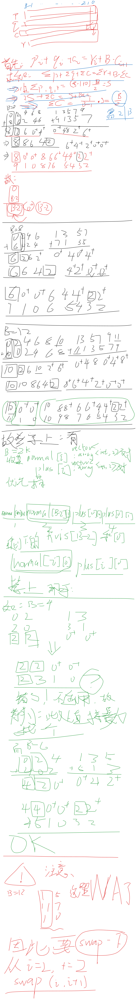

> 数学/构造 场

## A 回声前缀

### Problem Description

Input file: standard input  
Output file: standard output  
Time limit: 4 seconds  
Memory limit: 512 megabytes

给定一个长度为 $n$ 的小写英文字母串 $S$。字符串 $S$ 固定不变。

每个位置 $i$ 有一个非负权值 $a_i$，权值可以被修改。

对于一个非空字符串 $X$，定义它的回声值为

$$
H(X)=\sum_{\substack{1\le j\le n-|X|+1\\ S[j..j+|X|-1]=X}} a_j.
$$

也就是说，$X$ 在 $S$ 中每出现一次，就贡献该出现起点的当前权值。

处理 $q$ 次操作：

- `1 i x`：令 $a_i = x$。
- `2 p m`：输出

$$
\sum_{t=1}^{m} H(S[p..p+t-1]).
$$

- `3 p m k`：求最小的 $t$，满足 $1 \le t \le m$ 且

$$
\sum_{d=1}^{t} H(S[p..p+d-1]) \ge k.
$$

若不存在这样的 $t$，输出 $0$。

所有下标均从 $1$ 开始。

### Input

第一行包含两个整数 $n, q$（$1 \le n, q \le 2 \cdot 10^5$）。

第二行包含一个长度为 $n$ 的小写英文字母串 $S$。

第三行包含 $n$ 个整数 $a_1, a_2, \dots, a_n$（$0 \le a_i \le 10^6$）。

接下来 $q$ 行，每行包含一次操作，格式为以下三种之一：

- `1 i x`（$1 \le i \le n$，$0 \le x \le 10^6$）
- `2 p m`（$1 \le p \le n$，$1 \le m \le n-p+1$）
- `3 p m k`（$1 \le p \le n$，$1 \le m \le n-p+1$，$1 \le k \le 10^{18}$）

保证所有输出答案均不超过 $9 \cdot 10^{18}$。

### Output

对于每个类型为 $2$ 或 $3$ 的操作，输出一行一个整数。

### Sample Input

```txt
5 9
ababa
1 0 2 1 3
2 1 5
3 1 5 10
1 1 5
2 1 5
3 1 5 20
2 2 3
1 4 4
3 2 3 8
2 2 3
```

### Sample Output

```txt
14
3
34
3
2
2
8
```

### Hint

初始时，$S=\texttt{ababa}$，$a=[1,0,2,1,3]$。

对于 $p=1, m=5$，五个前缀分别为 $\texttt{a}, \texttt{ab}, \texttt{aba}, \texttt{abab}, \texttt{ababa}$，它们的回声值分别为 $6, 3, 3, 1, 1$。因此第一个答案为 $14$。

对于询问 `3 1 5 10`，$t=1,2,3$ 时的前缀累计和依次为 $6,9,12$，所以答案为 $3$。

将 $a_1=5$ 后，上述五个回声值变为 $10,7,7,5,5$，所以 `2 1 5` 的答案为 $34$。

### Solution

**【后缀树 上 RMQ** 】**【SA 构建后缀树】**

> **后缀树** 不失为处理 子串查询 的强有力数据结构

- 用到的后缀树的性质
	- 压缩版的 Trie
		- 压缩了二度节点
	- 所有后缀节点都是叶子节点
		- 一个叶子节点，对应一条链，一个后缀
	- 一个字符串在后缀树上如果可以走过某一条路径，那么它所到达的端点子树的叶子个数，即为出现次数
		- 原因：出现次数对应于各种后缀的前缀，因此该子树的叶子个数即为出现次数
	- 两个叶子节点的 LCA 即为两个后缀的 LCP，
		- 【这是很棒的一点】
		- 因为如果单纯使用 Height 数组构建的笛卡尔树，非常难用，还需要判断排名相对大小，并且左端点+1
- 后缀树的 SA 构建原理
	- 由于 SA 越相似的前缀，越容易排到连续的位置，
		- 因此，lcp 扫描过程中，其长度是连续变化的
		- 便于压缩构造 Trie 树
	- 使用一个栈链，维护当前稻苗到的后缀的单链结构
	- Height 表示的即为下一个后缀与当前栈链第一个不同的位置，便于快速定位、分叉
	- （注意到）已经被弹出栈链的节点，不再有机会和后续的后缀合并
		- 这也就对应了 lcp = rmq height

### Code

```cpp
#include<bits/stdc++.h>
using namespace std;
using ll = long long;

const int N = 2e5 + 5;
const int M = 1<<8;

// 【NEW】 SA 构建后缀树 无终止符 优雅 模板
namespace SufTree {
    int sa[N*2], tsa[N], rk[N*2], trk[N*2], cnt[N], n,m,p;
    int height[N];
    string s;
    void init(const string & _) {
        s = _;
        n = s.size();
        m = M - 1;
        p = 0;
        for (int i = 1; i <= n; i++) cnt[rk[i]=s[i-1]]++;
        for (int i = 1; i <= m; i++) cnt[i] += cnt[i-1];
        for (int i = n; i >= 1; i--) sa[cnt[rk[i]]--] = i;
        
        for (int w = 1; w <= n; w <<= 1, m=p) {
            int cur = 0;
            for (int i = n; i > n - w; i--) tsa[++cur] = i;
            for (int i = 1; i <= n; i++) if (sa[i] > w) tsa[++cur] = sa[i] - w;

            memset(cnt,0,sizeof(cnt[0]) * (m + 1));
            for (int i = 1; i <= n; i++) cnt[rk[i]]++;
            for (int i = 1; i <= m; i++) cnt[i] += cnt[i-1];
            for (int i = n; i >= 1; i--) sa[cnt[rk[tsa[i]]]--] = tsa[i];

            p = 0;
            memcpy(trk,rk,sizeof(rk[0]) * (n+1));
            for (int i = 1; i <= n; i++) {
                p += trk[sa[i]] != trk[sa[i-1]] || trk[sa[i]+w] != trk[sa[i-1]+w];
                rk[sa[i]] = p;
            }
            if (p == n) break;
        }
    }
    // 【终于知道复杂度为什么这么低了】
    // 想想 SufTree 的节点个数才 O(2n) 个
    void get_height() {
        for (int i = 1,h=0;i<=n;i++) {
            if(rk[i]==1) h=0;
            else {
                if(h)h--;
                int j = sa[rk[i]-1];
                while(i+h<=n&&j+h<=n&&s[i+h-1]==s[j+h-1])h++;
            }
            height[rk[i]]=h;
        }
    }
    // 【正片】
    // 1-n 是后缀， >= n + 1 是中间节点
    int fa[N*2], stk[N*2], tp, tot, len[N*2], root;
    void build(const string& s) {
        init(s);
        get_height();

        tot = n;
        root = ++tot;
        fa[root] = 0;
        len[root] = 0;
        stk[tp = 1] = root;

        for (int i = 1; i <= n; ++i) {
            int x = sa[i], h = height[i];
            len[x] = n + 1 - x;

            int last = 0;
            while (len[stk[tp]] > h) last = stk[tp--];

            int cur = stk[tp];
            if (len[cur] < h) {
                int z = ++tot;
                len[z] = h;
                fa[z] = cur;
                if (last) fa[last] = z;
                cur = z;
                stk[++tp] = z;
            } else if (cur <= n) {
                int z = ++tot;
                len[z] = h;
                fa[z] = stk[tp - 1];
                fa[cur] = z;
                cur = z;
                stk[tp] = z;
            }

            fa[x] = cur;
            stk[++tp] = x;
        }
    }
}

int n, q;
string S;
ll a[N], sum[N];

vector<int> e[N*2];
int dfn[N*2], dfncnt, rnk[N*2], son[N*2], sz[N*2], fa[N*2], dep[N*2], top[N*2];

namespace SegTree{
    // f 表示区间 a 之和 g 表示区间边长之和 h 表示区间 a * h 之和
    ll f[N*8], g[N*8], h[N*8];
    ll tag[N*8]; // tag 表示 区间加
    void up(int i) {
        f[i] = f[i*2] + f[i*2+1];
        g[i] = g[i*2] + g[i*2+1];
        h[i] = h[i*2] + h[i*2+1];
    }
    void build(int i,int l,int r) {
        tag[i] = 0;
        if (l == r) {
            int u = rnk[l];
            f[i] = sum[u];
            g[i] = SufTree::len[u] - SufTree::len[fa[u]];
            h[i] = f[i] * g[i];
        } else {
            int mid = (l + r) / 2;
            build(i*2,l,mid);
            build(i*2+1,mid+1,r);
            up(i);
        }
    }
    void lazy_add(int i,int n,ll v) {
        tag[i] += v;
        f[i] += n * v;
        h[i] += v * g[i];
    }
    void down(int i,int ln,int rn) {
        if(tag[i]) {
            lazy_add(i*2,ln,tag[i]);
            lazy_add(i*2+1,rn,tag[i]);
            tag[i] = 0;
        }
    }
    void add(int i,int l,int r,int jl,int jr,ll v) {
        if (jl <= l && r <= jr) {
            lazy_add(i,r-l+1,v);
        } else {
            int mid = (l + r) / 2;
            down(i,mid-l+1,r-mid);
            if(jl<=mid) add(i*2,l,mid,jl,jr,v);
            if(jr>mid) add(i*2+1,mid+1,r,jl,jr,v);
            up(i);
        }
    }
    ll query_f(int i,int l,int r,int jl,int jr) {
        if (jl <= l && r <= jr) {
            return f[i];
        } else {
            ll res = 0;
            int mid = (l + r) / 2;
            down(i,mid-l+1,r-mid);
            if (jl <= mid) res += query_f(i*2,l,mid,jl,jr);
            if (jr > mid) res += query_f(i*2+1,mid+1,r,jl,jr);
            return res;
        }
    }
    ll query_g(int i,int l,int r,int jl,int jr) {
        // 【坑点！！！】 在 upper_bound_g 调用它的时候，会出现 空集查询的情况，必须制止!
        if(r<jl||l>jr) return 0;
        if (jl <= l && r <= jr) {
            return g[i];
        } else {
            ll res = 0;
            int mid = (l + r) / 2;
            if (jl <= mid) res += query_g(i*2,l,mid,jl,jr);
            if (jr > mid) res += query_g(i*2+1,mid+1,r,jl,jr);
            return res;
        }
    }
    ll query_h(int i,int l,int r,int jl,int jr) {
        if(r<jl||l>jr) return 0;
        if (jl <= l && r <= jr) {
            return h[i];
        } else {
            ll res = 0;
            int mid = (l + r) / 2;
            down(i,mid-l+1,r-mid);
            if (jl <= mid) res += query_h(i*2,l,mid,jl,jr);
            if (jr > mid) res += query_h(i*2+1,mid+1,r,jl,jr);
            return res;
        }
    }
    int upper_bound_g(int i,int l,int r,int jl,int jr,ll x) {
        // cout << i << " " << l << " " << r << "\n";
        if (l == r) return l;
        int mid = (l + r) / 2;
        down(i,mid-l+1,r-mid);
        ll L = query_g(i*2,l,mid,jl,jr);
        if (L <= x) {
            x -= L;
            return upper_bound_g(i*2+1,mid+1,r,jl,jr,x);
        } else {
            return upper_bound_g(i*2,l,mid,jl,jr,x);
        }
    }
    int upper_bound_h(int i,int l,int r,int jl,int jr,ll x) {
        if (l == r) return l;
        int mid = (l + r) / 2;
        down(i,mid-l+1,r-mid);
        ll L = query_h(i*2,l,mid,jl,jr);
        if (L < x) {
            x -= L;
            return upper_bound_h(i*2+1,mid+1,r,jl,jr,x);
        } else {
            return upper_bound_h(i*2,l,mid,jl,jr,x);
        }
    }
}

// 由于后缀树 都是查询/修改的 从叶子到根 的路径，所以一路往上跳
vector<array<int,2>> get_range(int x) {
    vector<array<int,2>> res;
    while(x) {
        res.push_back({top[x], x});
        x = fa[top[x]];
    }
    reverse(res.begin(), res.end());
    return res;
}

// op1
void add(int x,ll v) {
    auto lr = get_range(x);
    for(auto [l,r]: lr) 
        SegTree::add(1,1,dfncnt,dfn[l], dfn[r], v);
}

// op2
ll query2(int x,int m) {
    ll res = 0;
    auto lr = get_range(x);
    for (auto [l, r]: lr) {
        ll tmp_g = SegTree::query_g(1,1,dfncnt,dfn[l],dfn[r]);
        if (tmp_g <= m) {
            m -= tmp_g;
            res += SegTree::query_h(1,1,dfncnt,dfn[l],dfn[r]);
        } else {
            int y = rnk[SegTree::upper_bound_g(1,1,dfncnt,dfn[l],dfn[r],m)];            
            if(y != top[y]) {
                int fy = fa[y];
                if(dep[fy] >= dep[l]) {
                    tmp_g = SegTree::query_g(1,1,dfncnt,dfn[l],dfn[fy]);
                    m -= tmp_g;
                    res += SegTree::query_h(1,1,dfncnt,dfn[l],dfn[fy]);
                }
            }
            ll f = SegTree::query_f(1,1,dfncnt,dfn[y],dfn[y]);
            res += f * m;
            break;
        }
    }
    return res;
}

// op3
int query3(int x,int m,ll k) {
    int t = 0;
    auto lr = get_range(x);
    for (auto [l, r]: lr) {
        ll tmp_h = SegTree::query_h(1,1,dfncnt,dfn[l],dfn[r]);
        if (tmp_h < k) {
            k -= tmp_h;
            t += SegTree::query_g(1,1,dfncnt,dfn[l],dfn[r]);
        } else {
            int y = rnk[SegTree::upper_bound_h(1,1,dfncnt,dfn[l],dfn[r],k)];
            if (y != top[y]) {
                int fy = fa[y];
                if(dep[fy] >= dep[l]) {
                    tmp_h = SegTree::query_h(1,1,dfncnt,dfn[l],dfn[fy]);
                    k -= tmp_h;
                    t += SegTree::query_g(1,1,dfncnt,dfn[l],dfn[fy]);
                }
            }
            ll f = SegTree::query_f(1,1,dfncnt,dfn[y],dfn[y]);
            // if(!f) return 0;
            ll rm = (k-1) / f;
            t += rm + 1;
            k = -1;
            break;
        }
    }
    return k == -1 && t <= m ? t : 0;
}

void dfs1(int u) {
    sz[u] = 1;
    sum[u] = u <= n ? a[u] : 0;
    for (auto v: e[u]) {
        fa[v] = u;
        dep[v] = dep[u] + 1;
        
        dfs1(v);

        sum[u] += sum[v];
        sz[u] += sz[v];
        if (sz[son[u]] < sz[v]) {
            son[u] = v;
        }
    }    
}

void dfs2(int u,int tp) {
    dfn[u] = ++dfncnt;
    rnk[dfncnt] = u;
    top[u] = tp;
    if(son[u]) dfs2(son[u], tp);
    for (auto v: e[u]) if (v!=son[u]) dfs2(v, v);
}

void solve() {
    cin >> n >> q;
    cin >> S;
    for (int i = 1; i <= n; i++) cin >> a[i];

    SufTree::build(S);
    for (int i = 1; i <= SufTree::tot; i++) e[SufTree::fa[i]].push_back(i);

    dfs1(SufTree::root);
    dfs2(SufTree::root,SufTree::root);
    
    SegTree::build(1,1,dfncnt);

    for (int i = 1; i <= q; i++) {
        int op;
        cin >> op;
        if (op == 1) {
            int i, x;
            cin >> i >> x;
            add(i, x - a[i]);
            a[i] = x; 
        } else if(op == 2) {
            int p, m;
            cin >> p >> m;
            cout << query2(p, m) << "\n";
        } else {
            int p, m;
            ll k;
            cin >> p >> m >> k;
            cout << query3(p, m, k) << "\n";

        }
    }

}

int main() {
    ios::sync_with_stdio(0); cin.tie(0); cout.tie(0);
    int T = 1;
    // cin >> T;
    while (T--) solve();
}
```

## B 放大的徽章

### Problem Description

- Input file: standard input
- Output file: standard output
- Time limit: 3 seconds
- Memory limit: 512 megabytes

平面上给定两个有限格点集合 $A$ 和 $B$。设 $P = \operatorname{conv}(A)$，$Q = \operatorname{conv}(B)$ 分别为它们的凸包。输入中可能包含重复点。

对于一个正整数 $k$，将 $P$ 关于原点放大 $k$ 倍，得到多边形 $kP$。

如果整数向量 $(u, v)$ 使得平移后的多边形 $kP + (u, v)$ 与 $Q$ 至少有一个公共点，则称 $(u, v)$ 是合法的。边界相交也算相交。

对于每个询问 $k$，求合法整数向量 $(u, v)$ 的数量，并对 $998244353$ 取模。

### Input

第一行包含三个整数 $n, m, q$（$3 \le n, m \le 2 \times 10^5$，$1 \le q \le 2 \times 10^5$），分别表示 $A$ 中点的个数、$B$ 中点的个数和询问次数。

接下来 $n$ 行，每行包含两个整数 $x_i, y_i$（$-10^9 \le x_i, y_i \le 10^9$），表示 $A$ 中的一个点。

接下来 $m$ 行，每行包含两个整数 $x_i, y_i$（$-10^9 \le x_i, y_i \le 10^9$），表示 $B$ 中的一个点。

接下来 $q$ 行，每行包含一个整数 $k$（$1 \le k \le 10^{18}$），表示一次询问。

保证 $P$ 和 $Q$ 的面积均为正。

### Output

对于每个询问，输出一行一个整数，表示合法整数向量的数量对 $998244353$ 取模的结果。

### Sample Input

```txt
6 5 4
0 0
2 0
2 1
0 1
1 0
1 1
0 0
3 0
1 2
0 1
1 1
1
2
5
10
```

### Sample Output

```txt
20
36
108
308
```

### Hint

在样例中，$P$ 是顶点为 $(0,0),(2,0),(2,1),(0,1)$ 的矩形，$Q$ 是顶点为 $(0,0),(3,0),(1,2),(0,1)$ 的四边形。

可以算出 $2S_P = 4$，$2S_Q = 7$，$B_P = 6$，$B_Q = 7$，且 $2S_{Q+(-P)} = 25$。因此询问 $k$ 的答案为

$$
2k^2 + 10k + 8.
$$

代入 $k = 1, 2, 5, 10$，答案分别为 $20, 36, 108, 308$。

### Solution

- **知道闵可夫斯基和**
- **但是忘了 Pick 定理可以用（还以为这一题不是整数格点）**
- **但是完全不知道，一个动态闵可夫斯基凸包的边，用多项式就能表达格点数量？！**
	- 完全没想到：动态 Minkowski 凸包的格点数，能压成一个关于 $k$ 的多项式。


**① 建模：Minkowski 和**

$$
\exists\, p \in P,\; q \in Q,\; kp + t = q
\;\;\Longleftrightarrow\;\;
t \in R_k = Q + (-kP)
$$

答案 = 凸多边形 $R_k$ 内的格点数。

**② 求格点数：Pick 定理**

$$
\#(X \cap \mathbb{Z}^2) = \frac{S(X) + B(X) + 2}{2}
$$

其中 $S$ 为二倍面积，$B$ 为**边界格点数**（不是几何边长）。

**③ 关键：$R_k$ 的面积和边界格点都能拆**

$$
S(R_k) = S(Q) + k^2 S(P) + kC, \qquad C = S(R_1) - S(Q) - S(P)
$$

$$
B(R_k) = B(Q) + k\,B(P)
$$

代入 Pick 定理 → 答案是关于 $k$ 的**二次多项式**，$O(1)$ 回答每次询问。

- 易混淆点：$B$ 是格点数，不是边长（虽然放边长上去依然成立）
	- $B(A+B) = B(A) + B(B)$ 成立，靠的不是"长度可加"，而是：
		- 不同向的边各自保留，贡献不变。
		- 同向边合并时，$\gcd$ 恰好可加

- 计算流程
	1. 对 $P$、$Q$ 求凸包。
	2. 算 $S(Q),\; B(Q),\; S(P),\; B(P)$。
	3. 求一次 Minkowski 和 $R_1 = Q + (-P)$（极角归并，$O(n)$）。
	4. 算 $S(R_1)$，得 $C = S(R_1) - S(Q) - S(P)$。
	5. 每次询问代入多项式，模 $998244353$。

> 面积为什么是 $S(Q) + k^2 S(P) + kC$？（最抽象）

你拿 $Q$ 沿着 $-kP$ 滑一圈，扫出来的面积，直觉上分三块：

| 部分         | 来源          | 为什么                                           |
| ---------- | ----------- | --------------------------------------------- |
| $S(Q)$     | $Q$ 自己的面积   | 起点那块                                          |
| $k^2 S(P)$ | $-kP$ 自己的面积 | $P$ 放大 $k$ 倍，面积变 $k^2$ 倍（二维）                  |
| $kC$       | 两者"混合"出来的面积 | 滑动过程中，$Q$ 的边和 $P$ 的边"交叉"扫出来的，跟 $k$ 成正比（一维×一维） |

$C$ 就是个常数，代表 $Q$ 和 $P$ 的形状有多"不搭"。你只需要算一次 $R_1$（$k=1$ 的情况），反推出 $C$ 就行了。

> 边界格点为什么是 $B(Q) + k \cdot B(P)$？（可以理解）

Minkowski 和的边界 = 把两个多边形的边向量**按方向排好序，拼起来**。

- $Q$ 的边：原封不动贡献 $B(Q)$ 个格点。
- $-kP$ 的边：每条边放大了 $k$ 倍。一条边上有 $\gcd(\Delta x, \Delta y)$ 个格点，放大 $k$ 倍后变成 $\gcd(k\Delta x, k\Delta y) = k \cdot \gcd(\Delta x, \Delta y)$。

所以 $-kP$ 的边界格点就是 $k \cdot B(P)$，加起来就完事了。

### Code

```cpp
#include<bits/stdc++.h>
using namespace std;
using LL = long long;
using LLL = __int128;

const int N = 2e5 + 5;
const LL mod = 998244353, inv2 = (mod + 1) / 2;

struct Vec;

struct Vec{
    LL x,y;
    double angle;
    Vec(LL x=0,LL y=0):x(x),y(y){
        angle = atan2(y, x);
    }
    Vec operator+(Vec o) const { return Vec(x+o.x,y+o.y);}
    Vec& operator+=(Vec o) { x+=o.x; y+=o.y; return *this;}
    Vec operator-(Vec o) const { return Vec(x-o.x,y-o.y);}
    Vec operator-() const { return Vec(-x,-y);}
    Vec operator*(LL k) const { return Vec(x*k,y*k);}
    LLL operator%(Vec o) const { 
        return (LLL)x*o.y - (LLL)y*o.x;
    }
    // 【坑点2：极角排序需要使用极角】
    bool operator<(const Vec& o) const {
        // return *this % o > 0;
        return angle < o.angle;
    }
    friend istream& operator>>(istream& in, Vec& o) {
        return in >> o.x >> o.y;
    }
    friend ostream& operator<<(ostream& os, Vec& o) {
        return os << "Vec:" << o.x << ", " << o.y;
    } 
};

int n, m, q;
int cnt;
Vec P[N], Q[N], C[N*2], R[N*2], tmp[N];
LL sk[3], bk[2];

// 【坑点1：[-1e9, 1e9] 算面积二倍要开 i128 】
LLL S2(Vec* A, int n) {
    LLL res = 0;
    for(int i = 1;i<=n;i++) res += A[i+1] % A[i];
    return res < 0 ? -res:res;
}

// 【坑点3：闵可夫斯基和 + Andrew 都建议传入 1..n 并使用 1..n+1 并返回 B[1..n]】
void minkowski(Vec* A, int n, Vec* B) {
    sort(A+1,A+1+n);
    B[1] = {0,0};
    for(int i = 2; i<=n+1;i++) {
        B[i] = B[i-1] + A[i-1];
        // cout << A[i-1] << "!\n";
    } 
    // for(int i = 1;i<=n+1;i++) {
    //     cout << B[i] << "\n";
    // }
}

int Andrew(Vec* A, int n,Vec* B) {
    sort(A+1,A+1+n,[](Vec& a,Vec& b){
        return a.x != b.x ? a.x < b.x: a.y < b.y;
    });
    int tp = 0;
    for (int i = 1;i <= n;i++) {
        while(tp >= 2 && (B[tp]- B[tp-1]) % (A[i] - B[tp]) <= 0) tp--;
        B[++tp] = A[i];
    }
    int tp2 = tp;
    for(int i = n;i>=1;i--) {
        while(tp2 >= tp + 1 && (B[tp2]-B[tp2-1]) % (A[i] - B[tp2]) <= 0) tp2--;
        B[++tp2] = A[i];
    }
    return tp2-1;
}

void solve() {
    cin >> n >> m >> q;
    cnt = 0;
    for(int i = 1; i <= n; i++) cin >> P[i];
    for(int i = 1; i <= m; i++) cin >> Q[i];

    n = Andrew(P, n, tmp);
    memcpy(P, tmp, sizeof(Vec) * (n+1));
    P[n+1] = P[1];
    m = Andrew(Q, m, tmp);
    memcpy(Q, tmp, sizeof(Vec) * (m+1));
    Q[m+1] = Q[1];
    
    // for(int i = 1; i <= n;i++) cout << P[i] << "!!\n";
    // for(int i = 1; i <= m;i++) cout << Q[i] << "!!!\n";
    
    for(int i = 1;i<=n;i++) C[++cnt] = P[i] - P[i+1];
    for(int i = 1;i<=m;i++) C[++cnt] = Q[i+1] - Q[i];
    minkowski(C, cnt, R);
    sk[2] = S2(P, n) % mod;
    sk[1] = ((S2(R, cnt) - S2(P, n) - S2(Q, m)) % mod + mod) % mod;
    sk[0] = S2(Q, m) % mod;
    for(int i = 1;i<=n;i++) {
        Vec D = P[i+1] - P[i];
        (bk[1] += gcd(abs(D.x), abs(D.y))) %= mod;
    }
    for(int i = 1;i<=m;i++) {
        Vec D = Q[i+1] - Q[i];
        (bk[0] += gcd(abs(D.x), abs(D.y))) %= mod;
    }
    while(q--) {
        LL k;
        cin >> k;
        // 【坑点4：开门爆】
        k %= mod;
        LL res = (
            sk[0]+sk[1]*k%mod+sk[2]*k%mod*k%mod 
            + bk[0] + bk[1] * k % mod + 2
        ) % mod * inv2 % mod;
        cout << res << "\n";
    }
}

int main() {
    // cout << "啥阴（闵可夫斯基和之后的面积爆了）：" << ((4e9 * 4e9 * 2) > LONG_LONG_MAX) << "\n";
    ios::sync_with_stdio(0); cin.tie(0); cout.tie(0);
    int T = 1;
    // cin >> T;
    while (T--) solve();
}
```

## C 数字游戏

### Problem Description

- Input file: standard input
- Output file: standard output
- Time limit: 1 second
- Memory limit: 256 megabytes

给定一个正整数进制 $B$。

你需要构造三个长度为 $B$ 的排列 $P, Q, R$（即每个序列恰好包含 $0$ 到 $B-1$ 每个数字一次）。

$$
P = (p_1, p_2, \dots, p_B),\quad
Q = (q_1, q_2, \dots, q_B),\quad
R = (r_1, r_2, \dots, r_B).
$$

定义一个序列 $X = (x_1, x_2, \dots, x_B)$ 在 $B$ 进制下表示的整数为

$$
[X]_B = \sum_{i=1}^{B} x_i \cdot B^{B-i}.
$$

注意序列允许以数字 $0$ 开头，因此表示的整数可以小于 $B^{B-1}$。

请你构造三个排列 $P, Q, R$，使得它们满足等式（注意加法是在 $B$ 进制下的加法）

$$
[P]_B + [Q]_B = [R]_B,
$$

并且对于每个位置 $i$（$1 \le i \le B$），$p_i, q_i, r_i$ 两两不同。

如果不存在这样的构造，请输出 $-1$。

### Input

输入仅一行，包含一个整数 $B$（$2 \le B \le 10^6$）。

### Output

如果存在合法构造，则输出三行，每行 $B$ 个整数，分别表示序列 $P, Q, R$ 中的数字，数字之间用空格分隔。

如果不存在合法构造，则输出一行 $-1$。

若存在多种构造，输出任意一种即可。

### Sample Input

样例 1：

```txt
5
```

样例 2：

```txt
6
```

### Sample Output

样例 1：

```txt
-1
```

样例 2：

```txt
4 2 5 0 3 1
0 4 1 2 5 3
5 1 0 3 2 4
```

### Hint

$2 \le B \le 10^6$。

### Solution

**数学场典型计算方式：**

- 整体求和得到不变量性质
	- 即 将每一位的 $a_i + b_i + \text{carray}_i = c_i + \text{carry}_{i+1} \times B$ 求和
	- 再利用天然整除约束得出约束条件
- 奇偶数重排的加法性质
	- 奇数+奇数=偶数集+进位
	- 偶数+偶数=偶数集+进位
	- 由此通过偶数+进位可得奇数集
- 循环移位后加法的进位性质
	- 很有规律，天然规律



### Code

```cpp
#include<bits/stdc++.h>
using namespace std;

const int N = 1e6 + 5;

int n;

void solve() {
    cin >> n;
    // cout << n << "\n";
    if ((n&1) || n == 2) cout << -1 << "\n";
    else if(n == 4){
        cout << "1 3 0 2\n0 1 2 3\n2 0 3 1\n";
    } else {
        vector<vector<array<int,3>>> nom(n),pls(n);
        for(int i = 0;i<n;i+=2) {
            int a = i, b = (i - 2 + n) % n;
            int c = (a + b) % n, car = (a + b) / n;
            if (car) {
                pls[c].push_back({a, b, c});
            } else {
                nom[c].push_back({a, b, c});
            }
        }
        for(int i = 1;i<n;i+=2) {
            int a = i, b = (i - 2 + n) % n;
            int c = (a + b) % n, car = (a + b) / n;
            if (car) {
                pls[c].push_back({a, b, c});
            } else {
                nom[c].push_back({a, b, c});
            }
        }
        vector<array<int,3>> ans(n);
        int i = 0;
        assert(nom[n-2].size()==2);
        assert(pls[0].size()==2);
        ans[i++] = nom[n-2][1];
        nom[n-2][0][2]++;
        ans[i++] = nom[n-2][0];
        pls[0][0][2]++;
        ans[i++] = pls[0][0];
        ans[i++] = pls[0][1];
        for(int j = 2;j<n-2;j+=2) {
            assert(nom[j].size() == 1);
            assert(pls[j].size() == 1);
            nom[j][0][2]++;
            ans[i++] = nom[j][0];
            ans[i++] = pls[j][0];
        }
        for(int i = 2;i<n;i+=2) {
            if(ans[i][0] == ans[i][2] || ans[i][1] == ans[i][2]) {
                swap(ans[i], ans[i+1]);
                swap(ans[i][2], ans[i+1][2]);
            }
        }
        for(int j =0;j<3;j++) {
            for(int i = 0;i<n;i++) {
                cout << ans[i][j] << " ";
            }cout << "\n";
        }
    }
}

int main() {
    ios::sync_with_stdio(0); cin.tie(0); cout.tie(0);
    int T = 1;
    // cin >> T;
    while (T--) solve();
}
```

> 附对拍代码
> PS：system() 函数的返回值原来是子程序的返回值，这样 check 就不需要 diff 或者 fc 了

```cpp
// gen.cpp
#include<bits/stdc++.h>
using namespace std;

mt19937 rng(chrono::steady_clock().now().time_since_epoch().count());

int main() {
    cout << (rng() % 1000)*2 + 4;    
}
```

```cpp
// check.cpp
#include<bits/stdc++.h>
using namespace std;

mt19937 rng(chrono::steady_clock().now().time_since_epoch().count());

int n;
int main() {
    cin >> n;
    vector<int> a(n), b(n), c(n), cc(n+1);
    for(int i = 0;i<n;i++) cin >> a[n-1-i];
    for(int i = 0;i<n;i++) cin >> b[n-1-i];
    for(int i = 0;i<n;i++) cin >> c[n-1-i];
    for(int i = 0;i<n;i++) {
        cc[i] += a[i] + b[i];
        cc[i+1] += cc[i] / n;
        cc[i] %= n;
    }
    vector<int> cnt;
    cnt.assign(n, 0);
    for(int i = 0;i<n;i++) {
        if(++cnt[a[i]] == 2) return 1;
    }
    cnt.assign(n, 0);
    for(int i = 0;i<n;i++) {
        if(++cnt[b[i]] == 2) return 1;
    }
    cnt.assign(n, 0);
    for(int i = 0;i<n;i++) {
        if(++cnt[c[i]] == 2) return 1;
    }
    for(int i = 0;i<n;i++) {
        if(a[i] == b[i] || a[i] == c[i] || b[i] == c[i]) return 1;
    }
    for(int i = 0;i<n;i++) if(cc[i]!=c[i]) return 1;

    cout << "OK\n";
    return 0;
}
```

```cpp
// test.cpp
#include<bits/stdc++.h>
using namespace std;

int main() {
    system("g++ -std=c++20 gen.cpp -o gen.o");
    system("g++ -std=c++20 C.cpp -o C.o");
    system("g++ -std=c++20 check.cpp -o check.o");
    while(1) {
        system("gen.o > in.txt");
        system("C.o < in.txt > out.txt");
        if(system("check.o < out.txt")) {
            cout << "WA\n";
            break;
        }
    }
}
```

[^1]: 
