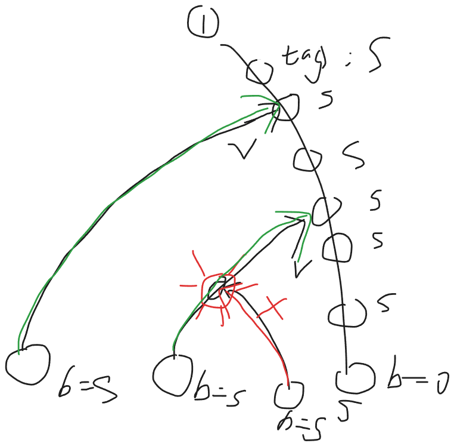

## C 我得到神奇宝贝了！

### Problem Description


一场面向关都地区三种初始伙伴宝可梦的特别赛跑即将举行。红队有 $x$ 只小火龙，绿队有 $y$ 只妙蛙种子，蓝队有 $z$ 只杰尼龟。它们分别记作

$$
R_1, R_2, \ldots, R_x,\quad G_1, G_2, \ldots, G_y,\quad B_1, B_2, \ldots, B_z.
$$

每只宝可梦通过终点的时间均不相同。因此，它们的完赛名次构成 $1, 2, \ldots, x + y + z$ 的一个排列，其中名次 $1$ 表示最先完赛。

颁奖典礼开始前，火箭队企图偷走参赛的宝可梦。虽然他们的计划被及时阻止，但主计时系统遭到了破坏，完整的比赛结果也因此丢失。幸运的是，一台独立的终点摄影判定终端幸存了下来。给定一只小火龙 $R_i$、一只妙蛙种子 $G_j$ 和一只杰尼龟 $B_k$，该终端会显示三者中完赛名次位于另外两者之间的宝可梦所属队伍的颜色。换言之，它会找出三者中既不是最早完赛、也不是最晚完赛的那只宝可梦。主办方使用终端查询了所有可能的三元组，其中每个三元组均由每支队伍各选出一只宝可梦组成。

更准确地说，设 $r_i$、$g_j$ 和 $b_k$ 分别为 $R_i$、$G_j$ 和 $B_k$ 的完赛名次。对于所有 $1 \le i \le x$、$1 \le j \le y$ 和 $1 \le k \le z$，相应字符的含义如下：

- 若字符为 `R`，则小火龙 $R_i$ 的名次位于另外两者之间，即

$$
g_j < r_i < b_k \quad \text{或} \quad b_k < r_i < g_j;
$$

- 若字符为 `G`，则妙蛙种子 $G_j$ 的名次位于另外两者之间，即

$$
r_i < g_j < b_k \quad \text{或} \quad b_k < g_j < r_i;
$$

- 若字符为 `B`，则杰尼龟 $B_k$ 的名次位于另外两者之间，即

$$
r_i < b_k < g_j \quad \text{或} \quad g_j < b_k < r_i.
$$

请重构任意一种与所有留存记录相符的完整完赛顺序。保证至少存在一种合法的完赛顺序。

### Input

第一行包含三个整数 $x$、$y$ 和 $z$（$1 \le x, y, z \le 150$），分别表示小火龙、妙蛙种子和杰尼龟的数量。

接下来的输入描述 $x$ 个字符矩阵，每个矩阵均有 $y$ 行、$z$ 列。对于 $i = 1, 2, \ldots, x$，接下来的 $y$ 行描述与小火龙 $R_i$ 对应的矩阵。其中第 $j$ 行包含一个长度为 $z$ 的字符串 $s_{i,j}$。对于每个 $1 \le k \le z$，$s_{i,j}$ 的第 $k$ 个字符为 `R`、`G` 或 `B` 之一。该字符表示在 $R_i$、$G_j$ 和 $B_k$ 三只宝可梦中，完赛名次位于另外两者之间的宝可梦所属队伍的颜色。相邻矩阵之间没有分隔符。

### Output

输出三行。

第一行应包含 $x$ 个整数 $r_1, r_2, \ldots, r_x$，其中 $r_i$ 表示为小火龙 $R_i$ 分配的完赛名次。

第二行应包含 $y$ 个整数 $g_1, g_2, \ldots, g_y$，其中 $g_j$ 表示为妙蛙种子 $G_j$ 分配的完赛名次。

第三行应包含 $z$ 个整数 $b_1, b_2, \ldots, b_z$，其中 $b_k$ 表示为杰尼龟 $B_k$ 分配的完赛名次。

序列

$$
r_1, r_2, \ldots, r_x, g_1, g_2, \ldots, g_y, b_1, b_2, \ldots, b_z
$$

必须是 $1, 2, \ldots, x + y + z$ 的一个排列。重构出的完赛名次必须满足输入中给出的所有条件。如果存在多种合法的完赛顺序，输出任意一种均可。

### Sample Input

```txt
2 2 2
BR
BR
GG
RR
```

### Sample Output

```txt
5 2
3 1
4 6
```

### Solution

> **我脑子抽了：答案就在眼皮底下，为什么我不认为这是 2-SAT ?**

**【2-SAT 秒了】** **【二元 扩展域并查集 也可以过】**

- 显然，要么 $a<b<c$ 要么 $a>b>c$ 
- 所以我们可以设计节点 $p:x<y$ 则 $!p:x>y$
- 给定一个约束 $a,b,c$ 那么显然
	- 要么 $p:a<b$，$q:b<c$  即 $p \land q$
	- 要么 $\neg p:a>b$，$\neg q:b>c$ 即 $\neg p \land \neg q$ 
- 所以为什么我没看出来，分析原因
	- 是因为我没有细看，值关注了 $p, q$ 整体要么 $p,q$ 要么 $\neg p, \neg q$ 忽视了具体公式的关系
	- 进一步的说，是因为我没有建立 base 信息，导致我看问题过于抽象，宏观，忽视了底层基础决定上层抽象
- 现在分析
	- 要么 $p \land q$ 要么 $\neg p \land \neg q$ 
	- 就是 $(p \land q) \lor (\neg p \land \neg q)$
	- 写出来真值表啊！！！！
	- 就是 $(ture, true) \lor (false, false)$
	- 不就是 $p = q$ 吗！！！！！！！

- 【2-SAT】解法
- 对于 2-SAT 需要化成 **合取式子** 找到所有不满足的条件，就是 $(true, false), (false, true)$
	- 就是 $(\neg p \lor q) \land (p \lor \neg q)$
	- 就是 $(p \rightarrow q) \land (\neg q \rightarrow \neg p) \land (\neg p \rightarrow \neg q) \land (q \rightarrow p)$ 
	- 四条 有向边
	- 【可行解】
		- 显然是 tarjan 缩点，一个可行解

- 【二元扩展域并查集】解法
	- 注意到是 $p = q$ 的形式
	- 由于二元扩展域并查集专注于 相等/不等 关系，因此可以用它
	- 只需 `merge(p, q), merge(!p, !q)`
	- 【可行解】
		- 逐个遍历每一个变量 $x$，如果 $x$ 或者 $!x$ 所在集合的代表元素已经确定，那么直接对应着来即可
		- 否则，默认 $x$ 所在集合为真，对应的 $!x$ 那一侧的集合代表元素设置为 假


#### 2-SAT vs 二元扩展域并查集

可以，按“**常见布尔关系**”整理成表最清楚。

| 关系                        | 2-SAT 处理                               | 扩展域并查集处理                    |
| ------------------------- | -------------------------------------- | --------------------------- |
| `a` 为真                    | `!a -> a` (1条边)                        | 不能直接表达“真”，只能作为某个块被赋值后间接成立   |
| `!a` 为真                   | `a -> !a` (1条边)                        | 同上，`a` 和 `!a` 是一对互补点        |
| `a or b`                  | `!a -> b`，`!b -> a` (2条边)              | 不能直接表达                      |
| `a and b`                 | `!a -> a`，`!b -> b` (2条边)              | 不能直接表达                      |
| `a xor b` / `a != b`      | `(a or b) && (!a or !b)`，即 4 条蕴含 (4条边) | `a` 与 `!b` 合并，`!a` 与 `b` 合并 |
| `a -> b`                  | `a -> b` (1条边)                         | 不能直接表达                      |
| `a <-> b`                 | `a -> b`，`b -> a` (2条边)                | `a` 与 `b` 合并，`!a` 与 `!b` 合并 |
| `a == b`                  | `(a -> b) && (b -> a)` (2条边？卧槽确实？)     | `a` 与 `b` 合并，`!a` 与 `!b` 合并 |
| `a` 和 `b` 不能同时真 (ban 1 1) | `a -> !b`，`b -> !a` (2 条边，)            | `a` 与 `!b` 合并，`b` 与 `!a` 合并 |
|                           |                                        |                             |

- `2-SAT` 适合：**逻辑公式、蕴含、或、至少一个、不能同时**
- 扩展域并查集适合：**相等、相反、异或、差分/模关系**

> But: 以上的 2-SAT 内容，这题用不上！！！ 或者说，2-SAT 解不了！！！

#### 正解：

【法1：先定一个方向，逐步丰富拓扑信息】

1. 可以先定向 $R_1 < G_1$ （入队） 
2. 然后现在枚举 $B_i$ ，此时必然可以知道 $B_i$ 的相对大小是什么，将 $(R_1, B_i), (G_1, B_i)$ 入队，以此类推，不断补充拓扑信息
3. 特别注意，所有的相对信息都要补充，不要留有隐式传递的信息

【法2：扩展域并查集，法1的扩展域并查集维护版】（使用抽象写法）

1. 设节点 $i$ 的状态为
	1. `i << 1` 表示与 $(R_0,G_0)$ 正向（0-base）
	2. `i << 1 | 1` 表示与 $(R_0, G_0)$ 反向
2. 将三维矩阵得到的相对方向信息，全部进行并查集合并
3. 以 $(R_0, G_0)$ 为参考系，按照对应方向进行建图（由于是，互异阵营，所以只需 度数++）
4. 使用朴素的拓扑排序即可得到拓扑序

### Code

> 法1：手动定向，丰富信息，写麻了

```cpp
#include<bits/stdc++.h>
using namespace std;

const int N = 152;
const int NN = N*N*9;

int x, y, z;

// 三元组
char mat[N][N][N];

// 小编号
int r[N*3], g[N*3], b[N*3];
// 大编号
int R[N], G[N], B[N];

// 拓扑图
vector<int> e[N*3];
// 入度，拓扑序
int ind[N*3], rnk[N*3];

// A->B 处理记录
bool vis[N*3][N*3];

// 处理节点
struct Node {
    string type;
    int V1, V2;
};

void solve() {
    cin >> x >> y >> z;
    
    for (int i = 1; i <= x; i++) r[R[i] = i] = i;
    for (int i = 1; i <= y; i++) g[G[i] = x + i] = i;
    for (int i = 1; i <= z; i++) b[B[i] = x + y + i] = i;

    for (int i = 1; i <= x; i++) {
        for (int j = 1; j <= y; j++) {
            for (int k = 1; k <= z; k++) {
                char c;
                cin >> c;
                mat[i][j][k] = c;
            }
        }
    }

    queue<Node> Q;
    Q.push({"RGB", R[1], G[1]});
    
    while(Q.size()) {
        auto [type, V1, V2] = Q.front(); Q.pop();
        
        if (vis[V1][V2]) continue;
        vis[V1][V2] = true;
        
        // cout << type << ":";
        // cout << V1 << "->" << V2 << "\n";

        e[V1].push_back(V2);
        ind[V2]++;

        char cc = type.back();
        type.pop_back();

        int RR, GG, BB, rr, gg, bb;
        
        bool inc = type == "RG" || type == "RB" || type == "GB";
        if (!inc) swap(V1, V2);

        // cout << inc << "\n";
        
        if(cc == 'R') {
            GG = V1; BB = V2;
            gg = g[GG]; bb = b[BB];
            // cout << gg << " " << bb << "\n";
            for (int rr = 1; rr <= x; rr++) {
                RR = R[rr];
                char c = mat[rr][gg][bb];
                if (c == 'R') {
                    if (inc) {
                        // G -> R -> B
                        if(!vis[GG][RR])
                        Q.push({"GRB", GG, RR});
                        if(!vis[RR][BB])
                        Q.push({"RBG", RR, BB});
                    } else {
                        // B -> R -> G
                        if(!vis[BB][RR])
                        Q.push({"BRG", BB, RR});
                        if(!vis[RR][GG])
                        Q.push({"RGB", RR, GG});
                    }
                } else if (c == 'G') {
                    // R -> G B
                    if (inc) {
                        if(!vis[RR][GG])
                        Q.push({"RGB", RR, GG});
                        if(!vis[RR][BB])
                        Q.push({"RBG", RR, BB});
                    }
                    // B G -> R
                    else {
                        if(!vis[GG][RR])
                        Q.push({"GRB", GG, RR});
                        if(!vis[BB][RR])
                        Q.push({"BRG", BB, RR});
                    }
                } else if (c == 'B') {
                    // G B -> R
                    if (inc) {
                        if(!vis[BB][RR])
                        Q.push({"BRG", BB, RR});
                        if(!vis[GG][RR])
                        Q.push({"GRB", GG, RR});
                    }
                    // R -> B G 
                    else {
                        if(!vis[RR][BB]) Q.push({"RBG", RR, BB});
                        if(!vis[RR][GG]) Q.push({"RGB", RR, GG});
                    }
                }
            } 
        } else if(cc == 'G') {
            RR = V1; BB = V2;
            rr = r[RR]; bb = b[BB];
            for (int gg = 1; gg <= y; gg++) {
                GG = G[gg];
                char c = mat[rr][gg][bb];
                if (c == 'G') {
                    if (inc) {
                        // R -> G -> B
                        if(!vis[RR][GG]) Q.push({"RGB", RR, GG});
                        if(!vis[GG][BB]) Q.push({"GBR", GG, BB});
                    } else {
                        // B -> G -> R
                        if(!vis[BB][GG]) Q.push({"BGR", BB, GG});
                        if(!vis[GG][RR]) Q.push({"GRB", GG, RR});
                    }
                } else if (c == 'R') {
                    // G -> R B
                    if (inc) {
                        if(!vis[GG][RR]) Q.push({"GRB", GG, RR});
                        if(!vis[GG][BB]) Q.push({"GBR", GG, BB});
                    }
                    // B R -> G
                    else {
                        if(!vis[RR][GG]) Q.push({"RGB", RR, GG});
                        if(!vis[BB][GG]) Q.push({"BGR", BB, GG});
                    }
                } else if (c == 'B') {
                    // R B -> G
                    if (inc) {
                        if(!vis[BB][GG]) Q.push({"BGR", BB, GG});
                        if(!vis[RR][GG]) Q.push({"RGB", RR, GG});
                    }
                    // G -> B R
                    else {
                        if(!vis[GG][BB]) Q.push({"GBR", GG, BB});
                        if(!vis[GG][RR]) Q.push({"GRB", GG, RR});
                    }
                }
            } 
        } else if(cc == 'B') {
            RR = V1; GG = V2;
            rr = r[RR]; gg = g[GG];
            for (int bb = 1; bb <= z; bb++) {
                BB = B[bb];
                char c = mat[rr][gg][bb];
                if (c == 'B') {
                    if (inc) {
                        // R -> B -> G
                        if(!vis[RR][BB]) Q.push({"RBG", RR, BB});
                        if(!vis[BB][GG]) Q.push({"BGR", BB, GG});
                    } else {
                        // G -> B -> R
                        if(!vis[GG][BB]) Q.push({"GBR", GG, BB});
                        if(!vis[BB][RR]) Q.push({"BRG", BB, RR});
                    }
                } else if (c == 'R') {
                    // B -> R G
                    if (inc) {
                        if(!vis[BB][RR]) Q.push({"BRG", BB, RR});
                        if(!vis[BB][GG]) Q.push({"BGR", BB, GG});
                    }
                    // G R -> B
                    else {
                        if(!vis[RR][BB]) Q.push({"RBG", RR, BB});
                        if(!vis[GG][BB]) Q.push({"GBR", GG, BB});
                    }
                } else if (c == 'G') {
                    // R G -> B
                    if (inc) {
                        if(!vis[GG][BB]) Q.push({"GBR", GG, BB});
                        if(!vis[RR][BB]) Q.push({"RBG", RR, BB});
                    }
                    // B -> G R
                    else {
                        if(!vis[BB][GG]) Q.push({"BGR", BB, GG});
                        if(!vis[BB][RR]) Q.push({"BRG", BB, RR});
                    }
                }
            } 
        }
    }
    
    queue<int> q;
    for (int i = 1;  i <= x+y+z; i++) {
        if(!ind[i]) q.push(i);
    }
    
    assert(q.size());

    int idx = 0;
    while(q.size()) {
        int u = q.front(); q.pop();
        rnk[u] = ++idx;
        for (auto v:e[u]) {
            if(!--ind[v]) q.push(v);
        }
    }
    for (int i = 1; i <= x+y+z;i++) {
        assert(rnk[i]);
        cout << rnk[i] << " ";
        if (i == x || i == x + y || i == x+y+z) cout << "\n";
    }
}

int main() {
    ios::sync_with_stdio(0); cin.tie(0); cout.tie(0);
    int T  =1;
    // cin >> T;
    while (T--) solve();
}
```

> 法2：扩展域并查集，依然维护有向边的相对方向

```cpp
#include <bits/stdc++.h>
#define INF 1000000000
#define LINF 1000000000000000000
#define MOD 1000000007
#define mod 998244353
#define F first
#define S second
#define ll long long
#define N 70010
using namespace std;
const int B=22500;
int n,m,d,fa[N*2],deg[N],ans[N];
int getf(int x){return x==fa[x]?x:fa[x]=getf(fa[x]);}
void upd(int x,int y,int o){
    fa[getf(x<<1)]=getf(y<<1|o);
    fa[getf(x<<1|1)]=getf(y<<1|(o^1));
    return;
}
int main(){
    ios::sync_with_stdio(false);
    cin.tie(0),cout.tie(0);
    cin>>n>>m>>d;
    for(int i=0;i<N*2;i++) fa[i]=i;
    for(int i=0;i<n;i++){
        for(int j=0;j<m;j++){
            string s;
            cin>>s;
            for(int k=0;k<d;k++){
                if(s[k]=='R'){
                    upd(i*m+j,i*d+k+B,1);
                    upd(i*m+j,j*d+k+B*2,1);
                }
                else if(s[k]=='G'){
                    upd(i*m+j,i*d+k+B,0);
                    upd(i*m+j,j*d+k+B*2,0);
                }
                else{
                    upd(i*m+j,i*d+k+B,0);
                    upd(i*m+j,j*d+k+B*2,1);
                }
            }
        }
    }
    for(int i=0;i<n;i++) for(int j=0;j<m;j++){
        if(getf((i*m+j)<<1)==getf(0)) deg[j+n]++;
        else deg[i]++;
    }
    for(int i=0;i<n;i++) for(int j=0;j<d;j++){
        if(getf((i*d+j+B)<<1)==getf(0)) deg[j+n+m]++;
        else deg[i]++;
    }
    for(int i=0;i<m;i++) for(int j=0;j<d;j++){
        if(getf((i*d+j+B*2)<<1)==getf(0)) deg[j+n+m]++;
        else deg[i+n]++;
    }
    for(int _=0;_<n+m+d;_++){
        pair<int,int> mn=make_pair(INF,INF);
        for(int i=0;i<n+m+d;i++) mn=min(mn,make_pair(deg[i],i));
        assert(mn.F==0);
        ans[mn.S]=_+1;
        for(int i=0;i<n+m+d;i++){
            if((i<n?0:(i<n+m?1:2))!=(mn.S<n?0:(mn.S<n+m?1:2))) deg[i]--;
        }
        deg[mn.S]=INF;
    }
    for(int i=0;i<n;i++) cout<<ans[i]<<" ";
    cout<<'\n';
    for(int i=n;i<n+m;i++) cout<<ans[i]<<" ";
    cout<<'\n';
    for(int i=n+m;i<n+d+m;i++) cout<<ans[i]<<" ";
    cout<<'\n';
    return 0;
}
```

## J Leaf Order Reconstruction

### Problem Description

在无数次试图拯救 Madoka 之后，Homura Akemi 已经体验了许多不同的时间线。

Kyubey 将这些因果关系表示为一棵有 $n$ 个顶点的树，以顶点 $1$ 为根。根代表所有时间循环的共同起点，每条边代表时间线之间的一次分歧。

顶点的深度定义为从根到该顶点路径上的边数。没有子顶点的顶点称为叶子，代表一个已完成的时间线。

Homura 恰好体验了每个已完成的时间线一次，体验顺序未知，记为 $L_1, L_2, \ldots, L_s$。

Kyubey 的观测系统按如下规则为每个叶子 $u$ 保存一个参考编号 $b_u$：

- 第一个被体验的叶子被赋予参考编号 $0$。
- 对于之后每个叶子 $u$，系统考察所有先前被体验过的叶子，并选择一个叶子 $v$，使得 $\operatorname{depth}(\operatorname{LCA}(u,v))$ 尽可能大。
- 如果有多个叶子满足该条件，则选择其中被体验最早的叶子。
- 然后系统令 $b_u = v$。

其中，$\operatorname{LCA}(u,v)$ 表示树中 $u$ 和 $v$ 的最近公共祖先。最近公共祖先越深，表示两条时间线共享越长的因果历史。

给定这棵树和所有参考编号，判断它们是否可能由某种 Homura 体验叶子的顺序产生。如果存在这样的顺序，输出任意一种合法顺序。

### Input

第一行包含一个整数 $n$（$1 \le n \le 2 \cdot 10^5$）——树中顶点的数量。

接下来 $n-1$ 行，每行包含两个整数 $u$ 和 $v$（$1 \le u, v \le n$），表示顶点 $u$ 和 $v$ 之间的一条无向边。保证给出的边构成一棵树。

下一行包含一个整数 $s$（$1 \le s \le n$）——当树以顶点 $1$ 为根时叶子的数量。

接下来 $s$ 行，每行包含两个整数 $u$ 和 $b_u$（$1 \le u \le n$，$0 \le b_u \le n$），其中 $u$ 是一个叶子，$b_u$ 是它的参考编号。

保证给出的顶点恰好是根树中的所有叶子，且每个叶子恰好出现一次。

注意，非零值 $b_u$ 不保证是某个叶子的编号。

### Output

如果不存在合法的叶子访问顺序，输出一行 `NO`。

否则，第一行输出 `YES`。第二行输出 $s$ 个整数 $L_1, L_2, \ldots, L_s$，表示 Homura 可能体验已完成时间线的一个合法顺序。

每个叶子必须在输出序列中恰好出现一次。

如果存在多个合法顺序，输出任意一个即可。

### Sample Input

```txt
7
1 2
1 3
2 4
2 5
3 6
3 7
4
4 0
5 4
6 4
7 6
```

### Sample Output

```txt
YES
4 5 6 7
```

### Hint

在第一个例子中，叶子是 $4, 5, 6, 7$。考虑顺序 $4, 5, 6, 7$。

叶子 $4$ 最先被体验，因此 $b_4 = 0$。

对于叶子 $5$，先前唯一被体验过的叶子是 $4$，因此 $b_5 = 4$。

对于叶子 $6$，$4$ 和 $5$ 与 $6$ 的最近公共祖先相同。由于 $4$ 被体验得更早，系统令 $b_6 = 4$。

对于叶子 $7$，有 $\operatorname{LCA}(7,6)=3$，而 $\operatorname{LCA}(7,4)=\operatorname{LCA}(7,5)=1$。由于顶点 $3$ 比顶点 $1$ 更深，系统令 $b_7 = 6$。

因此，$4, 5, 6, 7$ 是一个合法顺序。

### Solution

**疑似阅读理解，诈骗题** 



### Code

```cpp
#include<bits/stdc++.h>
using namespace std;

const int N  = 2e5  + 5;

int n;
vector<int> e[N], li[N];
int fa[N];
bool vis[N], leaf[N];
int tag[N];

void dfs(int u) {
    for(auto v:e[u]) if(v!=fa[u]) {
        fa[v] = u;
        dfs(v);
    }
}

void solve() {
    cin >> n;
    for (int i = 1; i < n; i++) {
        int u, v;
        cin >> u >> v;
        e[u].push_back(v);
        e[v].push_back(u);
    }
    dfs(1);
    int s;
    cin >> s;
    for (int i = 1; i <= s; i++) {
        int u, b;
        cin >> u >> b;
        leaf[u] = true;
        li[b].push_back(u);
    }
    bool ok = true;
    for (int i = 1; i <= n; i++) {
        if (li[i].size()) ok &= leaf[i];
    }
    ok &= li[0].size();
    vector<int> order;
    if (ok) {
        queue<pair<int,int>> Q;
        vis[0] = true;
        tag[0] = 0;
        for(auto v:li[0]) Q.push({v, 0});
        while(Q.size()) {
            auto [u, v] = Q.front(); Q.pop();
            order.push_back(u);
            int cur = u;
            while(!vis[cur]) {
                vis[cur] = true;
                tag[cur] = u;
                // 【写对了啊】
                cur = fa[cur];
            }
            ok &= tag[cur] == v;
            for(auto v:li[u]) Q.push({v, u});
        }
    }
    if(!ok || order.size()!=s) cout << "NO\n";
    else {
        cout << "YES\n";
        for(auto v:order) cout << v << " ";
        cout << "\n";
    }
}

int main() {
    ios::sync_with_stdio(0); cin.tie(0); cout.tie(0);
    int T  =1 ;
    // cin >> T;
    while (T--) solve();
}
```