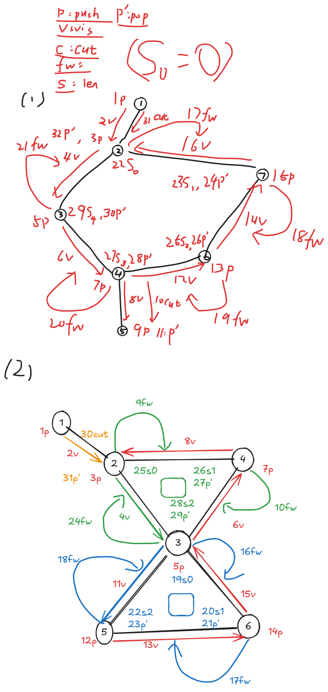
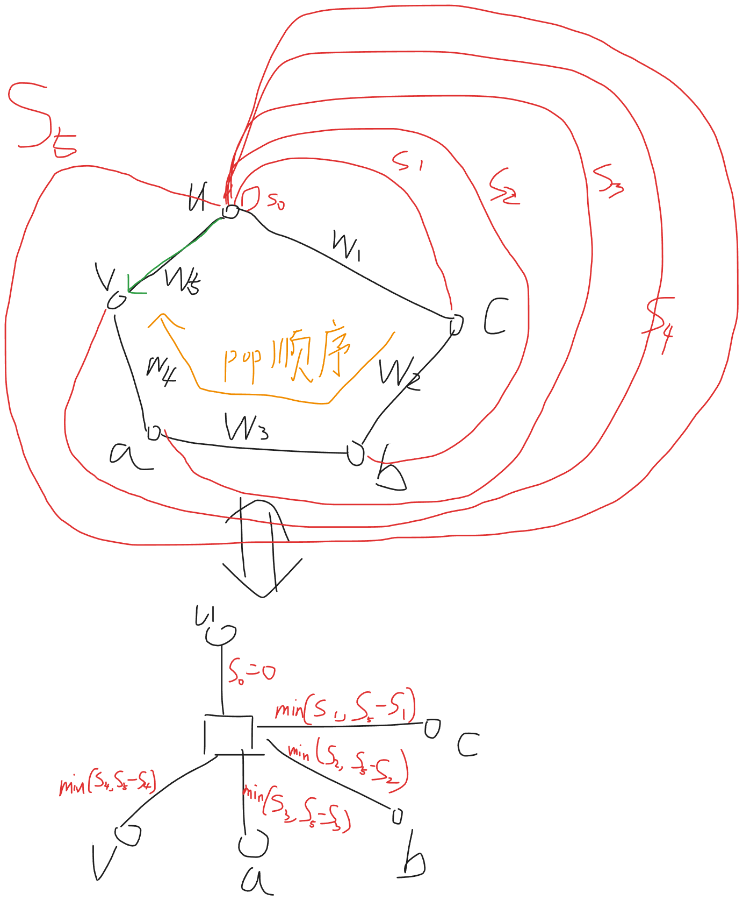

## 图解

### Link 最短路



### Circle 最短路



## P1 仙人掌最大权独立集（直接DP）

- 【坑点】
	- 没有发现，仙人掌缩环
	- 其实 就是 按照 **拓扑序** 的！

```cpp
#include<bits/stdc++.h>
using namespace std;
using ll = long long;

namespace Cactus {
    // P4410
    const int N = 1e5 + 5;
    const int M = 2e5 + 5;
    
    int n;

    struct Edge {
        int to, nxt;
    }e[M*2];
    int hd[N], cntE;
    
    int dfn[N], low[N], dfncnt;
    int stk[N], tp;
    
    // 题目信息
    int a[N];
    ll dp[N][2];

    void init(int nn) {
        fill(hd,hd+1+n,0);
        fill(dfn,dfn+1+n,0);

        n = nn;
        cntE = 1;
        dfncnt = tp = 0;
    }

    void add_edge(int u,int v) {
        e[++cntE] = {v, hd[u]};
        hd[u] = cntE;
    }

    void tarjan(int u,int fi);

    void link(int u,int v) {
        // 收集环节点 标记已有环节点
        vector<int> buf;
        int pop;
        do {
            pop = stk[tp--];
            buf.push_back(pop);
        }while(pop != v);
        // 【坑坑点！】 我太愚蠢！耍小聪明！
        // 我突然 最终发现： 仙人掌缩环是按照 "拓扑序" 缩环的
        // 并非无序!!!
        // 所以不应该有所谓的:
        // 递归计算完毕 "子树"
        // 都充分算完之后，终于可以计算了
        // 注意 我们最终只服务于 u 
        // 因为 u 是 "祖先"
        // 因此 下方环间的 dp 值并非全局 dp 值 
        // 而是一个 抽象物品 值 即使 不选 也可能有 权值
        // 1. u 不选 那么直接对 [1,sz] 进行打家劫舍
        ll res = 0;
        ll pre0 = 0, pre1 = -2e18;
        int sz = buf.size();
        for (int i = 0; i < sz; i++) {
            int u = buf[i];
            ll cur0 = dp[u][0] + max(pre0, pre1);
            ll cur1 = dp[u][1] + pre0;
            res = max(cur0, cur1);
            pre0 = cur0;
            pre1 = cur1;
        }
        // 注意是 +=
        dp[u][0] += res;

        // 2. u 选 那么直接对 [2,sz-1] 进行打家劫舍
        res = 0;
        pre0 = 0, pre1 = -2e18;
        for (int i = 1; i + 1 < sz; i++) {
            int u = buf[i];
            ll cur0 = dp[u][0] + max(pre0, pre1);
            ll cur1 = dp[u][1] + pre0;
            res = max(cur0, cur1);
            pre0 = cur0;
            pre1 = cur1;
        }
        // 注意是 +=
        // 【坑点1】不选也有价值啊啊
        // 【坑点4】 我居然直接存到 pre0 里面 根本无法生效啊
        dp[u][1] += res + dp[buf[0]][0];
        // 【坑点2】 如果是 二元环我不就炸了？
        // 【坑点3】 不是 0 sz-1 而是 buf[0] buf[sz-1] 啊啊啊啊啊
        if(0!=sz-1) dp[u][1] += dp[buf[sz-1]][0];
    }

    void tarjan(int u, int fi) {
        low[u] = dfn[u] = ++dfncnt;
        stk[++tp] = u;

        // 初始化 dp 信息
        dp[u][0] = 0;
        dp[u][1] = a[u];
        for (int i = hd[u]; i; i = e[i].nxt) {
            if ((i^1) == fi) continue;
            int v = e[i].to;
            if (!dfn[v]) {
                tarjan(v, i);
                if (low[v] < dfn[u]) {
                    low[u] = min(low[u], low[v]);
                } else if (low[v] > dfn[u]) {
                    // 割边直接转移
                    // 注意是 +=
                    dp[u][0] += max(dp[v][0], dp[v][1]);
                    dp[u][1] += dp[v][0];
                    tp--;
                } else {
                    // 非割边递归转移
                    link(u, v);
                }
            } else {
                if (dfn[v] < dfn[u]) {
                    low[u] = min(low[u], dfn[v]);
                }
            }
        }
    }

    // 缝缝补补
    // 只为 营造出一种 拓扑排序/树形DP/等价抽象化 的计算顺序
    ll cal() {
        tarjan(1, 0);
        return max(dp[1][0], dp[1][1]);
    }
}

void solve() {
    int n, m;
    cin >> n >> m;
    Cactus::init(n);
    for (int i = 1; i <= m; i++) {
        int u, v;
        cin >> u >> v;
        if (u != v) {
            Cactus::add_edge(u, v);
            Cactus::add_edge(v, u);
        }
    }
    for (int i = 1; i <= n; i++) {
        cin >> Cactus::a[i]; // P4410
        // Cactus::a[i] = 1; // P10779
    }
    cout << Cactus::cal() << "\n";
}

int main() {
    ios::sync_with_stdio(0); cin.tie(0); cout.tie(0);
    solve();
}
```

## P2 仙人掌静态最短路（仙人掌树 + 树剖）

```cpp
#include<bits/stdc++.h>
using namespace std;
using ll = long long;

namespace Cactus {
    const int N = 2e6 + 5;
    const int M = 2e6 + 5;

    int n;
    int cntn;

    struct Edge {
        int to, nxt;
        int w;
    }e[M*2];
    int hd[N], cntE;
    
    vector<pair<int,int>> E[N*2];
    
    int dfn[N], low[N], dfncnt;
    int stk[N], tp;
    
    // 圆方树信息
    int fw[N]; // fromWeight
    ll len[N]; // 前缀和
    // 方点信息 
    ll sum[N*2];
    
    void init(int nn) {
        fill(hd,hd+1+n,0);
        for (int i = 1; i <= cntn; i++) E[i].clear();

        fill(dfn,dfn+1+n,0);
        fill(sum,sum+1+cntn,0);

        cntn = n = nn;
        cntE = 1;
        dfncnt = tp = 0;
    }

    void add_edge(int u,int v, int w=0) {
        e[++cntE] = {v, hd[u], w};
        hd[u] = cntE;
    }

    void link(int u,int v) {
        // 顶
        ++cntn;
        E[u].push_back({cntn, 0});
        int pop, tmp = tp;
        sum[cntn] = fw[u];
        // 前缀和 同时计算 len
        do {
            pop = stk[tmp--];
            len[pop] = sum[cntn];
            sum[cntn] += fw[pop];
        } while(pop != v);
        do {
            pop = stk[tp--];
            // 添加最短路
            E[cntn].push_back({pop, min(len[pop], sum[cntn] - len[pop])});
        } while(pop != v);
    }

    void tarjan(int u, int fi) {
        low[u] = dfn[u] = ++dfncnt;
        stk[++tp] = u;
        for (int i = hd[u]; i; i = e[i].nxt) {
            if ((i^1) == fi) continue;
            int v = e[i].to;
            if (!dfn[v]) {
                // 走树边 
                tarjan(v, i);
                // 树边最终覆盖(最高优先级)
                fw[v] = e[i].w;
                if (low[v] < dfn[u]) {
                    // 没有扎口袋
                    low[u] = min(low[u], low[v]);
                } else if (low[v] > dfn[u]) {
                    // 是 "割边"
                    E[u].push_back({v, e[i].w});
                    // 弹出 v
                    tp--;
                } else {
                    // 是环顶 
                    link(u, v);
                    // 弹出了 v
                }
            } else {
                if (dfn[v] < dfn[u]) {
                    // 发现回边
                    // 回边覆盖(最低优先级, 先解决 "子树")
                    fw[v] = e[i].w;
                    low[u] = min(low[u], dfn[v]);
                }
            }
        }
    }

    void build() {
        for (int i = 1; i <= n; i++) {
            if (!dfn[i]) {
                tarjan(i, 0);
            }
        }
    }
}

struct LG_P5236 {
    // 仙人掌最短路 模板题
    inline static const int N = 1e4 + 5, M = 2e4 + 5;
    
    // 基本树剖 求 lca 求 子树方向
    int dfn[N*2], dfncnt, sz[N*2], son[N*2], fa[N*2], top[N*2], dep[N*2];
    // 差分工具
    ll path[N*2];

    void dfs1(int u, int f) {
        fa[u] = f;
        dep[u] = dep[f] + 1;
        sz[u] = 1;
        son[u] = 0;
        for(auto [v, w]: Cactus::E[u]) {
            if (v == f) continue; // 无用
            path[v] = path[u] + w;
            dfs1(v, u);
            sz[u] += sz[v];
            if (sz[v] > sz[son[u]]) son[u] = v;
        }
    }
    void dfs2(int u, int tp) {
        dfn[u] = ++dfncnt; 
        top[u] = tp;
        if (son[u]) dfs2(son[u], tp);
        for (auto [v, w]: Cactus::E[u]) {
            if (v != fa[u] && v != son[u]) {
                dfs2(v, v);
            }
        }
    }
    // 树剖 求 lca
    int lca(int x, int y) {
        while(top[x] != top[y]) {
            if (dep[top[x]] < dep[top[y]]) swap(x, y);
            x = fa[top[x]];
        }
        return dep[x] < dep[y] ? x : y;
    }
    // 树剖 求 子树方向
    // 已知 x 是 s 的子孙 找到 s 的儿子 y 使得 x in y
    int find(int x,int s) {
        int pre = 0;
        while(top[x] != top[s]) {
            pre = top[x];
            x = fa[pre];
        }
        return x == s ? pre:son[s];
    }
    ll cal(int x,int y) {
        if (x == y) return 0;
        int z = lca(x, y);
        if (z <= n) {
            return path[x] + path[y] - 2 * path[z];
        } else {
            int X = find(x, z);
            int Y = find(y, z);
            ll d = abs(Cactus::len[X] - Cactus::len[Y]);
            return path[x] - path[X] + min(d, Cactus::sum[z] - d) + path[y] - path[Y];
        }
    }
    int n, m, q;
    LG_P5236() {
        fill(dfn,dfn+1+Cactus::cntn, 0);
        cin >> n >> m >> q;
        Cactus::init(n);
        for (int i = 1; i <= m; i++) {
            int u, v, w;
            cin >> u >> v >> w;
            Cactus::add_edge(u, v, w);
            Cactus::add_edge(v, u, w);
        }
        Cactus::build();
        dfs1(1, 0);
        dfs2(1, 1);
        while(q--) {
            int x, y;
            cin >> x >> y;
            cout << cal(x, y) << "\n";            
        }
    }
};

int main() {
    ios::sync_with_stdio(0); cin.tie(0); cout.tie(0);
    new LG_P5236();
}
```

## P3 仙人掌子图小直径（仙人掌树 带 树剖 + 虚树 + DP）

- 踩了好多坑
	- 仙人掌图的边要开 4 倍 n
	- 全体整体都要开 2 倍，不要只改部分
	- `unique` 的 cmp 竟然是 `==`
	- 单调队列使用的时候 下标 不要和其它数据结构 比如 树和图 的下标 混淆！
		- 一定要最好隔离
	- 不要边递归，边收集 tmp
		- 仙人掌 约等于 树
		- 因此可以先递归儿子
		- 要保证 无 **后效性** 再操纵 静态空间


```cpp
 #include<bits/stdc++.h>
using namespace std;
using ll = long long;

namespace Cactus {
    const int N = 3e5 + 5;
    // 【坑点】
    // 终于重大发现：
    // 仙人掌图，边数一定是点数的 1.5 ~ 2 倍
    // 所以要开 3 ~ 4 倍!!!!!!!!!!!
    const int M = N * 4;

    int n;
    int cntn;

    struct Edge {
        int to, nxt;
        int w;
    }e[M];

    int hd[N], cntE;

    int dfn[N], low[N], dfncnt, stk[N], tp;

    // 基本
    int from_w[N];
    ll cycle_len[N];

    // 核心
    vector<pair<int,ll>> E[N*2];
    ll cycle_sum[N*2];
    
    // 圆方树 树剖
    // 【坑点】 怎么没有全部开二倍呢？
    int dfn2[N*2], dfncnt2, sz2[N*2], son2[N*2], fa2[N*2], top2[N*2], dep2[N*2];
    // 差分
    ll len2[N*2];

    void init(int nn) {

        fill(dfn2,dfn2+1+cntn, 0);
        fill(len2,len2+1+cntn, 0);
        fill(cycle_sum,cycle_sum+1+cntn,0);
        for (int i = 1; i <= cntn; i++) E[i].clear();

        dfncnt2 = 0;

        fill(hd,hd+1+n,0);
        fill(dfn,dfn+1+n,0);
        fill(cycle_len,cycle_len+1+n,0);

        cntn = n = nn;
        cntE = 1;
        dfncnt = tp = 0;
    }

    void add_edge(int u,int v,int w) {
        e[++cntE] = {v, hd[u], w};
        hd[u] = cntE;
    }

    void link(int u,int v) {
        ++cntn;
        E[u].push_back({cntn, 0});
        cycle_sum[cntn] = from_w[u];
        int pop, tmp = tp;
        do {
            pop = stk[tmp--];
            cycle_len[pop] = cycle_sum[cntn];
            cycle_sum[cntn] += from_w[pop];
        } while (pop != v);
        do {
            pop = stk[tp--];
            E[cntn].push_back({pop, min(cycle_len[pop], cycle_sum[cntn] - cycle_len[pop])});
        } while (pop != v);
    }

    void tarjan(int u, int fi) {
        low[u] = dfn[u] = ++dfncnt;
        stk[++tp] = u;
        for (int i = hd[u]; i; i = e[i].nxt) {
            if ((i^1) == fi) continue;
            int v = e[i].to, w = e[i].w;
            if (!dfn[v]) {
                tarjan(v, i);
                from_w[v] = w;
                if (low[v] < dfn[u]) {
                    // 没有扎口袋
                    low[u] = min(low[u], low[v]);
                } else if (low[v] > dfn[u]) {
                    // 割边
                    E[u].push_back({v, w});
                    tp--;
                } else {
                    // 扎起了口袋
                    link(u, v);
                }
            } else {
                if (dfn[v] < dfn[u]) {
                    // 回边
                    from_w[v] = w;
                    low[u] = min(low[u], dfn[v]);
                }    
            }
        }
    }

    // 树剖1
    void dfs(int u, int f) {
        dep2[u] = dep2[f] + 1;
        fa2[u] = f;
        sz2[u] = 1;
        son2[u] = 0;
        for (auto [v, w]: E[u]) if (v != f) {
            len2[v] = len2[u] + w;
            dfs(v, u);
            sz2[u] += sz2[v];
            if (sz2[v] > sz2[son2[u]]) son2[u] = v;
        }
    }

    // 树剖2
    void dfs2(int u,int tp) {
        dfn2[u] = ++dfncnt2;
        top2[u] = tp;
        if (son2[u]) dfs2(son2[u], tp);
        for (auto [v, w]: E[u]) if (v != fa2[u] && v != son2[u]) {
            dfs2(v, v);
        }
    }

    // 树剖用法1
    int lca(int x,int y) {
        while(top2[x] != top2[y]) {
            if (dep2[top2[x]] < dep2[top2[y]]) swap(x, y);
            x = fa2[top2[x]];
        }
        return dep2[x] < dep2[y] ? x : y;
    }

    // 树剖用法2
    int find(int x,int s) {
        int pre = 0;
        while (top2[x] != top2[s]) {
            pre = top2[x];
            x = fa2[pre];
        }
        return x == s ? pre : son2[s];
    }

    void build() {
        tarjan(1, 0);
        dfs(1, 0);
        dfs2(1, 1);
    }
}

namespace VTree {
    vector<int> e[Cactus::N*2];

    int get(vector<int>& a) {
        sort(a.begin(), a.end(), [&](int a,int b){
            return Cactus::dfn2[a] < Cactus::dfn2[b];
        });
        int sz = a.size();
        vector<int> b(sz*2-1);
        int p = 0;
        for(int i = 0; i + 1 < sz;i++) {
            b[p++] = a[i];
            b[p++] = Cactus::lca(a[i], a[i+1]);
        }
        b[p++] = a[sz-1];
        sort(b.begin(), b.end(), [&](int a,int b) {
            return Cactus::dfn2[a] < Cactus::dfn2[b];
        });
        // 【巨巨巨坑点！】 unique 的比较器是 operator== 啊啊啊啊
        b.erase(unique(b.begin(), b.end()), b.end());
        for (auto v: b) e[v].clear();
        for (int i = 0; i + 1 < b.size(); i++) {
            int z = Cactus::lca(b[i], b[i+1]);
            e[z].push_back(b[i+1]);
        }
        return b[0];
    }
}

ll diameter;
ll dist[Cactus::N*2];

int tmp[Cactus::N*2];
ll val[Cactus::N*4], pre[Cactus::N*4];
int Q[Cactus::N*4];

void dp_on_cycle(int u, int siz) {
    ll sum = Cactus::cycle_sum[u];
    sort(tmp+1,tmp+1+siz, [&](int a,int b) {
        return Cactus::cycle_len[a] < Cactus::cycle_len[b];
    });
    // 【坑点坑点】 我是 sb 吧：
    // 单调队列 下标 和 图标号 混了
    // 根本说不清楚了
    // 可以这样：想象成为另一个问题，必须用 val[i] 隔离两种数据结构
    for (int i = 1; i <= siz; i++) {
        int u = tmp[i];
        val[i] = dist[u];
        val[i+siz] = dist[u];
        pre[i] = Cactus::cycle_len[u];
        pre[i+siz] = pre[i] + sum;
    }
    int l = 1, r = 0;
    for (int i = 1; i <= siz * 2; i++) {
        while (l <= r && (pre[i] - pre[Q[l]]) * 2 > sum) l++;
        if (l <= r) diameter = max(diameter, val[i] + pre[i] + val[Q[l]] - pre[Q[l]]);
        while (l <= r && val[i] - pre[i] > val[Q[r]] - pre[Q[r]]) r--;
        Q[++r] = i;
    }
}

void cal(int u) {
    dist[u] = 0;
    if (u <= Cactus::n) {
        // 圆点
        for (auto v: VTree::e[u]) {
            cal(v);
            ll w = Cactus::len2[v] - Cactus::len2[u];
            diameter = max(diameter, dist[u] + dist[v] + w);
            dist[u] = max(dist[u], dist[v] + w);
        }
    } else {
        // 方点
        for (auto v: VTree::e[u]) {
            cal(v);
            ll w = Cactus::len2[v] - Cactus::len2[u];
            // 不计答案
            dist[u] = max(dist[u], dist[v] + w);
        }
        // 【坑点】不要边递归边收集啊
        // 保证无后效性！
        int idx = 0;
        for (auto v: VTree::e[u]) {
            int fv = Cactus::find(v, u);
            dist[fv] = dist[v] + Cactus::len2[v] - Cactus::len2[fv];
            tmp[++idx] = fv;
        }
        dp_on_cycle(u, idx);
    }
}

void solve() {
    int n, m;
    cin >> n >> m;
    Cactus::init(n);
    for (int i = 1; i <= m; i++) {
        int u, v, w;
        cin >> u >> v >> w;
        Cactus::add_edge(u, v, w);
        Cactus::add_edge(v, u, w);
    }
    Cactus::build();
    int Q;
    cin >> Q;
    while (Q--) {
        int cnt;
        cin >> cnt;
        vector<int> a(cnt);
        for(auto& v: a) {
            cin >> v;
        }
        int root = VTree::get(a);
        diameter = 0;
        cal(root);
        cout << diameter << "\n";
    }
}

int main() {
    ios::sync_with_stdio(0); cin.tie(0); cout.tie(0);
    solve();
}
```