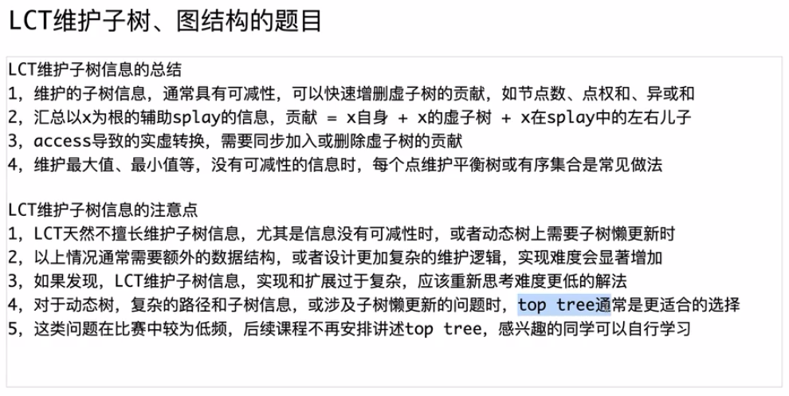

## 辅助函数

- `is_root(x)`：既不是 fa 的左孩子，又不是 fa 的右孩子
- `lr(x)`：是否是 fa 的右孩子
- `up(x)`：从 x lc rc 更新
- `reverse(x)`：make_root 需要，翻转翻转标记
- `down(x)`：若有标记，swap lc rc 并翻转 lc rc 并 清空标记

- `rotate(x)`：升一步
	- 设 `d=lr(x)` 那么
		- 父亲 f 的 d 接替 x 的反方向 !d 儿子
		- 同时 父亲的 d 新儿子认领 f 父亲
		- x 连接 !d 方向的 f
	- 如果 f 不是根
		- 让 g 认领 lr(f) 方向的新儿子 x
	- 最后设置 x 和 f 的 fa
	- 并且依次执行 f 和 x 的 up
- `splay(x)`：升到根
	- 如果有懒标记
		- 需要收集所有 x 到根的所有点，压栈
		- 倒序弹出并下传
	- 当 x 不为根时循环：
		- 如果 f 不是根
			- lr x 和 f 同向，一字，旋转 f
			- lr x 和 f 不同，z 字，旋转 x
		- 固定旋转一次 x
## 核心函数（单参数）

- `access(x)`：打通 x 到树根的实链
	- 预设 y = 0
	- 当 x 不为 0 时循环：
		- 将 x splay 到顶部
		- x 的右孩子改为上一个 y 
			- 由于更新了 x 的孩子，所以 up 一下 x
		- y <- x
		- x <- fa x 
			- （此处有点不懂！为什么直接跳了 fa x）
- `make_root(x)`：使得 x 成为根
	- 首先 access 一下打通
	- 然后 splay 一下成为根
		- 此时， x 只有左孩子
	- 然后， reverse x 即翻转整个层级链
- `find_root(x)`：找到 x 所在树的 **代表根**
	- 首先 access 一下打通
	- 然后 splay 一下成为根
	- 然后 先下传 down 一下 x
	- 当有 lc x 时循环：
		- 跳到 lc x 并 down 一下
	- splay 一下 x
	- 返回 x

## 接口函数（双参数）

> 注意到 每一个函数开始都 `make_root(x)` 让 x 成为根

- `split(x, y)`：打通 x y 并让 y 为根（前提 x y 连通）
	- 首先 make_root x 让 x 成为根
	- 然后 access y 打通 x y
	- 然后 splay y 提升 y
- `link(x, y)`：尝试连接 x y
	- 首先 make_root x 让 x 成为根
	- 如果 find_root y 不是 x 
		- 那么让 x 这个根认 y 为父亲
- `cut(x, y)`：尝试切断相邻的 x y
	- 首先 make_root 让 x 成为根
	- 按顺序执行以下，如果 x y 满足如下条件才可以继续：
		- y find_root 之后得到 x
		- x 的右儿子是 y
		- y 的父亲是 x
		- y 没有左儿子
	- 清空 x 的右儿子
		- 不要忘了 up 一下 x
	- 清空 y 的父亲

---

模板题

## P1 无向树 - 路径求和 - （带 rev / make_root - split - link - cut）

- `LG_P3690`

## P2 有向树 - LCA （无需 rev / link_fa - cut_fa）

- `SP_8791`
	- 我的猜想没有问题！
	- 这种定根的最好写了
		- 不用写 rev 和 stk 和 down！！！
	- **什么时候可以用这种简单** **LCT**：
		- 有确定的根的时候
		- 即，是一个 **有根树**，有一定的规律的
		- 不是无根树
	- 难道无根树就不可以了吗？
		- 似乎，可以维护这个联通区出度为 0 的点，即根
		- 好维护吗？
		- 显然不可借助并查集，因为动态树 > 并查集
		- 
	- 有了 LCA 其实也可以轻度的 路径求和

## P3 有向树 - 前缀查询 （无需 rev / link_fa - cut_fa）

- `LG_P3203`
	- 与上一题类似，都是有向树，共用一套模板
	- 弹飞绵羊

---

维护路径

## P4 无向树 - 路径加乘 （有 rev / 有懒标记）

- `LG_P1501`
	- 路径加
	- 路径乘
	- 查询路径和
	- 连边 断边

## P5 无向树 - 路径染色（有 rev / 有懒标记）

- `LG_P2486`
	- 曾经是树剖的模板题
	- 坑点：
		- 懒标记不要施加于空节点啊！！！

## P6 有向树 - "三叉投票" （可以用无向莽）

- `LG_P4332`

## P7 有向树 - 新颜色染色/维护实链 （无 rev）

- `LG_P3703`
	- 这一题的意义在于：
		- **有向树** **LCT** **并不是弱小的**
		- 由于 根/dfn序 的确定性，它可以和 **树剖** 结合
	- op1：前缀链染新颜色
	- op2：链上查询颜色种类数
	- op3：子树查询前缀最大颜色种类数

---

维护边双
## P8 无向树 - 动态边双缩点树（带 rev / 无懒标记）

> 配合并查集
>—— 维护边双版 LCT 初步尝试

- `LG_P10657`
	- 初始一个 n 个点 m 条边的图
	- 加 p 条边 (u, v)
		- 如果
- 说到并查集
	- **路径压缩** 可以加速 log
	- 如果 **不指定根**，按 **秩/大小合并** 可以加速 log
	- 同时使用 变成 **反阿克曼**

## P9 无向树 - 动态边双缩点树 （带 rev / 无懒标记 但是带缩点信息）

> 维护边双版 LCT 代码结构基本成熟

- `LG_P10658`
	- n 个点 p 次操作
		- 1 **连边**
		- 2 **修改点权**
		- 3 **边双缩点树** 上查询路径点权和

##  P10 无向树 - 动态边双缩点树 - 带缩点信息 - 结合时光倒流

- `LG_P2542`
	- 1 断边
	- 0 查询 **边双缩点树** 路径边 个数
	- 结合时光大佬

---

LCT 维护 **边权** / **生成树** 

## P11 无向树 - 动态最小生成树 - 动态换边 - 结合时光倒流

> 初步探索维护边权的写法

- `LG_P4172`
	- 1 查询路径最小最大边权
	- 2 断边
	- 依然类似上一题 结合时光倒流

## P12 无向树 - 最小差值生成树（实质在线最大生成树） - 动态换边 - 结合滑动窗口（bushi）

> 维护边权的写法走向成熟：
> 使用 `pair<int,int> wi;` 
> LCT 使用 `pair<int,int> p[N], mn[N];` 

- `LG_P4234`
	- 给定 n 个点 m 条边 有边权
	- 求最小查值生成树的最小差值
	- 从小到大来连接
	- 贪心移除连接路径上最小的边权竟然就可以

## P13 无向树 - 动态最小生成树 - 动态换边 - 双指标约束 - but 只需路径连通

> 维护边权的写法更规范了
> `multiset<int> W;` 的维护放在 `link_edge` `cut_edge` 内

- `LG_P2387`
	- 给定 n 个点 m 条边 
	- 边有边权 a b
	- 求使得 1 n 连通的最小 max(a) + max(b) 路径

## P14 无向树 - 动态最大生成树 - 动态换边 - 带修改边权 - 路径查询

- `LG_P6664`
	- 给定 n 个点 m 次询问
	- find 连接 u v 之间 id 的边 边权 t 长度 l
	- move 查询 u v 之间最大生成树路径的长度 l
	- change 修改 id 边的长度为 l

## P15 无向树 - 严格次小生成树 - 仅路径查询

- `LG_P4180`
	- 要研究透：最小生成树的性质
	- 如果生成树之外的边，他连的两个端点路径
	- 必然是任何边权都 <= 它的边权！！！！
	- 所以，选择尽可能大的边权替换啊
	- 但是由于严格次小，所以不能相等
	- 维护两个值

## P16 无向树 - 动态最小生成树(有时限) - 结合线段树分治

> 初步体验：LCT 结合 线段树分治 的代码

- `LG_P4319`
	- sb 数据 我也 sb
	- 维护边权，输入一个树 需要开二倍的 LCT 节点
	- 有 n 个点的树 有 m 个有时限的边
	- 问每一个时刻的最小生成树的权值
	- 用线段树分治
	- 终于懂了线段树分治：
		- 从顶到底，是一个栈的叠加
		- 所以就非常容易结合 LCT / DSU 这种可撤销的东西
		- 不要看复杂度高，其实只是每一个边进出 log 次

## P17 无向树 - 动态最小生成树(带修改) - 结合线段树分治

> LCT 结合线段树分治 的代码 走向成熟

- `LG_P3206`
	- n 个点 m 条边 q 次操作
	- 每次操作 修改一条边的 **边权**
	- 求 **每次操作** 之后 的 **最小生成树** **权值和** 是什么
	- 【首先吸取上一题的教训】
		- 分析一下需要多少节点 节点的数量
		- 首先 n + m 是基础
		- 然后 q 次操作 每一次操作都 新增一种边 
		- 所以 n + m + q
	- 牛逼，终于一次过了

---

LCT 维护 子树/图结构

## P18 纯树 - 维护子树 - 虚子树信息 - 颜色连通区查询

> 初步尝试 vir 虚子树维护

- `LG_P4219`
	- 1 动态加边，保证是一个树
	- 2 查询 x y 相邻两个点 两侧的 子树大小乘积

## P19 纯树 - 维护子树 - 菊花图预防 - 颜色连通区查询

> 对 vir 更更新的时机有了成熟的认识
> vir 的更新 视为 单点修改

- `SP_QTREE6`
	- 给定一个 n 个的节点的树 有两种操作 初始 n 个点全部黑色
	- 0 查询 u 点颜色连通区的大小
	- 1 toggle u 点的颜色
	- 【终于明白】
		- 手动的 up 一定要保证 这个 x 已经是顶部了
	- ？？？但是还有不懂的？？？？？
		- vir 为什么我只写 splay() 不行？
		- 还得需要前面加 access() ？？？

## P20 纯树 - 维护子树 - 有序表维护不可差分虚儿子信息 - 颜色连通区最大权查询 

> 对 vir 结合 有序表 有了初步的理解

- `SP_QTREE7`
	- 给定一个 n 个点的树 有3种操作 初始 n 个点的颜色
	- 0 查询 u 节点颜色连通区的最大权
	- 1 翻转 u 的颜色
	- 2 修改 u 的权值为 w

## P21 纯树 - 维护子树 - 菊花图预防 - 最近关键点查询

> 对 vir 的更新时机、前驱条件 的认识基本成熟

- `SP_QTREE5`
	- 给定一个 n 个点的树 有两种操作 初始 n 个点的颜色为黑色
	- 0 翻转 u 的颜色
	- 1 查询 u 到最近的白色点的 距离

> 小结
> 
> 原来还有动态子树 Top Tree ？
> 

---

LCT 维护图结构

## P22 无向树 - 动态树重心 - 结合并查集

> 问了问 DS **树的重心合并结论**
> 
> 设两棵树 $T_1,T_2$，大小 $n_1,n_2$，重心分别为 $g_1,g_2$。连接 $u\in T_1,\ v\in T_2$ 得新树 $T$。
> 
> - 新重心 $g$ 位于 $T$ 中 $g_1$ 到 $g_2$ 的唯一路径上。
> - 若 $n_1\ge n_2$，则 $g\in T_1$，且从 $g_1$ 沿 $g_1\to u$ 方向移动，距离不超过 $\lceil n_2/2\rceil$。
> - 特例：若连接 $g_1$ 与 $g_2$，则当 $n_1\ge n_2$ 时 $g=g_1$；当 $n_1=n_2$ 时 $g_1,g_2$ 均为重心。
> 
> 动态维护时，只需在 $g_1$ 到 $g_2$ 的路径上找满足“最大子树大小 $\le n/2$”的点。

- `LG_P4299`
	- 给定 n 个初始孤立的点 有 m 条操作
	- 1 连接 x y 保证是树结构
	- 2 查询 x 所在树的重心（最小编号）
	- 3 查询所有树的重心的异或和
	- 为什么这样求是对的，能找到最小重心
		- 注意到：重心是相邻的，所以在 splay 树中，只可能是上下级的关系（不一定是父子）

## P23 无向树 - 动态树直径（Easy Version） - 结合并查集 

> 问了问 DS **树的直径合并结论**
> 
> 设两棵树直径分别为 $d_1,d_2$，按边数计。
> 
> 1. 指定连接点 $u,v$：
> $D=\max\{d_1,\ d_2,\ \operatorname{far}_1(u)+1+\operatorname{far}_2(v)\}$
> 
> 2. 自由选连接点，使新直径最小：
> $D_{\min}=\max\left\{d_1,\ d_2,\ \left\lceil\frac{d_1}{2}\right\rceil+\left\lceil\frac{d_2}{2}\right\rceil+1\right\}$
> 
> 3. 合并维护直径：
> 设 $T_1$ 直径端点为 $a,b$，$T_2$ 直径端点为 $c,d$，则
> $D=\max\{d_1,\ d_2,\ \operatorname{dist}(a,c),\ \operatorname{dist}(a,d),\ \operatorname{dist}(b,c),\ \operatorname{dist}(b,d)\}$
> 
> 若直径按点数计，最后结果 $+1$。

- `LG_P4271`
	- 动态加 “叶子” 维护树的直径
	- 询问节点能够到达的最远距离

## P24 无向树 - 维护最简连通分量（树） - 结合主席树

- `LG_P5385`
	- 给定 n 个点 m 条边 q 次询问
	- 询问 l r 区间内的边启用之后 **连通分量** 个数
		- 有公式 $n - 启用的树边的数量$
	- 跟 **最小差值生成树** **异曲同工**！
	- 忘本了
		- **LCT 维护边权的时候多开 M 大小啊**
		- **PSegT 的节点大小开 log 啊！！！**

## P25 无向树 - 动态图路径割点 - 动态图路径割边 - （融合怪）

- `LG_P5489`
	- 给定 n 个点有 m 个操作
	- 1 连接 u v
	- 2 求 u v 之间的割边数量
		- 之前做过
	- 3 求 u v 之间的割点数量
		- 原来可以动态圆方树
			- 暴力收集点
		- 统计圆点数量
		- 复杂度是正确的
	- 【事实上】
		- 左神有更优雅的实现（见代码注释）

## Codes

### P1 无向树 / 有 rev / 无懒标记

> 带懒标记的就不要封装模板了

```cpp
#include<bits/stdc++.h>
using namespace std;

// 无向树版 有 rev / make_root - split - link - cut 
template<class T, class V, class M, int N>
struct LCT {
    int ch[N][2], fa[N];
    #define lc(x) ch[x][0]
    #define rc(x) ch[x][1]
    #define ch(x, y) ch[x][y]
    
    bool rev[N];
    int stk[N], tp;

    T sum[N];
    V val[N];
    M merge;

    void reserve(int n) {
        memset(ch,0,sizeof(ch[0])*(n+1));
        memset(fa,0,sizeof(fa[0])*(n+1));
        memset(rev,0,sizeof(rev[0])*(n+1));
        
        memset(sum,0,sizeof(sum[0])*(n+1));
        memset(val,0,sizeof(val[0])*(n+1));
    }

    void up(int x) {
        sum[x] = merge(sum[lc(x)], val[x], sum[rc(x)]);
    }

    void reverse(int x) {
        rev[x] ^= true;
    }

    void down(int x) {
        if (rev[x]) {
            reverse(lc(x));
            reverse(rc(x));
            swap(lc(x), rc(x));
            rev[x] = false;
        }
    }

    bool is_root(int x) {
        return x != lc(fa[x]) && x != rc(fa[x]);
    }

    inline bool lr(int x) {
        return rc(fa[x]) == x;
    }

    void rotate(int x) {
        int f = fa[x], g = fa[f];
        bool d = lr(x);
        if(ch(f, d) = ch(x, !d)) fa[ch(f, d)] = f;
        ch(x, !d) = f;
        if (!is_root(f)) ch(g, lr(f)) = x;
        fa[f] = x;
        fa[x] = g;
        up(f);
        up(x);
    }

    void splay(int x) {
        stk[++tp] = x;
        for (int y = x; !is_root(y); y = fa[y]) stk[++tp] = fa[y];
        while(tp) down(stk[tp--]);

        while (!is_root(x)) {
            int f = fa[x];
            if (!is_root(f)) rotate(lr(x) == lr(f) ? f : x);
            rotate(x);
        }
    }

    void access(int x) {
        for (int y = 0; x; y = x, x = fa[x]) {
            splay(x);
            rc(x) = y;
            up(x);
        }
    }

    void make_root(int x) {
        access(x);
        splay(x);
        reverse(x);
    }

    int find_root(int x) {
        access(x);
        splay(x);
        down(x);
        while(lc(x)) down(x=lc(x));
        splay(x);
        return x;
    }

    void split(int x,int y) {
        make_root(x);
        access(y);
        splay(y);
    }

    void link(int x, int y) {
        make_root(x);
        if (find_root(y) != x) fa[x] = y;
    }

    void cut(int x, int y) {
        make_root(x);
        if (find_root(y) == x && fa[y] == x && lc(y) == 0 && rc(x) == y) {
            fa[y] = rc(x) = 0;
            up(x);
        }
    }

    // 扩展
    void modify(int x, V v) {
        make_root(x);
        val[x] = v;
        up(x);
    }
};

struct LG_P3690 {
    // 路径查询 + 连/断无向边 + 单点修改 
    inline static const int N = 1e5 + 5, M = 3e5 + 5;
    int n, m;
    struct mg {int operator()(int l,int m,int r) { return l ^ m ^ r;}};
    LCT<int,int,mg,N>* T;
    LG_P3690() {
        T = new LCT<int,int,mg,N>();
        cin >> n >> m;
        for (int i = 1; i <= n; i++) {
            cin >> T->val[i];
            T->sum[i] = T->val[i];
        }
        for (int i = 1; i <= m; i++) {
            int op, x, y;
            cin >> op >> x >> y;
            if (op == 0) {
                T->split(x, y);
                cout << T->sum[y] << "\n";
            } else if (op == 1) {
                T->link(x, y);
            } else if (op == 2) {
                T->cut(x, y);
            } else {
                T->modify(x, y);
            }
        }
        T->reserve(n);
    }
};

struct LG_P2147 {
    // 连/断无向边 + 查询连通性
    inline static const int N = 1e4 + 5, M = 2e5 + 5;
    int n, m;
    struct mg {char operator()(char l,char m,char r){return 0;}};
    LCT<char,char,mg,N>* T;
    LG_P2147() {
        T = new LCT<char,char,mg,N>();
        cin >> n >> m;
        for (int i = 1; i <= m; i++) {
            string op; int u, v;
            cin >> op >> u >> v;
            if (op == "Connect") {
                T->link(u, v);
            } else if (op == "Destroy") { // 【chovy】 拼写错了
                T->cut(u, v);
            } else if (op == "Query"){
                cout << (T->find_root(u) == T->find_root(v) ? "Yes" : "No") << "\n";
            }
        }
        T->reserve(n);
    }
};

int main() {
    ios::sync_with_stdio(0); cin.tie(0); cout.tie(0);
    new LG_P3690();
    // new LG_P2147();
}
```

### P2 - P3 有向树 / 无 rev / 无懒标记

> 带懒标记的就不要封装模板了

```cpp
#include<bits/stdc++.h>
using namespace std;

// 有向树版 无 rev / link_fa - cut_fa
// 可以艰难地使用路径查询 借助 lca 需要差分 
template<class T, class V, class M, int N>
struct LCT {
    int ch[N][2], fa[N];
    #define lc(x) ch[x][0]
    #define rc(x) ch[x][1]
    #define ch(x, y) ch[x][y]
    
    T sum[N];
    V val[N];
    M merge;

    void reserve(int n) {
        memset(ch,0,sizeof(ch[0])*(n+1));
        memset(fa,0,sizeof(fa[0])*(n+1));
        memset(sum,0,sizeof(sum[0])*(n+1));
        memset(val,0,sizeof(val[0])*(n+1));
    }

    inline bool is_root(int x) {
        return x != lc(fa[x]) && x != rc(fa[x]);
    }

    inline bool lr(int x) {
        return rc(fa[x]) == x;
    }

    inline void up(int x) {
        sum[x] = merge(sum[lc(x)], val[x], sum[rc(x)]);
    }

    inline void rotate(int x) {
        int f = fa[x], g = fa[f];
        bool d = lr(x);
        if (ch(f,d) = ch(x,!d)) fa[ch(f,d)] = f;
        ch(x,!d) = f;
        if (!is_root(f)) ch(g,lr(f)) = x;
        fa[f] = x;
        fa[x] = g;
        up(f);
        up(x);
    }

    // (无 rev stk)
    inline void splay(int x) {
        while(!is_root(x)) {
            int f = fa[x];
            if (!is_root(f)) rotate(lr(x)==lr(f)?f:x);
            rotate(x);
        }
    }

    // 魔改
    // (无 rev stk)
    inline int access(int x) {
        int pre = 0;
        for(int y = 0;x;y=x,x=fa[x]) {
            splay(x);
            rc(x)=y;
            up(x);
            pre = x;
        }
        return pre;
    }
    
    // 找到当前的树头节点
    inline int find_root(int x) {
        access(x);
        splay(x);
        while(lc(x)) x = lc(x);
        splay(x);
        return x;
    }

    // 保证 x 是树根
    inline void link_fa(int x,int y) {
        access(x);
        splay(x);
        fa[x]=y;
    }
    
    // 断掉 x 与 fa 的边
    // 只需：让 x "失踪"
    inline void cut_fa(int x) {
        access(x);
        splay(x);
        fa[lc(x)] = 0;
        lc(x) = 0;
        up(x); // 【chovy】 忘了
    }

    // 扩展
    inline void modify(int x, V v) {
        access(x); // ??? 建议保留
        splay(x);
        val[x] = v;
        up(x);
    }

    // 扩展: 有向树
    inline int lca(int x,int y) {
        access(x);
        return access(y);
    }
};

struct SP_8791 {
    inline static const int N = 1e5 + 5, M = 1e5 + 5;
    struct mg {char operator()(char l,char m,char r){return 0;}};
    LCT<char,char,mg,N>* T;
    int n, m;
    SP_8791() {
        T = new LCT<char,char,mg,N>();
        cin >> n >> m;
        for (int i = 1; i <= m; i++) {
            string op; int x, y;
            cin >> op;
            if (op == "link") {
                cin >> x >> y;
                T->link_fa(x, y);
            } else if (op == "cut") {
                cin >> x;
                T->cut_fa(x);
            } else if (op == "lca") {
                cin >> x >> y;
                cout << T->lca(x, y) << "\n";
            }
        }
        T->reserve(n);
    }
};

struct LG_3203 {
    inline static const int N = 2e5 + 5, M = 2e5 + 5;
    struct mg {int operator()(int l,int m,int r){return l+m+r;}};
    LCT<int,int,mg,N>* T;
    int n, m, a[N];
    LG_3203() {
        T = new LCT<int,int,mg,N>();
        cin >> n;
        for (int i = 1; i <= n; i++) T->sum[i] = T->val[i] = 1;
        for (int i = 1; i <= n; i++) {
            cin >> a[i];
            T->link_fa(i, min(i+a[i], n + 1));
        }
        cin >> m;
        for (int i = 1; i <= m; i++) {
            int op, x, y;
            cin >> op >> x;
            x++; // 【chovy】 编号 变成 1-base
            if (op == 1) {
                T->access(x);
                T->splay(x);
                cout << T->sum[x] << "\n";
            } else {
                cin >> y;
                T->cut_fa(x);
                a[x] = y;
                T->link_fa(x, min(x+a[x], n + 1));
            }
        }
        T->reserve(n+1);
    }
};

int main() {
    ios::sync_with_stdio(0); cin.tie(0); cout.tie(0);
    new SP_8791();
    // new LG_3203();
}
```

### P4 无向树 / 有 rev / 有懒标记

```cpp
#include<bits/stdc++.h>
using namespace std;
const int N = 1e5 + 5;
const int mod = 51061;

// 日常普通手搓 现做现卖版 特别是带懒标记
namespace LCT {
    int ch[N][2], fa[N];
    #define lc(x) ch[x][0]
    #define rc(x) ch[x][1]
    #define ch(x, y) ch[x][y]

    bool rev[N];
    int stk[N], tp;

    int sum[N], val[N], sz[N];
    int add_tag[N], mul_tag[N];

    void clear(int n) {
        memset(ch,0,sizeof(ch[0])*(n+1));
        memset(fa,0,sizeof(fa[0])*(n+1));
        memset(rev,0,sizeof(rev[0])*(n+1));
    }

    bool is_root(int x) {
        return x != lc(fa[x]) && x != rc(fa[x]);
    }

    bool lr(int x) {
        return rc(fa[x]) == x;
    }
    
    void up(int x) {
        // TODO
        sz[x] = 1 + sz[lc(x)] + sz[rc(x)];
        sum[x] = (val[x] + sum[lc(x)] + sum[rc(x)]) % mod;
    }

    // 【事实上】 一般情 况使用的是懒标记时，改变生效
    void reverse(int x) {
        swap(lc(x), rc(x));
        rev[x] ^= 1;
    }

    void add(int x, int v) {
        val[x] = (val[x] + v) % mod;
        sum[x] = (sum[x] + (long long) sz[x] * v) % mod;
        add_tag[x] = (add_tag[x] + v) % mod;
    }

    void mul(int x, int v) {
        val[x] = (long long) val[x] * v % mod;
        sum[x] = (long long) sum[x] * v % mod;
        add_tag[x] = (long long) add_tag[x] * v % mod;
        mul_tag[x] = (long long) mul_tag[x] * v % mod;
    }

    void down(int x) {
        // TODO
        if(rev[x]) {
            reverse(lc(x));
            reverse(rc(x));
            rev[x] = 0;
        }
        if (mul_tag[x] != 1) {
            mul(lc(x), mul_tag[x]);
            mul(rc(x), mul_tag[x]);
            mul_tag[x] = 1;
        }
        if (add_tag[x]) {
            add(lc(x), add_tag[x]);
            add(rc(x), add_tag[x]);
            add_tag[x] = 0;
        }
    }

    void rotate(int x) {
        int f = fa[x], g = fa[f];
        bool d = lr(x);
        if(ch(f,d) = ch(x,!d)) fa[ch(f,d)] = f;
        ch(x,!d) = f;
        if(!is_root(f)) ch(g,lr(f)) = x;
        fa[f] = x;
        fa[x] = g;
        up(f);
        up(x);
    }
    void splay(int x) {
        // 
        stk[++tp] = x;
        for(int y = x;!is_root(y);y=fa[y]) stk[++tp] = fa[y];
        while(tp) down(stk[tp--]);
        
        while(!is_root(x)) {
            int f = fa[x];
            // 【chovy】f 写成 x 了！
            if(!is_root(f)) rotate(lr(x)==lr(f)?f:x);
            rotate(x);
        }
    }
    void access(int x) {
        for(int y = 0; x; y=x,x=fa[x]) {
            splay(x);
            rc(x)=y;
            up(x);
        }
    }
    int find_root(int x) {
        access(x);
        splay(x);
        down(x);
        while(lc(x)) down(x=lc(x));
        splay(x);
        return x;
    }
    void make_root(int x) {
        access(x);
        splay(x);
        reverse(x);
    }
    void split(int x,int y) {
        make_root(x);
        access(y);
        splay(y);
    }
    void link(int x,int y) {
        make_root(x);
        if (!fa[x]) {
            fa[x] = y;
        }
    }
    void cut(int x,int y) {
        make_root(x);
        if (find_root(y) == x && rc(x) == y && !lc(y) && fa[y] == x) {
            rc(x) = fa[y] = 0;
            up(x); // 【chovy】!!!
        }
    }
}

struct LG_P1501 {
    int n, m;
    LG_P1501() {
        cin >> n >> m;
        char op; int u,v,c,u1,v1,u2,v2;
        for (int i = 1; i <= n; i++) {
            LCT::sum[i] = LCT::val[i] = LCT::mul_tag[i] = LCT::sz[i] = 1;
        }
        for (int i = 1; i < n; i++) {
            cin >> u >> v;
            LCT::link(u, v);
        }
        for (int i = 1; i <= m; i++) {
            cin >> op;
            if (op == '+') {
                cin >> u >> v >> c;
                LCT::split(u, v);
                LCT::add(v, c);
            } else if (op == '-') {
                cin >> u1 >> v1 >> u2 >> v2;
                LCT::cut(u1, v1);
                LCT::link(u2, v2);
            } else if (op == '*') {
                cin >> u >> v >> c;
                LCT::split(u, v);
                LCT::mul(v, c);
            } else if (op == '/') {
                cin >> u >> v;
                LCT::split(u, v);
                cout << LCT::sum[v] << "\n";
            }
        }
        LCT::clear(n);
    }
};

int main() {
    // cout << mod * mod << "\n";
    ios::sync_with_stdio(0); cin.tie(0); cout.tie(0);
    new LG_P1501();
}
```

### P5 无向树 / 有 rev / 有懒标记

```cpp
#include<bits/stdc++.h>
using namespace std;

namespace LCT {
    const int N = 1e5 + 5;
    int ch[N][2], fa[N];
    #define lc(x) ch[x][0]
    #define rc(x) ch[x][1]
    #define ch(x,y) ch[x][y]
    
    bool rev[N];
    int C[N], L[N], R[N], num[N];
    int C_tag[N];

    int stk[N], tp;

    bool is_root(int x) {
        return x != lc(fa[x]) && x != rc(fa[x]);
    }

    bool lr(int x) {
        return rc(fa[x]) == x;
    }
    
    void up(int x) {
        L[x] = lc(x) ? L[lc(x)] : C[x];
        R[x] = rc(x) ? R[rc(x)] : C[x];
        num[x] = 1 + num[lc(x)] + num[rc(x)];
        if(lc(x)) num[x] -= (C[x] == R[lc(x)]);
        if(rc(x)) num[x] -= (C[x] == L[rc(x)]);
    }

    void reverse(int x) {
        // 【坑点】卧槽 忘了
        swap(L[x], R[x]);
        swap(lc(x), rc(x));
        rev[x] ^= 1;
    }

    void color(int x, int c) {
        // 【坑坑坑！！！】 空节点 tmd 被懒标记污染了 
        if (x == 0) return; 
        C[x] = L[x] = R[x] = c;
        // ！
        num[x] = 1;
        C_tag[x] = c;
    }

    void down(int x) {
        if (rev[x]) {
            reverse(lc(x));
            reverse(rc(x));
            rev[x] = 0;
        }
        if(C_tag[x]) {
            color(lc(x), C_tag[x]);
            color(rc(x), C_tag[x]);
            C_tag[x] = 0;
        }
    }

    void rotate(int x) {
        int f = fa[x], g = fa[f];
        bool d = lr(x);
        if (ch(f,d) = ch(x,!d)) fa[ch(f,d)] = f;
        ch(x,!d) = f;
        if(!is_root(f)) ch(g,lr(f)) = x;
        fa[f] = x;
        fa[x] = g;
        up(f);
        up(x);
    } 

    void splay(int x) {
        stk[++tp] = x;
        for(int y = x;!is_root(y);y=fa[y]) stk[++tp] = fa[y];
        while(tp) down(stk[tp--]);
        while(!is_root(x)) {
            int f = fa[x];
            if(!is_root(f)) rotate(lr(x)==lr(f)?f:x);
            rotate(x);
        }
    }

    void access(int x) {
        for(int y = 0;x;y=x,x=fa[x]) {
            splay(x);
            rc(x)=y;
            up(x);
        }
    }
    
    int find_root(int x) {
        access(x);
        splay(x);
        down(x);
        while(lc(x)) down(x=lc(x));
        splay(x);
        return x;
    }

    void make_root(int x) {
        access(x);
        splay(x);
        reverse(x);
    }

    void split(int x,int y) {
        make_root(x);
        access(y);
        splay(y);
    }

    void link(int x,int y) {
        make_root(x);
        if(find_root(y) != x) fa[x] = y;
    }
}

struct LG_P2486 {
    inline static const int N = 1e5 + 5;
    int n, m;

    LG_P2486() {
        cin >> n >> m;
        for (int i = 1; i <= n; i++) {
            cin >> LCT::C[i];
            LCT::L[i] = LCT::R[i] = LCT::C[i];
            LCT::num[i] = 1;
        }
        for (int i = 1; i < n ;i++) {
            int u, v;
            cin >> u >> v;
            LCT::link(u, v);
        }
        for (int i =1 ; i<= m; i++) {
            char op; int a, b, c;
            cin >> op;
            if (op == 'C') {
                cin >> a >> b >> c;
                LCT::split(a, b);
                LCT::color(b, c);
            } else {
                cin >> a >> b;
                LCT::split(a, b);
                cout << LCT::num[b] << "\n";
            }
        }
    }
};

int main() {
    ios::sync_with_stdio(0); cin.tie(0); cout.tie(0);
    new LG_P2486();
}
```

### P6 无向树直接莽 / 有 rev / 懒标记

```cpp
#include<bits/stdc++.h>
using namespace std;

// 有根 / 无根都能做 
// 本质就是 有根
namespace LCT {
    const int N = 5e5 + 5;
    int ch[N][2], fa[N];
    #define lc(x) ch[x][0]
    #define rc(x) ch[x][1]
    #define ch(x,y) ch[x][y]

    bool rev[N], tag[N];
    int s[N];
    int stop1[N], stop2[N];

    int stk[N], tp;

    void clear(int n) {
        memset(ch,0,sizeof(ch[0])*(n+1));
        memset(fa,0,sizeof(fa[0])*(n+1));
        memset(rev,0,sizeof(rev[0])*(n+1));
    }

    bool is_root(int x) {
        return x != lc(fa[x]) && x != rc(fa[x]);
    }

    bool lr(int x) {
        return rc(fa[x]) == x;
    }

    void up(int x) {
        stop1[x] = stop1[rc(x)];
        if(!stop1[x] && s[x] != 1) {
            stop1[x] = x;
        }
        if(!stop1[x]) stop1[x] = stop1[lc(x)];
        stop2[x] = stop2[rc(x)];
        if(!stop2[x] && s[x] != 2) {
            stop2[x] = x;
        }
        if(!stop2[x]) stop2[x] = stop2[lc(x)];
    }

    void change(int x) {
        if(x == 0) return;
        s[x] = 3 - s[x];
        // 【chovy】 这里 没 swap 
        swap(stop1[x], stop2[x]);
        tag[x] ^= 1;
    }

    void reverse(int x) {
        if(x == 0) return;
        swap(lc(x), rc(x));
        rev[x] ^= 1;
    }

    void down(int x) {
        if (rev[x]) {
            reverse(lc(x));
            reverse(rc(x));
            rev[x] = 0;
        }
        if (tag[x]) {
            change(lc(x));
            change(rc(x));
            tag[x] = 0;
        }
    }

    void rotate(int x) {
        int f = fa[x], g = fa[f];
        bool d = lr(x);
        if (ch(f,d) = ch(x,!d)) fa[ch(f,d)] = f;
        ch(x,!d) = f;
        if(!is_root(f)) ch(g,lr(f)) = x;
        fa[f] = x;
        fa[x] = g;
        up(f);
        up(x);
    }

    void splay(int x) {
        stk[++tp] = x;
        for(int y = x;!is_root(y);y=fa[y]) stk[++tp] = fa[y];
        while(tp) down(stk[tp--]);
        while(!is_root(x)) {
            int f = fa[x];
            if(!is_root(f)) rotate(lr(x)==lr(f)?f:x);
            rotate(x);
        }
    }
    void access(int x) {
        for(int y = 0;x;y=x,x=fa[x]) {
            splay(x);
            rc(x)=y;
            up(x);
        }
    }
    int find_root(int x) {
        access(x);
        splay(x);
        down(x);
        while(lc(x)) down(x=lc(x));
        splay(x);
        return x;
    }
    void make_root(int x) {
        access(x);
        splay(x);
        reverse(x);
    }
    void split(int x,int y) {
        make_root(x);
        access(y);
        splay(y);
    }
    void link(int x,int y) {
        make_root(x);
        if(find_root(y) != x) fa[x] = y;
    }
}

struct LG_P4332 {
    inline static const int N = 5e5 + 5;
    int n, q;
    int fa[N*3], s[N*3];
    LG_P4332() {
        cin >> n;
        for (int i = 1; i <= n; i++) {
            for (int j = 1; j <= 3; j++) {
                int a;
                cin >> a;
                fa[a] = i;
                if (a <= n) {
                    LCT::link(a, i);
                }
            }
        }
        for (int i = n+1;i<=n*3+1;i++) {
            int b = fa[i];
            cin >> s[i];
            if (s[i]) {
                LCT::split(1, b);
                int x = LCT::stop1[b];
                if (x) {
                    LCT::splay(x);
                    LCT::change(LCT::rc(x));
                    LCT::s[x]++;
                    LCT::up(x);
                } else {
                    LCT::change(b);
                }
            }
        }
        cin >> q;
        while(q--) {
            int a, b;
            cin >> a;
            b = fa[a];
            // 直接莽 1 为根 无根树 也是可以的 虽然带了 rev
            // 只要你可以提前下传 rev 就没事
            LCT::split(1, b);
            int x = s[a] == 0 ? LCT::stop1[b] : LCT::stop2[b];
            if(x) {
                LCT::splay(x);
                LCT::change(LCT::rc(x));
                LCT::s[x] += s[a] == 0 ? 1 : -1;
                LCT::up(x);
            } else {
                LCT::change(b);
            }
            s[a] ^= 1;
            LCT::make_root(1);
            cout << (LCT::s[1] >= 2) << "\n";
        }
    }
};

int main() {
    ios::sync_with_stdio(0); cin.tie(0); cout.tie(0);
    new LG_P4332();
}
```

### P7 有向树 / 无 rev / 无懒标记

```cpp
#include<bits/stdc++.h>
using namespace std;
const int N = 1e5 + 5, M = 1e5 + 5;
int n, m;

namespace SegT {
    int f[N*4], added[N*4];
    void up(int i) {
        f[i] = max(f[i*2],f[i*2+1]);
    }
    void lazy_add(int i,int v) {
        f[i] += v;
        added[i] += v;
    }
    void down(int i) {
        if(added[i]) {
            lazy_add(i*2,added[i]);
            lazy_add(i*2+1,added[i]);
            added[i] = 0;
        }
    }
    void add(int i,int l,int r,int jl,int jr,int v) {
        if(jl<=l&&r<=jr) {
            lazy_add(i,v);
        } else {
            down(i);
            int mid = (l + r) / 2;
            if(jl<=mid) add(i*2,l,mid,jl,jr,v);
            if(jr>mid) add(i*2+1,mid+1,r,jl,jr,v);
            up(i);
        }
    }
    int query(int i,int l,int r,int jl,int jr) {
        if(jl<=l&&r<=jr) {
            return f[i];
        } else {
            down(i);
            int mid = (l + r) / 2;
            int res = 0;
            if(jl<=mid) res = query(i*2,l,mid,jl,jr);
            if(jr>mid) res = max(res, query(i*2+1,mid+1,r,jl,jr));
            return res;
        }
    }
}

namespace HLD {
    vector<int> e[N];
    int dfn[N], son[N], sz[N], dep[N], fa[N], top[N], dfncnt;
    
    void add(int x,int v) {
        SegT::add(1,1,n,dfn[x],dfn[x]+sz[x]-1,v);
    }
    
    void dfs1(int u, int f) {
        dep[u] = dep[f] + 1;
        fa[u] = f;
        sz[u] = 1;
        son[u] = 0;
        // cout << "dfs1:" << u << " " << dep[u] << " " << fa[u] << " " << sz[u] << " " << son[u] << endl;
        
        for (auto v: e[u]) if (v != f) {
            dfs1(v, u);
            sz[u] += sz[v];
            if(sz[v] > sz[son[u]]) son[u] = v;
        }

    }
    
    void dfs2(int u,int tp) {
        dfn[u] = ++dfncnt;
        top[u] = tp;
        // cout << "dfs2:" << u << " " << top[u] << " " << dfncnt << "!" << endl; 
        if(son[u]) dfs2(son[u],tp);
        for(auto v:e[u]) if(v!=fa[u]&&v!=son[u]) dfs2(v,v);
        if(fa[u]) {
            add(u, 1);
        }
    }

    int lca(int x,int y) {
        while(top[x] != top[y]) {
            if(dep[top[x]] < dep[top[y]]) swap(x, y);
            x = fa[top[x]];
        }
        return dep[x] < dep[y] ? x : y;
    }
}

namespace LCT {
    int ch[N][2], fa[N];
    #define lc(x) ch[x][0]
    #define rc(x) ch[x][1]
    #define ch(x, y) ch[x][y]

    int L[N];
    
    void clear(int n) {
        memset(ch,0,sizeof(ch[0])*(n+1));
        memset(fa,0,sizeof(fa[0])*(n+1));
    }
    
    bool is_root(int x) {
        return x != rc(fa[x]) && x != lc(fa[x]);
    }

    bool lr(int x) {
        return rc(fa[x]) == x;
    }

    void up(int i) {
        L[i] = lc(i) ? L[lc(i)] : i;
    }

    void rotate(int x) {
        int f = fa[x], g = fa[f];
        bool d = lr(x);
        if(ch(f,d) = ch(x,!d)) fa[ch(f,d)] = f;
        ch(x,!d) = f;
        if(!is_root(f)) ch(g,lr(f)) = x;
        fa[f] = x;
        fa[x] = g;
        up(f);
        up(x);
    }

    void splay(int x) {
        while(!is_root(x)) {
            int f = fa[x];
            if(!is_root(f)) rotate(lr(x)==lr(f)?f:x);
            rotate(x);
        }
    }

    int find_l(int x) {
        while(lc(x)) x = lc(x);
        // 已经实测，不 splay 会 tle 
        splay(x);
        return x;
    }

    void access(int x) {
        for(int y = 0;x;y=x,x=fa[x]){
            splay(x);
            if(rc(x)) {
                // 如果有 右儿子 变成了虚边所以计数++
                // 法一
                // HLD::add(L[rc(x)],1);
                
                // 法二 但还是慢
                // 【坑点】卧槽先断
                int tmp = rc(x);
                rc(x) = 0;
                int l = find_l(tmp);
                HLD::add(l,1);
                splay(tmp);
            }
            if(y) {
                // 如果有接入点 那么变成了实边 计数 --
                // 法一
                // HLD::add(L[y],-1);

                // 法二 但还是慢
                int l = find_l(y);
                HLD::add(l,-1);
                // 【何意味】这两种选一个都可以 （其实跟我想的一样呵呵）
                // y = l;
                splay(y);
            }
            rc(x) = y;
            up(x);
        }
    }
}

struct LG_P3703 {
    LG_P3703() {
        cin >> n >> m;
        for (int i = 1; i < n; i++) {
            int u, v;
            cin >> u >> v;
            HLD::e[u].push_back(v);
            HLD::e[v].push_back(u);
        }
        HLD::dfs1(1,0);
        HLD::dfs2(1,1);
        for(int i = 1; i <= n; i++) {
            LCT::fa[i] = HLD::fa[i];
            LCT::L[i] = i;
        }
        for(int i = 1; i <= m; i++) {
            int op, x, y;
            cin >> op;
            if (op == 1) {
                cin >> x;
                // cout << "op1 " << x << endl;
                LCT::access(x);
            } else if(op == 2) {
                cin >> x >> y;
                int z = HLD::lca(x, y);
                // cout << "op2 " << x << " " << y << " " << z << endl;
                int X = SegT::query(1,1,n,HLD::dfn[x],HLD::dfn[x]);
                int Y = SegT::query(1,1,n,HLD::dfn[y],HLD::dfn[y]);
                int Z = SegT::query(1,1,n,HLD::dfn[z],HLD::dfn[z]);
                cout << (X + Y - Z * 2 + 1) << "\n";
            } else {
                cin >> x;
                // cout << "op3 " << x << endl;
                cout << (SegT::query(1,1,n,HLD::dfn[x],HLD::dfn[x]+HLD::sz[x]-1) + 1) << "\n";
            }
        }
        LCT::clear(n);
    }
};

int main() {
    // 【坑点】本地运行 气笑了！ in.txt out.txt 开的不是 ZUO 文件夹的
    // ios::sync_with_stdio(0); cin.tie(0); cout.tie(0);
    new LG_P3703();
}
```

### P8 无向树 - 动态边双缩点树 - 带 rev / 无懒标记

```cpp
#include<bits/stdc++.h>
using namespace std;
const int N = 2e5 + 5;

int n, m, p;

namespace LCT {
    /*
    并查集四种策略组合复杂度对比
    策略组合	路径压缩	合并策略	
    1. 朴素实现	❌ 否	❌ 无	O(n)	
    2. 仅按秩/大小合并	❌ 否	✅ 是	O(log n)	
    3. 仅路径压缩	✅ 是	❌ 无	O(log n)	
    4. 路径压缩 + 按秩/大小合并	✅ 是	✅ 是	O(α(n))	
    */
   // 这才是标准的 符合 acm 工业标准的 嵌套 lct dsu 代码
    namespace DSU {
        int f[N], sz[N];
        void init(int n) {
            iota(f,f+1+n,0);
            fill(sz,sz+1+n,1);
        }
        int find(int x) {
            return x == f[x] ? x : f[x] = find(f[x]);
        }
        void move(int x,int y) {
            f[y] = x;
            sz[x] += sz[y];
        }
    }

    int ch[N][2], fa[N];
    #define lc(x) ch[x][0]
    #define rc(x) ch[x][1]
    #define ch(x,y) ch[x][y]

    bool rev[N];
    int stk[N], tp;

    bool is_root(int x) {
        return x != lc(fa[x]) && x != rc(fa[x]);
    }

    bool lr(int x) {
        return rc(fa[x]) == x;
    }

    void up(int x) {}

    void reverse(int x) {
        swap(lc(x), rc(x));
        rev[x] ^= 1;
    }

    void down(int x) {
        if(rev[x]) {
            reverse(lc(x));
            reverse(rc(x));
            rev[x] = 0;
        }
    }

    void rotate(int x) {
        int f = fa[x], g = fa[f];
        bool d = lr(x);
        if(ch(f,d) = ch(x,!d)) fa[ch(f,d)] = f;
        ch(x,!d) = f;
        if(!is_root(f)) ch(g,lr(f)) = x;
        fa[f] = x;
        fa[x] = g;
        up(f);
        up(x);
    }

    void splay(int x) {
        stk[++tp] = x;
        for(int y = x;!is_root(y);y = fa[y]) stk[++tp] = fa[y];
        while(tp) down(stk[tp--]);
        while(!is_root(x)) {
            int f = fa[x];
            if(!is_root(f)) rotate(lr(x)==lr(f)?f:x);
            rotate(x);
        }
    }

    void access(int x) {
        // x = find(x); // ??????????
        for(int y = 0;x;y=x,x=fa[x]) {
            splay(x);
            rc(x) = y;
            up(x);
            // 【妙啊】
            fa[x] = DSU::find(fa[x]);
        }
    }

    int find_root(int x) {
        access(x);
        splay(x);
        down(x);
        while(lc(x)) down(x=lc(x));
        splay(x);
        return x;
    }

    void make_root(int x) {
        access(x);
        splay(x);
        reverse(x);
    }

    // 前置 
    void condense(int x,int f) {
        if(x) {
            DSU::move(f, x);
            condense(lc(x), f);
            condense(rc(x), f);
        }
    }

    // 边双特化版
    int link(int x,int y) {
        int fx = DSU::find(x), fy = DSU::find(y);
        if (fx == fy) return DSU::sz[fx];
        make_root(fx);
        if(find_root(fy) != fx) {
            fa[fx] = fy;
            return -1;
        } else {
            // 因为已经 access fy 并且 spaly fx
            condense(rc(fx), fx);
            rc(fx) = 0;
            up(fx);
            return DSU::sz[fx];
        }
    }
}

struct LG_P10657 {
    LG_P10657() {
        cin >> n >> m >> p;
        LCT::DSU::init(n+1);
        for (int i = 1; i <= m; i++) {
            int u, v;
            cin >> u >> v;
            LCT::link(u, v);
        }
        while(p--) {
            int u, v;
            cin >> u >> v;
            int res = LCT::link(u, v);
            if (res == -1) cout << "No\n";
            else cout << res << "\n";
        }
    }
};
 
int main() {
    ios::sync_with_stdio(0); cin.tie(0); cout.tie(0);
    new LG_P10657();
}
```

### P9 无向树 - 动态边双缩点树 - 带 rev / 无懒标记 但是带缩点信息

```cpp
#include<bits/stdc++.h>
using namespace std;
using ll = long long;
const int N = 2e5 + 5;

int n, m;

namespace LCT {
    // 【人生经验】 隔离一下 scope 越往上 越公用
    ll sum[N], val[N];
    
    // 这才是标准的 符合 acm 工业标准的 嵌套 lct dsu 代码
    namespace DSU {
        // \begin
        // 《维护边双必备 DSU》
        int f[N];
        // 【坑点】 chovy 没有初始化
        void init(int n) {
            iota(f,f+1+n,0);
        }
        int find(int x) {
            return f[x] == x ? x : f[x] = find(f[x]);
        }
        // 【坑坑坑坑坑！】 chovy！ f 和 fa 混了！！！！！！！！！！
        void move(int x,int y) {
            // 【人生经验】 隔离一下 scope 越往上 越公用
            f[y] = x;
            val[x] += val[y];
        }
        // \end
    }

    // 切割 f 与 fa !!!
    int ch[N][2], fa[N];
    #define lc(x) ch[x][0]
    #define rc(x) ch[x][1]
    #define ch(x,y) ch[x][y]

    bool rev[N];
    
    int stk[N], tp;

    bool is_root(int x) {
        return rc(fa[x]) != x && lc(fa[x]) != x;
    }

    bool lr(int x) {
        return rc(fa[x]) == x;
    }

    void up(int x) {
        sum[x] = sum[lc(x)] + sum[rc(x)] + val[x];
    }   
    
    void reverse(int x) {
        if(x) {
            swap(lc(x), rc(x));
            rev[x] ^= 1;
        }
    }

    void down(int x) {
        if(rev[x]) {
            reverse(lc(x));
            reverse(rc(x));
            rev[x] = 0;
        }
    }

    void rotate(int x) {
        int f = fa[x], g = fa[f];
        bool d = lr(x);
        if(ch(f,d) = ch(x,!d)) fa[ch(f,d)] = f;
        ch(x,!d) = f;
        if(!is_root(f)) ch(g,lr(f)) = x;
        fa[f] = x;
        fa[x] = g;
        up(f);
        up(x);
    }

    void splay(int x) {
        stk[++tp] = x;
        for(int y = x;!is_root(y);y=fa[y]) stk[++tp] = fa[y];
        while(tp) down(stk[tp--]);
        while(!is_root(x)) {
            int f = fa[x];
            if(!is_root(f)) rotate(lr(x)==lr(f)?f:x);
            rotate(x);
        }
    }

    void access(int x) {
        // x = find(x); // ???
        for(int y = 0; x; y = x, x = fa[x]) {
            splay(x);
            rc(x) = y;
            up(x);
            fa[x] = DSU::find(fa[x]);
        }
    }

    int find_root(int x) {
        access(x);
        splay(x);
        down(x);
        while(lc(x)) down(x=lc(x));
        splay(x);
        return x;
    }

    void make_root(int x) {
        access(x);
        splay(x);
        reverse(x);
    }

    void split(int x,int y) {
        make_root(x);
        access(y);
        splay(y);
    }

    // link 前置
    void condense(int x, int f) {
        if(x) {
            DSU::move(f, x);
            condense(lc(x), f);
            condense(rc(x), f);
        }
    }

    // 维护边双版 link
    void link(int x,int y) {
        int fx = DSU::find(x), fy = DSU::find(y);
        if (fx == fy) return;
        
        make_root(fx);
        if(find_root(fy) != fx) {
            fa[fx] = fy;
        } else {
            // find_root 已经 splay 过了 fx
            condense(rc(fx), fx);
            rc(fx) = 0;
            up(fx);
        }
    }

    // 业务相关：

    void add(int x,int v) {
        int fx = DSU::find(x);
        make_root(fx);
        val[fx] += v;
        up(fx);
    }

    ll query(int x,int y) {
        int fx = DSU::find(x), fy = DSU::find(y);
        make_root(fx);
        if(find_root(fy) != fx) {
            return -1;
        } else {
            // 因为 find_root 已经 access fy 并 spaly 了 fx
            return sum[fx];
        }
    }
}

struct LG_P10658 {
    int v[N];
    LG_P10658() {
        cin >> n >> m;
        LCT::DSU::init(n + 1);
        for (int i = 1; i <= n; i++) {
            cin >> v[i];
            LCT::sum[i] = LCT::val[i] = v[i];
        }
        for (int i = 1; i <= m; i++) {
            int op, a, b;
            cin >> op >> a >> b;
            if(op == 1) {
                LCT::link(a, b);
            } else if (op == 2) {
                int delta = b - v[a];
                v[a] = b;
                LCT::add(a, delta);
            } else {
                cout << LCT::query(a, b) << "\n";
            }
        }
    }
};

int main() {
    ios::sync_with_stdio(0); cin.tie(0); cout.tie(0);
    new LG_P10658();
}
```

### P10 无向树 - 动态边双缩点树 - 带缩点信息 - 结合时光倒流

```cpp
#include<bits/stdc++.h>
using namespace std;
const int N = 3e4 + 5, M = 1e5 + 5;
int n, m;

namespace LCT {
    // TODO
    int val[N], sum[N]; // 点的权值 0/1 与 总和
    namespace DSU {
        int f[N];
        void init(int n) {
            iota(f,f+1+n,0);
        }
        int find(int x) {return f[x] == x ? x : f[x] = find(f[x]);}
        void move(int x,int y) {
            f[y] = x;
            // TODO
            val[y] = 0; // 清零
        }
    }
    int ch[N][2], fa[N];
    #define lc(x) ch[x][0]
    #define rc(x) ch[x][1]
    #define ch(x, y) ch[x][y]
    int stk[N], tp;
    bool rev[N];

    bool is_root(int x) {return x != lc(fa[x]) && x != rc(fa[x]);}
    bool lr(int x) {return rc(fa[x]) == x;}
    void up(int x) {
        // TODO
        sum[x] = sum[lc(x)] + sum[rc(x)] + val[x];
    }
    void reverse(int x) {
        swap(lc(x),rc(x));
        rev[x] ^= 1;
    }
    void down(int x) {
        if(rev[x]) {
            reverse(lc(x));
            reverse(rc(x));
            rev[x] = 0;
        }
    }
    void rotate(int x) {
        int f = fa[x], g = fa[f];
        bool d = lr(x);
        if(ch(f,d) = ch(x,!d)) fa[ch(f,d)] = f;
        ch(x,!d) = f;
        if(!is_root(f)) ch(g,lr(f)) = x;
        fa[f] = x;
        fa[x] = g;
        up(f);
        up(x); 
    }
    void splay(int x) {
        stk[++tp] = x;
        for(int y = x; !is_root(y);y=fa[y]) stk[++tp] = fa[y];
        while(tp) down(stk[tp--]);
        while(!is_root(x)) {
            int f = fa[x];
            // 【卧槽】 我怎么这么唐啊 三连写错名 f -> x
            if(!is_root(f)) rotate(lr(x)==lr(f)?f:x);
            rotate(x);
        }
    }
    void access(int x) {
        for(int y = 0; x; y = x, x = fa[x]) {
            splay(x);
            rc(x) = y;
            up(x);
            fa[x] = DSU::find(fa[x]);
        }
    }
    int find_root(int x) {
        access(x);
        splay(x);
        down(x);
        while(lc(x)) down(x=lc(x));
        splay(x);
        return x;
    }
    void make_root(int x) {
        access(x);
        splay(x);
        reverse(x);
    }
    void condense(int x,int f) {
        if(x) {
            DSU::move(f, x);
            condense(lc(x),f);
            condense(rc(x),f);
        }
    }
    void link(int x, int y) {
        int fx = DSU::find(x), fy = DSU::find(y);
        if(fx == fy) {
            // TODO
            return ;
        }
        make_root(fx);
        // 【卧槽】 我怎么这么唐啊 三连写错名 fx -> x
        if(find_root(fy) != fx) {
            fa[fx] = fy;
        } else {
            condense(rc(fx), fx);
            rc(fx) = 0;
            up(fx);
            // TODO
        }
    }

    // 业务方法
    int query(int x,int y) {
        int fx = DSU::find(x), fy = DSU::find(y);
        make_root(fx);
        if(find_root(fy) != fx) {
            return 0;
        } else {
            // 已经 access fy 并且 splay fx
            return sum[fx] - 1; 
        }
    }
}

struct LG_P2542 {
    LG_P2542() {
        cin >> n >> m;
        LCT::DSU::init(n);
        for (int i = 1; i <= n; i++) LCT::val[i] = LCT::sum[i] = 1;
        set<pair<int,int>> edge;
        for(int i = 1; i <= m; i++) {
            int u, v;
            cin >> u >> v;
            if(u > v) swap(u, v);
            edge.insert({u, v});
        }
        int op;
        vector<array<int,3>> tmp;
        while(cin >> op && op != -1) {
            int u, v;
            cin >> u >> v;
            if(u > v) swap(u, v);
            if(op == 0) edge.erase({u, v});
            tmp.push_back({op,u,v});
        }
        for(auto [u, v] : edge) LCT::link(u, v); // 连接已有的 
        reverse(tmp.begin(), tmp.end());
        vector<int> sna;
        for(auto [op,u,v]: tmp) {
            if (op == 1) { // query 点数量 - 1
                int ans;
                ans = LCT::query(u, v);
                sna.push_back(ans);
            } else { // 连接 u v
                LCT::link(u, v);
            }
        }
        reverse(sna.begin(), sna.end());
        for(auto a:sna) cout << a << "\n";
    }
};

int main() {
    ios::sync_with_stdio(0); cin.tie(0); cout.tie(0);
    new LG_P2542();
}
```

### P11 无向树 - 动态最小生成树 - 动态换边 - 结合时光倒流

```cpp
#include<bits/stdc++.h>
using namespace std;
const int N = 1e3 + 5 + (1e5), M = 1e5 + 5;

int n, m, q;

int tot;
map<pair<int,int>, int> id; // 正向映射
array<int,3> uvw[M]; // 反向映射
array<int,3> no[M]; // 询问
set<int> S; // 当前边集

namespace LCT {
    int ch[N][2], fa[N];
    #define lc(x) ch[x][0]
    #define rc(x) ch[x][1]
    #define ch(x, y) ch[x][y]

    int stk[N], tp;
    bool rev[N];

    int val[N], mx[N], mxi[N];
    
    bool is_root(int x) {return x != lc(fa[x]) && x != rc(fa[x]);}
    bool lr(int x) {return x == rc(fa[x]);}
    
    void reverse(int x) {
        swap(lc(x),rc(x));
        rev[x] ^= 1;
    }

    void up(int x) {
        // TODO
        mx[x] = val[x];
        mxi[x] = x;
        if(mx[x] < mx[lc(x)]) {
            mx[x] = mx[lc(x)];
            mxi[x] = mxi[lc(x)];
        }        
        if(mx[x] < mx[rc(x)]) {
            mx[x] = mx[rc(x)];
            mxi[x] = mxi[rc(x)];
        }
    }

    void down(int x) {
        if(rev[x]) {
            reverse(lc(x));
            reverse(rc(x));
            rev[x] = 0;
        }
    }

    void rotate(int x) {
        int f = fa[x], g = fa[f];
        bool d = lr(x);
        if(ch(f,d) = ch(x,!d)) fa[ch(f,d)] = f;
        ch(x,!d) = f;
        if(!is_root(f)) ch(g,lr(f)) = x;
        fa[f] = x;
        fa[x] = g;
        up(f);
        // 【卧槽】 我怎么这么唐啊 三连写错名 x -> g
        up(x);
    }

    void splay(int x) {
        stk[++tp] = x;
        for(int y = x;!is_root(y);y=fa[y]) stk[++tp] = fa[y];
        while(tp) down(stk[tp--]);
        while(!is_root(x)) {
            int f = fa[x];
            if(!is_root(f)) rotate(lr(x)==lr(f) ? f : x);
            rotate(x);
        }
    }
    
    void access(int x) {
        for(int y = 0; x;y=x,x=fa[x]) {
            splay(x);
            rc(x) = y;
            up(x);
        }
    }

    int find_root(int x) {
        access(x);
        splay(x);
        down(x);
        while(lc(x)) down(x=lc(x));
        splay(x);
        return x;
    }

    void make_root(int x) {
        access(x);
        splay(x);
        reverse(x);
    }

    pair<int,int> query(int x,int y) {
        // x y 路径上 最大权值
        make_root(x);
        access(y);
        splay(y);
        return {mx[y], mxi[y]};
    }

    void cut(int x,int y) {
        make_root(x);
        if(find_root(y) == x && fa[y] == x && lc(y) == 0 && rc(x) == y) {
            fa[y] = rc(x) = 0;
            up(x);
        }
    }
    
    void link(int x,int y) {
        make_root(x);
        if(find_root(y) != x) {
            fa[x] = y;
        }
    }

    void connect(int x,int y,int i, int w) {
        if(find_root(x) != find_root(y)) {            
            val[i+n] = mx[i+n] = w;
            mxi[i+n] = i + n;
            link(i+n, x);
            link(i+n, y);
        } else {
            // TODO
            // 环
            auto [_w, _ni] = query(x, y);
            if (_w <= w) return;
            cut(_ni, uvw[_ni-n][0]);
            cut(_ni, uvw[_ni-n][1]);

            val[i+n] = mx[i+n] = w;
            mxi[i+n] = i + n;
            link(i+n, x);
            link(i+n, y);
        }
    }

}

struct LG_P4172 {
    LG_P4172() {
        cin >> n >> m >> q;
        for (int i = 1; i <= m; i++) {
            int u, v, w;
            cin >> u >> v >> w;
            if(u > v) swap(u, v);
            id[{u, v}] = ++tot;
            uvw[tot] = {u, v, w};
            S.insert(tot);
        }
        for (int i = 1; i <= q;i ++) {
            auto& [op, u, v] = no[i];
            cin >> op >> u >> v;
            if (u > v) swap(u, v);
            if(op == 2) S.erase(id[{u, v}]);
        }
        for(auto i: S) {
            auto [u, v, w] = uvw[i];
            LCT::connect(u, v, i, w);
        }
        vector<int> sna;
        for(int i = q;i >= 1; i--) {
            auto [op, u, v] = no[i];
            if (op == 1) { // query u, v max
                sna.push_back(u == v ? 0 : LCT::query(u, v).first);
            } else { // connect u, v 
                int i = id[{u, v}];
                LCT::connect(u, v, i, uvw[i][2]);
            }
        }
        reverse(sna.begin(), sna.end());
        for(auto a:sna) cout << a << "\n";
    }
};

int main() {
    ios::sync_with_stdio(0); cin.tie(0); cout.tie(0);
    new LG_P4172();
}
```

### P12 无向树 - 最小差值生成树（实质在线最大生成树） - 动态换边 - 结合滑动窗口（bushi）

```cpp
#include<bits/stdc++.h>
using namespace std;
const int N = 5e4 + 5 + (2e5 + 5), M = 2e5 + 5, inf = 2e9;
int n, m;
array<int,3> uvw[M];
multiset<int> W;

namespace LCT {
    int ch[N][2], fa[N];
    #define lc(x) ch[x][0]
    #define rc(x) ch[x][1]
    #define ch(x,y) ch[x][y]

    bool rev[N];
    int stk[N], tp;

    // {ew, eid} 
    pair<int,int> p[N], mn[N];

    bool is_root(int x) {return x != lc(fa[x]) && x != rc(fa[x]);}
    bool lr(int x) {return x == rc(fa[x]);}

    void up(int x) {
        // TODO
        mn[x] = min(mn[lc(x)], mn[rc(x)]);
        mn[x] = min(mn[x], p[x]);
    }
    void reverse(int x) {
        swap(lc(x),rc(x));
        rev[x] ^= 1;
    }
    void down(int x) {
        if(rev[x]) {
            reverse(lc(x));
            reverse(rc(x));
            rev[x]=0;
        }
    }
    void rotate(int x) {
        int f = fa[x], g = fa[f];
        bool d = lr(x);
        if(ch(f,d) = ch(x,!d)) fa[ch(f,d)] = f;
        ch(x,!d) = f;
        if(!is_root(f)) ch(g,lr(f)) = x;
        fa[f] = x;
        fa[x] = g;
        up(f);
        up(x);
    }
    void splay(int x) {
        stk[++tp] = x;
        for(int y = x; !is_root(y); y = fa[y]) stk[++tp] = fa[y];
        while(tp) down(stk[tp--]);
        while(!is_root(x)) {
            int f = fa[x];
            if(!is_root(f)) rotate(lr(x)==lr(f)?f:x);
            rotate(x);
        }
    }
    void access(int x) {
        for(int y = 0;x;y=x,x=fa[x]) {
            splay(x);
            rc(x)=y;
            up(x);
        }
    }
    int find_root(int x) {
        access(x);
        splay(x);
        down(x);
        while(lc(x))down(x=lc(x));
        splay(x);
        return x;
    }
    void make_root(int x) {
        access(x);
        splay(x);
        reverse(x);
    }
    void split(int x,int y) {
        make_root(x);
        access(y);
        splay(y);
    }
    void link(int x,int y) {
        make_root(x);
        if(find_root(y) != x) {
            fa[x] = y;
        }
    }
    void cut(int x,int y) {
        make_root(x);
        if(find_root(y) == x && fa[y] == x && lc(y)==0 && rc(x) == y) {
            fa[y] = rc(x) = 0;
            up(x);
        }
    }

    void link_edge(int x,int y,pair<int,int> wi) {
        auto [w, i] = wi;
        mn[i+n] = p[i+n] = wi;
        link(x, i + n);
        link(y, i + n);
        // cout << "add:" << x << " " << y << endl;
    }
    
    void cut_edge(int x,int y,pair<int,int> wi) {
        auto [w, i] = wi;
        cut(x,i+n);
        cut(y,i+n);
        // cout << "del:" << x << " " << y << endl;
    }

    // {ew, eid}
    pair<int,int> query(int x,int y) {
        split(x, y);
        // cout << "query: " << x << " " << y << ": [" << mn[y].first << " " << mn[y].second << "]" << endl;
        return mn[y];
    }

    // {ew, eid}
    void connect(int x,int y,pair<int,int> wi) {
        // cout << "connect:" << x << " " << y << "[" << wi.first << " " << wi.second << "]" << endl;
        if (find_root(x) != find_root(y)) {
            link_edge(x, y, wi);
            W.insert(wi.first);
        } else {
            pair<int,int> wi0 = query(x, y);
            auto [w0,i0] = wi0;
            int x0 = uvw[i0][0], y0 = uvw[i0][1];
            if (wi0 <= wi) {
                cut_edge(x0, y0, wi0);
                W.erase(W.find(wi0.first));
                link_edge(x, y, wi);
                W.insert(wi.first);
            }
        }

    }
}

struct LG_P4234 {
    LG_P4234() {
        cin >> n >> m;
        for(int i = 0; i <= n; i++) {
            // 【坑点】 chovy 0 也要设置 
            LCT::p[i] = LCT::mn[i] = {inf, inf};
        }
        for(int i = 1; i <= m; i++) {
            auto& [u, v, w] = uvw[i];
            cin >> u >> v >> w;
        }
        if(n == 1) {
            cout << 0 << "\n";
            return;
        }
        sort(uvw+1,uvw+1+m,[](auto a,auto b){return a[2] < b[2];});
        int ans = 2e9;
        for(int i = 1; i <= m; i++) {
            auto [u, v, w] = uvw[i];
            if(u == v) continue;
            LCT::connect(u, v, {w, i});
            if(W.size() == n - 1) {
                ans = min(ans, *W.rbegin() - *W.begin());
            }
        }
        cout << ans << "\n";
    }
};

int main() {
    ios::sync_with_stdio(0); cin.tie(0); cout.tie(0);
    new LG_P4234();
}
```

### P13 无向树 - 动态最小生成树 - 动态换边 - 双指标约束 - but 只需路径连通

```cpp
#include<bits/stdc++.h>
using namespace std;
// TODO
// 【坑点】 差点 
const int N = 5e4 + 5 + (1e5 + 5), M = 1e5 + 5;

// TODO
int n, m;
array<int,4> uvab[M];
multiset<int> W;

namespace LCT {
    int ch[N][2], fa[N];
    #define lc(x) ch[x][0]
    #define rc(x) ch[x][1]
    #define ch(x,y) ch[x][y]

    int stk[N], tp;
    bool rev[N];

    // TODO
    // {eb, eid}
    pair<int,int> mx[N], p[N];

    bool is_root(int x) {return x != lc(fa[x]) && x != rc(fa[x]);}
    bool lr(int x) {return x == rc(fa[x]);}
    void up(int x) {
        // TODO
        mx[x] = max(mx[lc(x)], mx[rc(x)]);
        mx[x] = max(mx[x], p[x]);
    }
    void reverse(int x) {
        swap(lc(x),rc(x));
        rev[x] ^= 1;
    }
    void down(int x) {
        if(rev[x]) {
            reverse(lc(x));
            reverse(rc(x));
            rev[x] = 0;
        }
    }
    void rotate(int x) {
        int f = fa[x], g = fa[f];
        bool d = lr(x);
        if (ch(f,d) = ch(x,!d)) fa[ch(f,d)] = f;
        ch(x,!d) = f;
        if(!is_root(f)) ch(g,lr(f)) = x;
        fa[f] = x;
        fa[x] = g;
        up(f);
        up(x);
    }
    void splay(int x) {
        stk[++tp] = x;
        for(int y = x; !is_root(y);y=fa[y]) stk[++tp]= fa[y];
        while(tp) down(stk[tp--]);
        while(!is_root(x)) {
            int f = fa[x];
            if(!is_root(f)) rotate(lr(x)==lr(f)?f:x);
            rotate(x);
        }
    }
    void access(int x) {
        for(int y = 0; x; y = x, x = fa[x]) {
            splay(x);
            rc(x) = y;
            up(x);
        }
    }
    void make_root(int x) {
        access(x);
        splay(x);
        reverse(x);
    }
    int find_root(int x) {
        access(x);
        splay(x);
        down(x);
        while(lc(x)) down(x=lc(x));
        splay(x);
        return x;
    }
    void split(int x,int y) {
        make_root(x);
        access(y);
        splay(y);
    }
    void link(int x,int y) {
        make_root(x);
        if(find_root(y) != x) {
            fa[x] = y;
        }
    }
    void cut(int x,int y) {
        make_root(x);
        if(find_root(y) == x && fa[y] == x && !lc(y) && rc(x) == y) {
            fa[y] = rc(x) = 0;
            up(x);
        }
    }
    void link_edge(int x,int y, pair<int,int> wi) {
        // TODO
        auto [w, i] = wi;
        mx[i+n] = p[i+n] = wi;
        link(x, i+n);
        link(y, i+n);
        W.insert(w); // yes
    }
    void cut_edge(int x,int y, pair<int,int> wi) {
        // TODO
        auto [w, i] = wi;
        cut(x,i+n);
        cut(y,i+n);
        W.erase(W.find(w)); // yes 
    }
    pair<int,int> query(int x,int y) {
        split(x, y);
        return mx[y];
    }

    // {eb, eid}
    void connect(int x,int y,pair<int,int> wi) {
        if (find_root(x) != find_root(y)) {
            link_edge(x, y, wi);
        } else {
            pair<int,int> wi0 = query(x, y);
            auto [w0, i0] = wi0;
            int x0 = uvab[i0][0], y0 = uvab[i0][1];
            // TODO
            if (wi0 > wi) {
                cut_edge(x0,y0,wi0);
                link_edge(x,y,wi);
            }
        }
    }
}

struct LG_P2387 {
    LG_P2387() {
        cin >> n >> m;
        // PS: mx 就不用初始化 0 了
        for (int i = 1; i <= m; i++) {
            auto&[u, v, a, b] = uvab[i];
            cin >> u >> v >> a >> b;
        }
        sort(uvab+1,uvab+1+m,[](auto a,auto b){return a[2] < b[2];});
        int ans = 1e9;
        for (int i = 1; i <= m;i ++) {
            auto [u,v,a,b] = uvab[i];
            if(u == v) continue;
            LCT::connect(u, v, {b, i});
            if (LCT::find_root(1) == LCT::find_root(n)) {
                // 不用 a 那么之前就算过了
                // 用 a 那么必须是 a
                // 【坑点】要的不是最小生成树全局 而是 最小生成树的路径！！！
                ans = min(ans, a + LCT::query(1, n).first);
            }
        }
        if(ans == 1e9) ans = -1;
        cout << ans << "\n";
    }
};

int main() {
    ios::sync_with_stdio(0); cin.tie(0); cout.tie(0);
    new LG_P2387();
}
```

### P14 无向树 - 动态最大生成树 - 动态换边 - 带修改边权 - 路径查询

```cpp
#include<bits/stdc++.h>
using namespace std;
const int N = 1e5 + 5 + (3e5 + 5), M = 3e5 + 5, inf = 1e9;

int n, m;
array<int,4> uvtl[M];

namespace LCT {
    int ch[N][2], fa[N];
    #define lc(x) ch[x][0]
    #define rc(x) ch[x][1]
    #define ch(x, y) ch[x][y]

    bool rev[N];
    int stk[N], tp;

    // {et, eid} 
    pair<int,int> mn[N], p[N];
    // {l}
    int sum[N], val[N];

    bool is_root(int x) {return x != lc(fa[x]) && x != rc(fa[x]);}
    bool lr(int x) {return rc(fa[x]) == x;}
    void up(int x) {
        // TODO
        mn[x] = min(mn[lc(x)], mn[rc(x)]);
        mn[x] = min(mn[x], p[x]);

        sum[x] = sum[lc(x)] + sum[rc(x)] + val[x];
    }
    void reverse(int x) {
        swap(lc(x),rc(x));
        rev[x] ^= 1;
    }
    void down(int x) {
        if(rev[x]) {
            reverse(lc(x));
            reverse(rc(x));
            rev[x] = 0;
        }
    }
    void rotate(int x) {
        int f = fa[x], g = fa[f];
        bool d = lr(x);
        if(ch(f,d) = ch(x,!d)) fa[ch(f,d)] = f;
        ch(x,!d) = f;
        // 【chovy】 又又 写错了
        if(!is_root(f)) ch(g,lr(f)) = x;
        fa[f] = x;
        fa[x] = g;
        up(f);
        // 【chovy】 又又 写挂了
        up(x);
    }
    void splay(int x) {
        stk[++tp] = x;
        for(int y = x; !is_root(y); y = fa[y]) stk[++tp] = fa[y];
        while(tp) down(stk[tp--]);
        while(!is_root(x)) {
            int f = fa[x];
            if(!is_root(f)) rotate(lr(x)==lr(f)?f:x);
            rotate(x);
        }
    }
    void access(int x) {
        for(int y = 0;x;y=x,x=fa[x]) {
            splay(x);
            rc(x)=y;
            up(x);
        }
    }
    void make_root(int x) {
        access(x);
        splay(x);
        reverse(x);
    }
    int find_root(int x) {
        access(x);
        splay(x);
        down(x);
        while(lc(x)) down(x=lc(x));
        splay(x);
        return x;
    }
    void split(int x,int y) {
        make_root(x);
        access(y);
        splay(y);
    }
    void link(int x,int y) {
        make_root(x);
        if(find_root(y) != x) {
            fa[x] = y;
        }
    }
    void cut(int x,int y) {
        make_root(x);
        if(find_root(y)==x && fa[y] == x && rc(x)==y && !lc(y)) {
            fa[y] = rc(x) = 0;
            up(x);
        }
    }
    void link_edge(int x,int y,pair<int,int> wi,int l) {
        auto [w, i] = wi;
        mn[i+n] = p[i+n] = wi;
        sum[i+n] = val[i+n] = l;
        link(x,i+n);
        link(y,i+n);
    }
    void cut_edge(int x,int y,pair<int,int> wi) {
        auto [w, i] = wi;
        cut(x,i+n);
        cut(y,i+n);
    }
    pair<int,int> query_mn(int x,int y) {
        split(x, y);
        return mn[y];
    }
    int query_sum(int x,int y) {
        make_root(x);
        if (find_root(y) != x) {
            return -1;
        } 
        // 已经 access y 并且 splay x
        return sum[x];
    }
    void connect(int x,int y,pair<int,int> wi,int l) {
        if(find_root(x) != find_root(y)) {
            link_edge(x,y,wi,l);
        } else {
            pair<int,int> wi0 = query_mn(x,y);
            if (wi0 < wi) {
                auto [w0,i0] = wi0;
                int x0 = uvtl[i0][0], y0 = uvtl[i0][1];
                cut_edge(x0,y0,wi0);
                link_edge(x,y,wi,l);
            }
        }
    }
    void modify(int x,int v) {
        make_root(x);
        val[x] = v;
        up(x);
    }
}

struct LG_P6667 {
    LG_P6667() {
        cin >> n >> m;
        // 注意哦
        for (int i = 0; i <= n; i++) LCT::mn[i] = LCT::p[i] = {inf, inf};
        for (int i = 1; i <= m; i++) {
            // 【坑点】 被 0-base 坑死了
            string op; int id, u, v, t, l; 
            cin >> op;
            if(op == "find") {
                // u v 之间 建立一条 {t,id},l 路
                cin >> id >> u >> v >> t >> l;
                u++,v++;id++;
                uvtl[id] = {u,v,t,l};
                LCT::connect(u,v,{t,id},l);
            } else if(op == "move") {
                cin >> u >> v;
                u++,v++;
                cout << LCT::query_sum(u, v) << "\n";
            } else if(op == "change") {
                cin >> id >> l;
                id++;
                LCT::modify(id+n,l);
            }
        }
    }
};

int main() {
    ios::sync_with_stdio(0); cin.tie(0); cout.tie(0);
    new LG_P6667();
}
```

### P15 无向树 - 严格次小生成树 - 仅路径查询

```cpp
#include<bits/stdc++.h>
using namespace std;
using ll = long long;
const int N = 1e5 + 5 + (3e5 + 5), M = 3e5 + 5;
const int inf = 1e9;

int n, m;
ll sum;
array<int,3> uvw[M];

namespace LCT {
    int ch[N][2], fa[N];
    #define lc(x) ch[x][0]
    #define rc(x) ch[x][1]
    #define ch(x,y) ch[x][y]
    
    int stk[N], tp;
    bool rev[N];

    int val[N];
    int mx1[N], mx2[N];
    
    bool is_root(int x) {return x != lc(fa[x]) && x != rc(fa[x]);}
    bool lr(int x) {return x == rc(fa[x]);}
    void up(int x) {
        // TODO
        mx1[x] = max(mx1[lc(x)], mx1[rc(x)]);
        mx1[x] = max(mx1[x], val[x]);
        mx2[x] = -inf;
        if(mx1[lc(x)] < mx1[x]) mx2[x] = max(mx2[x], mx1[lc(x)]);
        if(mx2[lc(x)] < mx1[x]) mx2[x] = max(mx2[x], mx2[lc(x)]);
        if(mx1[rc(x)] < mx1[x]) mx2[x] = max(mx2[x], mx1[rc(x)]);
        if(mx2[rc(x)] < mx1[x]) mx2[x] = max(mx2[x], mx2[rc(x)]);
    }
    void reverse(int x) {
        swap(lc(x),rc(x));
        rev[x] ^= 1;
    }
    void down(int x) {
        if(rev[x]) {
            reverse(lc(x));
            reverse(rc(x));
            rev[x] = 0;
        }
    }
    void rotate(int x) {
        int f = fa[x], g = fa[f];
        bool d = lr(x);
        if(ch(f,d) = ch(x,!d)) fa[ch(f,d)] = f;
        ch(x,!d) = f;
        if(!is_root(f)) ch(g,lr(f)) = x;
        fa[f] = x;
        fa[x] = g;
        up(f);
        up(x);
    }
    void splay(int x) {
        stk[++tp] = x;
        for(int y = x; !is_root(y);y=fa[y]) stk[++tp] = fa[y];
        while(tp) down(stk[tp--]);
        while(!is_root(x)) {
            int f = fa[x];
            if(!is_root(f)) rotate(lr(x) == lr(f) ? f : x);
            rotate(x);
        }
    }
    void access(int x) {
        for (int y = 0; x;y=x,x=fa[x]) {
            splay(x);
            rc(x)=y;
            up(x);
        }
    }
    int find_root(int x) {
        access(x);
        splay(x);
        down(x);
        while(lc(x)) down(x=lc(x));
        splay(x);
        return x;
    }
    void make_root(int x) {
        access(x);
        splay(x);
        reverse(x);
    }
    void split(int x,int y) {
        make_root(x);
        access(y);
        splay(y);
    }
    void link(int x,int y) {
        make_root(x);
        if(find_root(y) != x) {
            fa[x] = y;
        }
    }
    void link_edge(int x,int y,pair<int,int> wi) {
        auto [w, i] = wi;
        val[i+n] = mx1[i+n] = w;
        mx2[i+n] = -inf;
        link(x, i+n);
        link(y, i+n);
    }
    // 返回 与 最大 / 次大值 差值
    int connect(int x,int y,pair<int,int> wi) {
        make_root(x);
        if(find_root(y) != x) {
            link_edge(x,y,wi);
            sum += wi.first;
            return inf;
        } else {
            // 已经 access y 并且 splay x
            if(mx1[x] != wi.first) {
                return wi.first - mx1[x];
            } else if (mx2[x] != -inf) {
                return wi.first - mx2[x];
            } else {
                return inf;
            }
        }
    }
}

struct LG_P4180 {
    LG_P4180() {
        cin >> n >> m;
        for (int i = 0; i <= n; i++) {
            LCT::mx1[i] = LCT::mx2[i] = LCT::val[i] = -inf;
        }
        for(int i = 1; i <= m;i ++) {
            auto& [u,v,w] = uvw[i];
            cin >> u >> v >> w;
        }
        sort(uvw + 1, uvw + 1 + m, [](auto a,auto b){return a[2] < b[2];});
        sum = 0;
        int ans = inf;
        for(int i = 1; i <= m; i++) {
            auto [u, v, w] = uvw[i];            
            ans = min(ans, LCT::connect(u, v, {w, i}));
        }
        cout << sum + ans << "\n";
    }
};

int main() {
    ios::sync_with_stdio(0); cin.tie(0); cout.tie(0);
    new LG_P4180();
}
```

### P16 无向树 - 动态最小生成树(有时限) - 结合线段树分治

```cpp
#include<bits/stdc++.h>
using namespace std;
using ll = long long;

// 【坑点】 卧槽 本身读入一个树需要的空间是二倍的 n 啊啊啊啊啊啊
const int N = (5e4 + 5) * 2 + (32766+5)*3, D = 32766;
const int inf = 1e9;

int n, m, cnte;
array<int,3> uvw[N];
ll sum;

namespace LCT {

    // TODO
    // link_edge / cut_edge 历史记录
    //  +1/-1 eid
    // {type, i} 
    vector<array<int,2>> op;

    int ch[N][2], fa[N];
    #define lc(x) ch[x][0]
    #define rc(x) ch[x][1]
    #define ch(x,y) ch[x][y]

    int stk[N], tp;
    bool rev[N];

    pair<int,int> mx[N], p[N];

    bool is_root(int x) {return x != lc(fa[x]) && x != rc(fa[x]);}
    bool lr(int x) {return x == rc(fa[x]);}

    void up(int x) {
        // TODO
        mx[x] = max(mx[lc(x)], mx[rc(x)]);
        mx[x] = max(mx[x], p[x]);
    }
    void reverse(int x) {
        swap(lc(x),rc(x));
        rev[x] ^= 1;
    }
    void down(int x) {
        if(rev[x]) {
            reverse(lc(x));
            reverse(rc(x));
            rev[x] = 0;
        }
    }
    void rotate(int x) {
        int f = fa[x], g = fa[f];
        bool d = lr(x);
        if(ch(f,d) = ch(x,!d)) fa[ch(f,d)] = f;
        ch(x,!d) = f;
        if(!is_root(f)) ch(g,lr(f)) = x;
        fa[f] = x;
        fa[x] = g;
        up(f);
        up(x);
    }
    void splay(int x) {
        stk[++tp] = x;
        for(int y = x; !is_root(y);y=fa[y]) stk[++tp] = fa[y];
        while(tp) down(stk[tp--]);
        while(!is_root(x)) {
            int f = fa[x];
            if(!is_root(f)) rotate(lr(x)==lr(f)?f:x);
            rotate(x);
        }
    }
    void access(int x) {
        for(int y = 0; x;y=x,x=fa[x]) {
            splay(x);
            rc(x) = y;
            up(x);
        }
    }
    int find_root(int x) {
        access(x);
        splay(x);
        down(x);
        while(lc(x)) down(x=lc(x));
        splay(x);
        return x;
    }
    void make_root(int x) {
        access(x);
        splay(x);
        reverse(x);
    }
    void split(int x, int y) {
        make_root(x);
        access(y);
        splay(y);
    }
    void link(int x,int y) {
        make_root(x);
        if(find_root(y) != x) {
            fa[x] = y;
        }
    }
    void cut(int x,int y) {
        make_root(x);
        if(find_root(y) == x && fa[y] == x && rc(x) == y && !lc(y)) {
            fa[y] = rc(x) = 0;
            up(x);
        }
    }

    // 以下是业务代码
    // 路径查询最大边
    pair<int,int> query_mx(int x,int y) {
        split(x, y);
        return mx[y];
    }
    // 连接
    void link_edge(int x,int y,pair<int,int> wi) {
        auto [w, i] = wi;
        mx[i+n] = p[i+n] = wi;
        link(x,i+n);
        link(y,i+n);
        // TODO
        sum += w;
        op.push_back({+1,i});
    }
    // 断边
    void cut_edge(int x,int y,pair<int,int> wi) {
        auto [w, i] = wi;
        cut(x,i+n);
        cut(y,i+n);
        // TODO
        sum -= w;
        op.push_back({-1,i});
    }
    // 尝试连接 返回操作步数
    int connect(int x,int y,pair<int,int> wi) {
        make_root(x);
        if(find_root(y) != x) {
            link_edge(x,y,wi);
            return 1;
        } else {
            // 已经 access y 并 splay x
            pair<int,int> wi0 = query_mx(x, y);
            if (wi0 > wi) {
                auto [w0,i0] = wi0;
                int x0 = uvw[i0][0], y0 = uvw[i0][1];
                cut_edge(x0,y0,wi0);
                link_edge(x,y,wi);
                return 2;
            } else {
                return 0;
            }
        }
    }

    // 撤回函数
    void pop() {
        assert(op.size());
        auto [type, id] = op.back(); op.pop_back();
        auto [u,v,w] = uvw[id];
        if(type == 1) {
            // 删除
            cut(u, id + n);
            cut(v, id + n);
            sum -= w;
        } else {
            // 连接
            link(u, id + n);
            link(v, id + n);
            sum += w;
        }
    }

    namespace SegT {
        // 所有待施加的边 
        vector<int> f[D*4];
        // 递归中用栈存储 vector<int> add sub
        void add(int i,int l,int r,int jl,int jr,int ji) {
            if(jl<=l&&r<=jr) {
                f[i].push_back(ji);
            } else {
                int mid = (l + r) / 2;
                if(jl<=mid) add(i*2,l,mid,jl,jr,ji);
                if(jr>mid) add(i*2+1,mid+1,r,jl,jr,ji);
            }
        }
        void dfs(int i,int l,int r) {
            // TODO
            int cnt = 0;
            for(auto eid: f[i]) {
                auto [u,v,w] = uvw[eid];
                cnt += connect(u,v,{w,eid});
            }
            if(l == r) {
                // TODO
                cout << sum + 1 << "\n";
            } else {
                int mid = (l + r) / 2;
                dfs(i*2,l,mid);
                dfs(i*2+1,mid+1,r);
            }
            while(cnt--) pop();
        }
    }
}

struct LG_P4319 {
    LG_P4319() {
        cin >> n;
        // 取得 mx 不必初始化 [0,n]
        // 先读入 n-1 条边 做好编号 尝试连接
        for (int i = 1; i < n; i++) {
            int u,v,w;
            cin >> u >> v >> w;
            uvw[++cnte] = {u, v, w};
            LCT::connect(u, v, {w, cnte});
        }
        // m 个特殊边 依然编号 按时增加
        cin >> m;
        for (int i = 1; i <= m; i++) {
            int u,v,w,l,r;
            cin >> u >> v >> w >> l >> r;
            uvw[++cnte] = {u,v,w};
            LCT::SegT::add(1,1,D,l,r,cnte);
        }
        assert(m <= D*3 + 5);
        // dfs 执行线段树分治
        LCT::SegT::dfs(1,1,D);
    }
};

int main() {
    ios::sync_with_stdio(0); cin.tie(0); cout.tie(0);
    new LG_P4319();
}
```

### P17 无向树 - 动态最小生成树(带修改) - 结合线段树分治

```cpp
#include<bits/stdc++.h>
using namespace std;
using ll = long long;
const int N = 2e4 + 5 + (5e4 + 5) * 2, M = 5e4 + 5, Q = 5e4 + 5;

int n, m, q;
int cnte;
array<int,2> uv[M];
vector<pair<int,int>> events[M]; 
array<int,3> uvw[M+Q];
ll sum;

namespace LCT {
    vector<array<int,2>> op;

    int ch[N][2], fa[N];
    #define lc(x) ch[x][0]
    #define rc(x) ch[x][1]
    #define ch(x, y) ch[x][y]
    int stk[N], tp;
    bool rev[N];

    pair<int,int> mx[N], p[N];

    bool is_root(int x) {return x != lc(fa[x]) && x != rc(fa[x]);}
    bool lr(int x) {return x == rc(fa[x]);}

    void up(int x) {
        mx[x] = max(mx[lc(x)], mx[rc(x)]);
        mx[x] = max(mx[x], p[x]);
    }

    void reverse(int x){
        swap(lc(x),rc(x));
        rev[x] ^= 1;
    }
    void down(int x) {
        if(rev[x]) {
            reverse(lc(x));
            reverse(rc(x));
            rev[x] = 0;
        }
    }
    void rotate(int x) {
        int f = fa[x], g = fa[f];
        bool d = lr(x);
        if(ch(f,d) = ch(x,!d)) fa[ch(f,d)] = f;
        ch(x,!d) = f;
        if(!is_root(f)) ch(g,lr(f)) = x;
        fa[fa[f] = x] = g;
        up(f);
        up(x);
    }
    void splay(int x) {
        stk[++tp] = x;
        for(int y = x; !is_root(y);y=fa[y]) stk[++tp] = fa[y];
        while(tp) down(stk[tp--]);
        while(!is_root(x)) {
            int f = fa[x];
            if(!is_root(f)) rotate(lr(x)==lr(f)?f:x);
            rotate(x);
        }
    }
    void access(int x) {
        for(int y = 0; x;y=x,x=fa[x]) {
            splay(x);
            rc(x)=y;
            up(x);
        }
    }
    void make_root(int x) {
        access(x);
        splay(x);
        reverse(x);
    }
    int find_root(int x) {
        access(x);
        splay(x);
        down(x);
        while(lc(x)) down(x=lc(x));
        splay(x);
        return x;
    }
    void split(int x,int y) {
        make_root(x);
        access(y);
        splay(y);
    }
    void link(int x,int y) {
        make_root(x);
        if(find_root(y) != x) {
            fa[x] = y;
        }
    }
    void cut(int x,int y) {
        make_root(x);
        if(find_root(y) == x && fa[y] == x && rc(x) == y && !lc(y)) {
            fa[y] = rc(x) = 0;
            up(x);
        }
    }
    
    pair<int,int> query_mx(int x,int y) {
        split(x, y);
        return mx[y];
    }
    void link_edge(int x,int y,pair<int,int> wi) {
        auto [w, i] = wi;
        mx[i+n] = p[i+n] = wi;
        link(x,i+n);
        link(y,i+n);
        sum += w;
        op.push_back({+1,i});
    }
    void cut_edge(int x,int y,pair<int,int> wi) {
        auto [w, i] = wi;
        cut(x,i+n);
        cut(y,i+n);
        sum -= w;
        op.push_back({-1,i});
    }

    int connect(int x,int y,pair<int,int> wi) {
        make_root(x);
        if(find_root(y) != x) {
            link_edge(x,y,wi);
            return 1;
        } else {
            pair<int,int> wi0 = query_mx(x, y);
            if(wi0 > wi) {
                auto [w0,i0] = wi0;
                int x0 = uvw[i0][0], y0=uvw[i0][1];
                cut_edge(x0,y0,wi0);
                link_edge(x, y, wi);
                return 2;
            } else {
                return 0;
            }
        }
    }

    void pop() {
        assert(op.size());
        auto [type, eid] = op.back(); op.pop_back();
        auto [u,v,w] = uvw[eid];
        if(type == 1) {
            cut(u,eid+n);
            cut(v,eid+n);
            sum -= w;
        } else {
            link(u,eid+n);
            link(v,eid+n);
            sum += w;
        }
    }

    namespace SegT {
        vector<int> f[Q*4];

        void add(int i,int l,int r,int jl,int jr,int ji) {
            if(jl<=l&&r<=jr) {
                f[i].push_back(ji);
            } else {
                int mid = (l + r) / 2;
                if(jl<=mid) add(i*2,l,mid,jl,jr,ji);
                if(jr>mid) add(i*2+1,mid+1,r,jl,jr,ji);
            }
        }
        void dfs(int i,int l,int r) {
            int cnt = 0;
            for(auto eid: f[i]) {
                auto [u, v, w] = uvw[eid];
                cnt += connect(u,v,{w,eid});
            }
            if(l == r) {
                cout << sum << "\n";
            } else {
                int mid = (l + r) / 2;
                dfs(i*2,l,mid);
                dfs(i*2+1,mid+1,r);
            }
            while(cnt--) pop();
        }
    }
}

struct LG_P3206 {
    LG_P3206() {
        cin >> n >> m >> q;
        // 输入 m 条边
        for (int i = 1; i <= m; i++) {
            int w;
            cin >> uv[i][0] >> uv[i][1] >> w;
            events[i].push_back({1, w});
        }
        for (int i = 1; i <= q; i++) {
            int k, d;
            cin >> k >> d;
            if(i == 1) events[k][0] = {1, d};
            else events[k].push_back({i, d});
        }
        // 遍历所有边的生命周期
        // 创建真正的 cnte
        for (int i = 1; i <= m; i++) {
            int sz = events[i].size();
            int u = uv[i][0], v = uv[i][1];
            for(int j = 0; j < sz;j++) {
                int st = events[i][j].first;
                int ed = j < sz-1? events[i][j+1].first-1: q;
                uvw[++cnte] = {u, v, events[i][j].second};
                LCT::SegT::add(1,1,q,st,ed,cnte);
            }
        }
        LCT::SegT::dfs(1,1,q);
    }
};

int main() {
    ios::sync_with_stdio(0); cin.tie(0); cout.tie(0);
    new LG_P3206();
}
```

### P18 无向树 - 维护子树 - 虚子树信息

```cpp
#include<bits/stdc++.h>
using namespace std;
const int N = 1e5 + 5;
int n, q;

namespace LCT {
    int ch[N][2], fa[N];
    #define lc(x) ch[x][0]
    #define rc(x) ch[x][1]
    #define ch(x,y) ch[x][y]
    int stk[N], tp;
    bool rev[N];

    // 当 x 为指定的树根的时候 sum[x] 是整颗子树的大小
    // vir 是虚儿子子树的大小 对比 sum 相当于 val 
    int sum[N], vir[N]; 

    bool is_root(int x) {return x != lc(fa[x]) && x != rc(fa[x]);}
    bool lr(int x) {return x == rc(fa[x]);}
    void up(int x) {
        // TODO
        sum[x] = sum[lc(x)] + sum[rc(x)] + vir[x] + 1;
    }
    void reverse(int x) {
        swap(lc(x),rc(x));
        rev[x] ^= 1;
    }
    void down(int x) {
        if(rev[x]) {
            reverse(lc(x));
            reverse(rc(x));
            rev[x] = 0;
        }
    }
    void rotate(int x) {
        int f = fa[x], g = fa[f];
        bool d = lr(x);
        if(ch(f,d) = ch(x,!d)) fa[ch(f,d)] = f;
        ch(x,!d) = f;
        if(!is_root(f)) ch(g,lr(f)) = x;
        fa[f] = x;
        fa[x] = g;
        up(f);
        up(x);
    }
    void splay(int x) {
        stk[++tp] = x;
        for(int y = x;!is_root(y);y=fa[y]) stk[++tp] = fa[y];
        while(tp) down(stk[tp--]);
        while(!is_root(x)) {
            int f = fa[x];
            if(!is_root(f)) rotate(lr(x)==lr(f)?f:x);
            rotate(x);
        }
    }
    void access(int x) {
        for(int y =0;x;y=x,x=fa[x]) {
            splay(x);
            // TODO
            vir[x] += sum[rc(x)];
            vir[x] -= sum[y];
            rc(x)=y;
            up(x);
        }
    }
    void make_root(int x) {
        access(x);
        splay(x);
        reverse(x);
    }
    int find_root(int x) {
        access(x);
        splay(x);
        down(x);
        while(lc(x)) down(x=lc(x));
        splay(x);
        return x;
    }
    void split(int x,int y) {
        make_root(x);
        access(y);
        splay(y);
    }
    void link(int x,int y) {
        make_root(x);
        if(find_root(y) != x) {
            fa[x] = y;
            // TODO 
            // 【坑点】要 splay ???！！！！！！！！！！
            splay(y);
            // 【坑点】要 up ?????
            vir[y] += sum[x];
            up(y);
        }
    }
    void cut(int x,int y) {
        make_root(x);
        if(find_root(y) == x && fa[y] == x && rc(x) == y && !lc(y)) {
            fa[y] = rc(x) = 0;
            up(x); // NO ! 不需要 因为 反正不是虚边
        }
    }
    long long query(int x,int y) {
        cut(x, y);
        make_root(x);
        make_root(y);
        long long res = (long long) sum[x] * sum[y];
        link(x,y);
        return res;
    }
}

struct LG_P4219 {
    LG_P4219() {
        cin >> n >> q;
        for (int i = 1; i <= n; i++) LCT::sum[i] = 1;
        while(q--) {
            char op; int x, y;
            cin >> op >> x >> y;
            if (op == 'A') {
                LCT::link(x, y);
            } else if(op == 'Q'){
                cout << LCT::query(x, y) << "\n";
            }
        }
    }
};

int main() {
    ios::sync_with_stdio(0); cin.tie(0); cout.tie(0);
    new LG_P4219();
}
```

### P19 有向树 - 维护子树 - 菊花图预防 - 连通区查询

```cpp
#include<bits/stdc++.h>
using namespace std;
const int N = (1e5 + 5) * 2;

int n, q;
vector<int> e[N];
int parent[N];

void dfs(int u,int f) {
    parent[u] = f;
    for(auto v:e[u]) if (v != f) dfs(v,u);
}

namespace LCT {
    int ch[N][2], fa[N];
    #define lc(x) ch[x][0]
    #define rc(x) ch[x][1]
    #define ch(x, y) ch[x][y]

    int stk[N], tp;
    int sum[N], vir[N];
    int val[N];

    bool is_root(int x) {return x != lc(fa[x]) && x != rc(fa[x]);}
    bool lr(int x) {return x == rc(fa[x]);}
    void up(int x) {
        // TODO
        sum[x] = sum[lc(x)] + sum[rc(x)] + vir[x] + 1;
    }
    void rotate(int x) {
        int f = fa[x], g = fa[f];
        bool d = lr(x);
        if(ch(f,d) = ch(x,!d)) fa[ch(f,d)] =f;
        ch(x,!d) = f;
        if(!is_root(f)) ch(g,lr(f)) = x;
        fa[f] = x;
        fa[x] = g;
        up(f);
        up(x);
    }
    void splay(int x) {
        while(!is_root(x)) {
            int f = fa[x];
            if(!is_root(f)) rotate(lr(x)==lr(f)?f:x);
            rotate(x);
        }
    }
    void access(int x) {
        for(int y=0;x;y=x,x=fa[x]) {
            splay(x);
            // TODO
            vir[x] += sum[rc(x)];
            vir[x] -= sum[y];
            rc(x)=y;
            up(x);
        }
    }
    int find_root(int x) {
        access(x);
        splay(x);
        while(lc(x)) x=lc(x);
        splay(x);
        return x;
    }
    void link_fa(int x,int y) {
        access(x);
        splay(x);
        fa[x] = y;
        // TODO
        // 【坑点】 WTF????
        // 依然是 需要 y 作为根才能正常更新 
        // 奥，确实啊啊啊啊啊啊啊啊
        // 就跟修改点权一样啊啊啊啊
        access(y);
        splay(y);
        vir[y] += sum[x];
        up(y);
    }
    void cut_fa(int x) {
        access(x);
        splay(x);
        fa[lc(x)] = 0;
        lc(x) = 0;
        up(x);
    }
    int query(int x) {  
        int sx = val[x] == 1 ? x : x + n;
        int sy = find_root(sx);
        // 同色显然是要全选 
        // 否则就是中断了 那么就选择 sx 子树方向的那个大小
        return val[sy] == 1 ? sum[sy] : sum[rc(sy)];
    }
    void toggle(int x) {
        int curx = val[x] == 1 ? x : x + n;
        int otherx = val[x] == 1 ? x + n : x;
        val[curx] = 0;
        val[otherx] = 1;
        if(parent[x]) {
            cut_fa(curx);
            link_fa(otherx, otherx - x + parent[x]);
        }
    }
}

struct SP_QTREE6 {
    SP_QTREE6() {
        cin >> n;
        for (int i = 1; i <= n;i ++) {
            LCT::val[i] = 1;
            LCT::sum[i] = 1;
        }
        for(int i = 1; i < n; i++) {
            int u, v;
            cin >> u >> v;
            e[u].push_back(v);
            e[v].push_back(u);
        }
        dfs(1,0);
        for(int i = 2; i <= n; i++) LCT::link_fa(i,parent[i]);
        cin >> q;
        while(q--) {
            int op, u;
            cin >> op >> u;
            if(op == 0) { // 查询连通区大小
                cout << LCT::query(u) << "\n";
            } else { // 翻转颜色
                LCT::toggle(u);
            }
        }
    }
};

int main() {
    ios::sync_with_stdio(0); cin.tie(0); cout.tie(0);
    new SP_QTREE6();
}
```


### P20 纯树 - 维护子树 - 有序表维护不可差分虚儿子信息 - 颜色连通区最大权查询 

```cpp
#include<bits/stdc++.h>
using namespace std;
const int N = (1e5 + 5) * 2, M = 1e5 + 5;
const int inf = 2e9; // !!! |w| <= 1e9

int n, m;
vector<int> e[N];
int parent[N];
int tmpc[N];

void dfs(int u,int f) {
    parent[u] = f;
    for(auto v:e[u]) if (v!=f) dfs(v,u);
}

namespace LCT {
    int ch[N][2], fa[N];
    #define lc(x) ch[x][0]
    #define rc(x) ch[x][1]
    #define ch(x, y) ch[x][y]

    int mx[N], val[N];
    bool color[N];
    multiset<int> vir[N];

    bool is_root(int x) { return x != lc(fa[x]) && x != rc(fa[x]);}
    bool lr(int x) {return x == rc(fa[x]);}
    void up(int x) {
        mx[x] = max(mx[lc(x)], mx[rc(x)]);
        mx[x] = max(mx[x], val[x]);
        if (vir[x].size()) mx[x] = max(mx[x], *vir[x].rbegin());
    }
    void rotate(int x) {
        int f = fa[x], g = fa[f];
        bool d = lr(x);
        if (ch(f, d) = ch(x, !d)) fa[ch(f,d)] = f;
        ch(x,!d) = f;
        if (!is_root(f)) ch(g,lr(f)) = x;
        fa[f] = x;
        fa[x] = g;
        up(f);
        up(x);
    }
    void splay(int x) {
        while(!is_root(x)) {
            int f = fa[x];
            if (!is_root(f)) rotate(lr(x)==lr(f)?f:x);
            rotate(x);
        }
    }
    void access(int x) {
        for(int y = 0;x;y=x,x=fa[x]) {
            splay(x);
            // TODO
            if (rc(x)) vir[x].insert(mx[rc(x)]);
            if (y) vir[x].erase(vir[x].find(mx[y]));
            rc(x) = y;
            up(x);
        }
    }
    int find_root(int x) {
        access(x);
        splay(x);
        while(lc(x)) x=lc(x);
        splay(x);
        return x;
    }
    void link_fa(int x,int y) {
        access(x);
        splay(x);
        fa[x] = y;

        // TODO
        access(y); // !!!
        splay(y); // !!!
        vir[y].insert(mx[x]);
        up(y);
    }
    void cut_fa(int x) {
        access(x);
        splay(x);
        fa[lc(x)] = 0;
        lc(x) = 0;
        up(x);
    }
    int query(int x) {
        int xs = color[x] ? x : x + n;
        int ys = find_root(xs);
        return color[ys] ? mx[ys] : mx[rc(ys)];
    }
    void toggle(int x) {
        int curx = color[x] ? x : x + n;
        int otherx = color[x] ? x + n : x;
        if (parent[x]) {
            cut_fa(curx);
            link_fa(otherx,otherx-x+parent[x]);
        }
        color[x] ^= 1; // !
        color[x+n] ^= 1; // !
    }
    void modify(int x,int v) {
        access(x);
        splay(x);
        val[x] = v;
        up(x);
        
        access(x+n);
        splay(x+n);
        val[x+n] = v;
        up(x+n);
    }
}

struct SP_QTREE7 {
    SP_QTREE7() {
        cin >> n;
        LCT::mx[0] = LCT::val[0] = -inf;
        for (int i = 1; i < n; i++) {
            int u, v;
            cin >> u >> v;
            e[u].push_back(v);
            e[v].push_back(u);
        }
        for (int i = 1; i <= n; i++) cin >> tmpc[i];
        for (int i = 1; i <= n; i++) {
            int v; cin >> v;
            // 【坑点】 chovy！！ 对面的点也要改
            LCT::mx[i]=LCT::val[i] = LCT::mx[i+n] = LCT::val[i+n] = v;
            LCT::color[i] = 1;
        }
        dfs(1, 0);
        for (int i = 2; i <= n; i++) LCT::link_fa(i,parent[i]);
        for (int i = 1; i <= n; i++) if (!tmpc[i]) LCT::toggle(i);
        cin >> m;
        for (int i = 1; i <= m; i++) {
            int op,u,w;
            cin >> op >> u;
            if (op == 0) {
                cout << LCT::query(u) << "\n";
            } else if (op == 1) {
                LCT::toggle(u);
            } else {
                cin >> w;
                LCT::modify(u, w);
            }
        }
    }
};

int main() {
    ios::sync_with_stdio(0); cin.tie(0); cout.tie(0);
    new SP_QTREE7();
}
```

### P21 纯树 - 维护子树 - 菊花图预防 - 最近关键点查询

```cpp
#include<bits/stdc++.h>
using namespace std;
const int N = 1e5 + 5, M = 1e5 + 5, inf = 1e9;

int n, q;
vector<int> e[N];
int parent[N];
void dfs(int u,int f) {
    parent[u] = f;
    for(auto v:e[u]) if (v!=f) dfs(v, u);
}
namespace LCT {
    int ch[N][2], fa[N];
    #define lc(x) ch[x][0]
    #define rc(x) ch[x][1]
    #define ch(x,y) ch[x][y]

    // 0 白 1 黑
    bool color[N];
    // sz 不用说
    // lm 是指的是 x 子树管辖的实链中的 链顶开始 到 最近的 白色点 的距离
    // rm 指的是 x 子树管辖的实链中的 链底开始 到 最近的白色的点的距离 
    int sz[N], lm[N], rm[N];
    // vir 指的是 x 的虚子树(当然是 splay 的根) 的链顶 到最近的白色点的距离
    multiset<int> vir[N];

    bool is_root(int x) {return x != lc(fa[x]) && x != rc(fa[x]);}
    bool lr(int x) {return x == rc(fa[x]);}
    void up(int x) {
        // TODO
        sz[x] = sz[lc(x)] + sz[rc(x)] + 1;
        // 如何更新 lm[x] ?
        // 首先 lm[lc(x)] 是一个 
        // 然后 如果 x 是白色点 那么 sz[lc(x)] 是一个
        // 否则 要么去 x 的虚子树 sz[lc(x)] + 1 + min vir[x]
        // 要么 直接用的是 跨过 x 的下方的 lm[rc(x)] + sz[lc(x)] + 1
        // rm 同理~~~
        lm[x] = lm[lc(x)];
        rm[x] = rm[rc(x)];
        if (!color[x]) {
            lm[x] = min(lm[x], sz[lc(x)]);
            rm[x] = min(rm[x], sz[rc(x)]);
        } else {
            if(vir[x].size()) {
                lm[x] = min(lm[x], sz[lc(x)] + 1 + *vir[x].begin());
                rm[x] = min(rm[x], sz[rc(x)] + 1 + *vir[x].begin());
            }
            lm[x] = min(lm[x], lm[rc(x)] + sz[lc(x)] + 1);
            rm[x] = min(rm[x], rm[lc(x)] + sz[rc(x)] + 1);
        }
    }
    void rotate(int x) {
        int f = fa[x], g = fa[f];
        bool d = lr(x);
        if(ch(f,d) = ch(x,!d)) fa[ch(f,d)] = f;
        ch(x,!d) = f;
        if(!is_root(f)) ch(g,lr(f)) = x;
        fa[f] = x; fa[x] = g;
        up(f); up(x);
    }
    void splay(int x) {
        while(!is_root(x)) {
            int f = fa[x];
            if(!is_root(f)) rotate(lr(x)==lr(f)?f:x);
            rotate(x);
        }
    }
    void access(int x) {
        for(int y = 0;x;y=x,x=fa[x]) {
            splay(x);
            // TODO
            if (rc(x)) vir[x].insert(lm[rc(x)]);
            if (y) vir[x].erase(vir[x].find(lm[y]));
            rc(x) = y;
            up(x);
        }
    }
    void link_fa(int x, int y) {
        access(x);
        splay(x);
        fa[x] = y;
        // TODO
        // 终于知道为什么要 access y 因为这样这个实链才不会被当作儿子
        access(y);
        // 终于知道这个 splay y 的效果了 因为这样在实链中 y 才不会被当作儿子
        splay(y);
        // TODO
        vir[y].insert(lm[x]);
        up(y);
    }
    // [妙啊]
    void toggle(int x) {
        // 登顶第一步
        access(x);
        // 登顶第二步
        splay(x);
        // 无人知我：
        // sz lm rm 什么的 只在我的范围内被考虑
        // 不存在 实链父亲 vir 里面有我
        color[x] ^= 1;
        up(x);
    }
    // [妙啊]
    int query(int x) {
        access(x); // 让 x 所在实链 拥有 整棵树 的信息
        splay(x); // 让 x 拥有 整个实链 的信息
        return rm[x] != inf ? rm[x] : -1;
    }
}

struct SP_QTREE5 {
    SP_QTREE5() {
        cin >> n;
        LCT::color[0] = 1;
        LCT::sz[0] = 0; // 注意哦~~~
        LCT::lm[0] = LCT::rm[0] = inf;
        for (int i = 1; i <= n; i++) {
            LCT::color[i] = LCT::sz[i] = 1;
            LCT::lm[i] = LCT::rm[i] = inf;
        }
        for (int i = 1; i < n; i++) {
            int u, v;
            cin >> u >> v;
            e[u].push_back(v);
            e[v].push_back(u);
        }
        dfs(1, 0);
        for (int i = 2; i <= n; i++) LCT::link_fa(i, parent[i]);
        cin >> q;
        while(q--) {
            int op, v;
            cin >> op >> v;
            if (op == 0) LCT::toggle(v);
            else cout << LCT::query(v) << "\n";
        }
    }
};

int main() {
    ios::sync_with_stdio(0); cin.tie(0); cout.tie(0);
    new SP_QTREE5();
}
```

### P22 无向树 - 维护子树 - 动态树重心 - 结合并查集

```cpp
#include<bits/stdc++.h>
using namespace std;
const int N = 1e5 + 5, M = 2e5 + 5;

int n, m;
int ans;

namespace LCT {

    namespace DSU { // 史上最简单的 DSU O(log n)
        int f[N];
        void init(int n) {iota(f,f+1+n,0);}
        int find(int x) {return f[x] == x ? x : f[x]=find(f[x]);}
    }

    int ch[N][2], fa[N];
    #define lc(x) ch[x][0]
    #define rc(x) ch[x][1]
    #define ch(x,y) ch[x][y]

    bool rev[N];
    // sum 其实就是 sz ? 并非 维护子树啊啊啊
    int sum[N], vir[N];

    int stk[N], tp;
    
    bool is_root(int x) {return x != lc(fa[x]) && x != rc(fa[x]);}
    bool lr(int x) {return x == rc(fa[x]);}

    void up(int x) {
        // TODO
        sum[x] = sum[lc(x)] + sum[rc(x)] + 1 + vir[x];
    }
    void reverse(int x) {
        swap(lc(x),rc(x));
        rev[x] ^= 1;
    }
    void down(int x) {
        if(rev[x]) {
            reverse(lc(x));
            reverse(rc(x));
            rev[x] = 0;
        }
    }
    void rotate(int x) {
        int f = fa[x], g = fa[f];
        bool d = lr(x);
        if(ch(f,d) = ch(x,!d)) fa[ch(f,d)] = f;
        ch(x,!d) = f;
        if(!is_root(f)) ch(g,lr(f)) = x;
        fa[f] = x; fa[x] = g;
        up(f); up(x);
    }
    void splay(int x) {
        stk[++tp] = x;
        for(int y = x;!is_root(y);y=fa[y]) stk[++tp] = fa[y];
        while(tp) down(stk[tp--]);
        while(!is_root(x)) {
            int f = fa[x];
            if(!is_root(f)) rotate(lr(x)==lr(f) ? f: x);
            rotate(x);
        }
    }
    void access(int x) {
        for(int y = 0;x;y=x,x=fa[x]) {
            splay(x);
            // TODO
            vir[x] += sum[rc(x)];
            vir[x] -= sum[y];
            rc(x) = y;
            up(x);
        }
    }
    int find_root(int x) {
        access(x);
        splay(x);
        down(x);
        while(lc(x)) down(x=lc(x));
        splay(x);
        return x;
    }
    void make_root(int x) {
        access(x);
        splay(x);
        reverse(x);
    }
    void link(int x,int y) {
        make_root(x);
        if (find_root(y) != x) {
            fa[x] = y;
            // TODO
            // access(y); // 无需
            splay(y);
            vir[y] += sum[x];
            up(y);
        }
    }

    // 业务
    void connect(int x,int y) {
        int fx = DSU::find(x), fy = DSU::find(y);
        link(x, y);
        make_root(fx);
        access(fy);
        splay(fy);
        int tot = sum[fy]; // 并不一定需要从绝对的 fx 根收集信息哦
        int cur = fy, lsum = 0, rsum = 0;
        int res = 1e9;
        while(cur) {
            // 【注意哦】 
            down(cur);
            int lsz = lsum + sum[lc(cur)];
            int rsz = rsum + sum[rc(cur)];
            if(lsz * 2 <= tot && rsz * 2 <= tot) {
                res = min(res, cur);
            }
            if (lsz < rsz) {
                // 【坑点坑点坑点！！！！！】 chovy cur 的虚子树没加
                lsum += sum[lc(cur)] + 1 + vir[cur];
                cur = rc(cur);
            } else {
                // 【坑点坑点坑点！！！！！】 chovy cur 的虚子树没加
                rsum += sum[rc(cur)] + 1 + vir[cur];
                cur = lc(cur);
            }
        }
        DSU::f[fx] = DSU::f[fy] = DSU::f[res] = res;
        ans ^= fx ^ fy ^ res;
    }
    int query(int x) {return DSU::find(x);}
}

struct LG_P4299 {
    LG_P4299() {
        cin >> n >> m;
        LCT::DSU::init(n);
        for (int i = 1; i <= n; i++) {
            LCT::sum[i] = 1;
            ans ^= i;
        }
        while (m--) {
            string op; int x, y;
            cin >> op;
            if (op == "A") {
                cin >> x >> y;
                LCT::connect(x, y);
            } else if (op == "Q") {
                cin >> x;
                cout << LCT::query(x) << "\n"; 
            } else if (op == "Xor") {
                cout << ans << "\n";
            }
        }
    }
};

int main() {
    ios::sync_with_stdio(0); cin.tie(0); cout.tie(0);
    new LG_P4299();
}
```

### P23 无向树 - 动态树直径（Easy Version） - 结合并查集 

```cpp
#include<bits/stdc++.h>
using namespace std;
const int N = 1e5 + 5;

int tot;
int m;

namespace LCT {
    namespace DSU {
        int f[N];
        int dl[N], dr[N];
        int find(int x) {return f[x] == x ? x : f[x] = find(f[x]);}
    }
    int ch[N][2], fa[N];
    #define lc(x) ch[x][0]
    #define rc(x) ch[x][1]
    #define ch(x,y) ch[x][y]

    bool rev[N];
    int sz[N];

    int stk[N], tp;

    bool is_root(int x) {return x != lc(fa[x]) && x != rc(fa[x]);}
    bool lr(int x) {return x == rc(fa[x]);}
    void up(int x) {sz[x] = sz[lc(x)] + sz[rc(x)] + 1;}
    void reverse(int x) {swap(lc(x),rc(x));rev[x]^=1;}
    void down(int x) {if(rev[x]) {reverse(lc(x));reverse(rc(x));rev[x]=0;}}
    void rotate(int x) {
        int f = fa[x], g = fa[f];
        bool d = lr(x);
        if(ch(f,d)=ch(x,!d)) fa[ch(f,d)] = f;
        ch(x,!d) = f;
        if(!is_root(f)) ch(g,lr(f)) = x;
        fa[f] = x; fa[x] = g;
        up(f); up(x);
    }
    void splay(int x) {
        stk[++tp] = x; for(int y=x;!is_root(y);y=fa[y]) stk[++tp]=fa[y];
        while(tp) down(stk[tp--]);
        while(!is_root(x)) {int f = fa[x];if(!is_root(f))rotate(lr(x)==lr(f)?f:x);rotate(x);}
    }
    // 【靠靠靠靠靠靠靠靠靠靠坑】 ！！！！！！！！！ y=x ???? 我是傻逼！！！
    void access(int x) {for(int y = 0; x;y=x,x=fa[x]) {splay(x);rc(x)=y;up(x);}}
    int find_root(int x) {access(x);splay(x);down(x);while(lc(x))down(x=lc(x));splay(x);return x;}
    void make_root(int x) {access(x);splay(x);reverse(x);}
    void split(int x,int y) {make_root(x);access(y);splay(y);}
    void link(int x,int y) {make_root(x);if(find_root(y)!=x)fa[x]=y;}
    void cut(int x,int y) {make_root(x);if(find_root(y)==x&&fa[y]==x&&rc(x)==y&&!lc(y)){fa[y]=rc(x)=0;up(x);}}
    
    // 业务
    int path(int x,int y) {
        split(x, y);
        return sz[y] - 1;
    }
    int query(int x) {
        int fx = DSU::find(x);
        return max(path(x, DSU::dl[fx]), path(x,DSU::dr[fx]));
    }
    void connect(int y) {
        int x = ++tot;
        DSU::f[x] = DSU::dl[x] = DSU::dr[x] = x;
        sz[x] = 1;
        if (y != -1) {
            link(x, y);
            int fy = DSU::find(y);
            int a = DSU::dl[fy], b= DSU::dr[fy];
            // x -> (a, b)
            // 1. xa > ba : 替代 b b <- x
            // 2. xb > ba : 替代 a a <- x
            // 3. 1 2 同时满足如何？ 废弃到达 x 较小者
            int xa = path(x, a), xb = path(x, b);
            int ba = path(b, a);
            if (xa > ba && (xb <= ba || xb <= xa)) {
                DSU::dr[fy] = x;
            } else if (xb > ba) {
                DSU::dl[fy] = x;
            } else {
                // null
            }
            DSU::f[x] = fy;
        }
    }
}

struct LG_P4271 {
    LG_P4271() {
        cin >> m;
        while(m--) {
            char op; int u;
            cin >> op >> u;
            if(op == 'B') {
                LCT::connect(u);
            } else if (op == 'Q') {
                cout << LCT::query(u) << "\n";
            }
        }
    }
};

int main() {
    ios::sync_with_stdio(0); cin.tie(0); cout.tie(0);
    new LG_P4271();
}
```

### P24 无向树 - 维护最简连通分量（树） - 结合主席树

```cpp
#include<bits/stdc++.h>
using namespace std;
// 【chovy 】 忘了完辣！
const int N = 1e5 + 5 + (2e5 + 5), M = 2e5 + 5, inf = 1e9;

int n,m,q,t;
array<int,2> edge[N];

namespace LCT {
    namespace PSegT {
        // 【chovy】 这个 主席树啊啊啊啊啊啊啊啊啊 节点数量
        const int NN = N * 20;
        int lc[NN], rc[NN], sum[NN];
        int tot;
        int rt[N], ver; // ver: 当前的版本号
        int clone(int i) {
            ++tot;
            lc[tot] = lc[i];
            rc[tot] = rc[i];
            sum[tot] = sum[i];
            return tot;
        }
        int build(int l,int r) {
            int rt = ++tot;
            if(l == r) return rt;
            int mid = (l + r) / 2;
            lc[rt] = build(l,mid);
            rc[rt] = build(mid+1,r);
            return rt;
        }
        int add(int i,int l,int r,int p,int v) {
            int rt = clone(i);
            sum[rt]+=v;
            if(l == r) return rt;
            else {
                int mid = (l + r) / 2;
                if(p<=mid) lc[rt] = add(lc[rt], l,mid,p,v);
                else rc[rt] = add(rc[rt], mid+1,r,p,v);
                return rt;
            }
        }
        int query(int i,int l,int r,int jl,int jr) {
            if(jl > jr) return 0;
            if (jl <= l && r <= jr) return sum[i];
            else {
                int res = 0;
                int mid = (l + r) / 2;
                if(jl <= mid) res += query(lc[i], l,mid,jl,jr);
                if(jr > mid) res += query(rc[i],mid+1,r,jl,jr);
                return res;
            }
        }
    }
    int ch[N][2], fa[N];
    #define lc(x) ch[x][0]
    #define rc(x) ch[x][1]
    #define ch(x, y) ch[x][y]

    bool rev[N];
    pair<int,int> mn[N], p[N];

    int stk[N], tp;

    bool is_root(int x) {return x != lc(fa[x]) && x != rc(fa[x]);}
    bool lr(int x) {return x == rc(fa[x]);}
    void up(int x) {
        // TODO
        mn[x] = min(mn[lc(x)], mn[rc(x)]);
        mn[x] = min(mn[x], p[x]);
    }
    void reverse(int x) {
        swap(lc(x),rc(x));
        rev[x] ^= 1;
    }
    void down(int x) {
        if(rev[x]) {
            reverse(lc(x));
            reverse(rc(x));
            rev[x] = 0;
        }
    }
    void rotate(int x) {
        int f = fa[x], g = fa[f];
        bool d = lr(x);
        if(ch(f,d) = ch(x,!d)) fa[ch(f,d)] = f;
        ch(x,!d) = f;
        if(!is_root(f)) ch(g,lr(f)) = x;
        fa[f] = x; fa[x] = g;
        up(f); up(x);
    }
    void splay(int x) {
        stk[++tp] = x;
        for(int y = x; !is_root(y);y=fa[y]) stk[++tp] = fa[y];
        while(tp) down(stk[tp--]);
        while(!is_root(x)) {
            int f = fa[x];
            if(!is_root(f)) rotate(lr(x)==lr(f)?f:x);
            rotate(x);
        }
    }
    void access(int x) {
        for(int y=0;x;y=x,x=fa[x]) {
            splay(x);
            rc(x)=y;
            up(x);
        }
    }
    int find_root(int x) {
        access(x);
        splay(x);
        down(x);
        while(lc(x))down(x=lc(x));
        splay(x);
        return x;
    }
    void make_root(int x) {
        access(x);
        splay(x);
        reverse(x);
    }
    void split(int x,int y) {
        make_root(x);
        access(y);
        splay(y);
    }
    void link(int x,int y) {
        make_root(x);
        if(find_root(y) != x) fa[x] = y;
    }
    void cut(int x,int y) {
        make_root(x);
        if(find_root(y)==x&&fa[y]==x&&rc(x)==y&&!lc(y)) {
            fa[y] = rc(x) = 0;
            up(x);
        }
    }
    pair<int,int> query_mn(int x,int y) {
        split(x, y);
        return mn[y];
    }
    void link_edge(int x,int y,pair<int,int> wi) {
        auto [w, i] = wi;
        mn[i+n] = p[i+n] = wi;
        link(x,i+n);
        link(y,i+n);
    }
    void cut_edge(int x,int y,pair<int,int> wi) {
        auto [w, i] = wi;
        cut(x,i+n);
        cut(y,i+n);
    }
    void connect(int x,int y,pair<int,int> wi) {
        int root = PSegT::rt[PSegT::ver];
        make_root(x);
        if(find_root(y) != x) {
            link_edge(x, y, wi);
            root = PSegT::add(root, 1,m,wi.first, 1);
        } else {
            pair<int,int> wi0 = query_mn(x, y);
            if (wi0 < wi) {
                auto [w0, i0] = wi0;
                int x0 = edge[i0][0], y0 = edge[i0][1];
                cut_edge(x0,y0,wi0);
                root = PSegT::add(root, 1,m,wi0.first, -1);
                link_edge(x,y,wi);
                root = PSegT::add(root, 1,m,wi.first, 1);
            }
        }
        PSegT::rt[++PSegT::ver] = root;
    }
    int query(int l,int r) {
        return n - PSegT::query(PSegT::rt[r], 1,m,l,r);
    }
}

struct LG_P5385 {
    int l,r,lst;
    void decode() {
        if (t > 0) {
            l = (l + (long long) t * lst) % m + 1;
            r = (r + (long long) t * lst) % m + 1;
        }
        if (l > r) swap(l, r);
    }
    LG_P5385() {
        cin >> n >> m >> q >> t;
        // 【不要忘记哦】
        for (int i = 0; i <= n; i++) LCT::p[i] = LCT::mn[i] = {inf, inf};
        // 【不要忘记哦】
        LCT::PSegT::rt[0] = LCT::PSegT::build(1, m);
        for (int i = 1; i <= m; i++) {
            auto& [u, v] = edge[i];
            cin >> u >> v;
            LCT::connect(u, v, {i, i});
        }
        while(q--) {
            cin >> l >> r;
            decode();
            cout << (lst = LCT::query(l,r)) << "\n";
        }
    }
};

int main() {
    ios::sync_with_stdio(0); cin.tie(0); cout.tie(0);
    new LG_P5385();
}
```

### P25 无向树 - 动态图路径割点 - 动态图路径割边 - （融合怪）

```cpp
#include<bits/stdc++.h>
#define lc(x) ch[x][0]
#define rc(x) ch[x][1]
#define ch(x, y) ch[x][y]
using namespace std;
const int N = 1e5 + 5, M = 3e5 + 5;

int n, m;

/*
可惜了 我直接用两棵 LCT 莽
左神用的是 一棵 LCT 然后稍微注意一下固定编号 与 动态编号 就可以了

并且我的 LCT1 用的是老方法 使用并查集缩点 优势是开点少 快
而左神用的是 边变点 + zeroTag 啊，早知道 这个居然是可行的
*/
namespace LCT1 {
    namespace DSU {
        int f[N];
        void init(int n) {iota(f,f+1+n,0);}
        int find(int x) {return f[x] == x ? x : f[x] = find(f[x]);}
    }
    int ch[N][2], fa[N];

    bool rev[N];
    int sz[N];

    int stk[N], tp;

    bool is_root(int x) {return x != lc(fa[x]) && x != rc(fa[x]);}
    bool lr(int x) {return x == rc(fa[x]);}
    void up(int x) { sz[x] = sz[lc(x)] + sz[rc(x)] + 1; }
    void reverse(int x) {
        swap(lc(x),rc(x));
        rev[x] ^= 1;
    }
    void down(int x) {
        if(rev[x]) {
            reverse(lc(x));
            reverse(rc(x));
            rev[x] = 0;
        }
    }
    void rotate(int x) {
        int f = fa[x], g = fa[f];
        bool d = lr(x);
        if(ch(f,d) = ch(x,!d)) fa[ch(f,d)] = f;
        ch(x,!d) = f;
        if(!is_root(f)) ch(g,lr(f)) = x;
        fa[f] = x; fa[x] = g;
        up(f); up(x);
    }
    void splay(int x) {
        stk[++tp] = x;
        for(int y = x; !is_root(y);y=fa[y]) stk[++tp] = fa[y];
        while(tp) down(stk[tp--]);
        while(!is_root(x)) {
            int f = fa[x];
            if(!is_root(f)) rotate(lr(x)==lr(f)?f:x);
            rotate(x);
        }
    }
    void access(int x) {
        for(int y = 0;x;y=x,x=fa[x]) {
            splay(x);
            rc(x)=y;
            up(x);
            // TODO
            fa[x] = DSU::find(fa[x]);
        }
    }
    int find_root(int x) {
        access(x);
        splay(x);
        down(x);
        while(lc(x)) down(x=lc(x));
        splay(x);
        return x;
    }
    void make_root(int x) {
        access(x);
        splay(x);
        reverse(x);
    }
    void link(int x,int y) {
        make_root(x);
        if(find_root(y) != x) fa[x] = y;
    }
    void cut(int x,int y) {
        make_root(x);
        if(find_root(y) == x && fa[y] == x && rc(x) == y && !lc(y)) {
            fa[y] = rc(x) = 0;
            up(x);
        }
    }
    void dfs(int x,int f) {
        if(x) {
            DSU::f[x] = f;
            dfs(lc(x), f);
            dfs(rc(x), f);
        }
    }
    void connect(int x,int y) {
        int fx = DSU::find(x), fy = DSU::find(y);
        if(fx == fy) return;
        make_root(fx);
        if(find_root(fy) != fx) {
            link(fx, fy);
        } else {
            // 已经 access fy 并且 splay fx
            dfs(rc(fx), fx);
            rc(fx) = 0;
            up(fx);
        }
    }
    int query(int x,int y) {
        int fx = DSU::find(x), fy = DSU::find(y);
        if (fx == fy) return 0;
        make_root(fx);
        if(find_root(fy) != fx) return -1;
        // access fy 并且 splay fx
        return sz[fx] - 1;
    }
}

// 想一下割点怎么维护 
// 在圆方树里面 两点路径上面的 圆点数量 就是 割点数量
// 如何动态维护圆方树
// 当出现环的时候
// 两端点必然是 圆方树方点的两侧 其余的点应该如何搞 ？
// 首先 让链上的所有点 两两断连吧
// 然后 创建一个方点 
// 然后 方点连接所有其它的点
// 对了一半
// 你没有想到 复杂度其实是可行的 并且 认为方点没有点权
// 两点之间的点权之和就是答案
namespace LCT2 {
    int cntn;

    int ch[N+M][2], fa[N+M];
    
    bool rev[N+M];
    int stk[N+M], tp;
    int sum[N+M], val[N+M];

    bool is_root(int x) {return x != lc(fa[x]) && x != rc(fa[x]);}
    bool lr(int x) {return x == rc(fa[x]);}
    void up(int x) {
        sum[x] = sum[lc(x)] + sum[rc(x)] + val[x];
    }
    void reverse(int x) {
        swap(lc(x),rc(x));
        rev[x] ^= 1;
    }
    void down(int x) {
        if(rev[x]) {
            reverse(lc(x));
            reverse(rc(x));
            rev[x] = 0;
        }
    }
    void rotate(int x) {
        int f = fa[x], g = fa[f];
        bool d = lr(x);
        if(ch(f,d) = ch(x,!d)) fa[ch(f,d)] = f;
        ch(x,!d) = f;
        if(!is_root(f)) ch(g,lr(f)) = x;
        fa[f] = x; fa[x] = g;
        up(f); up(x);
    }
    void splay(int x) {
        stk[++tp] = x;
        for(int y = x; !is_root(y); y = fa[y]) stk[++tp] = fa[y];
        while(tp) down(stk[tp--]);
        while(!is_root(x)) {
            int f = fa[x];
            if(!is_root(f)) rotate(lr(x)==lr(f)?f:x);
            rotate(x);
        } 
    }
    void access(int x) {
        for(int y = 0; x; y=x, x = fa[x]) {
            splay(x);
            rc(x) = y;
            up(x);
        }
    }
    int find_root(int x) {
        access(x);
        splay(x);
        down(x);
        while(lc(x)) down(x=lc(x));
        splay(x);
        return x;
    }
    void make_root(int x) {
        access(x);
        splay(x);
        reverse(x);
    }
    void link(int x,int y) {
        make_root(x);
        if(find_root(y) != x) fa[x] = y;
    }
    void cut(int x,int y) {
        make_root(x);
        if(find_root(y) == x && fa[y] == x && rc(x) == y && !lc(y)) {
            fa[y] = rc(x) = 0;
            up(x);
        }
    }

    int buf[N+M], cnt;
    void dfs(int x) {
        if(x) {
            down(x);
            dfs(lc(x));
            buf[++cnt] = x;
            dfs(rc(x));
        }
    }
    void connect(int x,int y) {
        make_root(x);
        if(find_root(y) != x) {
            link(x, y);
        } else {
            // 已经 access y 并且 splay x
            cnt = 0;
            dfs(x);
            if(cnt > 2) {
                for(int i = 1; i < cnt; i++) cut(buf[i], buf[i+1]);
                ++cntn;
                for(int i = 1; i <= cnt; i++) link(n + cntn, buf[i]);
            }
        }
    }

    int query(int x,int y) {
        make_root(x);
        if(find_root(y) != x) return -1;
        // 已经 access y 并且 splay x
        return sum[x];
    }
}

struct LG_P5489 {
    LG_P5489() {
        int lst = 0;
        cin >> n >> m;
        LCT1::DSU::init(n);
        for (int i = 1; i <= n; i++) {
            LCT1::sz[i] = 1;
            LCT2::sum[i] = LCT2::val[i] = 1;
        }
        for (int i = 1; i <= m; i++) {
            int op, u, v, res;
            cin >> op >> u >> v;
            u ^= lst; v ^= lst;
            if (op == 1) { // 连接
                LCT1::connect(u, v);
                LCT2::connect(u, v);
            } else if (op == 2) { // 求割边
                cout << (res = LCT1::query(u, v)) << "\n";
                if (res != -1) lst = res;
            } else { // 求割点
                cout << (res = LCT2::query(u, v)) << "\n";
                if (res != -1) lst = res;
            }
        }
    }
};

int main() {
    ios::sync_with_stdio(0); cin.tie(0); cout.tie(0);
    new LG_P5489();
}
```