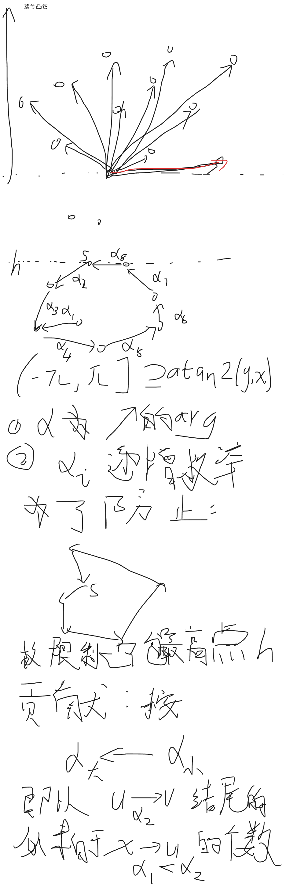
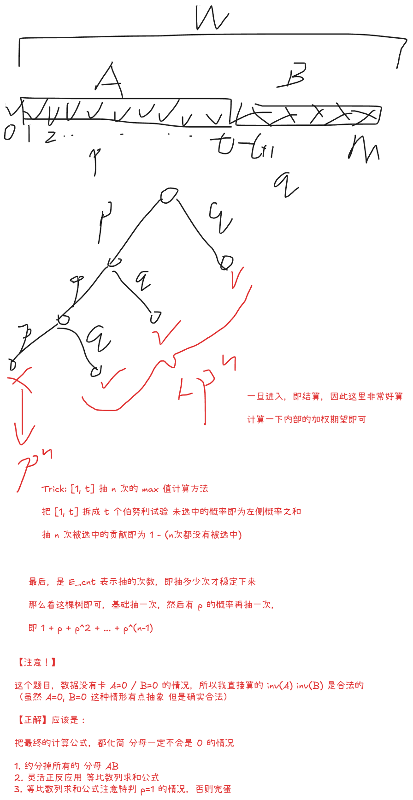

## 1003 括号凸包【凸包DP / 环形前缀和 / 几何特有的限定端点法】

### Problem Description

给定二维平面上的 $n$ 个点，所有点互不相同，且不存在三点共线。每个点上写有一个括号，可能是左括号 $($，也可能是右括号 $)$。

我们称一个字符串 $S$ 是一个合法括号序列，当且仅当它可以由如下递归规则生成：

空串是一个合法括号序列；
如果 $A$ 是合法括号序列，那么字符串 $(A)$ 也是合法括号序列；
如果 $A$ 和 $B$ 都是合法括号序列，那么 $AB$ 也是合法括号序列。

例如，$()$, $(())$, $()()$ 都是合法括号序列，而 $)($, $(()$, $())($ 不是合法括号序列。

现在，你需要从给定的点中选出若干个互不相同的点作为顶点，构成一个凸多边形。

在本题中，一个由 $m$ 个点 $p_{a_1}, p_{a_2}, \dots, p_{a_m}$ 构成的多边形被称为凸多边形，当且仅当满足：

$m \ge 3$；
这些点按照 $a_1, a_2, \dots, a_m$ 的顺序依次连接，并连接 $a_m$ 与 $a_1$ 后，形成一个简单多边形（即多边形的边仅在相邻边的端点处相交，不相邻边互不相交）；
对于该多边形的每一条边，其余所有顶点都严格位于这条边所在直线的同一侧。

换句话说，所选出的点必须恰好按照它们在自身凸包上的环形顺序排列，并且所有内角都严格小于 $180^\circ$，凸多边形上不存在三点共线。

对于一个凸多边形，任选其边界上的一个顶点作为起点，并沿着多边形边界按顺时针或逆时针方向依次遍历所有顶点，最后回到起点前停止。这样可以得到一个长度为 $m$ 的括号序列：若当前顶点上写有左括号，则写下 $($；若当前顶点上写有右括号，则写下 $)$。

你的任务是找到包含左括号的凸多边形，使得对于该多边形上的任意一个写有左括号的顶点，以它作为起点沿多边形边界并以任意方向遍历得到的括号序列都是合法括号序列。但这样的多边形数量很多，所以你决定只计算满足条件的多边形个数对 $998244353$ 取模后的结果。

### Input

第一行包含一个整数 $T$（$1 \le T \le 100$），表示数据组数。

每组数据的第一行包含一个整数 $n$（$1 \le n \le 500$），表示点的数量。

接下来 $n$ 行，每行包含三个整数 $x_i, y_i, t_i$（$0 \le x_i, y_i \le 10^9, t_i \in \{0, 1\}$），表示第 $i$ 个点的坐标和括号类型，其中 $t_i = 0$ 表示左括号，$t_i = 1$ 表示右括号。

保证每组数据中所有点互不相同，且不存在三点共线。

保证所有数据的 $n$ 之和不超过 $1000$。

### Output

对于每组数据，输出一行一个整数表示多边形的方案数取模后的结果。

### Sample Input

```txt
5
4
1 1 0
2 4 1
3 9 0
4 16 1
5
1 1 0
2 4 0
3 9 0
4 16 1
5 25 1
6
47 58 0
30 23 0
27 34 1
35 7 1
10 30 1
1 25 1
8
10 5 0
10 16 0
1 5 0
24 9 0
6 2 0
6 12 0
7 18 1
3 13 1
1
0 0 0
```

### Sample Output

```txt
1
0
1
0
0
```

### Solution

> 看图吧



### Code

```cpp
#include<bits/stdc++.h>
using namespace std;

using ll = long long;
using lll = __int128;

const ll mod = 998244353;

struct Vec {
    ll x, y;
    double arg;
    Vec(ll x=0,ll y=0):x(x),y(y),arg(atan2(y,x)) {}
    lll operator%(const Vec o) const {
        return (lll)(x-o.x)*(o.y-y) - (lll)(y-o.y)*(o.x-x);
    }
    Vec operator-(const Vec& o) const {
        return Vec(x-o.x,y-o.y);
    }
    bool operator<(const Vec& o) const {
        return arg < o.arg;
    }
};

const int N = 505;

int n;
Vec p[N];
int t[N];

ll dp[N][N];
ll sum[N];

int order[N];
pair<int,int> par[N*N];

void solve() {
    cin >> n;
    for (int i = 1; i <= n; i++) {
        ll x, y;
        cin >> x >> y >> t[i];
        p[i] = Vec(x, y);
    }
    int cnt = 0;
    for(int i = 1; i <= n; i++) {
        for(int j = 1; j <= n; j++) {
            if(i != j) {
                par[++cnt] = {i, j};
            }
        }
    }
    iota(order,order+1+n,0);
    sort(order+1,order+1+n, [](auto& a,auto& b){
        return p[a].y > p[b].y;
    });
    sort(par+1,par+1+cnt,[](auto& i,auto& j){
        return (p[i.second] - p[i.first]) < (p[j.second] - p[j.first]);
    });
    ll ans = 0;
    for(int i = 1; i <= n; i++) {
        int s = order[i];
        ll h = p[s].y;
        // cout << "s=" << s << "\n";
        fill(sum,sum+1+n,0);
        for(int i = 1;i <= n; i++) {
            for (int j = 1; j <= n; j++) {
                dp[i][j] = 0;
            }
        }
        sum[s] = 1;
        for(int j = 1; j <= cnt; j++) {
            auto [u, v] = par[j];
            if(t[u] == t[v] || p[u].y > h || p[v].y > h) continue;
            // cout << u << "-" << v << "\n";
            (dp[u][v] += sum[u]) %= mod;
            (sum[v] += dp[u][v]) %= mod;
            // cout << "dp=" << dp[u][v] << "\n";
        }
        for(int j = 1; j <= n; j++) {
            (ans += dp[j][s] ) %= mod;
        }
    }
    for(int i = 1; i <= n; i++) {
        for (int j = 1; j < i; j++) {
            if(t[i] !=  t[j]) {
                (ans += mod - 1) %= mod;
            }
        }
    }
    cout << ans << "\n";
}

int main() {
    ios::sync_with_stdio(0);cin.tie(0);cout.tie(0);
    int T =  1;
    cin >> T;
    while (T--) solve();
}
```

## 1004 探索宝物【期望 / “已经达标特判” / “分母为0->公式最简化”】

### Problem Description

玩家准备探索一个神秘房间，最多可以进行 $n$ 次探索。每次探索会消耗 $c$ 个金币，并随机生成一个宝物。宝物的价值是 $[1, m]$ 中的一个整数。对于价值为 $v$ 的宝物，其出现概率为 $P_v$。

一开始，玩家身上没有宝物。每次探索后，玩家会看到新生成宝物的价值。此时玩家可以选择：

替换当前宝物，即丢弃旧宝物，拿走新宝物；
保留当前宝物，即丢弃新宝物。

之后，玩家可以继续消耗金币进行下一次探索，也可以立即结束探险，带着当前身上的宝物离开。

玩家的最终收益定义为最终带走的宝物价值减去探索消耗的金币总数。玩家也可以在尚未进行任何探索时直接结束探险，此时收益为 $0$。

请你求出在最优策略下，玩家最终收益的期望最大值。

### Input

第一行一个整数 $T$（$1 \le T \le 200$），表示数据组数。

对于每组数据，第一行包含三个整数 $n, m, c$（$1 \le n \le 10^9, 1 \le m \le 10^5, 0 \le c \le 10^9$），分别表示最多探索次数、宝物价值上限、每次探索消耗的金币数。

第二行包含 $m$ 个非负整数 $w_1, w_2, \dots, w_m$（$0 \le w_v \le 10^9$）。其中价值为 $v$ 的宝物出现概率为：$P_v = \frac{w_v}{\sum_{i=1}^m w_i}$。保证 $\sum_{i=1}^m w_i \bmod (10^9+7) \neq 0$。

对于所有数据，满足 $\sum m \le 10^6$。

### Output

输出一个整数，表示在最优策略下，玩家最终收益的期望最大值对 $10^9+7$ 取模后的结果。可以证明这个最大值是一个有理数，设为 $\frac{p}{q}$，你需要输出 $p \cdot q^{-1} \bmod (10^9+7)$，其中 $q^{-1}$ 表示 $q$ 在模 $10^9+7$ 意义下的逆元。

### Sample Input

```txt
2
2 3 0
1 1 1
2 6 1
1 1 1 1 1 1
```

### Sample Output

```txt
444444450
861111120
```

### Solution

- 这么理解，针对每一个当前价值 $x$ 计算：下一步的 **增量**

$$
E_x = \sum_{v>x}\frac{w_v(v-x)}{W} - c \gt 0
$$

- 可以发现，这是一个单调的式子，会有一个界限
	- 设 $x = t$ 是最大的满足上式的 $x$
- 由此得到：
	- 相当于 $c$ 的成本放在了 $w$ 中，在 $x\le t$ 的时候可以无限尝试
	- 一旦 $x>t$ 即停止
- 由此得到一个二叉树结构



- 【注意】
	- 注意一开始就达标的情况
		- 依稀记得，前不久，ST 表求 LCA 次高点求崩了的情况
	- 不要轻易使用 **半化简的公式**
		- 依稀记得，有一道换根 DP + 概率题目
			- 出题人特意卡了分母为 $0$ 的情况
			- 正解应该是维护乘法
### Code

```cpp
#include<bits/stdc++.h>
using namespace std;

using ll = long long;
using lll = __int128;

const int M = 1e5 + 5;
const ll mod = 1e9 + 7;

int n, m, c;
ll w[M];

ll ksm(ll a, ll b=mod-2) {
    ll res = 1;
    for (;b;b>>=1,a=a*a%mod) if(b&1) res= res*a%mod;
    return res;
}

void solve() {
    cin >> n >> m >> c;
    ll W = 0;
    for (int i = 1; i <= m; i++) {
        cin >> w[i];
        W += w[i];
    }
    lll suf = 0, sufv = 0;
    ll A = 0, B = 0;
    ll t = -1;
    for(int i = m; i >= 0; i--) {
        if(sufv - suf * i > (lll) c * W) {
            t = i;
            break;
        }
        suf += w[i];
        sufv += w[i] * i;
        B += w[i];
    }

    // 【最坑的一点】 因为可能一开始已经达标了！！！
    // 特判一下啊
    if(t == -1) {
        cout << 0 << "\n";
        return;
    }

    A = W - B;
    W%=mod;
    A%=mod;
    B%=mod;
    ll iW = ksm(W), iA = ksm(A), iB = ksm(B);
    
    // p, 1-p
    ll p = A * iW % mod, q = (1 - p + mod) % mod;
    // p^n, (1-p)^n
    // 【WA】 不可以分开处理，必须算出来一个最终的式子，防止中间有 0
    // ll p_low = ksm(p, n), p_high = (1 - p_low + mod) % mod;
    ll p_low = 1, p_high = 1;
    
    // E_low
    ll E_low = 0;
    ll pre = 0;
    for (int i = 1; i <= t; i++) {
        (E_low += ksm(pre, n)) %= mod;
        (pre += w[i]) %= mod;
    } 
    // (E_low*=ksm(iA, n )) %= mod;
    (E_low*=ksm(iW, n )) %= mod;
    // E_low= (t - E_low + mod) % mod;
    E_low= (t * ksm(A * iW % mod, n) - E_low + mod) % mod;
    
    // E_cnt
    ll E_cnt = (p != 1 ? (1 - ksm(p, n) + mod)%mod * ksm(q): n) % mod;
    
    // E_high
    ll E_high = 0;
    for(int i = t+1; i <= m; i++) 
        (E_high += w[i] * i) %= mod;
    // (E_high *= iB) %= mod;
    (E_high *= (iW * E_cnt) % mod) %= mod;

    ll ans = (p_low*E_low%mod + p_high*E_high%mod - c * E_cnt % mod + mod) % mod;
    cout << ans << "\n";
}

int main() {
    ios::sync_with_stdio(0);
    cin.tie(0); cout.tie(0); 
    int T = 1;
    cin >> T;
    while (T--) solve();
}
```


## 1006 三串共鸣【Z 函数 / 计数 / “类01段计数算法” / “类等长段覆盖算法”】

### Problem Description

给定三个仅由小写英文字母组成的字符串 $a$，$b$ 和 $c$。所有字符串的下标均从 $0$ 开始，我们用 $|S|$ 表示字符串 $S$ 的长度，$S[x..y]$ 表示字符串 $S$ 从下标 $x$ 到下标 $y$ 的连续子串，区间两端均包含在内。

你需要统计有多少个三元组 $(i, j, l)$ 满足以下条件：

$0 \le l < |a|$，$0 \le i < |b|$，$l \le j < |c|$；

在字符串 $b$ 中至少存在一个起始位置 $k$（$0 \le k$ 且 $k+l < |b|$），满足 $a[0..l] = b[k..k+l] = c[j-l..j]$ 且位置 $i$ 被这个匹配子串覆盖，即 $k \le i \le k+l$。

换句话说，对于每个 $l$ 和 $j$，如果 $a$ 的长度为 $l+1$ 的前缀等于 $c$ 中以 $j$ 结尾、长度为 $l+1$ 的子串，那么我们记这个字符串为目标串。接着在 $b$ 中寻找所有等于该目标串的子串，并统计这些子串覆盖到的不同位置 $i$ 的数量。

注意，$b$ 中可能存在多个相同的匹配子串。如果它们覆盖了同一个位置 $i$，那么对于当前固定的 $(j, l)$，这个位置 $i$ 只能贡献一次。

### Input

第一行一个正整数 $T$（$1 \le T \le 10^4$），表示数据组数。

对于每组数据，第一行三个整数 $n_a, n_b, n_c$（$1 \le n_a, n_b, n_c \le 10^5$），分别表示三个字符串的长度。

接下来三行，每行一个仅由小写英文字母构成的字符串，分别表示给定的字符串 $a$，$b$ 和 $c$。

对于所有数据，保证 $\sum(n_a + n_b + n_c) \le 3 \times 10^6$。

### Output

对于每组数据，输出一行一个整数，表示满足条件的三元组的总数。

### Sample Input

```txt
2
2 3 3
ab
bab
abc
4 5 6
aaaa
aaaaa
aaaaaa
```

### Sample Output

```txt
3
90
```

### Hint

对于第一组样例，满足条件的三个三元组分别为：$(1, 0, 0)$，$(1, 1, 1)$ 和 $(2, 1, 1)$。

### Solution

- 首先 c 显然可以变为一个权重
- 重点在于 b 在不同的 L 下的覆盖长度计算

- 还记得01段计数吗
	- $段数 = 1的个数 - 11的个数$
- 那么这里，等长段覆盖计数，依然使用
	- $覆盖长度 = 定长L \times 点个数n - \sum \max(0,L-邻点间距(p_{i+1}-p_i))$
	- $覆盖长度 = 定长L \times 点个数n - \sum \max((p_{i+1}-p_i), L) + (p_{\text{max}} - p_{\text{min}})$
	- 只需要维护：
		- 相对位置（set）
		- 间隔长度（Bit）
	- 对任意 $L$ 可以快读计算
	- 使用 `set` + `BitSum, BitCnt` 维护即可
- 考虑到发展变化的顺序，此题使用按 $L$ 倒序插入位置即可

### Code

```cpp
#include<bits/stdc++.h>
using namespace std;
using ll = long long;

const int N = 2e5 + 5;

struct BIT{
    int n;
    ll tr[N];

    // 0-base 适配
    void init(int _) {
        n = _ + 1;
        fill(tr,tr+1+n, 0);
    }

    void add(int i,int v) {
        for(i++;i<=n;i+=i&-i) tr[i]+=v;
    }

    // 查询前缀和
    ll query(int i) {
        ll res = 0;
        for(i++;i;i-=i&-i) res += tr[i];
        return res;
    }
    
    // // 第一个前缀和 >= v 的位置
    // // 返回 -1: 空即可 
    // // 返回 0~n: 找到
    // // 返回 n+1: 找不到
    // int lower_bound(int v) {
    //     if (v <= 0) return -1;
    //     int sum = 0;
    //     int cur = 0;
    //     for(int i = __lg(n); i>=0;i--) {
    //         int nxt = cur | (1 << i);
    //         // 止步
    //         if(nxt <= n && sum + tr[nxt] < v) {
    //             cur = nxt;
    //             sum += tr[nxt];
    //         }
    //     }
    //     return cur + 1 - 1;
    //     // 返回 0 说明
    // }
}Sum,Cnt;

vector<int> getZ(const string& s) {
    int n = s.size();
    vector<int> z(n);
    z[0] = n;
    for(int i=1,c,r=0,len;i<n;i++) {
        len = i<r ? min(z[i-c], r-i):0;
        while(i+len<n&&s[len]==s[i+len])len++;
        if(i+len>r) {
            r = i+len;
            c= i;
        }
        z[i]=len;
    }
    return z;
}

string a, b, c;
int na,nb,nc;
int k[N];
array<int,2> pl[N];
set<int> pos;

void add(int p) {
    auto nxt = pos.lower_bound(p);
    if(nxt==pos.end()) {
        if(nxt==pos.begin()) {
            // 空的 
            // 无事发生
        } else {
            // 最大的
            Sum.add(p - *pos.rbegin(), (p - *pos.rbegin()));
            Cnt.add(p - *pos.rbegin(), 1);
        }
    } else {
        if(nxt==pos.begin()) {
            // 最小的
            Sum.add(*pos.begin() - p, (*pos.begin() - p));
            Cnt.add(*pos.begin() - p, 1);
        } else {
            // 中间的
            auto pre = prev(nxt);
            Sum.add(*nxt - *pre, -(*nxt - *pre));
            Cnt.add(*nxt - *pre, -1);
            Sum.add(*nxt - p, (*nxt - p));
            Cnt.add(*nxt - p, 1);
            Sum.add(p - *pre, (p - *pre));
            Cnt.add(p - *pre, 1);
        }
    }
    pos.insert(p);
}

ll query(int lim) {
    int cn = Cnt.query(lim);
    return (ll) cn * lim + Sum.query(nb) - Sum.query(lim);
}

void solve() {
    cin >> na >> nb >> nc;
    cin >> a >> b >> c;
    string ab = a + "#" + b;
    string ac = a + "#" + c;
    vector<int> zab = getZ(ab);
    vector<int> zac = getZ(ac);

    fill(k,k+1+na,0);
    for(int i = 1; i <= nc; i++) k[zac[na+i]]++;
    for(int i = na-1;i>=1;i--) k[i] += k[i+1];

    for(int i = 1; i <= nb; i++) pl[i] = {zab[na+i], i};
    sort(pl+1,pl+1+nb,greater<>());
    
    // 【坑点2】用的其实是 b 的间隔 不是 a !!!
    ll ans = 0;
    Sum.init(nb);
    Cnt.init(nb);
    pos.clear();
    int cn = 0;
    int mx = -1, mn = 1e9;
    for(int L = nb, p = 1; L >= 1; L--) {
        while(p <= nb && pl[p][0] == L) {
            cn++;
            mx=max(mx, pl[p][1]);
            mn=min(mn, pl[p][1]);
            add(pl[p++][1]);
        }
        // 【坑点：】 正负号又算反了，让我想起了概率论与数理统计
        if(cn)
            ans += k[L] * ((ll) cn * L - query(L) + (mx - mn));
    }
    cout << ans << "\n";
}

int main() {
    ios::sync_with_stdio(0);
    cin.tie(0); cout.tie(0);
    int T = 1;
    cin >> T;
    while (T--) solve();
}
```