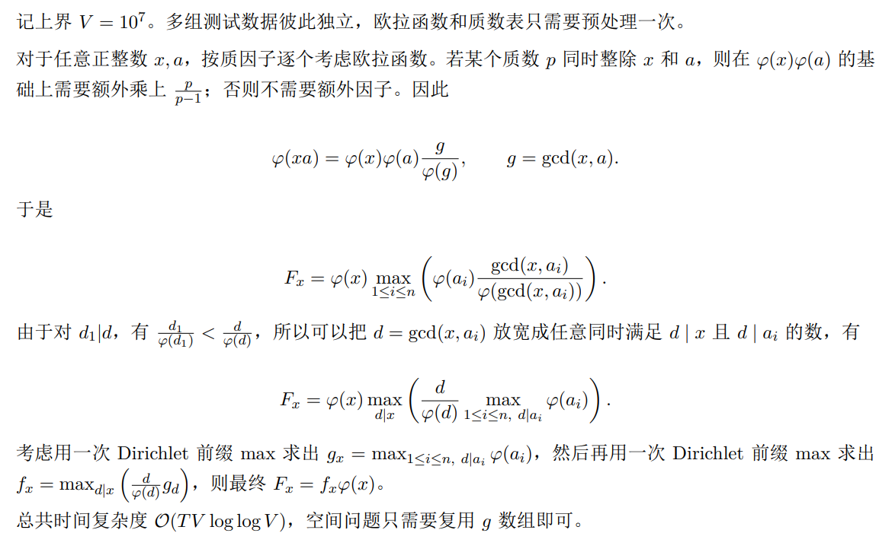

## 1001 Grand Mex【构造 / 2-SAT】

[链接](http://acm.hdu.edu.cn/contest/problem?cid=1234&pid=1001)

### Problem Description

有 $n$ 个整数 $a_1, a_2, \dots, a_n$，初始时它们全部等于 $0$。

接下来依次进行 $n-1$ 次操作。第 $i$ 次操作给出两个不同的下标 $x_i, y_i$。你需要选择其中一个下标。

如果选择 $x_i$，则执行 $a_{x_i} \leftarrow a_{x_i} + 1, a_{y_i} \leftarrow 0$。

如果选择 $y_i$，则执行 $a_{y_i} \leftarrow a_{y_i} + 1, a_{x_i} \leftarrow 0$。

保证将所有 $(x_i, y_i)$ 看作无向边后，它们构成一棵包含 $n$ 个点的树。

你必须按照输入顺序完成全部操作。请最小化最终序列 $a$ 的 $\operatorname{mex}$，并构造一种达到最小值的操作方案。

序列的 $\operatorname{mex}$ 定义为没有在序列中出现的最小非负整数。例如，$\operatorname{mex}([0, 2, 2]) = 1$。

### Input

第一行包含一个整数 $T$（$1 \le T \le 2 \times 10^5$），表示测试数据的组数。

对于每组测试数据：

第一行包含一个整数 $n$（$2 \le n \le 5 \times 10^5$）。

接下来 $n-1$ 行，第 $i$ 行包含两个整数 $x_i, y_i$（$1 \le x_i, y_i \le n$，$x_i \neq y_i$），表示第 $i$ 次操作涉及的两个下标。

保证每组测试数据中的所有边构成一棵树，且对于所有测试数据 $\sum n \le 10^6$。

### Output

对于每组测试数据：

第一行输出一个整数，表示最终序列的最小可能 $\operatorname{mex}$。

第二行输出 $n-1$ 个整数 $s_1, s_2, \dots, s_{n-1}$。其中 $s_i$ 必须等于 $x_i$ 或 $y_i$，表示在第 $i$ 次操作中选择 $a_{s_i}$ 加一，并将另一个数清零。

如果存在多种最优方案，输出任意一种。

### Sample Input

```txt
3
2
1 2
6
4 3
2 1
3 1
5 3
6 1
8
4 7
2 5
1 3
6 2
3 6
8 3
2 4
```

### Sample Output

```txt
2
2
2
4 2 3 5 6
1
4 2 3 2 3 3 2
```

### Hint

样例输出分别给出了一种最优操作方案。可能存在其他正确的最优方案。

### Solution

- 首先关键在于，发现入度与取值的关系，能发现 mex 最多为2
- 然后，使用 2-SAT解决问题
	- 关键在于，去杂法的使用
	- 并且发现，去杂的 1 的最后两次操作是固定的
	- 因此，可以使用 2-SAT
	- 注意编码

### Code

```cpp
#include<bits/stdc++.h>
using namespace std;

const int N = 1e6 + 5;

int n;
array<int,2> xy[N];
vector<int> e[N], g[N];

int dfn[N], low[N], dfncnt, tp, stk[N], ins[N], sc, scc[N];

int ans[N];
int fa[N];

void tarjan(int u) {
    dfn[u] = low[u] = ++dfncnt;
    ins[stk[++tp] = u] = 1;
    for (auto v: g[u]) {
        if(!dfn[v]) {
            tarjan(v);
            low[u] = min(low[u], low[v]);
        } else if(ins[v]) {
            low[u] = min(low[u], dfn[v]);
        }
    }
    if (dfn[u] == low[u]) {
        sc++;
        do {
            scc[stk[tp]]=sc;
            ins[stk[tp]]=0;
        }while(stk[tp--]!=u);
    }
}

void dfs2(int u, int f) {
    fa[u] = f;
    for(auto i:e[u]) {
        int v = u ^ xy[i][0] ^ xy[i][1];
        if (v == f) continue;
        dfs2(v, u);
    }
}

void solve() {
    bool ok = true;
    cin >> n;
    for (int i = 1; i < n; i++) {
        int u, v;
        cin >> u >> v;
        xy[i] = {u, v};
        e[u].push_back(i);
        e[v].push_back(i);
    }
    for(int u = 1; u <= n; u++) {
        int sz = e[u].size();
        if (sz == 1) {
            // 必须不被选择
            int i = e[u][0];
            auto [x, y] = xy[i];
            int p = i*2-1; // p
            int np = i*2; // !p
            if (u == x) {
                // 不被选择时 为 0 所以 保持非 
                // !p v !p = p -> !p
                g[p].push_back(np);
            } else {
                // 不被选择时为 1 所以
                // p v p = !p -> p
                g[np].push_back(p);
            }
        } else {
            // 必须不是 不被选+被选
            // 即 !(!p1 ^ p2)
            // 即 p1 v !p2
            // 即 !p1 -> !p2 | p2->p1
            int i = e[u][sz-2], j = e[u][sz-1];
            auto [x1, y1] = xy[i];
            auto [x2, y2] = xy[j];
            int p1 = i*2-1, np1 = i *2;
            if(u != x1) swap(p1, np1);
            int p2 = j*2-1, np2 = j *2;
            if(u != x2) swap(p2, np2);
            g[np1].push_back(np2);
            g[p2].push_back(p1);
        }
    }
    for (int i = 1; i <= n*2-2; i++) {
        if (!dfn[i]) tarjan(i);
    }
    for (int i = 1; i < n; i++) {
        ok &= scc[i*2-1] != scc[i*2];
        ans[i] = xy[i][scc[i*2-1]>scc[i*2]];
    }
    if (!ok) {
        dfs2(1, 0);
        cout << 2 << "\n";
        for (int i = 1; i < n; i++) 
            cout << xy[i][xy[i][0] == fa[xy[i][1]]] << " ";
    } else {
        cout << 1 << "\n";
        for (int i = 1; i < n; i++)
            cout << ans[i] << " ";
    }
    cout << "\n";
    for (int i = 1; i <= n; i++) {
        e[i].clear();
        dfn[i*2-1] = 0;
        dfn[i*2] = 0;
        g[i*2-1].clear();
        g[i*2].clear();
    }
    dfncnt=sc=0;
}

int main() {
    ios::sync_with_stdio(0);
    cin.tie(0); cout.tie(0);
    int T = 1;
    cin >> T;
    while (T--) solve();
}
```


## 1003 Phi Master【数论 / 换序 / 欧拉函数 / Dirichlet 前缀】

### Problem Description

小 C 在找 npy。

众所周知，找 npy 需要考虑两人之间的默契。经过初步筛选，小 C 列出了一个候选人列表 $a_1, a_2, \dots, a_n$，其中 $a_i$ 表示第 $i$ 号候选人的能力值。

如果小 C 的能力值为 $x$，那么候选人 $i$ 和小 C 之间的默契度为 $\varphi(x a_i)$，其中 $\varphi$ 表示欧拉函数。

由于小 C 的能力值未知，小 R 想要你对每个可能的能力值 $x$，求出此时的最大默契度。

形式化地，对每组测试数据，给定序列 $a_1, a_2, \dots, a_n$，对所有满足 $1 \le x \le 10^7$ 的整数 $x$，定义

$$F_x = \max_{1 \le i \le n} \varphi(x a_i)$$

你需要按照特殊格式输出这些值的压缩结果。

### Input

第一行一个正整数 $T$（$1 \le T \le 3$），表示测试数据的组数。

对于每组测试数据：

第一行包含一个正整数 $n$（$1 \le n \le 2 \times 10^6$），表示序列长度。

第二行包含 $n$ 个正整数 $a_1, a_2, \dots, a_n$（$1 \le a_i \le 10^7$）。

### Output

对每组测试数据，令 $B = 1000$。你需要输出 $B$ 行，第 $i+1$ 行输出整数 $A_i$，其中 $0 \le i < B$，并且

$$A_i = \bigoplus_{\substack{1 \le x \le 10^7 \\ x \bmod B = i}} \left\lceil \frac{x}{B} \right\rceil F_x$$

这里 $\oplus$ 表示按位异或。

多组测试数据的输出依次排列，中间不需要输出空行。

### Sample Input

```txt
1
8
13 7 10 20 4 9 19 16
```

### Sample Output

```txt
见题目附件
```

### Solution

**枚举换序 + 欧拉函数 + 狄利克雷后缀和 + 迪利克雷前缀和**

> Key Point: 枚举换序，整除关系枚举优先！！！！！！！！！！！！！！！！！
> 
> 重点是狄利克雷后缀和怎么搞的 是从大到小 并且大的贡献给小的 
> 
> 不就是狄利克雷差分的贡献方式吗



### Code

```cpp
#include<bits/stdc++.h>
using namespace std;
using ll = long long;

const int N = 2e6 + 5, V = 1e7 + 5;
int primes[V], cntP, factor[V], phi[V];

void init() {
    phi[1] = 1;
    for (int i = 2; i < V; i++) {
        if(!factor[i]) {
            factor[i] = i;
            // 【坑点：没写这个，本质基础错误，漏写】
            primes[++cntP] = i;
            phi[i] = i - 1;
        }
        for (int j = 1; j <= cntP; j++) {
            int p = primes[j];
            int pi = p * i;
            if(pi >= V) break;
            factor[pi] = p;
            if(i % p == 0) {
                phi[pi] = phi[i] * p;
                break;
            } else {
                phi[pi] = phi[i] * (p-1);
            }
        }
    }
}

int n;
int a[N];
int suf_max[V];
int F[V];
ll ans[1000];
bool vis[V];

void solve(int T) {
    cin >> n;
    for (int i = 1; i <= n; i++) {
        cin >> a[i];
        suf_max[a[i]] = phi[a[i]];
        // suf_max[1] = max(suf_max[1], a[i]);
    }
    
    fill(vis,vis+V,false);
    for(int i = 2; i < V; i++) {
        if (vis[i]) continue;
        for(int j = (V-1) / i, ij = i * j; j; j--, ij -= i) {
            vis[ij] = true;
            suf_max[j] = max(suf_max[j], suf_max[ij]);
        }
    }

    // 【巨大坑点： phi 整除不了！！！！！！！！】
    for (int i = 1; i < V; i++) F[i] = (ll) i * suf_max[i] / phi[i] ;

    // 【本质基础坑点：迪利克雷前缀和 不是调和级数！并且调和级数只能覆盖式 max 无法精确覆盖】
    fill(vis,vis+V,false);
    for (int d = 2; d < V; d++) {
        if (vis[d]) continue;
        for (int x = 1, xd = x * d; xd < V; x++, xd += d) {
            vis[xd] = true;
            F[xd] = max(F[xd], F[x]);
        }
    }
    
    for (int x = 1; x <= 10000000; x++) {
        ans[x%1000] ^= (x + 999ll) / 1000 * F[x] * phi[x];
    }

    // 【坑点：不要尝试在清空数据之后输出答案】
    for (int i = 0; i < 1000; i++) cout << ans[i] << "\n";
    fill(ans, ans + 1000, 0);
    fill(suf_max, suf_max + V, 0);
    fill(F, F + V, 0);
}

int main() {
    init();
    ios::sync_with_stdio(0); cin.tie(0); cout.tie(0);
    int T = 1;
    cin >> T;
    while (T--) solve(T);
}
```


## 1006 Gcd Master【数论 + 差分 + 狄利克雷卷积 + NTT】

### Problem Description

给定 $n$，求

$$\sum_{i=1}^{n} \sum_{j=i}^{n} \sum_{k=i}^{j} \gcd(i,k) \gcd(j,k) \binom{j}{k}$$

对 $998244353$ 取模的结果。

### Input

第一行包含一个整数 $T$（$1 \le T \le 10$），表示测试数据的组数。

之后 $T$ 行，每行包含一个整数 $n$（$1 \le \sum n \le 5 \times 10^5$）。

### Output

对于每组测试数据，输出一行一个整数，表示答案。

### Sample Input

```txt
1
5
```

### Sample Output

```txt
298
```

### Solution

- 求和符号太多了，先来个差分
	- 差分之前，需要一定的注意力：
	- 使用贡献分析法，观察，本质增加的项是什么

$$
\begin{equation}
\begin{aligned}

f(n) 

&= \sum_{i=1}^n \sum_{j=i}^n \sum_{k=i}^j \gcd(i, k) \gcd(j, k) \binom{j}{k} \\

\\
&这一步转化，差分化，正常看都看不出来，必须注意到，本质上枚举的是 \\
& [1, n] 范围内的 i \le k \le j 的三元组！！！ \\
\\
& 所以，利用差分！我们可以看出，多的是以 n 结尾的三元组，显然 j = n 然后 i, k 任意\\
\\

&= f(n - 1) + \sum_{i=1}^n \sum_{k=i}^n \gcd(i, k) \gcd(n, k) \binom{n}{k} \\

&= f(n - 1) + g(n)

\end{aligned}
\end{equation}
$$

- 然后这个式子好看多了，化简它

$$
\begin{equation}
\begin{aligned}

g(n) 

&= \sum_{i=1}^n \sum_{k=i}^n \gcd(i, k) \gcd(n, k) \binom{n}{k} \\

&= \sum_{k=1}^n \binom{n}{k} gcd(n, k) \sum_{i=1}^k \gcd(i, k) \\

\\
&经典的 \sum_{i=1}^n \gcd(i, n) ，怎么求 ？
\\

\end{aligned}
\end{equation}
$$

- 继续完成辅助工作

$$
\begin{equation}
\begin{aligned}

& 知道莫比乌斯，知道欧拉反演，用哪个？ \\

& 莫比乌斯适用于，统计 \gcd = d 的数量 \\ 

& 而 欧拉反演 更适合这里！！！ \gcd 的纯求和 \\

\\
& 啥是欧拉反演： 一个数 n，等于它的所有因子的 \varphi 之和
\\

& 根据自变量，设 a(n) = \sum_{i=1}^n \gcd(i, n)
\\

a(n) &=  \sum_{i=1}^{n} \sum_{d \mid i , d\mid n } \varphi(d)
\\

&= \sum_{d \mid n} \varphi(d) \frac{n}{d} \\

\end{aligned}
\end{equation}
$$

- 辅助数据件求完了，继续搞

$$
\begin{equation}
\begin{aligned}

g(n) &= n! \sum_{k=1}^n \frac{1}{k!(n-k)!} \gcd(n, k) a(k) \\

&= n! \sum_{k=1}^n \frac{a(k)}{k!(n-k)!} \sum_{d \mid n, d \mid k} \varphi(d) \\

\\ & 这一招太狠了 枚举直接反客为主 \\

&= n! \sum_{d \mid n} \varphi(d) \sum_{d \mid k} \frac{a(k)}{k!(n-k)!}

\\
\\

& \text{枚举 x，每次取出 x 倍数的下标做 FFT。！！！}

\end{aligned}
\end{equation}
$$

- 如何做 $k$ 的倍数位置上的 FFT ？？？题解里面妹说

$$
\begin{equation}
\begin{aligned}


g(n) &= n! \sum_{d \mid n} \varphi(d) \sum_{d \mid k} \frac{a(k)}{k!(n-k)!} \\

&= n! \sum_{d \mid n} \varphi(d) \sum_{k = 1}^{\frac{n}{d}} \frac{a(kd)}{(kd)!(n-kd)!} \\

\\ &注意到，对于不同的 g 只有 n 不同 \\

\\ &此时设 n = jd 那么 \\

&= n! \sum_{d \mid n} \varphi(d) \sum_{k = 1}^{j} \frac{a(kd)}{(kd)!((j-k)d)!} \\

\\ & 你发现了什么 ？ \\

&= n! \sum_{d \mid n} \varphi(d) \sum_{k = 1}^{j} \frac{a(kd)}{(kd)!} \cdot \frac{1}{((j-k)d)!} \\

\\ & 枚举的 k 并且 一边是 kd 另一边 (j-k)d

\end{aligned}
\end{equation}
$$

- 所以大胆设

$$
\begin{cases}
\begin{aligned}

F_d(n) &= \frac{a(nd)}{(nd)!}, 且 n = 0 时， F(0) = 0 \\

G_d(n) &= \frac{1}{(nd)!}\\

\end{aligned}
\end{cases}
$$

- 所以卷积就清晰了

$$
\begin{equation}
\begin{aligned}

g(n) &= n! \sum_{d \mid n} \varphi(d) \sum_{d \mid k} \frac{a(k)}{k!(n-k)!} \\

&= n! \sum_{d \mid n} \varphi(d) \cdot (F_d * G_d)_j

\end{aligned}
\end{equation}
$$

- 又套了一个狄利克雷卷积！！！

$$
\begin{equation}
\begin{aligned}

g(n) &= n! \sum_{d \mid n} \varphi(d) \sum_{d \mid k} \frac{a(k)}{k!(n-k)!} \\

&= n! \sum_{d \mid n} \varphi(d) \cdot (F_d * G_d)_{\frac{n}{d}}

\end{aligned}
\end{equation}
$$

- 依然使用 迪利克雷前缀和方式贡献法

### Code

```cpp

```

## 1007 Multicon【数学】（TODO）

[链接]((http://acm.hdu.edu.cn/contest/problem?cid=1234&pid=1007)

### Problem Description

对非负整数 $x$，定义 $x_i = \lfloor \frac{x}{6^i} \rfloor \bmod 6$，即 $x$ 在 $6$ 进制下第 $i$ 位的值。

对非负整数 $x, y$，定义运算 $x \otimes_6 y = \sum_{i \ge 0} ((x_i \times y_i) \bmod 6) 6^i$，即 $6$ 进制下不进位乘法。

给出长为 $6^n$ 的非负整数序列 $a, b$，求序列 $c$，其中 $c_k = \left( \sum_{i \otimes_6 j = k} a_i \times b_j \right) \bmod (10^8 + 7)$，即计算 $6$ 进制下不进位乘法卷积。

请注意模数是 $10^8 + 7$。

### Input

第一行包含一个整数 $T$（$1 \le T \le 2$）表示测试数据组数。

对每组测试数据：

第一行包含一个整数 $n$（$1 \le n \le 8$）。

第二行包含 $6^n$ 个整数 $a_0, a_1, a_2, \dots, a_{6^n - 1}$（$0 \le a_i < 10^8 + 7$）。

第三行包含 $6^n$ 个整数 $b_0, b_1, b_2, \dots, b_{6^n - 1}$（$0 \le b_i < 10^8 + 7$）。

### Output

对每组测试数据，输出一行包含 $6^n$ 个整数 $c_0, c_1, c_2, \dots, c_{6^n - 1}$，表示答案。

### Sample Input

```txt
2
1
1 1 1 1 1 1
1 1 1 1 1 1
2
0 6 7 3 0 6 0 7 9 7 9 6 6 9 4 9 8 0 1 8 5 3 6 3 4 7 4 1 0 3 9 9 1 2 8 5
7 5 7 6 9 9 0 1 9 1 9 0 5 2 3 5 7 8 5 6 9 4 2 6 3 1 1 0 3 2 5 0 0 2 0 7
```

### Sample Output

```txt
15 2 6 5 6 2
4376 803 2465 1538 2545 930 413 42 344 73 295 69 1367 158 615 324 712 220 1290 257 954 410 822 287 1531 115 616 415 620 257 451 51 271 107 278 54
```

### Hint

请注意模数是 $10^8 + 7$。

请使用较快速的输入输出方法，附件代码以 A + B Problem 为例，提供一份文件 IO 下简略的输入输出模板。

调用 `IO::R()` 输入并返回一个 `int` 范围内的非负整数，调用 `IO::W()` 输出一个 `int` 范围内的非负整数，并输出一个字符。

请保证输入文件的最后一个字符是空格或换行，即不是要读取的数字字符，数据中保证了这一点。请在程序结束运行前调用 `IO::flush()` 以刷新输出缓冲区。

## 1009 Imperfect Permutation【散装 DP / “多层寻址优化”】

### Problem Description

有一棵深度为 $n$ 的满二叉树（根节点深度为 $0$）。初始时，从左到右第 $i$ 个叶子节点的标号为 $i-1$。

你可以进行以下操作任意多次（可以不操作）：选择一个非叶子节点，交换它的左右子树。

所有操作结束后，从左到右读出叶子标号，得到长度为 $2^n$ 的序列 $a$。给定一个 $0, 1, \dots, 2^n - 1$ 的排列 $p$，求 $a_i = p_i$ 的位置数量的最大值。

### Input

第一行包含一个整数 $T$（$1 \le T \le 32$），表示测试数据组数。

接下来依次输入每组测试数据。每组测试数据包含两行：

第一行包含一个整数 $n$（$1 \le n \le 18$）；

第二行包含 $2^n$ 个整数 $p_0, p_1, \dots, p_{2^n - 1}$。

保证对于所有测试数据，$\sum 2^n \le 2^{22}$，且 $p$ 是 $0, 1, \dots, 2^n - 1$ 的排列。

### Output

对于每组测试数据，输出一行一个整数，表示最大重合位置数。

### Sample Input

```txt
3
3
0 1 2 3 7 6 5 4
3
5 7 4 3 1 0 6 2
4
9 11 13 7 5 14 8 4 6 0 12 15 1 3 10 2
```

### Sample Output

```txt
8
5
5
```

### Hint

对于第一组数据，可以与给定排列完全匹配，因此答案为 $8$。

对于第二组数据，一种最优结果为 $[6, 7, 4, 5, 1, 0, 3, 2]$，共有 $5$ 个位置匹配。

对于第三组数据，一种最优结果为 $[10, 11, 8, 9, 15, 14, 13, 12, 6, 7, 5, 4, 1, 0, 3, 2]$，共有 $5$ 个位置匹配。

### Solution

- 最能体现无后效性的 DP 题目
	- 首先，翻转顺序任意
	- 底层小区间可以 **稳稳地接住** 大区间的问题
- DP 套一个 map 存储有效状态可太爽了，但是代价是时间复杂度
- **卡常 Trick**: 多层寻址，特别是 map，使用 auto& 优化

### Code

```cpp
#include<bits/stdc++.h>
using namespace std;

const int N = 18;

int n;

int p[1<<N];
int a[1<<N];
vector<map<int,int>> f[N+1];

void solve() {
    cin >> n;
    for (int i = 0; i <= n;i ++) {
        f[i].assign(1<<i, map<int,int>());
    }
    for (int i = 0; i < (1 << n); i++) {
        cin >> a[i];
        f[n][i][a[i]]++;
    }
    for (int i = n-1; i >= 0; i--) {
        for(int j = 0; j < (1<<i); j++) {
            int l = j << 1, r = j << 1 | 1;
            for(auto [p, c]:f[i+1][l]) {
                auto it = f[i+1][r].find(p^1);
                auto& dp = f[i][j][p>>1];
                dp = max(dp, c + (it!=f[i+1][r].end()?it->second:0));
            }
            for(auto [p, c]:f[i+1][r]) {
                auto it = f[i+1][l].find(p^1);
                auto& dp = f[i][j][p>>1];
                dp = max(dp, c + (it!=f[i+1][l].end()?it->second:0));
            }
        }
    }
    cout << f[0][0][0] << "\n";
}

int main() {
    ios::sync_with_stdio(0);
    cin.tie(0); cout.tie(0);
    int T = 1;
    cin >> T;
    while (T--) solve();
}
```