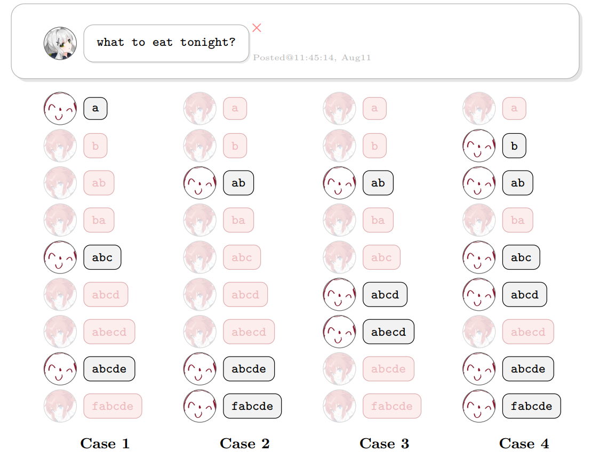
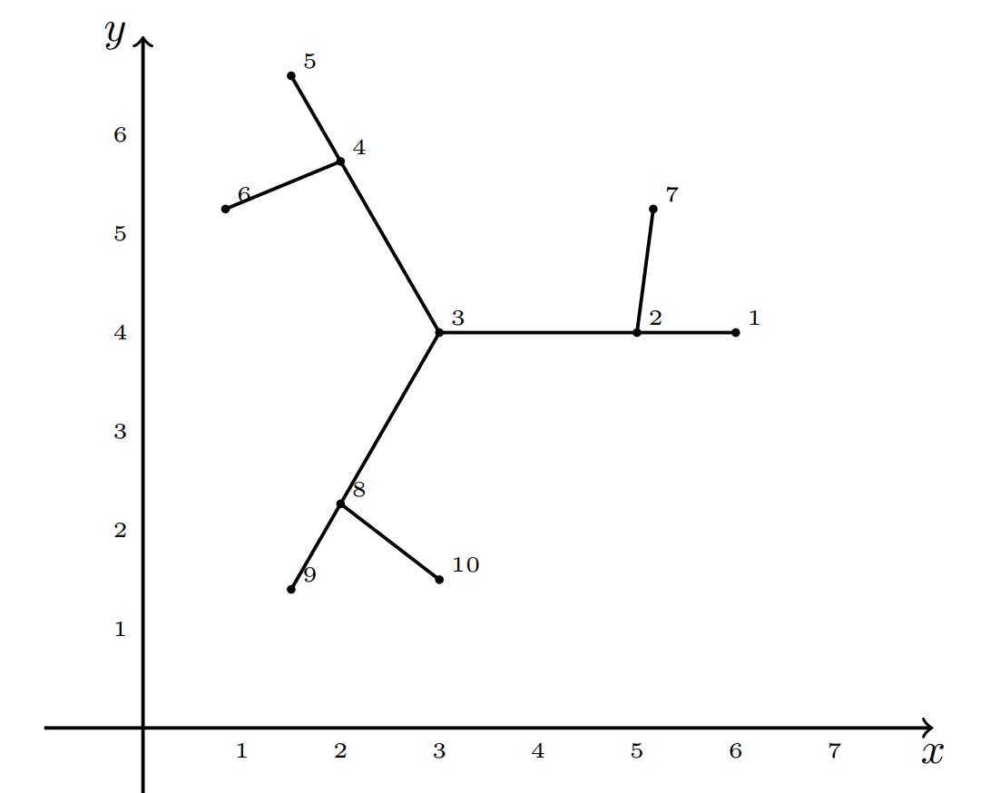
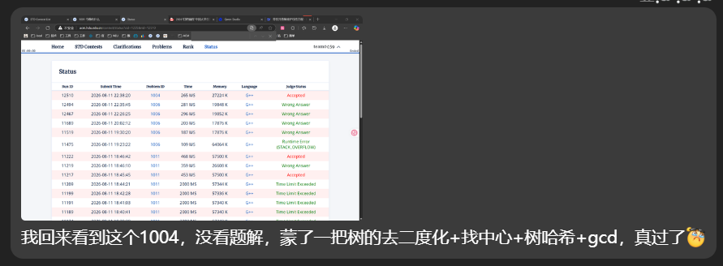

## 1001 今晚吃什么【AC 自动机 Fail 树 + 虚树路径差分覆盖 + dfn 序加速树形 DP 】
### Problem Description

本场比赛完整题目集参见：PDF 题面

“今晚吃什么？”真是一个难以解决的问题。

Hare 在竞赛网站上发布了有关“今晚吃什么”的帖子。不一会儿，帖子下方按照时间顺序就有了 $n$ 则评论，记作 $s_1, s_2, \cdots, s_n$。每则评论都是一个字符串，保证评论的长度随发布时间单调不降，也保证任意两则评论不完全相同。

不过，Hare 发现有一些是 Maki 骇入了网站，伪装成参赛选手发布的评论。Hare 已知，假如去除了 Maki 伪装发布的评论，剩下的参赛选手发布的评论满足：

每一则评论一定是在上一则评论的基础上，添加一段可能为空的字符串作为前缀，以及一段可能为空的字符串作为后缀所得到的。也就是说，上一则评论一定是本则评论的子串。

Hare 想知道，基于已知信息，对于 $k = 0, 1, 2, \cdots, n - 1$，若恰有 $k$ 则评论是伪装的，那么有多少种可能的伪装情况？答案对 $998244353$ 取模。两种情况不同当且仅当存在一则评论，在其中一种情况下是 Maki 发布的，而在另外一种情况下是参赛选手发布的。

### Input

本题包含多组测试数据。

首先在第一行输入一个整数 $T$（$1 \le T \le 300$）表示测试数据组数。

接下来对于每一组测试数据：

第一行包含一个整数 $n$（$1 \le n \le \sum n \le 10^5$）表示评论数量。

接下来 $n$ 行，第 $i + 1$（$1 \le i \le n$）行包含一个字符串 $s_i$（$1 \le |s_i|$），表示第 $i$ 则评论。保证输入的字符串长度单调不降，保证输入的任意两个字符串不完全相同，保证单组测试数据内输入的字符串长度之和不超过 $2 \times 10^5$。

保证所有测试数据输入的字符串均只包含小写拉丁字母，长度之和不超过 $6 \times 10^5$。

### Output

对于每一组测试数据，输出包含一行 $n$ 个整数表示 Maki 在 $k = 0, 1, 2, \cdots, n - 1$ 的条件下，可能的伪装情况数对 $998244353$ 取模的值。

### Sample Input

```txt
2
9
a
b
ab
ba
abc
abcd
abecd
abcde
fabcde
11
umm
ummspring
ummnahida
ummturkey
ummpastdays
ummamberconjecture
ummnpcnpcnpcnpcnpc
ummstrawberrystrawberry
ummkurokokurokokurokokuroko
ummcomputercomputercomputer
ummtoptreetoptreetoptreetoptree
```

### Sample Output

```txt
0 0 0 2 11 25 32 25 9
0 0 0 0 0 0 0 0 0 10 11
```

### Hint



对于第一组测试数据，在 $k = 6$ 的条件下，如上图：

情况 1 认为，评论 a、abc、abcde 是参赛选手发布的。该情况合理，因为它满足已知信息给出的条件。
情况 2 通过验证也合理。它与情况 1 不完全一致，因此 $k = 6$ 时的答案需要同时统计到它们。
情况 3 认为，评论 ab、abcd、abecd 是参赛选手发布的。该情况不合理，因为 abcd 不是 abecd 的子串。
情况 4 通过验证也不合理，因为 Maki 伪装的评论数量应当为 $6$，而不是情况 4 中的 $3$。

### Solution

- 首先，为什么是 AC 自动机？
	- 因为题目关注的是串之间的关系，而不是串内部的关系
- 设 $dp_{i,j}$ 表示以字符串 $i$ 结尾长度为 $j$ 的串序列个数
	- $dp_{i,j} = \sum_{l<i 且 s_l 是 s_i 的子串} dp_{l,j-1}$ 
- 问题来了，如何快速处理子串呢？
	- AC 自动机上面，建立之后，走过一个大串之后
	- 到达的节点，在 Fail 树上，到根的路径，均是 pop 掉若干前缀，所命中的子串
	- 但是，并不是说， AC 自动机完整读取一个串就行了，这只是匹配了最后一个前缀的各种后缀匹配
		- 事实上，需要在读取字符之后，立即匹配，
		- 即，匹配完所有前缀的各种后缀，取并集，才算完全
	- 如何求并集呢？
	- 可以在线遍历的时候，动态补充未覆盖的链
		- 显然，在跳转节点的前后
		- 我们发现，求前后节点的 LCA 可知，新增的链必然等于 $后节点的前缀-LCA前缀$
	- 题目有一个值得注意的条件：
		- 长度单调不降，且不完全相同
	- 这隐含着：
		- 前面的字符串，一定不包含后面的字符串
	- 同时提醒求并集的时候
		- 匹配完成最后一个字符之后，不要让自己转移给自己，也就是说，最后一次的前缀要去除自己
- 第一次先布置好 1 与前缀和
- 然后预处理好 $LCA(i, ch[i][j])$ 
- 由此，重复 $O(\sqrt{L})$ 次
	- 然后每一次进行前，预处理前缀和
	- 然后开始遍历每一个串
	- 第 $i$ 次遍历，得到长度为 $i+1$ 的序列计数
- 【坑点】
	- **虚树路径覆盖**，没想到可以这么求
	- dfn 序加速 DP
		- 又一个 卡常 Trick！这里我循环 $\sqrt{n}$ 次 prepare，重复遍历树求前缀和，一个 2000ms+ TLE，一个 800ms AC
		- 其实很久以前我也犯过这个错误，一个进行 n 多轮 树形 DP 父子递推，如果不用 dfn 序 DP 的话，进行 t 次 vector 图 dfs DP，时间常数大很多直接 TLE，记得是那是一道需要多次计算 树形DP 进行 根号级别值域分块二分 的题目！

### Code

```cpp
#include<bits/stdc++.h>
using namespace std;
using ll = long long;

const int N = 2e5 + 5;
const int mod = 998244353;

inline int add(int a,int b) {a+=b;if(a>=mod)a-=mod;return a;}
inline int sub(int a,int b) {a-=b;if(a<0)a+=mod;return a;}

int n;
string s[N];
int id[N];
vector<int> pos[N], neg[N];
int tmp[N];
int ans[N];

struct ACAM {
    int tot;
    int ch[N][26], fa[N];
    int dep[N], st[N][__lg(N)+1], val[N], P;
    int dfn[N], dfncnt, rnk[N];
    vector<int> e[N];
    void init() {
        memset(ch,0,sizeof(ch[0])*(tot+1));
        memset(fa,0,sizeof(fa[0])*(tot+1));
        memset(val,0,sizeof(val[0])*(tot+1));
        for(int i = 0; i <= tot; i++) e[i].clear();
        tot = 0;
        dfncnt = 0;
    }
    int insert(const string& s,vector<int>& vec) {
        int cur = 0;
        for(auto c:s) {
            c-='a';
            if(!ch[cur][c]) ch[cur][c] = ++tot;
            cur = ch[cur][c];
            vec.push_back(cur);
        }
        val[cur]++;
        return cur;
    }
    void build() {
        queue<int> Q;
        for(int j = 0;j < 26;j++) {
            if(ch[0][j]) Q.push(ch[0][j]);
        }
        while(Q.size()) {
            int u = Q.front(); Q.pop();
            for(int j = 0; j < 26; j++) {
                if(ch[u][j]) {
                    fa[ch[u][j]] = ch[fa[u]][j];
                    Q.push(ch[u][j]);
                } else {
                    ch[u][j] = ch[fa[u]][j];
                }   
            }
        }
        for(int i = 1; i <= tot; i++) {
            e[fa[i]].push_back(i);
        }
        P = __lg(tot);
        dfs(0);
        prepare();
    }
    void dfs(int u) {
        dep[u] = dep[fa[u]] + 1;
        st[u][0] = fa[u];
        dfn[u] = ++dfncnt;
        rnk[dfncnt] = u;
        for(int p = 1; p <= P; p++) {
            st[u][p] = st[st[u][p-1]][p-1];
        }
        for(auto v:e[u]) dfs(v);
    }
    int lca(int a, int b) {
        if(dep[a] < dep[b]) swap(a, b);
        for(int p = P; p >= 0; p--) 
            if(dep[st[a][p]] >= dep[b]) a = st[a][p];
        if (a == b) return a;
        for(int p = P; p >= 0; p--)
            if(st[a][p] != st[b][p]) a = st[a][p], b = st[b][p];
        return st[a][0];
    }
    // 【坑点】 dfn 序加速 树形 DP ，尤其是反复调用的那种
    void prepare() {
        for(int i = 1;i<=dfncnt;i++) {
            int u = rnk[i];
            val[u] = add(val[u], val[fa[u]]);
        }
    }
}AC;

void solve() {
    cin >> n;
    AC.init();
    ll tot = 0;
    for (int i =1 ; i <= n; i++) {
        cin >> s[i];
        tot += s[i].size();
        pos[i].clear();
        neg[i].clear();
        id[i] = AC.insert(s[i], pos[i]);
    }
    AC.build();
    for (int i = 1; i <= n; i++) {
        sort(pos[i].begin(), pos[i].end(), [](int a,int b) {return AC.dfn[a] < AC.dfn[b];});
        for (int j = 0; j + 1 < pos[i].size(); j++) 
            neg[i].push_back(AC.lca(pos[i][j], pos[i][j+1]));
    }
    fill(ans,ans+1+n,0);
    fill(tmp,tmp+1+n,1);
    ans[n-1] = n;
    int sn = sqrt(2*tot) + 5;
    sn = min(sn, n);
    for (int _ = 2; _ <= sn; _++) {
        for(int i = 0; i <= AC.tot; i++) 
            AC.val[i] = 0;
        for (int i = 1; i <= n; i++) 
            AC.val[id[i]] = tmp[i];
        AC.prepare();
        for (int j = 1; j <= n; j++) {
            tmp[j] = sub(0, tmp[j]);
            for(auto u:pos[j]) tmp[j] = add(tmp[j], AC.val[u]);
            for(auto u:neg[j]) tmp[j] = sub(tmp[j], AC.val[u]);
            ans[n-_] = add(ans[n-_], tmp[j]);
        }
    }
    for (int i = 0; i <= n-1; i++) cout << ans[i] << " ";
    cout << "\n";
}

int main() {
    ios::sync_with_stdio(0); cin.tie(0); cout.tie(0);
    int T =  1;
    cin >> T;
    while (T--) solve();
}
```

## 1004 今晚吃转转【树的去二度化+找中心+树哈希+gcd】

### Problem Description

即便是最细小的枝桠也能孕育无限可能。

地脉正在颤动，世界树岌岌可危。原本的世界树可以被看作一棵包含 $n$ 个点与 $n-1$ 条边的无根树 $Y$ 被绘制在平面上。$Y$ 中的第 $i$（$1 \le i \le n$）个点在坐标 $(x_i, y_i)$（$x_i, y_i \in \mathbb{R}$）处，点的坐标两两不同。$Y$ 的每条边都是连接两个端点的线段，连接后平面上的图形就被称为 $Y$ 的图像。注意，图像不能进行平移，缩放，旋转，轴对称等任何操作。

由于地脉紊乱，世界树被迫旋转。现在，平面中出现了一个紊乱点 $(p, q)$（$p, q \in \mathbb{R}$），使得世界树 $Y$ 的图像以 $(p, q)$ 为中心顺时针旋转了 $\frac{2\pi}{k}$ 弧度，其中 $k$ 是一个正整数。注意紊乱点坐标是任意的，可以与世界树某一个点重合，也可以落在世界树某一条边上。

作为新生的小吉祥草王，纳西妲只知道世界树 $Y$ 的形态而不知道它的图像。纳西妲想要知道，对于哪些正整数 $k$，存在一个为 $Y$ 中每个点赋予两两不同的坐标以及选取紊乱点坐标的方式，使得：

1. $Y$ 的图像中，任意两条边对应的线段除公共端点外不相交（包括某一条边的端点落在另一条边上的情况）。
2. $Y$ 的图像旋转后与其旋转前完全重合。

注意，判断重合时不能进行平移，缩放，旋转，轴对称等任何操作。

### Input

本题包含多组测试数据。

首先在第一行输入一个整数 $T$（$1 \le T \le 10^3$）表示测试数据组数。

接下来对于每一组测试数据：

第一行包含一个整数 $n$（$2 \le n \le 2 \times 10^5$，$\sum n \le 10^6$），表示世界树的大小。

接下来 $n-1$ 行，第 $i+1$（$1 \le i < n$）行包含两个整数 $u_i, v_i$（$1 \le u_i, v_i \le n$），表示第 $i$ 条边连接的两个端点。

### Output

对于每一组测试数据：

第一行包含一个整数 $c$，表示满足条件的正整数 $k$ 的个数。

第二行包含 $c$ 个整数 $k_1, k_2, k_3, \cdots, k_c$（$1 \le k_1 < k_2 < k_3 < \cdots < k_c$），表示每个满足条件的正整数 $k$。

### Sample Input

```txt
2
10
1 2
2 3
3 4
4 5
2 7
4 6
3 8
8 9
8 10
8
1 2
1 3
1 4
1 5
1 6
1 7
2 8
```

### Sample Output

```txt
2
1 3
4
1 2 3 6
```

### Hint



### Solution



### Code

```cpp
#include<bits/stdc++.h>
using namespace std;
using ull = unsigned long long;

const int N = 2e5 + 5;
const ull mask = mt19937_64(time(0))();

int n;
vector<int> e1[N], e2[N];

int s, t, o;
int dist[N];
int pre[N];

ull h[N];

void dfs1(int u, int f, int up) {
    if (e1[u].size() != 2 && f) {
        e2[u].push_back(up);
        e2[up].push_back(u);
        // cout << "add" << u << " " << up << "\n";
        up = u;
    }
    for (auto v:e1[u]) if (v!=f) {
        dfs1(v, u, up);
    }
}

void dfs2(int u,int f) {
    pre[u] = f;
    for(auto v:e2[u]) if(v!=f) {
        dist[v] = dist[u] + 1;
        dfs2(v, u);
    }
}

ull shift(ull x) {
    x^=mask;
    x^=x<<13;
    x^=x>>7;
    x^=x<<17;
    x^=mask;
    return x;
}

ull get_hash(int u,int f) {
    h[u] = 1;
    for (auto v:e2[u]) if(v!=f) {
        get_hash(v, u);
        h[u] += shift(h[v]);
    }
    return h[u];
}

void solve() {
    cin >> n;
    for (int i = 1; i < n;i++) {
        int u, v;
        cin >> u >> v;
        e1[u].push_back(v);
        e1[v].push_back(u);
    }
    for (int i = 1; i <= n;i++) {
        if(e1[i].size() == 1) {
            dfs1(i, 0, i);
            break;
        }
    }
    for(int i = 1; i <= n; i++) {
        if(e1[i].size()!=2) {
            dfs2(i, 0);
            break;
        }
    }
    int mx=-1,mxi = 0;
    for (int i = 1; i <= n; i++) {
        if(e1[i].size() == 2) continue;
        if(mx < dist[i]) {
            mx = dist[i];
            mxi = i;
        }
    }
    // cout << "mxi:" << mxi << "\n";
    dist[mxi] = 0;
    dfs2(mxi, 0);
    int mx2=-1,mxj=0;
    for (int i = 1; i <= n; i++) {
        if(e1[i].size() == 2) continue;
        if(mx2 < dist[i]) {
            mx2 = dist[i];
            mxj = i;
        }
    }
    // cout << "mxj:" << mxj << "\n";
    int p = 1;
    int t = mx2 / 2;
    int cur = mxj;
    while(t--) cur = pre[cur];
    int u = cur, v = pre[cur];
    // cout << "root:" << u << "\n";
    if(mx2&1) {
        // 奇数个边
        ull h1 = get_hash(u, v);
        ull h2 = get_hash(v, u);
        if(h1==h2) {
            p = 2;
        } else {
            p = 1;
        }
    } else {
        // 偶数个边
        // u 是中心
        map<ull,int> cnt;
        for(auto v:e2[u]) {
            cnt[get_hash(v, u)]++;
        }
        int g = 0;
        for(auto [_,c]:cnt) g = gcd(g, c);
        p = g;
    }

    vector<int> ans;
    for (int i = 1; i <= p; i++) {
        if (p % i == 0) {
            ans.push_back(i);
        }
    }
    
    cout << ans.size() << "\n";
    for(auto v:ans) {
        cout << v << " ";
    }cout << "\n";

    for (int i = 1; i <= n;i++) {
        e1[i].clear();
        e2[i].clear();
    }
}

int main() {
    ios::sync_with_stdio(0);
    cin.tie(0); cout.tie(0);
    int T = 1;
    cin >> T;
    while (T--) solve(); 
}
```

## 1011 今晚吃电脑配件【带权并查集】

### Problem Description

白井黑子有 $n$ 个电脑配件，质量分别为 $x_1, x_2, \ldots, x_n$。

现在有一个秤，每次可以测出两个电脑配件的质量之和。也就是说，每次测量结果是一个方程：

$$x_i + x_j = 2c$$

由于食用了电脑配件，白井黑子的测量结果不一定准确。所以对于每次测量结果，你需要判断它此时是否有可能是正确的。

也就是说，如果存在一组实数 $x_1, x_2, \ldots, x_n$ 同时满足当前测量结果和之前被认为正确的全部测量结果，则认为该结果正确。被认为错误的测量结果不会对之后的询问产生任何影响。注意，因为电脑配件可能由奇异物质组成，所以 $x_i$ 可能是负的。

询问采用如下方式加密：在每组数据开始时，令 $k = 0$，其中 $k$ 表示当前已经被保留的询问数。对于输入的一组整数 $a, b, d$，实际询问中的 $i, j, c$ 为

$$i = (a + k - 1) \bmod n + 1$$

$$j = (b + k - 1) \bmod n + 1$$

$$c = (d + k) \bmod 10^9 + 1$$

如果此次询问的测量结果正确，则令 $k$ 增加 $1$；否则 $k$ 不变。这里，$u \bmod v$ 表示 $u$ 除以 $v$ 所得的非负余数。

### Input

本题包含多组测试数据。

首先在第一行输入一个整数 $T$（$1 \leq T \leq 10^6$）表示测试数据组数。

接下来对于每一组测试数据：

第一行包含两个整数 $n$ 和 $m$（$1 \leq n, m \leq 10^6$），分别表示变量个数和询问次数。

接下来的 $m$ 行中的第 $q$（$1 \leq q \leq m$）行包含三个整数 $a_q, b_q, d_q$（$1 \leq a_q, b_q \leq n$，$0 \leq d_q < 10^9$），表示一条经过加密的询问。解码方式见题目描述。

数据保证所有测试数据的 $n$ 之和与 $m$ 之和均不超过 $10^6$。

### Output

对于每次询问输出一行。如果该询问被保留，输出 `Yes`；否则输出 `No`。

### Sample Input

```txt
1
3 5
1 2 2
1 2 3
2 1 999999999
1 1 999999997
1 3 999999998
```

### Sample Output

```txt
Yes
Yes
Yes
No
Yes
```

### Hint

样例中，解码后的前两次询问分别为 $x_1 + x_2 = 6$ 和 $x_2 + x_3 = 10$，此时存在同时满足它们的一组实数，故它们均被保留。

第三次询问解码为 $x_1 + x_3 = 4$，保留后可以推出 $x_1 = 0, x_2 = 6, x_3 = 4$。第四次询问解码为 $x_1 + x_1 = 2$，由于它与已有测量结果矛盾，因此被跳过，$k$ 保持为 $3$。最后一次询问再次解码为 $x_1 + x_3 = 4$，符合已有结果，因此被保留。

### Solution

**并查集！** **带权并查集！！！**

- 【误解】
	- 之前一直以为带权并查集只能维护差值
- 虽然补题的时候，写的代码是基于树结构，奇偶深度维护树形并查集的元素奇偶属性的
- 【题解】
	- 给了一个更 nb 的做法，带权并查集的正确用法：
	- 维护并查集中关于根节点的 **一元一次线性方程**
- 【疑问】
	- 是否可以进一步拓展为：
	- 带权并查集可以维护 n 元变量与 n 阶矩阵乘法合并操作

> **理论上：完全可以。** 带权并查集本质上是维护一个 **仿射变换群（Affine Group）** 的作用。  
> 
> **工程上：通常不可行。** 除非 n（变量维度）是极小的常数（如 2 或 3），否则时间复杂度爆炸，且矩阵求逆的稳定性极差。

### Code

> Version1：根据赛时代码改造 **树结构+普通并查集+启发式合并**

```cpp
#include <bits/stdc++.h>
using namespace std;

using ll = long long;

const int N = 1e6+5;

int n, m, q;

ll a, b, d;
ll i, j, c;

struct DSU {
  int f[N], sz[N], dep[N];
  vector<pair<int,ll>> e[N];
  bool vis[N];
  ll val[N];
  void init(int n) {
    iota(f, f+1+n, 0);
    fill(sz, sz+1+n, 1);
    fill(dep, dep+1+n, 0);
    fill(vis,vis+1+n, false);
    fill(val,val+1+n, 0);
    for(int i = 0;i<n;i++) {
      e[i].clear();
    }
  }

  int fd(int x) {
    if (f[x] == x)return x;
    return f[x] = fd(f[x]);
  }

  bool same(int x, int y) { return fd(x) == fd(y); }
  
  // 拼接新子树
  void dfs(int u,int fa,ll c) {
    dep[u] = dep[fa] + 1;
    val[u] = c;
    for(auto [v, w]:e[u]) if(v!=fa){
      dfs(v, u, w-c);
    }
  }

  // 从设置固定值
  void set_val(int u,int fa, ll c) {
    if(vis[u]) return;
    vis[u] = true;
    val[u] = c;
    for(auto [v, w]:e[u]) if(v!=fa) {
      set_val(v, u, w - c);
    }
  }

  // 尝试增加限制 x, y
  bool calc(int x,int y, ll c) {
    if (x == y) {
      // 同一个 
      c /= 2;
      if(vis[x]) {
        return val[x] == c;
      } else {
        set_val(x, -1, c);
        return true;
      }
    } if(vis[x] && vis[y]) {
      // 都有 
      return val[x] + val[y] == c;
    } else if(vis[x] || vis[y]) {
      // 有一个，求另一个
      if (!vis[x]) swap(x, y);
      set_val(y, -1, c - val[x]);
      return true;
    } else if(same(x, y)) {
      // 同一个子树 
      if ((dep[x]-dep[y])&1) {
        // 不同 奇偶性
        // 一个 val[x] = x + root
        // 一个 val[y] = y - root
        // 得到 x+y = c 验证
        return val[x] + val[y] == c;
      } else {
        // 相同 奇偶性
        // 一个 val[x] = x +- root
        // 一个 val[y] = y +- root
        // 相减即可得到 
        // x-y = d
        // 又有 
        // x+y = c
        // 则
        // 得到确定的两个值，只需要 set_val 一个
        ll d = val[x] - val[y];
        ll vx = (d+c)/2;
        set_val(x, -1, vx);
        return true;
      }
    } else {
      // 启发式，设置 dep 奇偶性
      
      int fx = fd(x), fy = fd(y);
      if(sz[fx] < sz[fy]) swap(x, y), swap(fx, fy);
      sz[fx] += sz[fy];
      f[fy] = fx;
      
      // 拼接子树
      e[x].push_back({y,c});
      e[y].push_back({x,c});
      dfs(y, x, c - val[x]);
      return true;
    }
  }
} D;

void solve() {
  ll k = 0;
  cin >> n >> m;
  D.init(n + 1);
  for (int tt = 1; tt <= m; tt++) {
    bool ok = true;
    cin >> a >> b >> d;
    i = (a + k - 1) % n + 1;
    j = (b + k - 1) % n + 1;
    c = (d + k) % 1'000'000'000 + 1;
    c *= 2;
    assert(i >= 1 && i <= n && j >= 1 && j <= n);
    ok = D.calc(i, j, c);
    if (ok) {
      cout << "Yes\n";
      k++;
    } else {
      cout << "No\n";
    }
  }
}

int main() {
  ios::sync_with_stdio(0); cin.tie(0); cout.tie(0);
  int T = 1;
  cin >> T;
  while (T--)
    solve();
}
```

> Version2：题解的 正宗 **带权并查集**

- 结构体 `node {ll k, b;}` 表示 $x_u = k * x_{father} + b$，这里的 `father` 是并查集父节点（注意不是根）。
- 查找函数 `ff(x)` 会路径压缩，同时更新 `A[x]` 为 $x$ 到当前根的变换（即最终 $x_x = k * x_{root} + b$）。
- 合并函数 `mg(x,y,c)` 将两个不同根的块合并：  
  - 先分别 `ff(x)` 和 `ff(y)`，得到根 `fx, fy`。
  - 根据当前根是否已知，决定哪个根作为新根（尽量将未知的根挂到已知根下，或随意）。
  - 利用方程解出 `fy` 相对于 `fx` 的变换，更新 `A[fy]`，并令 `fa[fy] = fx`。
- `ask(i)` 返回 $x_i$ 的当前表达式（相对于根）。
- 当根的值被确定时，用 `known[root] = true` 记录，并存储 `ans[root] = x_root`。

**关键点**：
- 因为系数可能为分数，但本题中由于所有方程都是 $x_i + x_j = 2c$，系数始终为 ±1，所以分母不会为零（除非 $k_i + k_j = 0$，此时我们单独处理）。
- 当合并时，如果 `known[fy]` 为真，交换 `fx, fy` 等，确保新根是未知的那个，避免覆盖已知值。


```cpp
#include <bits/stdc++.h>
#define rep(i, a, b) for (int i = (a), i##ABRACADABRA = (b); i <= i##ABRACADABRA; i++)
using namespace std;
using ll = long long;

struct node{
  ll k,b;
  friend node operator+(node u,node v){
    return {u.k*v.k,u.k*v.b+u.b};
  }
}A[1000010];
ll ans[1000010];
int fa[1000010];
bool known[1000010];
int n,m;

int ff(int x){
  if (fa[x]==x)return x;
  int f=ff(fa[x]);
  A[x]=A[x]+A[fa[x]];
  return fa[x]=f;
}
void mg(int x,int y,ll c){
  int fx=ff(x),fy=ff(y);
  c-=A[x].b,c-=A[y].b;
  if (known[fy])swap(fx,fy),swap(x,y);
  fa[fy]=fx;
  A[fy]={-A[x].k/A[y].k,c/A[y].k};
}
ll ask(int i){
  return A[i].k*ans[ff(i)]+A[i].b;
}

void solve(){
  cin>>n>>m;
  rep(i,0,n+1)fa[i]=i,known[i]=0,A[i]={1,0},ans[i]=0;
  int lst=0;
  while (m--){
    int i,j;
    ll c;
    cin>>i>>j>>c;
    i=(i+lst-1)%n+1;
    j=(j+lst-1)%n+1;
    c=(c+lst)%1000000000+1;
    c<<=1,ff(i),ff(j);
    if (known[ff(i)]&&known[ff(j)]){
      if (ask(i)+ask(j)==c)cout<<"Yes\n",++lst;
      else cout<<"No\n";
    }else if (ff(i)==ff(j)){
      if (A[i].k!=A[j].k){
        if (A[i].b+A[j].b==c){
          cout<<"Yes\n",++lst;
        }else cout<<"No\n";
      }else{
        known[ff(i)]=1;
        ans[ff(i)]=(c-A[i].b-A[j].b)/(A[i].k+A[j].k);
        cout<<"Yes\n",++lst;
      }
    }else{
      mg(i,j,c);
      cout<<"Yes\n",++lst;
    }
  }
}

int main() {
  ios_base::sync_with_stdio(0);
  cin.tie(0);
  int tt;
  cin>>tt;
  while (tt--)solve();
  return 0;
}
```

