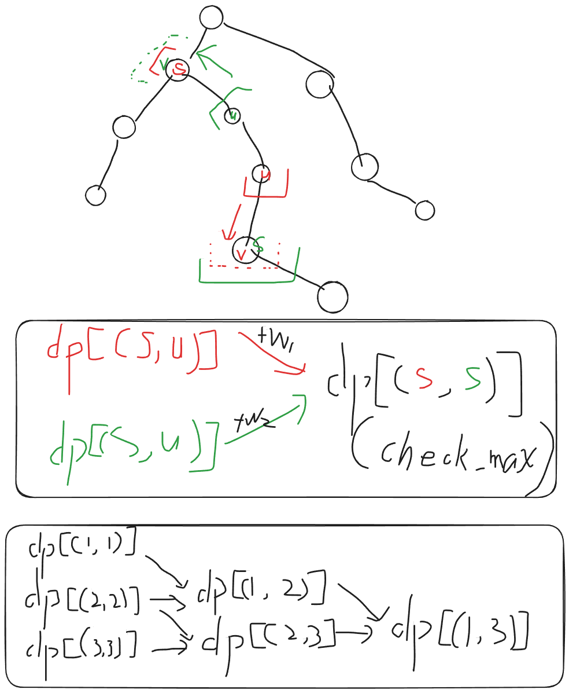

## 1008 分数越小还是越大越好【树上区间 DP / DP 建图】

### Problem Description

给定一棵包含 $N$ 个顶点的树，顶点编号为 $1,2,\ldots,N$。

你需要选择一个 $0$ 到 $N-1$ 的排列 $P$，并将 $P_i$ 作为顶点 $i$ 的标签。

对于一个整数集合 $S$，定义 $\operatorname{MEX}(S)$ 为没有出现在 $S$ 中的最小非负整数。

对于两个顶点 $u,v$，设它们之间简单路径上的顶点集合为 $V(u,v)$，定义

$$
f(u,v)=\operatorname{MEX}(\{P_x\mid x\in V(u,v)\}).
$$

树的分数定义为

$$
\operatorname{score}(P)=\sum_{u=1}^{N}\sum_{v=u}^{N}f(u,v).
$$

求所有标签排列中，树的最小可能分数和最大可能分数。

### Input

第一行输入一个整数 $T$，表示测试数据组数。

每组测试数据的格式如下：

第一行输入一个整数 $N$，表示树的顶点数。

接下来 $N-1$ 行，每行输入两个整数 $u,v$，表示树中存在一条连接顶点 $u$ 和顶点 $v$ 的无向边。

### Output

对于每组测试数据输出一行两个整数，分别表示树的最小可能分数和最大可能分数。

### Sample Input

```txt
3
3
1 2
2 3
4
1 2
1 3
1 4
5
1 2
1 3
1 4
1 5
```

### Sample Output

```txt
5 7
5 11
6 16
```

### Hint

对于一组测试数据：

- $3\le N\le 2000$；
- $1\le u,v\le N$；
- 输入保证给出的边构成一棵树。

OJ 中只有一个正式测试点，该测试点满足：

- $T=1000$；
- $\sum N^2=2\times 10^7$。

### Solution

> 赛事没有根据 n 的 1e3 数量级思考转移过程，过于贪心

**维护的其实是一条链向两侧延伸的 树上 区间 DP**


- 自认为比较正向思维的算法
	- 从 DP 的本质出发，尝试创建一个 DP 转移 DAG 图，并在转移边上面预设转移参数
	- 为了方便做转移，我们考虑将所有的状态编号 `id(u, v)` 收集起来，用我们熟悉的 `dfs` 快速创建同一端点的 区间 **转移边** 



- 其实我的实现麻烦了
	- 由于 $n$ 是 1e3 的数量级
	- 所以我们可以随意的以任意一个节点为根遍历一遍，为所欲为
	- 所以不妨以每一个节点为根，都搞一次信息：`sz[root][u], fa[root][u]`，这样更方便思考
	- 不难发现，一旦这样以后，就可以快速直到 `dp[u][v]` 的前驱状态是什么了，因为发散难，而溯源容易，直接以一个 `u` 为根节点，然后 `v` 跳 `fa[u][v]` 即可

### Code

```cpp
#include<bits/stdc++.h>
using namespace std;

using ll = long long;

const int N = 2005;

int n;

// 树
vector<int> e[N];
int sz[N];

// DP 图
vector<pair<int,ll>> E[N*N];
int deg[N*N];
ll dp[N*N];

inline int id(int i,int j) {
    if(i > j) swap(i, j);
    return (i-1)*n + j;
}

void get_size(int u,int f) {
    sz[u] = 1;
    for(auto v:e[u]) if (v!=f) {
        get_size(v, u);
        sz[u] += sz[v];
    }    
}

void dfs(int u,int f,int s, ll k1) {
    E[id(s, f)].push_back({id(s, u), k1 * sz[u]});
    deg[id(s, u)]++;
    for(auto v: e[u]) if (v!=f) dfs(v, u, s, k1);
}

void solve() {
    ll mn = 2e18;
    ll mx = 0;
    
    cin >> n;
    for (int i = 1; i < n;i ++) {
        int u, v;
        cin >> u >> v;
        e[u].push_back(v);
        e[v].push_back(u);
    }
    
    // min
    bool ok = true;
    for (int i = 1; i <= n; i++) ok &= e[i].size() <= 2;
    mn = ok ? (2*n-1) : (n + 1);
    
    // max 
    // 建立 DP 拓扑图
    fill(dp, dp+1+n*n, 0);
    // 从每一个节点开始，形成一个 区间 DP 转移链
    // 我愿称之为 增量 DP ???
    for(int u = 1; u <= n; u++) {
        get_size(u, 0);

        // 初始仅存储 0 的贡献
        // 容斥 = 所有的去重匹配方案数量 - 子树内部匹配数量 = 经过 u 的数量 
        ll sum = n + n * (n - 1) / 2;
        for (auto v:e[u]) sum -= sz[v] + sz[v] * (sz[v] - 1) / 2 ;
        dp[id(u, u)] = sum;
        
        // 确定转移边的权值
        for(auto v:e[u]) dfs(v, u, u, n - sz[v]);
    }

    // 严格按照拓扑序区间 DP
    queue<int> Q;
    for(int i = 1; i <= n * n; i++) if (!deg[i]) Q.push(i);
    while(Q.size()) {
        int u = Q.front(); Q.pop();
        mx = max(mx, dp[u]);
        // cout << u << " " << dp[u] << "\n";
        for (auto [v, w]:E[u]) {
            dp[v] = max(dp[v], dp[u] + w);
            if(!--deg[v]) Q.push(v);
        }
    }
    
    cout << mn << " " << mx << "\n";

    for (int i = 1; i <= n; i++) e[i].clear();
    for (int i = 1; i <= n * n; i++) E[i].clear(), deg[i] = 0;
}

int main() {
    ios::sync_with_stdio(0); cin.tie(0); cout.tie(0);
    int T = 1;
    cin >> T;
    while (T--) solve();
}
```