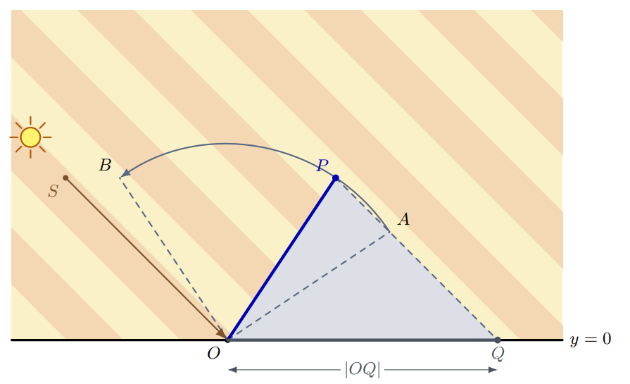

## A 夏日影 【卡精度 / “acos(1.0l), sqrt((ld)) 的必要性” / “C++模板参数影响返回值问题”】（归档）

### Problem Description

二维平面上，一根定长直杆的一端铰接在地面上，可以在两个边界方向之间转动，且杆身始终位于地面上方。太阳光是沿固定方向传播的平行光。求杆在所有允许方向下影长的最小值和最大值。

图中，$O$ 是原点，$\overrightarrow{SO}$ 表示太阳光的传播方向，杆可以从 $\overrightarrow{OA}$ 逆时针转动至 $\overrightarrow{OB}$。当前杆为 $OP$，此时影长为 $|OQ|$。



### Input

第一行包含一个整数 $T$（$1 \le T \le 10^5$），表示测试数据的组数。接下来是各组测试数据的描述。

每组测试数据包含六个整数 $s_x$、$s_y$、$a_x$、$a_y$、$b_x$ 和 $b_y$，分别确定 $S = (s_x, s_y)$、$A = (a_x, a_y)$ 和 $B = (b_x, b_y)$（$-10^5 \le s_x, a_x, b_x \le 10^5$；$1 \le s_y, a_y, b_y \le 10^5$）。

保证 $|OA| = |OB|$，且 $\overrightarrow{OB}$ 位于 $\overrightarrow{OA}$ 的逆时针方向或与其重合。

### Output

对于每组测试数据，输出两个实数，依次表示影长的最小值和最大值。

如果答案的绝对误差或相对误差不超过 $10^{-6}$，则认为答案正确。

### Sample Input

```txt
2
-3 3 3 2 -2 3
0 1 1 1 -1 1
```

### Sample Output

```txt
1.000000000000000 5.099019513592784
0.000000000000000 1.000000000000000
```

### Solution

- 见 Code

### Code

```cpp
#include<bits/stdc++.h>
using namespace std;
using ll = long long;
using ld = long double;

// 【坑点赏析1】 acos 如果你不加 l 默认用的是 double 精度低！
const ld pi = acos(-1.0l);
// const ld pi = acos(-1);
const ld eps = 1e-12;

int sign(ld x) {
    if(x > eps) return 1;
    if(x < -eps) return -1;
    return 0;
}

int eq(ld x, ld y) {
    return !sign(x-y);
}

int ge(ld x, ld y) {
    return x > y || eq(x,y);
}

pair<ld,ld> cal(ld r, ld theta, ld alpha0, ld alpha1) {
    ld L = theta+alpha0;
    ld R = theta+alpha1;
    ld st = abs(sin(theta));
    ld sl = abs(sin(L));
    ld sr = abs(sin(R));
    ld ans1 = min(sl, sr) / st * r;
    ld ans2 = max(sl, sr) / st * r;
    if(ge(R*2,pi) && ge(pi,L*2)) ans2 = max(ans2, r / st);
    if(ge(R*2,pi*3) && ge(pi*3,L*2)) ans2 = max(ans2, r / st);
    if(ge(pi, L)&& ge(R, pi)) ans1 = 0;
    return {ans1, ans2};
}

void solve() {
    ll sx, sy, ax, ay, bx,by;
    cin >> sx >> sy >> ax >> ay >> bx >> by;
    // 【坑点赏析2】 sqrt 如果你不加 (ld) 即使用的是 long long 
    //              返回值其实是 double 精度低！
    ld r = sqrt((ld)(ax*ax+ay*ay));
    ld theta = acos(((-sx) / sqrt(ld(sx*sx+sy*sy))));
    ld alpha0 = acos( (ax) / r);
    ld alpha1 = acos( (bx) / r);
    pair<ld,ld> p1 = cal(r, theta, alpha0, alpha1);
    cout << p1.first << " " << p1.second << "\n";
}

int main() {
    cout << fixed << setprecision(17);
    ios::sync_with_stdio(0); cin.tie(0); cout.tie(0);
    int T = 1;
    cin >> T;
    while (T--) solve();
}
```

## B 老虎机【结论题 / kth 期望公式】

### Problem Description

游戏厅里有 $n$ 台老虎机，编号为 $1, 2, \ldots, n$。游戏开始时，每台老虎机最初的奖金都是从区间 $[0, m]$ 中独立且均匀随机选取的一个实数。你的作弊手段可以让你在每次选择前看到所有老虎机当前的奖金。

你的策略是选择当前奖金最多的老虎机：奖金较多的老虎机排名更高，奖金相同时编号较大的老虎机排名更高。领取奖金后，被选中的老虎机会独立地从 $[0, m]$ 中均匀随机生成一笔新的奖金。你的作弊手段会立刻告诉你新的数额，其他老虎机的奖金则保持不变。

求恰好游玩 $k$ 次后，获得的奖金总额的期望。

### Input

第一行包含三个整数 $n$、$m$ 和 $k$（$1 \le n, k \le 300$，$1 \le m \le 10^9$）。

### Output

输出获得的 $k$ 笔奖金总额的期望。如果答案的绝对误差或相对误差不超过 $10^{-6}$，则认为答案正确。

### Sample Input 1

```txt
1 10 3
```

### Sample Output 1

```txt
15.0000000000
```

### Sample Input 2

```txt
2 6 2
```

### Sample Output 2

```txt
7.5000000000
```

### Hint

在第一组样例中，机器只有一台。每次游玩获得的奖金期望为 $5$，因此奖金总额的期望为 $15$。在第二组样例中，前两次游玩获得的奖金期望分别为 $4$ 和 $3.5$，因此奖金总额的期望为 $7.5$。

### Solution

- 记结论
	- 对于 $n$ 个随机变量 $x_i$ 取值范围均为实数区间 $[0, m]$，其中第 $k$ 小的数字期望是

$$
\text{E}_k = \frac{k}{n+1} \cdot m
$$
- 答案竟然是选最大的 k 个期望值，完了？
	- 不知道为什么
### Code

- 略
