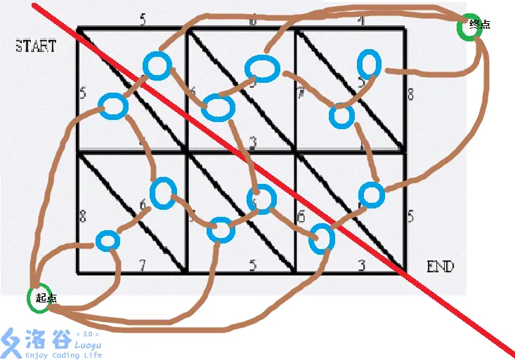

## 图论-结论

### Tarjan 与连通性

- **SCC 缩点**：有向图缩点后为 DAG。Tarjan 生成的 SCC 编号为逆拓扑序。
- **割点**：`low[v] >= dfn[u]`（根节点需子树数 $\ge 2$）。
- **桥**：`low[v] > dfn[u]`。
- **E-DCC**：删除所有桥后的连通块，缩点后为一棵树。
- **V-DCC**：删除割点后的连通块。圆方树：原图点为圆点，每个 V-DCC 新建方点，圆点连方点。

### 二分图与匹配

- **Kőnig 定理**：最大匹配 = 最小点覆盖。
- **最大独立集**：总点数 - 最小点覆盖。
- **DAG 最小路径覆盖**：拆点建二分图，原图点数 - 最大匹配。
- **霍尔定理**：二分图存在完美匹配 $\iff$ 对于左部任意子集 $S$，有 $|N(S)| \ge |S|$。
  - $N(S)$ 是点集 $S$ 的邻居集合

### 网络流建模

- 最大流最小割定理
  - 最大流 = 最小割。
- 最大权闭合子图
  - 源点连正权点（容量为权值），负权点连汇点（容量为权值绝对值），依赖边容量 INF。答案 = 正权点权值和 - 最小割。
- 有源汇上下界可行流
  - 无源汇连边容量 $r-l$，维护净流量 `in[u] += l, in[v] -= l`，虚拟源汇补满流。有源汇加 $T \to S$ 容量 INF 边转化为无源汇。


### 欧拉图

- **无向图欧拉回路**：所有点度数为偶数，且图连通。
- **有向图欧拉回路**：所有点入度 = 出度，且图连通。
- **Hierholzer 算法**：DFS 回溯时记录边，复杂度 $O(n+m)$。

### 矩阵树定理

#### 第一步：建基尔霍夫矩阵
- 定义度数矩阵 $D$：$D[i][i] = \text{点 } i \text{ 的度数}$。
- 定义邻接矩阵 $A$：$A[i][j] = \text{点 } i \text{ 和 } j \text{ 之间的边数（或边权）}$。
- 基尔霍夫矩阵 $L = D - A$。
- 对于 $i \ne j$：$L[i][j] = -A[i][j]$。
- 对于 $i = j$：$L[i][i] = \sum_{j \ne i} A[i][j]$（即度数或带权度数和）。

#### 第二步：删行删列
- 任选一个点 $r$（通常选点 $n$），删去 $L$ 的第 $r$ 行和第 $r$ 列。
- 得到一个 $(n-1) \times (n-1)$ 的矩阵 $L'$。

#### 第三步：求行列式
- 对 $L'$ 做高斯消元，求对角线乘积。
- 如果是模意义下，用乘法逆元消元。
- **答案** = 行列式的值。

#### 代码模板（模数为质数，最常用）

```cpp
#include <bits/stdc++.h>
using namespace std;
const int N = 305;
const int MOD = 1e9 + 7;

int n, m;
long long a[N][N]; // 基尔霍夫矩阵

// 高斯消元求行列式（模质数）
long long det(int n) {
    long long res = 1;
    for (int i = 0; i < n; i++) {
        // 找主元
        int p = -1;
        for (int j = i; j < n; j++) {
            if (a[j][i]) { p = j; break; }
        }
        if (p == -1) return 0; // 行列式为 0
        if (p != i) { swap(a[p], a[i]); res = -res; } // 交换行，行列式变号
        res = (res * a[i][i]) % MOD;
        long long inv = qpow(a[i][i], MOD - 2); // 逆元
        for (int j = i + 1; j < n; j++) {
            long long t = a[j][i] * inv % MOD;
            for (int k = i; k < n; k++) {
                a[j][k] = (a[j][k] - t * a[i][k]) % MOD;
                a[j][k] = (a[j][k] + MOD) % MOD;
            }
        }
    }
    return (res + MOD) % MOD;
}

int main() {
    cin >> n >> m;
    for (int i = 0; i < m; i++) {
        int u, v;
        cin >> u >> v;
        u--, v--;
        a[u][u]++; a[v][v]++;  // 度数 +1
        a[u][v]--; a[v][u]--;  // 邻接矩阵 -1
    }
    // 删去最后一行一列
    cout << det(n - 1) << "\n";
    return 0;
}
```

#### 无向图生成树计数

- 边权为 1。直接套模板。

#### 带权生成树（边权乘积之和）

- 题目要求：求 $\sum_{T} \prod_{e \in T} w_e$。
- **做法**：
  - $D[i][i] = \sum_{j} w_{i,j}$（所有连边的权值和）。
  - $A[i][j] = w_{i,j}$（边权）。
  - 其他不变，求行列式。

#### 有向图生成树（内向树 / 外向树）

- **内向树**（所有边指向根）：
  - 用**出度**矩阵（$D_{out}$）和邻接矩阵构造 $L$。
  - 删去根节点的行和列，求行列式。
- **外向树**（所有边从根指出）：
  - 用**入度**矩阵（$D_{in}$）和邻接矩阵构造 $L$。
  - 删去根节点的行和列，求行列式。
- **注意**：有向图的 $A[i][j]$ 表示 $i \to j$ 的边数，不要把方向搞反。


### BEST 定理

#### 前提条件（缺一不可）

- 每个点的 **入度 = 出度**。若不满足，欧拉回路数为 0。
- 图是**弱连通**的（忽略孤立点后连通）。若不连通，欧拉回路数为 0。
- 通常题目保证**无自环**。若有自环，需额外乘以 ∏ (自环数)!。

#### 公式

- 欧拉回路个数 = $t_w \times \prod_{v} (\deg(v)-1)!$
- 其中：
  - $t_w$：以任意点 $w$ 为根的**内向生成树**个数（所有边指向根）。
  - $\deg(v)$：点 $v$ 的出度（等于入度）。
  - $w$ 可以任选，结果相同。

#### 计算 $t_w$（用矩阵树定理）

- 建矩阵 $L$：
  - $L[i][i] = \text{点 } i \text{ 的出度}$
  - $L[i][j] = -\text{从 } i \text{ 到 } j \text{ 的边数}$（$i \ne j$）
- 删去 $w$ 的行和列，得到 $(n-1) \times (n-1)$ 矩阵。
- 求该矩阵的行列式，即为 $t_w$。

#### 计算阶乘
- 预处理阶乘，对每个点 $v$，计算 $(\deg(v)-1)!$ 并相乘。

#### 答案
- `ans = t_w * ∏ (deg(v)-1)! % MOD`。

---

### 代码模板（模数为质数）

```cpp
#include <bits/stdc++.h>
using namespace std;
const int N = 305;
const int MOD = 1e9 + 7;

int n, m;
int outdeg[N], indeg[N];
long long a[N][N]; // 基尔霍夫矩阵
long long fac[N];

long long qpow(long long a, long long b) {
    long long res = 1;
    while (b) { if (b & 1) res = res * a % MOD; a = a * a % MOD; b >>= 1; }
    return res;
}

// 高斯消元求行列式（模质数）
long long det(int n) {
    long long res = 1;
    for (int i = 0; i < n; i++) {
        int p = -1;
        for (int j = i; j < n; j++) if (a[j][i]) { p = j; break; }
        if (p == -1) return 0;
        if (p != i) { swap(a[p], a[i]); res = -res; }
        res = (res * a[i][i]) % MOD;
        long long inv = qpow(a[i][i], MOD - 2);
        for (int j = i + 1; j < n; j++) {
            long long t = a[j][i] * inv % MOD;
            for (int k = i; k < n; k++) {
                a[j][k] = (a[j][k] - t * a[i][k]) % MOD;
                a[j][k] = (a[j][k] + MOD) % MOD;
            }
        }
    }
    return (res + MOD) % MOD;
}

int main() {
    cin >> n >> m;
    for (int i = 0; i < m; i++) {
        int u, v;
        cin >> u >> v;
        u--, v--;
        outdeg[u]++; indeg[v]++;
        a[u][v]--; // 有向边 u -> v
    }
    // 判断入度 = 出度
    for (int i = 0; i < n; i++) {
        if (outdeg[i] != indeg[i]) { cout << 0 << "\n"; return 0; }
    }
    // 判断连通性（忽略孤立点）—— 用并查集或 DFS，此处略
    // 建矩阵 L
    for (int i = 0; i < n; i++) a[i][i] = outdeg[i];
    // 预处理阶乘
    fac[0] = 1;
    for (int i = 1; i <= m; i++) fac[i] = fac[i-1] * i % MOD;
    // 选根 w = 0，删去第 0 行第 0 列
    // 注意：需要把矩阵压缩到 n-1 维
    long long t_w = det(n - 1); // 实际要调整矩阵，略去细节
    long long ans = t_w;
    for (int i = 0; i < n; i++) {
        ans = ans * fac[outdeg[i] - 1] % MOD;
    }
    cout << ans << "\n";
    return 0;
}
```

> - 若有自环，每个自环可视为独立出边，需额外乘以 ∏ (自环数)!。
>
> - 定理中 $w$ 任选，结果相同。通常选点 0。
> 
> - 无解情况：
>   - 入度 ≠ 出度 → 0。
>   - 不连通 → 0。

---

### 全奇度生成子图

#### 核心结论

- **一张图存在一个生成子图，使得原图所有点的度数均为奇数，当且仅当该图的每一个连通块的大小均为偶数。**

#### 证明

- **必要性**：每个点的度数都是奇数。奇数个奇数相加（连通块大小为奇数）为奇数。但图的总度数为所有边贡献 2 之和，必定是偶数。矛盾。所以连通块大小必须为偶数。
- **充分性**：对于任意偶数大小的连通块，先任取一棵生成树。从叶子往上处理，若当前节点已处理的儿子数为偶数，则保留它与父亲的连边（使其度数为奇数）；若为奇数，则断开。递归到根，可保证所有点度数为奇数。

---

### 最大密度子图（01分数规划 + 最小割）

> 哦？没见过，还是网络流？

- **问题**：选一个子图，最大化 $\frac{|E|}{|V|}$。
- **二分答案** $g$：判断是否存在子图使得 $|E| - g|V| \ge 0$。
- **建图**：
  - 源点连边（容量 1），边连两端点（容量 INF），点连汇点（容量 $g$）。
  - 答案 = 边数 - 最小割。
- **经典**：P1730 最小密度路径、CF 上的最大密度子图题。

---

### 全局最小割（Stoer-Wagner）

> 陌生了

- **问题**：求无向图的全局最小割（不指定源汇）。
- **复杂度**：$O(n^3)$ 或 $O(nm \log n)$。
- **本质**：每次合并两个最近的点，更新答案，直到只剩一个点。
- **经典**：P5632 【模板】Stoer-Wagner。

---

### 支配树（Dominator Tree）

> 陌生了

- **定义**：在有向图中，$u$ 支配 $v$ 当且仅当所有从起点到 $v$ 的路径都经过 $u$。
- **结论**：支配关系形成一棵树（支配树），$u$ 支配 $v$ 当且仅当 $u$ 是 $v$ 在支配树上的祖先。
- **求法**：Lengauer-Tarjan 算法，$O(m \log n)$ 或 $O(m \alpha(n))$。
- **应用**：编译器优化、程序分析。
- **经典**：P2597 [ZJOI2012] 灾难。

---

### 二分图最大权匹配（KM 算法）

> 我还有吗？有的！

- **问题**：二分图中，每条边有权值，求最大权完美匹配。
- **算法**：KM 算法（匈牙利算法的带权版本），$O(n^3)$。
- **前提**：左右部点数相同，且存在完美匹配。若不存在，补 0 边。
- **经典**：P6577 【模板】二分图最大权完美匹配。

---

### 平面图与对偶图

> 哦？对偶图！！！牛逼！
>
> 确实啊，因为平面图确实，它的最小割是最直观的，所以可以用最短路求解
>
> 但是代码怎么写啊？？？？
>
> 我懂了，只能祈求出题人出的好点
> 否则，只能跑 网络流

- **欧拉公式**：$V - E + F = 2$（连通平面图）。
- **对偶图**：平面图中的每个面作为对偶图的点，原图的每条边对应一条连接两个面的对偶边。
- **应用**：平面图最小割 = 对偶图最短路。
- **经典**：P4001 [ICPC-Beijing 2006] 狼抓兔子。



---

### 拓扑排序计数

> 确实，多写写

- **结论**：DAG 的拓扑序数量 = 用状压 DP 求，$O(2^n n)$。
- **树上拓扑序计数**：$\frac{n!}{\prod_{u=1}^n sz[u]}$（父先于子）。
- **经典**：CF 1096F、CF 1436F。

---

### 图的 DFS 树性质

> 没啥用

- **无向图 DFS 树**：只有树边和回边（无横叉边）。
- **有向图 DFS 树**：有树边、前向边、后向边、横叉边。
- **强连通分量**：Tarjan 中，SCC 编号为逆拓扑序，可用于 DAG 上的 DP。

---

### 费用流（MCMF）

- **模型**：每条边有容量和费用，求最大流下的最小费用。
- **算法**：SPFA 找增广路（$O(nmf)$）或 Dijkstra + 势能（$O(f m \log n)$）。
- **经典**：P3381 【模板】最小费用最大流。

---

### 二分图最大权独立集

> 居然从来没有收录过！！！

- **问题**：二分图中，每个点有权值，选一个独立集使权值和最大。
- **建图**：源点连左部（容量权值），右部连汇点（容量权值），原图边连 INF。
- **答案**：总权值 - 最小割。
- **经典**：P2774 方格取数问题。

---

### 二分图最小权点覆盖

> 居然从来没有收录过！！！+1

- **问题**：二分图中，每个点有权值，选一个点覆盖使权值和最小。
- **建图**：与最大权独立集相同。
- **答案**：最小割。
- **经典**：P2774 方格取数问题（转化为最小权点覆盖）。

---

### 最大流最小割建模：项目选择

> 神秘新 项目收益 依赖

- **问题**：有 $n$ 个项目，每个项目有收益 $p_i$，有 $m$ 个依赖关系（做 $a$ 必须先做 $b$）。
- **建图**：源点连正收益项目，负收益项目连汇点，依赖边连 INF。
- **答案**：正收益之和 - 最小割。

--- 

> 还有一大堆

### 二分图最大匹配的必须边 / 可行边

- **必须边**：在所有最大匹配中都出现的边。
- **可行边**：在某个最大匹配中出现的边。
- **判定方法**（基于 Dinic 残余网络）：
  - 跑完最大流后，在残余网络上跑 SCC。
  - 边 $(u, v)$ 是**可行边** $\iff$ 满流 且 $u$ 和 $v$ 不在同一 SCC。
  - 边 $(u, v)$ 是**必须边** $\iff$ 满流 且 $u$ 和源点在同一 SCC，$v$ 和汇点在同一 SCC。
- **经典**：P4126 [AHOI2009] 最小割（同类思想）。

### 最小割的必须边 / 可行边

- **必须边**：在所有最小割中都出现的边。
- **可行边**：在某个最小割中出现的边。
- **判定方法**（残余网络 SCC）：
  - 边 $(u, v)$ 是**可行边** $\iff$ 满流 且 $u$ 和 $v$ 不在同一 SCC。
  - 边 $(u, v)$ 是**必须边** $\iff$ 满流 且 源点和 $u$ 在同一 SCC，$v$ 和汇点在同一 SCC。
- **经典**：P4126 [AHOI2009] 最小割。

### 竞赛图（Tournament）

- **定义**：任意两点之间恰好有一条有向边的有向图。
- **结论**：
  - 竞赛图必有哈密顿路径。
  - 竞赛图强连通 $\iff$ 存在哈密顿回路。
  - 竞赛图的 SCC 缩点后是一条链（全序）。
- **求法**：SCC 缩点后按拓扑序排列即为全序。
- **经典**：CF 上的构造题常客。

### 偏序集与 Dilworth 定理

- **Dilworth 定理**：偏序集的最小链覆盖 = 最大反链大小。
- **对偶形式（Mirsky 定理）**：偏序集的最小反链覆盖 = 最长链长度。
- **在图论中的体现**：
  - DAG 的最小路径覆盖 = 最大独立集（偏序集上的 Dilworth）。
  - 最小点覆盖 = 最大匹配（Kőnig 定理，二分图版本）。
- **经典**：P1020 导弹拦截（最长不上升子序列 = 最少不上升子序列覆盖）。

### 二分图博弈

- **问题**：二分图上两人轮流移动棋子，不能走到已访问的点，不能移动者输。
- **结论**：
  - 若起点**一定在最大匹配中**，先手必胜。
  - 若起点**不一定在最大匹配中**，先手必败。
- **判定**：从起点出发，若存在增广路则先手必胜。
- **经典**：CF 上二分图博弈题。

### 有向图最小环

- **求法**：枚举起点 $s$，跑 Dijkstra。初始化 `dist[s] = 0`，枚举 $s$ 的出边 $(s, v, w)$，更新 `ans = min(ans, dist[v] + w)`。但要注意不要重复经过 $s$。
- **更优做法**：Floyd 变形，`ans = min(ans, dis[i][j] + w[j][i])`，枚举中间点 $k$ 时更新。
- **复杂度**：$O(n^3)$ 或 $O(nm \log n)$。

### 无向图最小环

- **求法**：枚举每条边 $(u, v)$，删去它，跑 $u \to v$ 的最短路，`ans = min(ans, dist + w)`。
- **复杂度**：$O(m(n + m))$。

### 连通度与 Menger 定理

- **点连通度** $\kappa(G)$：使图不连通所需删去的最少点数。
- **边连通度** $\lambda(G)$：使图不连通所需删去的最少边数。
- **Menger 定理**：
  - 点形式：$u, v$ 间不相交路径的最大数量 = 分离 $u, v$ 所需删去的最少点数。
  - 边形式：$u, v$ 间边不相交路径的最大数量 = 最小割的大小。
- **求法**：拆点后跑最大流。
- **经典**：P2590 [ZJOI2008] 树的统计（不相关，是树剖）。

### 一般图最大匹配（带花树）

- **已在树论笔记中收录**，此处仅作索引。

### 费用流的消圈算法

- **适用**：图中存在负费用边，且需要求最小费用最大流。
- **做法**：先跑一次最大流（无视费用），然后在残余网络中找负环，沿负环增广，直到无负环。
- **复杂度**：理论 $O(nmf)$，实际较慢。
- **对比**：SPFA 增广适用于无负环图；消圈算法适用于有负环图。

### 二分图最大匹配的 Hall 定理应用

- **应用场景**：判断是否存在完美匹配，或证明贪心/构造的正确性。
- **经典模型**：“每个人只能选一个区间内的任务”，用 Hall 定理转化为“每个前缀的区间数 $\le$ 可用任务数”。
- **竞赛实战**：CF 上的区间分配题常用此套路。

