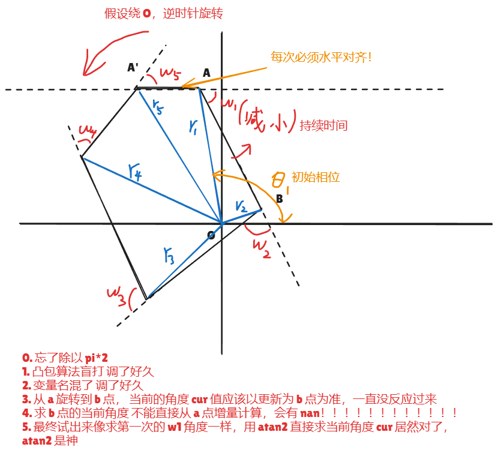

-  [链接](https://codeforces.com/gym/106570)

> 夜间做题，早早下班

## I. 星系观测计划（补）【计算几何】

- 给定 n 个点，按照统一角速度绕 O 旋转
	- 求无限转下去，最小包含所有点的水平竖直矩形的周长的平均值

### Solution



### Code

> 注：里面的 Andrew 代码其实我写错了
> 正宗的就是按照 x y 自然排就可以，反过来的时候跳过第一个

```cpp

#include<bits/stdc++.h>
using namespace std;
using db = long double;
using ll = long long;

const db pi = acos(-1.0l);

struct Vec {
	ll x, y;
	ll operator%(Vec o) const {
		return x *o.y - y * o.x;
	}
	Vec operator+(Vec o) const {
		return {x+o.x,y+o.y};
	}
	Vec operator-(Vec o) const {
		return {x-o.x,y-o.y};
	}
};

ll cross(Vec a, Vec b, Vec c) { 
	return (b-a) % (c-a);
}

struct Vec2 {
	db x, y;
	db operator%(Vec2 o) const {
		return x *o.y - y * o.x;
	}
	db operator*(Vec2 o) const {
		return x * o.x + y * o.y;
	}
	Vec2 operator+(Vec2 o) const {
		return {x+o.x,y+o.y};
	}
	Vec2 operator-(Vec2 o) const {
		return {x-o.x,y-o.y};
	}
	db len() const {
		return sqrt(x*x+y*y);
	}
};

Vec2 rotate(Vec2 o, db arg) {
	return {o.x*cos(arg) - o.y*sin(arg), o.y*cos(arg)+o.x*sin(arg)};
}

const int N = 1e6 + 5;

int n;

Vec p[N], tmp[N];
Vec stk[N];

Vec2 p2[N], p3[N];

int Andrew() {
	sort(tmp+1,tmp+1+n,[](Vec a, Vec b) {
		return a.x != b.x ? a.x < b.x : a.y > b.y;
	});
	int tp = 0;
	for (int i = 1; i <= n; i++) {
		while(tp >= 2 && cross(stk[tp-1],stk[tp],tmp[i]) <= 0) {
			tp--;
		}
		stk[++tp] = tmp[i];
	}
	sort(tmp+1,tmp+1+n,[](Vec a, Vec b) {
		return a.x != b.x ? a.x > b.x : a.y < b.y;
	});
	int tp2 = tp;
	for (int i = 2; i <= n; i++) {
		while (tp2 - tp >= 1 && cross(stk[tp2-1],stk[tp2],tmp[i]) <= 0) {
			tp2--;
		}
		stk[++tp2] = tmp[i];
	}
	return tp2;
}

db S(db l,db r, db R) {
	return R*(cos(l) - cos(r));
}

db angle(Vec2 a, Vec2 b) {
	return abs(acos( (a * b) /(a.len() * b.len())));
}

void solve() {
	cin >> n;
	for (int i = 1; i <= n; i++) {
		cin >> p[i].x >> p[i].y;
		tmp[i] = p[i];
	}
	int m = Andrew();
	for (int i = 1; i <= m; i++) {
		p2[i] = {stk[i].x, stk[i].y};
	}
	db arg = -atan2(stk[1].y-stk[2].y,stk[1].x-stk[2].x);
	for (int i = 1; i <= m; i++) {
		p2[i] = rotate(p2[i], arg);	
		p3[i] = p2[i];
	}
	db cur = atan2(p2[m].y,p2[m].x);
	p2[m+1] = p2[2];
	db ans = 0;
	for (int i = m; i >= 2; i--) {
		Vec2 a = p2[i] - p2[i+1];
		Vec2 b = p2[i-1] - p2[i]; 
		db w = angle(a, b);
		db r = p2[i].len();
		ans += S(cur,cur+w,r);
		arg = -atan2(stk[i-1].y-stk[i].y,stk[i-1].x-stk[i].x);
		cur = atan2(stk[i-1].y, stk[i-1].x) + arg;
	} 
	cout << (ans * 8) / (pi*2) << "\n";
}

int main() {
	cout << fixed << setprecision(12);
	ios::sync_with_stdio(0); cin.tie(0); cout.tie(0);
	int T = 1;
	cin >> T;
	while (T--) solve();
}
```